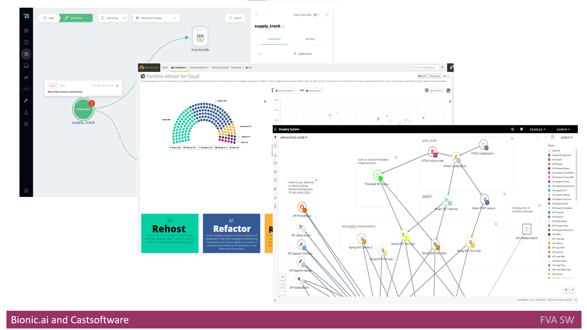
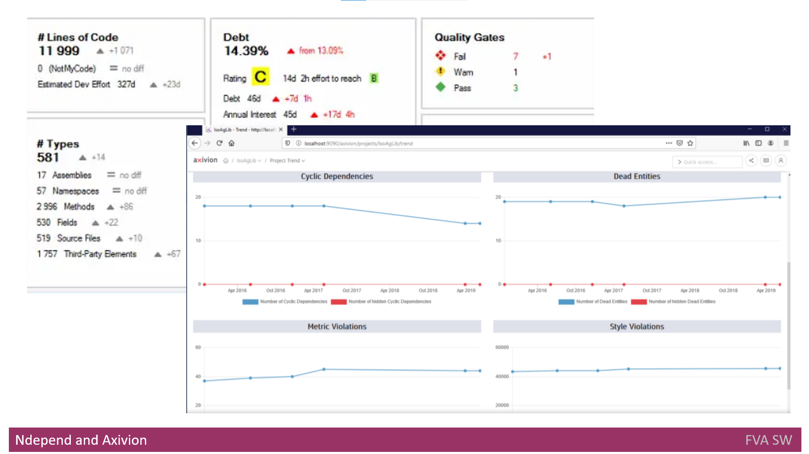

# Headline
**Detecting Architectural Gaps** with Automation: Powerful Tools for Real-Time Architecture Analysis: Bionic.ai, Castsoftware, Axivion, and NDepend Offer Comprehensive Solutions

# Article description
Discover how four cutting-edge tools—Bionic.ai, Castsoftware Highlight, Cast Imaging, Axivion Suite, and NDepend—revolutionize the way applications are analyzed and their architecture is maintained in real-time. 
From creating baseline architectures to detecting drifts, erosions, and security and compliance issues, these tools offer diverse features such as interactive architecture views, impact analysis, and integration with CI/CD pipelines. 
Dive into the comparison of their functionalities and understand how they address different levels of architectural governance, ensuring optimal application performance and development. 

# Tags
Bionic.ai Castsoftware Axivion NDepend softwarearchitecture applicationanalysis impactanalysis codeanalysis staticcodeanalysis architecturemaintenance

# Definitions, Acronyms, Abbreviations
| # | Abbreviation or Acronym | Definition     |
| - | ------------------------|:--------------:|
| 1 | API | is a computing interface to a software component or a system, that defines how other components or systems can use it. It defines the kinds of calls or requests that can be made, how to make them, the data formats that should be used, the conventions to follow, etc|
| 2 | AUTOSAR | AUTomotive Open System ARchitecture is a development partnership of automotive interested parties founded in 2003. It pursues the objective to create and establish an open and standardized software architecture for automotive electronic control units|
| 3 | Bamboo | Bamboo is a continuous integration and deployment tool that ties automated builds, tests and releases together in a single workflow.|
| 4 | Big Data | is data that contains greater variety, arriving in increasing volumes and with more velocity. This is also known as the three Vs. Put simply, big data is larger, more complex data sets, especially from new data sources.|
| 5 | C# | C# is a general-purpose, multi-paradigm programming language. C# encompasses static typing, strong typing, lexically scoped, imperative, declarative, functional, generic, object-oriented, and component-oriented programming disciplines.|
| 6 | CDN | A content delivery network (CDN) refers to a geographically distributed group of servers that work together to provide fast delivery of Internet content.|
| 7 | CI/CD | CI/CD or CICD is the combined practices of continuous integration and continuous delivery or continuous deployment.|
| 8 | Containers | A container is a standard unit of software that packages up code and all its dependencies so the application runs quickly and reliably from one computing.|
| 9 | Compliance | In general, compliance means conforming to a rule, such as a specification, policy, standard or law. Compliance has traditionally been explained by reference to the deterrence theory, according to which punishing a behavior will decrease the violations both by the wrongdoer and by others.|
| 10| DevOps | DevOps is the combination of cultural philosophies, practices, and tools that increases an organization's ability to deliver applications and services at high velocity: evolving and improving products at a faster pace than organizations using traditional software development and infrastructure management processes.|
| 11| Jenkins | Jenkins is an open source automation server. It helps automate the parts of software development related to building, testing, and deploying, facilitating continuous integration and continuous delivery. It is a server-based system that runs in servlet containers such as Apache Tomcat.|
| 12| Microservices | A microservice architecture – a variant of the SOA structural style – arranges an application as a collection of loosely-coupled services. In a microservices architecture, services are fine-grained and the protocols are lightweight. The goal is that teams can bring their services to life independent of others|
| 13| MISRA C | MISRA C is a set of software development guidelines for the C programming language developed by The MISRA Consortium. Its aims are to facilitate code safety, security, portability and reliability in the context of embedded systems, specifically those systems programmed in ISO C / C90 / C99.|
| 14| OLAP | Online analytical processing (OLAP) is a technology that organizes large business databases and supports complex analysis. It can be used to perform complex analytical queries without negatively affecting transactional systems.|
| 15| OLTP | OLTP or Online Transaction Processing is a type of data processing that consists of executing a number of transactions occurring concurrently—online banking, shopping, order entry, or sending text messages, for example.|
| 16| SCA | Static Code Analysis - One of the capabilities of the CI/CD pipeline. Its purpose is to check the code using a predefined set of rules. SCA usually is performed between Build and Test stages.|
| 17| SOA | In software engineering, service-oriented architecture is an architectural style that focuses on discrete services instead of a monolithic design|
| 18| UML | The Unified Modeling Language (UML) is a general-purpose, developmental, modeling language in the field of software engineering that is intended to provide a standard way to visualize the design of a system.|
 
# Content
## Bionic.ai
[Bionic](https://www.bionic.ai/) is a platform designed to analyze the **architecture** of applications and their dependencies in real-time.
Initially, it creates a **baseline** of the architecture during the initial scan.
Subsequently, whenever a **change occurs**, the **next scan** is triggered to detect any drift or erosion.
The platform supports regular scans by seamlessly integrating **Bionic.ai** into the **CI/CD** pipeline.
Upon detecting a change, Bionic.ai suggests the context and thoroughly analyzes the potential impact of the changes.
As a result, it generates comprehensive software **architecture** diagrams, encompassing deployment, logical, and flow views.

### Main features
- Facilitates checking if architecture rules and standards are applied
- Aids in identifying any structural or behavioral changes
- Conducts code and document scans during the initial or scheduled stages
- Determines new APIs in the application
- Capable of finding new data flows
- Detects new connections
- Provides a prioritized list of risks once changes occur

## Castsoftware Highlight
[Cast Highlight](https://www.castsoftware.com/products/highlight) is an application designed to automatically analyze the source code.

### Main features:
- Analyzes the code to identify processes/applications suitable for refactoring, retirement, or rebuilding.
- Provides a readiness percentage for migrating to the cloud based on the analysis.

## Castsoftware Cast Imaging 
[Cast Imaging](https://www.castsoftware.com/imaging) is an application that creates visualizations of **architecture**, offering several levels of detailed views ranging from services level up to code/classes level.
It defines data flows from the high-level application perspective down to the database level.
When changes occur, it provides the impact analysis, such as a list of components affected by the breaking of component communication.
Additionally, it creates inventories of **databases**, **libraries/frameworks**, and **languages**.

### Main features
- Performs reverse engineering of code, databases, and application dependencies.
- Generates holistic architecture views and blueprints.
- Interactive mode for exploring architecture views.
- Tagging feature to group components based on criteria, enabling easy component search and filtering after tagging is completed.

## NDepend
[NDepend](https://www.workshell.co.uk/products/netdepends/) is an application designed to analyze **C#** code, checking it against best practices and rules created by developers and architects. 
The tool enables users to manage dependencies through the creation of graphs and matrices.

### Main features

- Utilize built-in rules and customize them according to specific needs.
- Investigate application structure and library linkages.
- Seamless integration into the CI/CD process, enabling real-time identification of code and architecture issues.
- Provides insights into the cost and priority of fixing identified issues.

## Axivion Suite
[Axivion Suite](https://www.axivion.com/en/) is a powerful static code analysis tool that empowers users to thoroughly examine software **architecture**, ensuring prevention of **drifts** and **erosions**. 
The platform offers customizable reporting with a reporting API, providing flexibility in generating reports.
Axivion also includes an editor that allows users to create or customize rules for comprehensive code checking.

Supported Compliance Standards/Rules:

- MISRA
- AUTOSAR C++14 code
- CERT
- CWE
- ISO/IEC TS 17961

Supported Metrics:

- HIS (High Integrity Software)
- McCabe
- Tracking memory leaks

With Axivion Suite, users can proactively maintain the integrity and quality of their **software architecture** by adhering to industry-leading compliance standards and monitoring key metrics.

### Main Features

- Code checks for clones, identifying duplicated code segments to ensure code efficiency.
- Detection of unreachable code and cycles, improving code reliability and performance.
- Supported on three major operating systems - MacOS, Windows, and Linux, for seamless usage across platforms.
- Identification of technical debt, allowing developers to address code areas that require improvement or refactoring.
- Integration with CI (Continuous Integration) tools such as Jenkins and Bamboo, enabling smooth integration into development pipelines.
- Support for popular build systems like make, CMake, Msbuild, and Gradle, facilitating easy setup and usage.
- Analysis of delta changes against the baseline, enabling continuous tracking of code modifications and their impact on the architecture.
- IDE (Integrated Development Environment) plugins support, allowing developers to seamlessly integrate Axivion Suite into their preferred development environment for streamlined code analysis and optimization

## Comparison of existing solutions
| Function | Bionic | Cast Imaging and Highlight | Axivion  | NDepend               |
| -------- | -------|--------------------------- |--------- |:---------------------:|
|The initial scan to create a baseline of the holistic application architecture diagram involves capturing the comprehensive overview of all services, data flows, dependencies, APIs, technology stack, and application layers|+|+|+|+|
|Creating inventories of all the languages, frameworks, libraries, and databases used in the application|-|+|+|-|
|The scan after a change to detect drift or erosion (integration into CI/CD pipelines)|+|-|+|+|
|Tagging the components|-|+|-|-|
|Reporting the changes (behavioral or structural change)|+|+|+|+|
|Detection Security level issues|+|+|+|+|
|Detection Architecture level issues(new data flow, new API, new connection)|+|+|-|+|
|Detection Compliance level issues|+|-|+|-|
|Detection DevOps level issues|-|-|-|-|
|Detection Data level issues|-|-|-|-|
|Scanning code and configuration|+|+|+|+|
|Scanning documentation (UML) to get input|-|-|+|-|
|Scanning DB|-|+|-|+|
|Saving the results to UML documentation tools|-|-|-|-|
|Impact analysis|+|+|-|+|
|Simple to set up|+|+|+|+|
|Check for cloud Readiness|-|+|-|-|

As we can see from the table above, the existing **solutions** do not provide coverage for levels important for **architecture** governance, such as **DevOps**, **Data**, and **Compliance**. 
Additionally, not all inputs are supported by the overviewed solutions.
For example, scanning DB is not supported by **Bionic.ai**, and scanning **UML** documentation is not supported at all.

# References
| # | Name                 | Source                | Release date           |  Author                 | Description   |
| - | ---------------------|---------------------- |----------------------- | ----------------------- |:-------------:|
| 1 | Bionic | [Web](https://www.bionic.ai/) | | | |
| 2 | Castsoftware highlight | [Web](https://www.castsoftware.com/products/highlight) | | | |
| 3 | Castsoftware Image | [Web](https://www.castsoftware.com/imaging) | | | |
| 4 | Netdepends | [Web](https://www.workshell.co.uk/products/netdepends/) | | | |
| 5 | Axivion | [Web](https://www.axivion.com/en/) | | | |
| 6 | Detecting Architectural Gaps with Automation : Business Context | [GitHub](./DAGBusinessContext.md) |  | Dmytro Nikulin | | 
| 7 | Detecting Architectural Gaps with Automation : Proposed Solution | [GitHub](./DAGProposedSolution.md) |  | Dmytro Nikulin | | 
