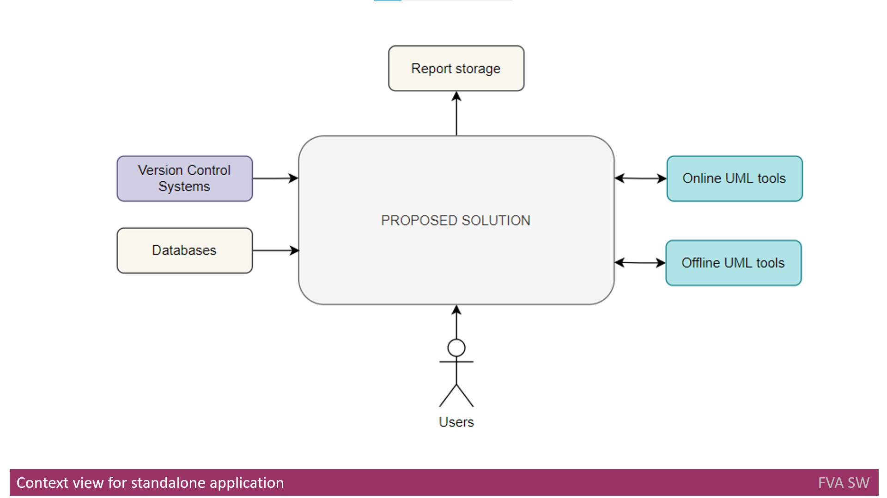
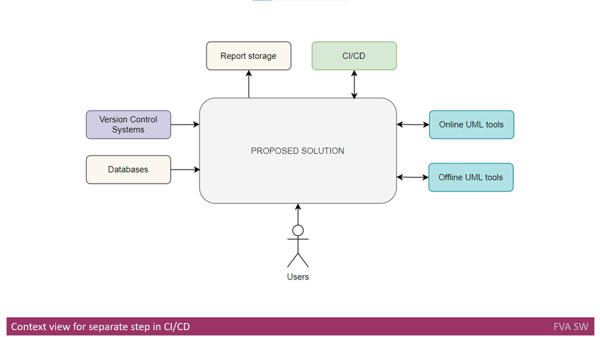
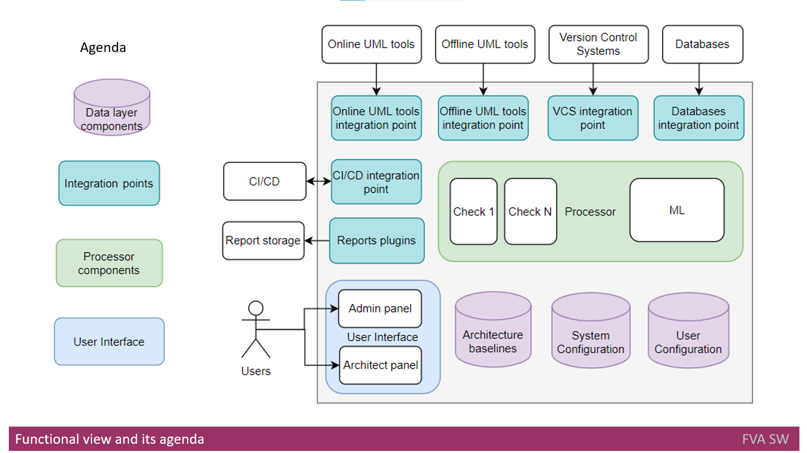
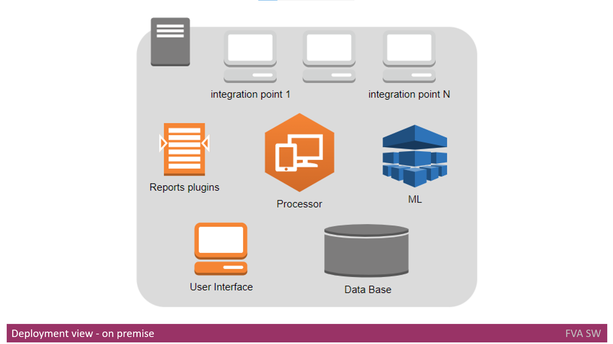
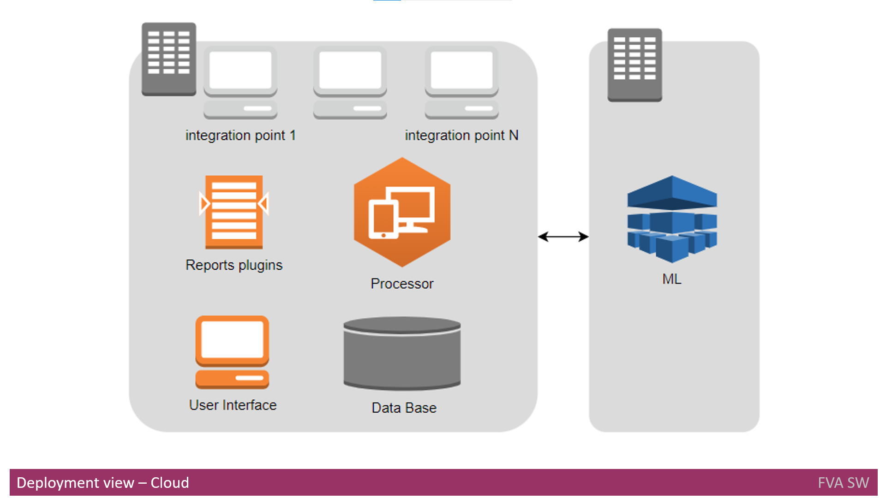
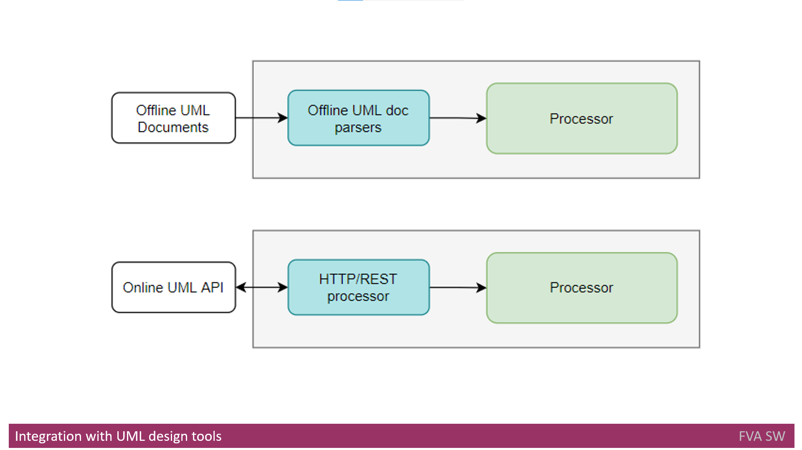
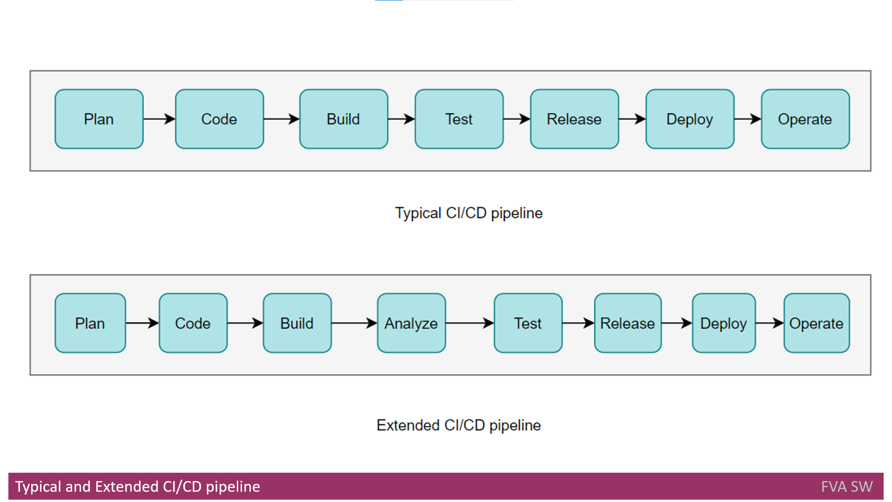

# **Detecting Architectural Gaps** with Automation: Comprehensive Overview of Proposed Software Solution's Architecture and Integration
In the ever-evolving landscape of software development, a robust and seamlessly integrated solution is a critical asset.
This article delves into a comprehensive analysis of a proposed software solution, encompassing its architecture, integration strategies, and deployment scenarios. 
From context diagrams that define solution boundaries to the intricate web of interactions with external systems, users, and data, we examine how the solution bridges the gap between users and technology.
Discover how the solution's functional decomposition and integration layers abstract complexities, enabling extensibility and modifiability. 
Explore the role of the user interface, data layer, processing layer, and the deployment view across on-premise and cloud environments.
Furthermore, learn about the integration with UML design tools, cloud services, and CI/CD pipelines, showcasing the solution's adaptability to industry best practices.
Whether you're an architect, developer, or IT enthusiast, this article offers a comprehensive guide to understanding the inner workings of a forward-looking software solution. 

# Table of contents
- [Tags](https://github.com/dimanikulin/dimanikulin/blob/main/!Template.md#tags)
- [Definitions, Acronyms, Abbreviations](https://github.com/dimanikulin/dimanikulin/blob/main/!Template.md#definitions-acronyms-abbreviations)
- [The Context View for Standalone Application](https://github.com/dimanikulin/dimanikulin/blob/main/DAGProposedSolution.md#the-context-view-for-standalone-application)
- [The Context View for a Separate Step in CI/CD](https://github.com/dimanikulin/dimanikulin/blob/main/DAGProposedSolution.md#the-context-view-for-a-separate-step-in-cicd)
- [Functional View](https://github.com/dimanikulin/dimanikulin/blob/main/DAGProposedSolution.md#functional-view)
- [Integration Layer](https://github.com/dimanikulin/dimanikulin/blob/main/DAGProposedSolution.md#integration-layer)
- [User Interface](https://github.com/dimanikulin/dimanikulin/blob/main/DAGProposedSolution.md#user-interface)
- [Data Layer](https://github.com/dimanikulin/dimanikulin/blob/main/DAGProposedSolution.md#data-layer)
- [Processing Layer](https://github.com/dimanikulin/dimanikulin/blob/main/DAGProposedSolution.md#processing-layer)
- [Deployment View](https://github.com/dimanikulin/dimanikulin/blob/main/DAGProposedSolution.md#deployment-view)
- [Deployment View - On-Premises](https://github.com/dimanikulin/dimanikulin/blob/main/DAGProposedSolution.md#deployment-view---on-premises)
- [Deployment View - Cloud](https://github.com/dimanikulin/dimanikulin/blob/main/DAGProposedSolution.md#deployment-view---cloud)
- [Integration with UML Design Tools:](https://github.com/dimanikulin/dimanikulin/blob/main/DAGProposedSolution.md#integration-with-uml-design-tools)
- [Integration with Offline UML Design Tools](https://github.com/dimanikulin/dimanikulin/blob/main/DAGProposedSolution.md#integration-with-offline-uml-design-tools)
- [Integration with Online UML Design Tools](https://github.com/dimanikulin/dimanikulin/blob/main/DAGProposedSolution.md#integration-with-online-uml-design-tools)
- [Integration with AWS, Azure, or GCP](https://github.com/dimanikulin/dimanikulin/blob/main/DAGProposedSolution.md#integration-with-aws-azure-or-gcp)
- [Dependency Analysis Tool](https://github.com/dimanikulin/dimanikulin/blob/main/DAGProposedSolution.md#dependency-analysis-tool)
- [Integration with Jenkins or Bamboo](https://github.com/dimanikulin/dimanikulin/blob/main/DAGProposedSolution.md#integration-with-jenkins-or-bamboo)
- [References](https://github.com/dimanikulin/dimanikulin/blob/main/!Template.md#references)

# Tags
Software Architecture, Integration Strategies, Deployment Scenarios, Context Diagrams, Functional Decomposition, CI/CD Pipelines

# Definitions, Acronyms, Abbreviations
| # | Abbreviation or Acronym | Definition     |
| - | ------------------------|:--------------:|
| 1 | API | is a computing interface to a software component or a system, that defines how other components or systems can use it. It defines the kinds of calls or requests that can be made, how to make them, the data formats that should be used, the conventions to follow, etc|
| 2 | Bamboo | Bamboo is a continuous integration and deployment tool that ties automated builds, tests and releases together in a single workflow.|
| 3 | C# | C# is a general-purpose, multi-paradigm programming language. C# encompasses static typing, strong typing, lexically scoped, imperative, declarative, functional, generic, object-oriented, and component-oriented programming disciplines.|
| 4 | CDN | A content delivery network (CDN) refers to a geographically distributed group of servers that work together to provide fast delivery of Internet content.|
| 5 | CI/CD | CI/CD or CICD is the combined practices of continuous integration and continuous delivery or continuous deployment.|
| 6 | Data Base | A database is an organized collection of structured information, or data, typically stored electronically in a computer system. A database is usually controlled by a database management system (DBMS)|
| 7 | Jenkins | Jenkins is an open source automation server. It helps automate the parts of software development related to building, testing, and deploying, facilitating continuous integration and continuous delivery.| It is a server-based system that runs in servlet containers such as Apache Tomcat.
| 8 | SCA | Static Code Analysis - One of the capabilities of the CI/CD pipeline. Its purpose is to check the code using a predefined set of rules. SCA usually is performed between Build and Test stages.|
| 9 | Software Architecture | Software architecture refers to the fundamental structures of a software system and the discipline of creating such structures and systems. Each structure comprises software elements, relations among them, and properties of both elements and relations.|
| 10| UML | The Unified Modeling Language (UML) is a general-purpose, developmental, modeling language in the field of software engineering that is intended to provide a standard way to visualize the design of a system.|

---

# The Context View for Standalone Application
A **context diagram (view)** defines the solution's boundaries and connections with third parties, such as external systems, users, and data.

As shown in the context diagram above, there is an interaction between **Users** and the **Proposed Solution**.
These interactions will be implemented using a **UI web interface**.

For obtaining input, the solution interacts with **Online** and **Offline UML** tools using their **API** to retrieve the initial **Software Architecture** and to save the extracted **Software Architecture**.

To access code, configuration, and the database, interactions with **Version Control Systems** and the database are utilized.

Finally, Report Storage is employed to save the outputs extracted from the **Architecture** under analysis.

# The Context View for a Separate Step in CI/CD
The sole distinction between the previous view and the **Context View** for a **Separate Step** in **CI/CD** is the integration of the proposed solution with the existing **CI/CD** pipeline.

# Functional View
The functional diagram below illustrates the high-level functional decomposition of the proposed solution.
An agenda is provided below to explain the color coding used in the functional decomposition diagram.

## Integration Layer
The function of the integration layer is to abstract and segregate the system from external components, enhancing system extensibility and modifiability.

The following components are involved:

- Online UML Tools Integration Point: This component integrates Online UML tools with the Processor.
- Offline UML Tools Integration Point: This component integrates Offline UML tools with the Processor.
- Version Control Systems (VSC) Integration Point: This component integrates Version Control Systems with the Processor.
- Databases Integration Point: This component integrates database configurations with the Processor.
- CI/CD Integration Point: This component integrates CI/CD tools (such as Jenkins, Bamboo) with the Processor.
- Reports Plugins: An engine designed to generate reports in a flexible manner and store them in an external report storage.

## User Interface
The user interface function interacts with users in two modes: **architects** and **administrator** mode. 
It utilizes a web interface that is compatible with desktop browsers.

## Data Layer
The data layer function maintains the following types of data:

- Architecture Baselines: This feature records the history of architecture changes, allowing users to track and view past changes. It is accessible for viewing from the architects' panel.
- System Configuration: This aspect encompasses a set of check configurations for processing. It also keeps track of configurations for report plugins. Changes to these configurations can be made from the architects' panel.
- User Configuration: This includes user profiles and access rights, which can be modified from the administrator panel.

## Processing Layer
The processing layer serves as a fundamental function within systems, tasked with processing input data to identify architecture problems.
Configuration of this layer takes place through the architect panel, where checks against the input are initiated.
Additionally, it collaborates with the reports plugins engine for report storage. 
Furthermore, the extracted architecture is preserved in **Architecture** baselines, enabling architects to review it at a later time.
It is worth noting that **Machine Learning (ML)** might be employed during processing to enhance the quality of reports.

# Deployment View
The deployment view illustrates how a solution is intended to be deployed, encompassing its flows and the supporting components.

## Deployment View - On-Premises

On-premise deployment assumes the use of a single computing node for installation.
The **Database** component should be deployed first, as other components depend on it.
Subsequently, the **Processor** and **ML components** are deployed once the Database component is in place.
The **User Interface** component, report plugins, and integration points are deployed in the final stage.

The **Database** component is deployed as a single DB instance with multiple schemas inside.
The **User Interface** component is presented as a web service, while the **Processor** and **ML components** are native processes built for the target platform.
Reports plugins and integration points are designed as dynamic libraries that can be easily added, removed, and configured at runtime.

## Deployment View - Cloud

**Cloud deployment** involves the utilization of two computing nodes for installation.
Due to the potentially high **CPU usage** of the Machine Learning process, it is recommended to allocate a dedicated machine for this purpose within the cloud pipeline.

# Integration with UML Design Tools:
As previously mentioned, the proposed solution should seamlessly integrate with offline **UML design** tools, including:

- Microsoft Visio
- OmniGraffle

Furthermore, the proposed solution should also integrate effectively with online **UML design** tools, which encompass:

- Enterprise Architecture
- LucidChart
- Draw.IO
- PlantUML
- Gliffy.com

## Integration with Offline UML Design Tools

Due to the absence of **APIs** in offline tools, collaboration with them is established through import mechanisms.
Consequently, architectural documents saved in **Microsoft Visio** format will be exported by a plugin (integration point) and subsequently analyzed by the **Processor**.
The path for scanning input documents will be stored in the **System Configuration DB**.
To support this form of integration, the ability to parse various input formats must be implemented.

## Integration with Online UML Design Tools

**Online UML** design tools typically offer **APIs** for integration purposes.
The collaboration with such tools will make use of their respective **APIs**.
However, it's important to note that some UML design tools might lack **APIs** for integration.
In such scenarios, the import of architecture documents to a designated folder will be undertaken.
The subsequent parsing of these documents will be implemented to import data into the **Processor**, following a similar approach as outlined earlier for offline tools.

For online **UML** design tools, **HTTP** or **REST APIs** are commonly available.
Accordingly, the integration point will access data within the **UML design** tool using the provided **HTTP** or **REST API**.
Each integration with a specific tool will require a distinct integration point.
For instance, integration with **LucidChart** will be realized using the **HTTP** protocol with **GET** and **POST** verbs.
On the other hand, integration with **Enterprise Architect** will involve the use of a **REST API** with **JSON** as the data format.

# Integration with AWS, Azure, or GCP

This section outlines how the proposed solution can seamlessly integrate with **AWS**, **Azure**, or **GCP**.
Given the potential enhancements **Machine Learning** can offer in terms of result quality, it is advisable to allocate a dedicated compute node for **ML** tasks. 
However, in scenarios where the on-premise environment lacks the capability to support **ML** calculations, a viable solution is to leverage a **Cloud Environment** for both **ML** computation and the overall computing needs.

Drawing from the deployment flows previously described, each component should be matched with the appropriate cloud provider service.
For instance, in the context of **AWS**:

- Processor - Leveraging AWS Lambda functions
- Database - Utilizing RDS and MySQL services
- Machine Learning - Employing AWS Machine Learning services
- And so forth for other components

Similar mapping strategies can be applied for **Azure** and **GCP**, ensuring that each component seamlessly integrates with the suitable services provided by the respective cloud platforms.

# Dependency Analysis Tool
Dependency identification plays a crucial role in architecture analysis.
It dissects the entire codebase into components and elucidates their interactions.
Given that similar functions are already available in tools like **JDeps**, leveraging their output would logically bolster the implementation of the **proposed solution**.
**JDeps**, for instance, is a command-line tool utilized for launching the **Java** class dependency analyzer.
For systems built on the **.NET framework**, **Net Dependency Walker** serves as a suitable choice to ascertain dependencies.

# Integration with Jenkins or Bamboo

As mentioned previously, one facet of the application involves integration within a **CI/CD** pipeline.
**CI/CD** represents a multifaceted and composite process, encompassing numerous stages.
Within a single **CI/CD** pipeline, a plethora of functionalities converge to facilitate a comprehensive workflow.

The diagram provided illustrates a standard **CI/CD** pipeline, depicted as the first pipeline.
This pipeline encompasses multiple sequential stages, which include:

- Plan
- Code
- Build
- Test
- Release
- Deploy
- Operate

At present, two prominent products, **Jenkins and Bamboo**, serve as implementations of the **CI/CD** pipeline concept.
In real-world project scenarios, both Jenkins and Bamboo are utilized to create pipelines tailored to specific project requirements.
Typically, upon each code commit, at least one pipeline is triggered, orchestrating various processes.

In the context of integrating the proposed solution, the existing pipeline structure can be extended.
This extension entails invoking the proposed solution for architecture analysis.
Consequently, the augmented pipeline would resemble the second pipeline depicted in the provided diagram.

# References
| # | Name                 | Source                | Release date           |  Author                 | Description   |
| - | ---------------------|---------------------- |----------------------- | ----------------------- |:-------------:|
| 1 | Why data drift detection is important and how do you automate it in 5 simple steps | [web](https://towardsdatascience.com/why-data-drift-detection-is-important-and-how-do-you-automate-it-in-5-simple-steps-96d611095d93)| Nov 1, 2021 | Srikanth Machiraju | |
| 2 | Detecting data drift using Amazon SageMaker | [web](https://aws.amazon.com/blogs/architecture/detecting-data-drift-using-amazon-sagemaker/)| 03 MAY 2022 | Shibu Nair, Zorina Alliata, Péter Molnár, and Joe Pazak | |
| 3 | Manipulate the Visio file format programmatically | [web](https://learn.microsoft.com/en-us/office/client-developer/visio/how-to-manipulate-the-visio-file-format-programmatically)| 04/03/2023 | Microsoft | |
| 4 | Enterprise Architect API | [Pdf document](https://sparxsystems.com/resources/user-guides/15.1/automation/automation.pdf)| 2020-01-20 | Sparx Systems | |
| 5 | Java class dependency analyzer | [web](https://docs.oracle.com/javase/9/tools/jdeps.htm#JSWOR690)| | | |
| 6 | Detecting Architectural Gaps with Automation : Business Context | [GitHub](./DAGBusinessContext.md) |  | Dmytro Nikulin | | 
| 7 | Detecting Architectural Gaps with Automation : Existing Solutions | [GitHub](./DAGExistingSolutions.md) |  | Dmytro Nikulin | | 
 