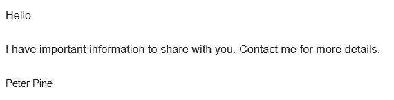

# Headline
TBD

# The Art of Phishing: How Scammers Are Trying to Reel You In
The art of phishing is constantly evolving, and scammers are finding new ways to trick unsuspecting victims. 
This article explores some of the latest tactics used in phishing attacks. 

# Table of contents
- [Tags](https://github.com/dimanikulin/dimanikulin/blob/main/Fishing.md#tags)
- [Attempt 0](https://github.com/dimanikulin/dimanikulin/blob/main/Fishing.md#attempt-0)
- [Attempt 1](https://github.com/dimanikulin/dimanikulin/blob/main/Fishing.md#attempt-1)
- [Attempt 2](https://github.com/dimanikulin/dimanikulin/blob/main/Fishing.md#attempt-2)
- [Attempt 3](https://github.com/dimanikulin/dimanikulin/blob/main/Fishing.md#attempt-3)
- [Attempt 4](https://github.com/dimanikulin/dimanikulin/blob/main/Fishing.md#attempt-4)
- [Sensitive or confidential language](https://github.com/dimanikulin/dimanikulin/blob/main/Fishing.md#sensitive-or-confidential-language)
- [References](https://github.com/dimanikulin/dimanikulin/blob/main/Fishing.md#references)

# Tags
fishing staysafe emailsecurity internetsecurity

---

# Attempt 0
Dear fishers, thank you!

But I will reject your gift ($3.5M) again

And will do it again and again.

# Attempt 1
This time they did not propose to send a big amount of money to me just for sharing my account info.

This time they did not propose a big prize for me just for providing my credit card information.

Instead, they used actor name (Peter Pine) to contact them – for me it‘s the best fishing attack for now.

# Attempt 2
It is so easy to get really big money now.

I can receive a payment with amount 10 Million US Dollars.

What I need is just to send my address, bank name and address, account name and number, Swift Code etc.

However, I need to reject this nice offer because I do not know what to do with such big money. )))

# Attempt 3
That is probably first time when I reject the high-paying job and WFH mode.

They sent me an email with a job description.

Also they even provided me a password and nice attachment to open so I could start working immediately.

Not this time, sorry guys ;-)

# Attempt 4
The most boring proposal so far.

This time they did not propose big money neither high-paying job with WFH. 

They just wanted to warn me about disk space.

# Sensitive or confidential language
It is unfortunately true that some people may use sensitive or confidential language (Confidential! Sensitive Information!) in their messages as a tactic to deceive or manipulate others, and they may not be concerned about the consequences of doing so.

If you receive a message that you suspect may be fraudulent or deceptive, it is important to exercise caution and to verify the authenticity of the message before taking any action.

This may involve double-checking the source of the message, looking for signs of phishing or other scams, or seeking guidance from a trusted authority or expert.

By taking these precautions, you can help protect yourself from potential harm and avoid falling victim to scams or other types of fraud.

Stay safe!

# References
| # | Name                 | Source                | Release date           |  Author                 | Description   |
| - | ---------------------|---------------------- |----------------------- | ----------------------- |:-------------:|
| 1 | Attempt 0 | [LinkedIn](https://www.linkedin.com/posts/dimanikulin_fishing-activity-6993092454992211969-Ucgz?utm_source=share&utm_medium=member_desktop)|December, 2022|Dmytro Nikulin||
| 2 | Attempt 1 | [LinkedIn](https://www.linkedin.com/posts/dimanikulin_fishing-activity-6939455519191404544-mWpp?utm_source=share&utm_medium=member_desktop)|June, 2022|Dmytro Nikulin||
| 3 | Attempt 2 | [LinkedIn](https://www.linkedin.com/posts/dimanikulin_it-is-so-easy-to-get-really-big-money-now-activity-6935298599983443968-1GRA?utm_source=share&utm_medium=member_desktop)|May, 2022|Dmytro Nikulin||
| 4 | Attempt 3 | [LinkedIn](https://www.linkedin.com/posts/dimanikulin_that-is-probably-first-time-when-i-reject-activity-6885883352952438784-CEq-?utm_source=share&utm_medium=member_desktop)|January, 2022|Dmytro Nikulin||
| 5 | Attempt 4 | [LinkedIn](https://www.linkedin.com/posts/dimanikulin_fishing-activity-7054716495364300801-_-1z?utm_source=share&utm_medium=member_desktop)|April 24, 2023|Dmytro Nikulin||
| 6 | Sensitive or confidential language | [LinkedIn](https://www.linkedin.com/posts/dimanikulin_staysafe-fishing-activity-7071738520201027584-TmuQ?utm_source=share&utm_medium=member_desktop)|June 6, 2023|Dmytro Nikulin||