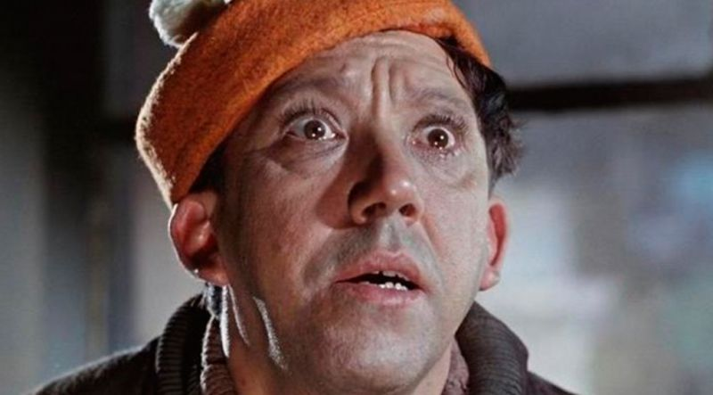

# Headline
О том, как плохо опаздывать на работу, и о том, как хорошо нам помогают фамилии иногда.

# Table of contents
- [Tags](./HistorySecondName.md#tags)
- [Overview](./HistorySecondName.md#overview)
- [References](./HistorySecondName.md#references)

# Tags
work, punctuality, discipline, surnames, workplace anecdotes, humorous stories.

# Overview
Этот пост рассказывает о том, как важно не опаздывать на работу и как иногда фамилии могут помочь.
Автор описывает ситуацию, когда начальство захотело проверить трудовую дисциплину сотрудников через охранников на входе и попросило их записать фамилии нарушителей. 
Автор опоздал на работу и неожиданно для себя оказался в числе потенциальных нарушителей. 
Но благодаря тому, что охранник знал его фамилию как актера, автору удалось справиться с ситуацией, не дав свою фамилию на запись.
В конце автор подчеркивает, что это реальная история. 

---

Был тут пост о фамилиях недавно, он и вдохновил меня на публикацию данного поста.

О том, как плохо опаздывать на работу, и о том, как хорошо нам помогают фамилии иногда.

Было это давно, проспав немного, быстро добрался до работы и думал уже забыть про просыпание, но...
 
Почему-то начальству взбрела в голову идея проверки трудовой дисциплины именно в этот день, и они решили реализовать ее через охранников на входе, пожелав увидеть фамилии как минимум 5 нарушающих трудовою дисциплину.
 
В мою душу закрались первые тревожные мысли после первого же взгляда, брошеного на меня охранником, кода я вошел в хол нашего заведения - он улыбался! Я тоже улыбнул свое лицо, желая не казаться невоспитанным.
 
- *Ваше удостоверение*,- попросил страж входа. Дело все в том, что мое лицо знали все охранники, и я, догадавшись о истинной цели его "желания моего удостоверения" и, желая поэтому потянуть время, начал ковыряться в своей бескрайней барсетке.
 
- *Вы с какого времени работаете?* - спросил охранник, желая заполнить возникшую паузу.
- *С 8-00.* - не долго думая ответил я, все еще ковыряясь.
 
- *А зачем Вам мое удостоверение* - с чрезмерной долей наивности спросил, нашев удостоверение и показав его краешек охраннику. Он увидел, что победа уже близка и выпалил:
- *Записать Вашу фамилию.*
 
- *Не дам,* - сказал я улыбнувшись и включил на полную генератор наглости.
- *?????* - таков был следующий вопрос стража.
 
- *Зачем Вам давать мое удостоверение, если вы и так знаете мою фамилию.*
- *Не помню...* - сказал охранник, попытавшись перелопатить все извесные фамилии хоть как-нибудь подходившие к моему лицу.
 
- *Готов спорить.Пропустите, если я окажусь прав?* - не теряя напора, молвил я. Охранник, все еще пытаясь вспомнить, согласился.
Уже проходя через **вертушку**, я назвал носимую мной фамилию.
 
Он улыбнулся, когда понял, что не мог не знать мою фамилию, хлопнул меня по плечу и мы оба забыли этот случай уже через 5 минут.

ПС. История невыдуманная )

# References
| # | Name                 | Source                | Release date           |  Author                 | Description   |
| - | ---------------------|---------------------- |----------------------- | ----------------------- |:-------------:|
| 1 |История связанная с фамилией|[LinkedIn](https://www.linkedin.com/posts/dimanikulin_%D0%B1%D1%8B%D0%BB-%D1%82%D1%83%D1%82-%D0%BF%D0%BE%D1%81%D1%82-%D0%BE-%D1%84%D0%B0%D0%BC%D0%B8%D0%BB%D0%B8%D1%8F%D1%85-%D0%BD%D0%B5%D0%B4%D0%B0%D0%B2%D0%BD%D0%BE-https-activity-6899776405601611776-PJn7?utm_source=share&utm_medium=member_desktop)| 14/02/2022 | Dmytro Nikulin||
