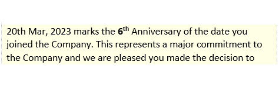
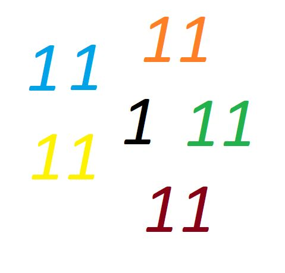
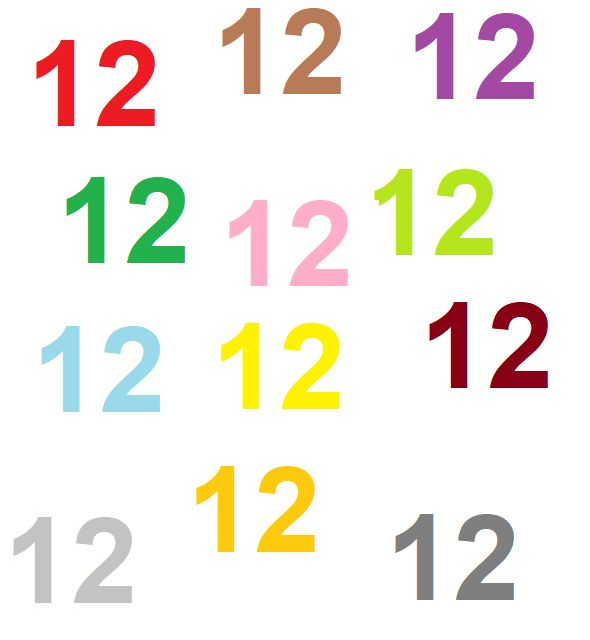
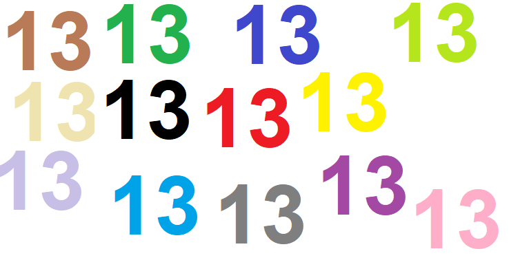

# Headline
TBD

# Interesting facts
Interesting facts about numbers and not only! 

# Table of contents
- [Tags](https://github.com/dimanikulin/dimanikulin/blob/main/InterestingFacts.md#tags)
- [Interesting facts about number *6*](https://github.com/dimanikulin/dimanikulin/blob/main/InterestingFacts.md#interesting-facts-about-number-6)
- [Interesting facts about number *11*](https://github.com/dimanikulin/dimanikulin/blob/main/InterestingFacts.md#interesting-facts-about-number-11)
- [Interesting facts about number *12*](https://github.com/dimanikulin/dimanikulin/blob/main/InterestingFacts.md#interesting-facts-about-number-12)
- [Interesting facts about number *13*](https://github.com/dimanikulin/dimanikulin/blob/main/InterestingFacts.md#interesting-facts-about-number-13)
- [References](https://github.com/dimanikulin/dimanikulin/blob/main/InterestingFacts.md#references)

# Tags
interestingfacts numbers

# Overview
TBD 

---

# Interesting facts about number "6"

- In many cultures, 6 is considered to be a lucky number;
- Six is the smallest perfect number, which means that the sum of its factors (1, 2, and 3) equals 6.;
- The average human hand has six bones in each finger, except for the thumb, which has two bones;
- I have reached the 6th Anniversary in GlobalLogic recently.

Are there other facts?

Something else? please share in comments other facts.

# Interesting facts about number "11"

- 11 * 11 = 121, 11 * 111 = 1221, 1111 * 11 = 12221...;
- Football team has 11 members;
- Eleven is the name of main character in "Stranger Things" TV show;
- I have reached 11 K connections now )

Are there other facts?

Something else? please share in comments other facts.

# Interesting facts about number "12"

- 12 months in a year;
- 12 hours visible on a clock;
- 12 is a composite number, an even number, a natural number, and a whole number;
- There are 12 stars on the flag of Europe.
- Max 12 columns in Bootstrap row. ;)

Something else? please share in comments other facts.

# Interesting facts about number "13"
Usually, the number 13 is considered unlucky in many cultures.
Here are some interesting facts about the number 13:
- In some Western cultures, Friday the 13th is considered an especially unlucky day.
- In some ancient cultures, this number was considered sacred and associated with the lunar and feminine cycles. It was seen as a symbol of fertility and good fortune.
- In mathematics, 13 is considered a prime number, and it has some unique properties - a part of Pythagorean triples and a part of the Fibonacci sequence.
- In Italian culture, this number is associated with good fortune.

Are there other facts?

# References
| # | Name                 | Source                | Release date           |  Author                 | Description   |
| - | ---------------------|---------------------- |----------------------- | ----------------------- |:-------------:|
| 1 | Interesting facts about number "6"| [LinkedIn](https://www.linkedin.com/posts/dimanikulin_interestingfacts-numbers-globallogic-activity-7051457743555104769-pDkY?utm_source=share&utm_medium=member_desktop) | 2023, April | Dmytro Nikulin | |
| 2 | Interesting facts about number "11"| [LinkedIn](https://www.linkedin.com/posts/dimanikulin_interestingfacts-activity-6967512359246393344-drW-?utm_source=share&utm_medium=member_desktop) | 2023, August | Dmytro Nikulin | |
| 3 | Interesting facts about number "12"| [LinkedIn](https://www.linkedin.com/posts/dimanikulin_interestingfacts-activity-7031329081606483968-Xg3L?utm_source=share&utm_medium=member_desktop)| 2023, March | Dmytro Nikulin | | 
| 4 | Interesting facts about number "13"| [LinkedIn](https://www.linkedin.com/posts/dimanikulin_interestingfacts-activity-7112326331484258304-C2fS?utm_source=share&utm_medium=member_desktop)| 2023, 26 September | Dmytro Nikulin | |