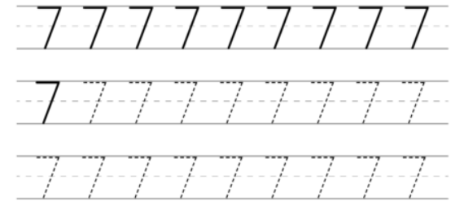
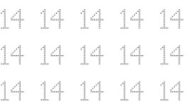

# Headline
Interesting facts
 
# Table of contents
- [Tags](./InterestingFacts.md#tags)
- [Overview](./InterestingFacts.md#overview)
- [Interesting facts about number *6*](./InterestingFacts.md#interesting-facts-about-number-6)
- [Interesting facts about number *11*](./InterestingFacts.md#interesting-facts-about-number-11)
- [Interesting facts about number *12*](./InterestingFacts.md#interesting-facts-about-number-12)
- [Interesting facts about number *13*](./InterestingFacts.md#interesting-facts-about-number-13)
- [Interesting facts about number *7*](./InterestingFacts.md#interesting-facts-about-number-7)
- [Interesting facts about me](./InterestingFacts.md#interesting-facts-about-me)
- [Interesting facts about number *14*](./InterestingFacts.md#interesting-facts-about-number-14)
- [References](./InterestingFacts.md#references)

# Tags
interestingfacts numbers

# Overview
Interesting facts about numbers and not only!

---

# Interesting facts about number "6"

- In many cultures, 6 is considered to be a lucky number;
- Six is the smallest perfect number, which means that the sum of its factors (1, 2, and 3) equals 6.;
- The average human hand has six bones in each finger, except for the thumb, which has two bones;
- I have reached the 6th Anniversary in GlobalLogic recently.

Are there other facts?

Something else? please share in comments other facts.

# Interesting facts about number "11"

- 11 * 11 = 121, 11 * 111 = 1221, 1111 * 11 = 12221...;
- Football team has 11 members;
- Eleven is the name of main character in "Stranger Things" TV show;
- I have reached 11 K connections now )

Are there other facts?

Something else? please share in comments other facts.

# Interesting facts about number "12"

- 12 months in a year;
- 12 hours visible on a clock;
- 12 is a composite number, an even number, a natural number, and a whole number;
- There are 12 stars on the flag of Europe.
- Max 12 columns in Bootstrap row. ;)

Something else? please share in comments other facts.

# Interesting facts about number "13"
Usually, the number 13 is considered unlucky in many cultures.
Here are some interesting facts about the number 13:
- In some Western cultures, Friday the 13th is considered an especially unlucky day.
- In some ancient cultures, this number was considered sacred and associated with the lunar and feminine cycles. It was seen as a symbol of fertility and good fortune.
- In mathematics, 13 is considered a prime number, and it has some unique properties - a part of Pythagorean triples and a part of the Fibonacci sequence.
- In Italian culture, this number is associated with good fortune.

Are there other facts?

# Interesting facts about number "7"

As you might know the number 7 has a rich history and significance across various cultures and disciplines.
Here are 7 interesting facts about the number 7:

- Seven is a prime number, meaning it can only be divided by 1 and itself without leaving a remainder.
- The fourth prime number, the fourth Fibonacci number, and a Mersenne prime.
- In Hinduism and some forms of yoga, there are believed to be seven energy centers in the body called chakras.
- Traditionally, the world is divided into seven continents and seven seas.
- In Christian theology, the Seven Deadly Sins are a classification of vices that were believed to be particularly detrimental to spiritual progress.
- In many cultures, 7 is considered a lucky number.
- The Seven Wonders of the Ancient World were a list of remarkable constructions of classical antiquity.

Are there other facts?

# Interesting facts about me
There are a lot of people in my LinkedIn network who know me well.

Let's share four random facts about me and guess which one is not true.

Can you also share something interesting about yourself?

Which one is not true about me?
- I cannot swim well
- They called me Winnie the Pooh
- I dance folk
- I visited Egypt

# Interesting facts about number "14"

Did you know the facts that highlight the number 14's significance and varied roles across different domains?

Here are some interesting facts about the number 14:

- The sum of the first three square numbers (1² + 2² + 3² = 1 + 4 + 9 = 14).
- Silicon has an atomic number of 14.
- The term "fortnight" means 14 nights (or two weeks).
- In traditional Judaism, a boy reaches the age of Bar Mitzvah at 13, but the celebration often occurs in the 14th year.
- Valentine's Day is celebrated on February 14th.

Do you know any other facts? Please share other facts in the comments.

# References
| # | Name                 | Source                | Release date           |  Author                 | Description   |
| - | ---------------------|---------------------- |----------------------- | ----------------------- |:-------------:|
| 1 | Interesting facts about number "6" | [LinkedIn](https://www.linkedin.com/posts/dimanikulin_interestingfacts-numbers-globallogic-activity-7051457743555104769-pDkY?utm_source=share&utm_medium=member_desktop) | 01/04/2023 | Dmytro Nikulin | |
| 2 | Interesting facts about number "11"| [LinkedIn](https://www.linkedin.com/posts/dimanikulin_interestingfacts-activity-6967512359246393344-drW-?utm_source=share&utm_medium=member_desktop) | 01/08/2023 | Dmytro Nikulin | |
| 3 | Interesting facts about number "12"| [LinkedIn](https://www.linkedin.com/posts/dimanikulin_interestingfacts-activity-7031329081606483968-Xg3L?utm_source=share&utm_medium=member_desktop)| 01/03/2023 | Dmytro Nikulin | | 
| 4 | Interesting facts about number "13"| [LinkedIn](https://www.linkedin.com/posts/dimanikulin_interestingfacts-activity-7112326331484258304-C2fS?utm_source=share&utm_medium=member_desktop)| 26/09/2023 | Dmytro Nikulin | |
| 5 | Interesting facts about number "7" | [LinkedIn](https://www.linkedin.com/posts/dimanikulin_numbers-interestingfacts-activity-7178308521065648130-rwAl?utm_source=share&utm_medium=member_desktop)| 26/03/2024 | Dmytro Nikulin | |
| 6 | Interesting facts about me  | [LinkedIn](https://www.linkedin.com/posts/dimanikulin_there-are-a-lot-of-people-in-my-linkedin-activity-7194653260526333953-wBiT?utm_source=share&utm_medium=member_desktop) | 26/03/2024 | Dmytro Nikulin | |
| 7 | Interesting facts about number "14" | [LinkedIn](https://www.linkedin.com/posts/dimanikulin_interestingfacts-numbers-activity-7201133644424396800-xGQA?utm_source=share&utm_medium=member_desktop) | 28/05/2024 | Dmytro Nikulin | |