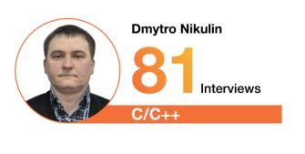

# Headline
Everything about the interviews

# Article description
TBD 

# Tags
interviewer cplusplus cpp technicalinterview

# Content
## Interview number

Do you think 81 interviews per year is a lot?

I feel like no, it is about 1.5 interviews in a week only.

And this year (the same as previous one) I was nominated as a Top Interviewer in Kyiv in C/C++ with 81 interviews.

In 2022 it was quite the same

## Interview Red Flags

Let me start with a small history about a technical interview I recently hosted. 
The interviewee greeted me in Ukrainian, which was a pleasant surprise. 
When I asked how he learned Ukrainian, he explained that he has friends in Ukraine and has visited them.
I suggested we switch to Ukrainian, but he declined as he doesn't speak it very well.

During the interview, I noticed that he had two or even three monitors, one of which he used to communicate with me through a camera.
At first, he struggled with practical tasks, but when I checked his theoretical knowledge, he showed a good level.
I asked him a lot of questions, and he answered them in the same manner - he would think and then move his eyes to the keyboard or other monitor before providing an answer.
After a while, he would either say that he wasn't sure about the answer or give me the wrong answer entirely.
But then he would provide the correct answer. 

Because time was limited, I had to rush him in his thinking for each answer, which made him nervous.
I noticed that when he moved his eyes, he seemed to be reading something on his second display. 
It was clear that he was trying to cheat.

So, some red flags to watch out for during an interview include:

- Avoiding eye contact
- Acting nervous or defensive
- Appearing to read notes
- Being overly friendly in an attempt to disarm you and lower your vigilance.

PS. Based on real interview.

## AI tools for interview 
Nowadays, people actively use AI to learn, grow, and engage in many other positive endeavors.
However, some individuals may employ AI to cheat, gaining an advantage during interviews.
One such new AI tool is called Ecout, which can listen to an interviewer's questions in real-time and generate instant answers.
This poses a potential problem for interviewers.

To detect such cases, I suggest the following:
- Maintain eye contact. If a person frequently avoids eye contact, it may indicate the use of cheating tools.
- Avoid waiting too long for an answer, as this could allow candidates to receive hints from AI tools incrementally.

And here are some other tips for interviewers:
- Be maximally objective to ensure fairness throughout the interview process.
- Maintain a poker face, as revealing emotions might help a candidate guess the correct answer.

What measures do you take to avoid the use of AI tools during interviews?
Please share your thoughts in the comments.

### Tags
ai interviewtips cheating

# References
| # | Name                 | Source                | Release date           |  Author                 | Description   |
| - | ---------------------|---------------------- |----------------------- | ----------------------- |:-------------:|
| 1 | Top Interviewer in Kyiv in C/C++ | [LinkedIn](https://www.linkedin.com/posts/dimanikulin_globallogic-activity-6894337668830822401-iBcr?utm_source=share&utm_medium=member_desktop) | January 2022 | Dmytro Nikulin | |
| 2 | Top Interviewer in Kyiv in C/C++ | [LinkedIn](https://www.linkedin.com/posts/dimanikulin_globallogic-interviewer-cplusplus-activity-7038422433585860608-Tr0W?utm_source=share&utm_medium=member_desktop) | March 2023 | Dmytro Nikulin | |
| 3 | Interview Red Flags | [LinkedIn](https://www.linkedin.com/posts/dimanikulin_redflags-interview-activity-7063775173203640321-fEDW?utm_source=share&utm_medium=member_desktop) | May 15, 2023 | Dmytro Nikulin | |
| 4 | AI tools for interview | [LinkedIn](https://www.linkedin.com/posts/dimanikulin_ai-interviewtips-cheating-activity-7092037033061232640-bL5J?utm_source=share&utm_medium=member_desktop) | August 1, 2023 | Dmytro Nikulin | | 
| 5 | Rip job interviews | [LinkedIn](https://www.linkedin.com/posts/zainkahn_rip-job-interviews-this-new-ai-tool-called-ugcPost-7069295920248406016-zBao?utm_source=share&utm_medium=member_desktop) | | Zain Kahn | |
