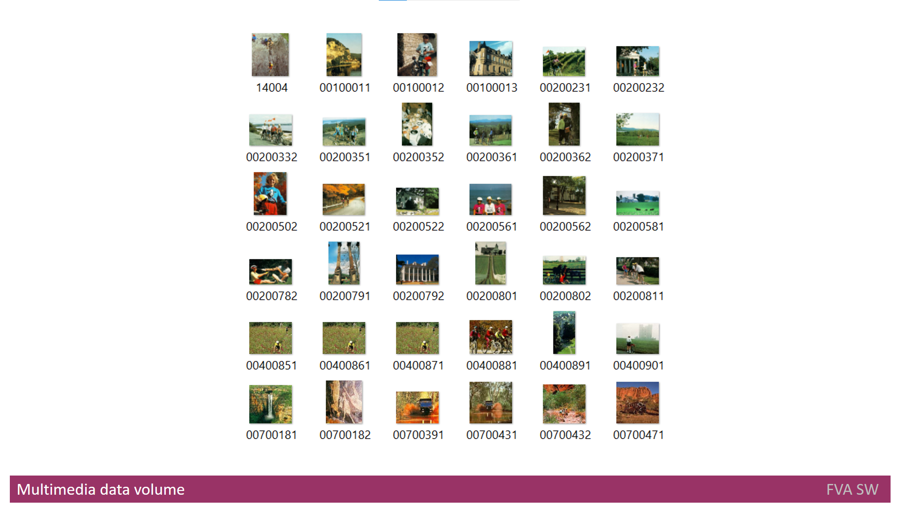

# Headline
What is Multimedia?

# Table of contents
- [Tags](./MultimediaData.md#tags)
- [Overview](./MultimediaData.md#overview)
- [Definitions, Acronyms, Abbreviations](./MultimediaData.md#definitions-acronyms-abbreviations)
- [References](./MultimediaData.md#references)

# Tags
Multimedia, Multimedia Information Retrieval, Media Formats, Search Engines

# Definitions, Acronyms, Abbreviations
| # | Abbreviation or Acronym | Definition     |
| - | ------------------------|:--------------:|
| 1 | [CBIR](https://en.wikipedia.org/wiki/Content-based_image_retrieval)|Content-based image retrieval, also known as query by image content ([QBIC](https://en.wikipedia.org/wiki/Content-based_image_retrieval#QBIC)) and content-based visual information retrieval (CBVIR), is the application of [computer vision](https://en.wikipedia.org/wiki/Computer_vision) techniques to the [image retrieval](https://en.wikipedia.org/wiki/Image_retrieval) problem, that is, the problem of searching for [digital images](https://en.wikipedia.org/wiki/Digital_image) in large [databases](https://en.wikipedia.org/wiki/Database) (see this survey for a recent scientific overview of the CBIR field). |
| 2 | [Google](https://en.wikipedia.org/wiki/Google)| Google LLC is an American multinational technology company that specializes in Internet-related services and products, which include [online advertising technologies](https://en.wikipedia.org/wiki/Online_advertising), a [search engine](https://en.wikipedia.org/wiki/Search_engine), [cloud computing](https://en.wikipedia.org/wiki/Cloud_computing), software, and hardware.|
| 3 | [Multimedia data](https://link.springer.com/referenceworkentry/10.1007%2F978-0-387-39940-9_1008)| Multimedia in principle means data of more than one medium. It usually refers to data representing multiple types of medium to capture information and experiences related to objects and events. Commonly used forms of data are numbers, alphanumeric, text, images, audio, and video. In common usage, people refer a data set as multimedia only when time-dependent data such as audio and video are involved.|
| 4 | Multimedia IR| Multimedia Information Retrieval (MIR) is an organic system made up of Text Retrieval (TR); Visual Retrieval (VR); Video Retrieval (VDR); and Audio Retrieval (AR) systems. So that each type of digital document may be analyzed and searched by the elements of language appropriate to its nature, search criteria must be extended.|

# Overview
The article provides an introduction to Multimedia Information Retrieval (MIR) systems, which are designed to search and retrieve information from multimedia sources like images, audio, and video. 

It explains the different components of MIR systems, such as feature extraction, indexing, and retrieval, and discusses some of the challenges associated with MIR, including the subjective nature of multimedia data and the need for efficient algorithms to handle large datasets. 

Overall, the article offers a helpful overview for those interested in learning about MIR systems. 

---

We currently live in a digital age when finding information is incredibly simple with just one click due to the development of the Internet. 
We are now able to conduct information searches from any place.

High-speed Internet connection allows everyone to utilize software to search for and manage information from any sources in the high-tech world.
Every day, people engage with digital data, and this interaction helps to produce specific types of data, such as **multimedia** data.
Data that spans multiple mediums is referred to as **multimedia**.
It often refers to data that represents various media formats used to record details and impressions about specific things and occasions. 
The most widely used formats of data are numbers, alphanumeric characters, text, images, audio and video.

In common usage, people refer to a data set as **multimedia** only when time-dependent [[data]](https://link.springer.com/referenceworkentry/10.1007%2F978-0-387-39940-9_1008) such as audio and video are involved.

Three subclasses of the **multimedia** data are distinguished: multidimensional (also known as spatial), dynamic and static.

**Multidimensional multimedia** includes:
* Three-dimensional, four-dimensional, five-dimensional, etc.;
* Virtual reality content.

**Dynamic multimedia** consists of:
* Video content;
* Animation content;
* Audio content.

**Static multimedia** involves:
* Image or photo content;
* Graphic content;
* Text content.

As a medium for interpersonal communication, text information has predominated. 
However, as computing capabilities like as disk and memory space, processor power, and other factors increase, other **media** formats, including audio, image, and video, are gaining greater value. 
The amount of photo content, available worldwide, is enormous, since many individuals own smartphones with cameras, and webcams, motion cameras and tablets with cameras are widely used all over the world.

This year people will shoot an estimated 1.5 trillion images, according to predictions [[How Many Photos Will Be Taken in 2021?]](https://blog.mylio.com/how-many-photos-will-be-taken-in-2021-stats/).
There is a need to search among various types of **media** because there is a massive amount of **multimedia** material in the globe and frequently a lot of **multimedia** content in a typical family (i.e., images). 
The systems that implement this market request are referred to as **Multimedia Information Retrieval (Multimedia IR)** systems. 

**Multimedia IR systems** often offer services like multimedia information storage, indexing, searching and distribution.
Additionally, they might include functions such as the extraction of descriptive information from **multimedia** data.
The textual and non-textual information are vastly different from one another.
Therefore, depending on the nature of **multimedia** data, several strategies and engines may be employed. 

In reality, text content is what **Multimedia IR systems** use most frequently.
Examples include **Bing**, **Google** and others.
As a result of the fact that finding information of any kind online is the most valued human activity, other sorts of information are becoming increasingly significant. 
Statistics shows that numerous resources, including photos, videos and other content, are constantly appearing and disappearing from search requests in the **Internet**.

# References
| # | Name                 | Source                | Release date           |  Author                 | Description   |
| - | ---------------------|---------------------- |----------------------- | ----------------------- |:-------------:|
| 1 | Multimedia Data      |[Web](https://link.springer.com/referenceworkentry/10.1007%2F978-0-387-39940-9_1008)| 01/01/2009 | Ramesh Jain |  |
| 2 | How Many Photos Will Be Taken in 2021? |[Web](https://blog.mylio.com/how-many-photos-will-be-taken-in-2021-stats/)| 11/03/2021 |Nina Pantic|After a pandemic-related decline, photo-taking is expected to surge back up in 2021|
| 3 | What are Multimedia IR systems?| [repo](./MultimediaIRSystems.md) | 01/01/2022 | Dmytro Nikulin | |
| 4 | Multimedia IR systems Analyze| [repo](./MultimediaIRSystemsAnalyze.md)| 01/01/2022 | Dmytro Nikulin | |
| 5 | What are MultimediaOrganizers?| [repo](./MultimediaOrganizers.md) | 01/01/2022 | Dmytro Nikulin | |
| 6 | How Many Photos Will Be Taken in 2020?|[Web](https://blog.mylio.com/how-many-photos-will-be-taken-in-2020/) | 10/01/2020 | David Carrington | Research analysts crunch the statistics and come up with a mind-blowing number. |
| 7 | Content Based Multimedia Information Retrieval To Support Digital Libraries | Magazine |  18/07/2012 | Mohammad Nabil Almunawar |  |
| 8 | Content Analysis with Apache Tika |[Web](https://www.baeldung.com/apache-tika) | 14/08/2019 | Nguyen Nam Thai       |  |
| 9 | The Massive Growth in Unstructured Data |[Web](https://www.researchgate.net/figure/The-Massive-Growth-in-Unstructured-Data-Source-IDC-The-Digital-Universe-Dec-2012_fig1_322058724)| 01/12/2012 |IDC The Digital Universe | |
