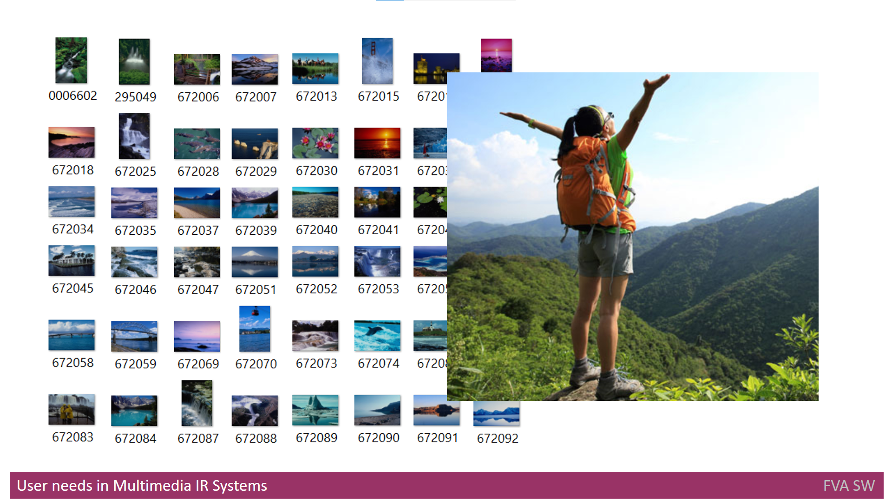

# Headline
What are Multimedia IR systems?

# Table of contents
- [Tags](./MultimediaIRSystems.md#tags)
- [Definitions, Acronyms, Abbreviations](./MultimediaIRSystems.md#definitions-acronyms-abbreviations)
- [Overview](./MultimediaIRSystems.md#overview)
- [User's needs in Multimedia IR Systems](./MultimediaIRSystems.md#users-needs-in-multimedia-ir-systems)
- [Professional's needs in Multimedia IR systems](./MultimediaIRSystems.md#professionals-needs-in-multimedia-ir-systems)
- [References](./MultimediaIRSystems.md#references)

# Tags
Multimedia Information Retrieval, Multimedia IR systems, Metadata, Search

# Definitions, Acronyms, Abbreviations
| # | Abbreviation or Acronym | Definition     |
| - | ------------------------|:--------------:|
| 1 | [Multimedia data](https://link.springer.com/referenceworkentry/10.1007%2F978-0-387-39940-9_1008)| Multimedia in principle means data of more than one medium. It usually refers to data representing multiple types of medium to capture information and experiences related to objects and events. Commonly used forms of data are numbers, alphanumeric, text, images, audio, and video. In common usage, people refer a data set as multimedia only when time-dependent data such as audio and video are involved.|
| 2 | Multimedia IR| Multimedia Information Retrieval (MIR) is an organic system made up of Text Retrieval (TR); Visual Retrieval (VR); Video Retrieval (VDR); and Audio Retrieval (AR) systems. So that each type of digital document may be analyzed and searched by the elements of language appropriate to its nature, search criteria must be extended.|
| 3 | [metadata](https://en.wikipedia.org/wiki/Metadata)|Metadata is "data that provides [information](https://en.wikipedia.org/wiki/Information) about other data". In other words, it is "data about data." Many distinct types of metadata exist, including descriptive metadata, structural metadata, administrative metadata, reference metadata and statistical metadata. |

# Overview
This article discusses the concept of Multimedia Information Retrieval (IR) systems and their potential uses for both ordinary users and professionals. 
The article provides an overview of Multimedia IR systems, explaining how they extract semantic information from various sources, such as audio, image, and video.
The article also highlights the importance of metadata, tags, and content in the search process, and how the indexing and storage functionality for multimedia information is implemented by these systems.
Additionally, the article outlines the key needs of users when it comes to Multimedia IR systems, including the ability to store, represent, edit, and search multimedia data, as well as the provision of relevance feedback, indexing, and cataloging functions.
Finally, the article examines how professionals in various industries can benefit from these systems, providing examples such as professional photographers, journalists, doctors, architects, and engineers. 

---

Let's make a brief overview of the **Multimedia IR systems**.
**Information retrieval (IR)** is the process of finding information system resources from a collection of those resources that are pertinent to an information demand, according to [Wikipedia](https://en.wikipedia.org/wiki/Information_retrieval). 
Furthermore, **Multimedia information retrieval** (MMIR or MIR) is a research area of computer science that aims to extract semantic information from **multimedia data** sources, according to [Wikipedia](https://en.wikipedia.org/wiki/Multimedia_information_retrieval) as well. 
Information is gathered from a variety of sources, including directly perceivable media like audio, image, and video, indirectly perceivable sources like text, semantic descriptions, and biosignals, as well as not perceivable sources such as bioinformation, stock prices, etc.

A computer system for browsing, searching, and retrieving images from a sizable database of digital images is called an **Image Retrieval system**. 
In order to execute retrieval over the words annotated to the photos, the majority of conventional and traditional techniques of image retrieval employ a certain method of adding information to the images, such as captioning, keywords, titles or [descriptions](https://en.wikipedia.org/wiki/Image_retrieval).

Therefore, when they discuss private **Multimedia IR** that searches through images and photos, they refer to the search based on the [metadata](https://en.wikipedia.org/wiki/Metadata), tags and content of the images and photos. 
The indexing and storage functionality for the **multimedia** information is also implemented by the **Multimedia IR** systems in response to market demand.
However, those systems might also have features like the ability to extract descriptions from **multimedia data**.
It goes without saying that if an average family does not have the **Multimedia IR** system to search for one item in thirty thousand photos, it would almost be impossible to find that one item by means of manual search. 
For this reason, the prospects offered by **Multimedia IR systems** would be of great interest to regular people.

The capacity to swiftly and simply search through the photo album is the essential requirement from the perspective of the end user when they are visiting the photo album.
It will also provide cataloging and search result browsing in addition to search functionality. 
Obviously, the search systems must deliver accurate and complete search results. 

# User's needs in Multimedia IR Systems
Considering **Multimedia IR** Systems, it is appropriate to bear in mind the potential users and their information needs. 
Therefore, the **Multimedia IR** system should:

* be able to store various types of multimedia data (or be integrated with other tools to do so); 
* be able to represent any type of multimedia information (photo, video, and audio) to the user via UI; 
* provide a simple way to edit the multimedia data;
* be able to quickly and easily search through the content;
* allow filtering of information by various sets of criteria;
* provide relevance feedback;
* include indexing and cataloging functions;
* provide the possibility to find information by image example;
* include a function of browsing through search results. 

# Professional's needs in Multimedia IR systems
Moreover, not ordinary people only, but also the businesses might find **Multimedia IR** systems useful due to their professional needs.
For example, there might be different professions who access the photos or images often in their everyday work activity, such as:

* professional photographers who work for businesses; 
* journalists who use cameras to produce multimedia news content; 
* individuals in various professions who require access to images, such as doctors looking for medical images or architects needing image examples to create buildings; 
* car engineers needing images and audio of car engines;
* video content engineers searching for specific video segments and movies by their titles.

# References
| # | Name                 | Source                | Release date           |  Author                 | Description   |
| - | ---------------------|---------------------- |----------------------- | ----------------------- |:-------------:|
| 1 | What is Multimedia Data?|[repo](./MultimediaData_en.md)| 01/01/2022            | Dmytro Nikulin | |
| 2 | Multimedia IR systems Analyze|[repo](./MultimediaIRSystemsAnalyze.md)|01/01/2022| Dmytro Nikulin | |
| 3 | What are MultimediaOrganizers?|[repo](./MultimediaOrganizers.md)|01/01/2022 | Dmytro Nikulin | |
| 4 | Information retrieval|[Web](https://en.wikipedia.org/wiki/Information_retrieval)| | Wikipedia      | |
| 5 | Multimedia information retrieval |[Web](https://en.wikipedia.org/wiki/Multimedia_information_retrieval)|| Wikipedia | |
| 6 | Image retrieval|[Web](https://en.wikipedia.org/wiki/Image_retrieval)|  | Wikipedia      | |
| 7 | Unified concept-based multimedia information retrieval technique | book | 01/01/2012 | Kambau, Ridwan, Hasibuan, Zainal, 10.1109/EECSI.2017.8239086 |  |
| 8 | Multimedia Retrieval |[Slides](https://www.ccs.neu.edu/home/jaa/CSG339.06F/Lectures/multimedia.pdf) | | Jimmy Lin , University of Maryland, Dr. Ramesh R. Sarukkai, Yahoo! Search | |
