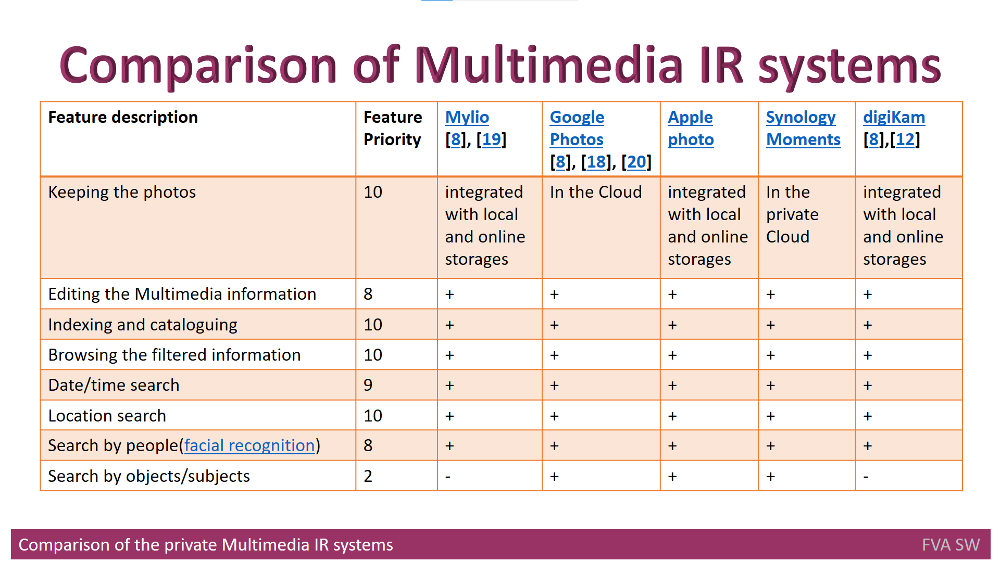
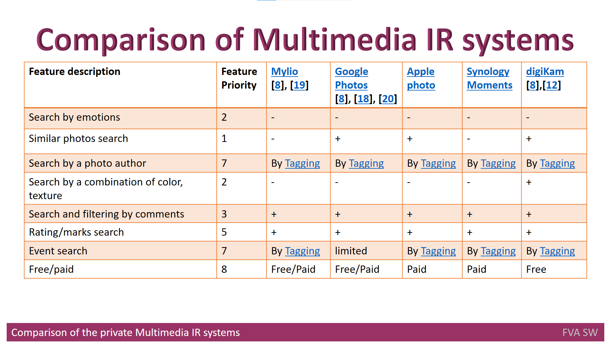

# Headline
TBD

# The Comparison of Private Multimedia IR Systems
In this article, we compare several private multimedia information retrieval (IR) systems based on the requirements and needs of users.
We recommend choosing one offline and one online system, as some users prefer multimedia IR systems integrated with online storage while others prefer offline ones.
Similarly, we compare both proprietary and open systems. 

# Table of contents
- [Tags](https://github.com/dimanikulin/dimanikulin/blob/main/MultimediaIRSystemsAnalyze.md#tags)
- [Overview](https://github.com/dimanikulin/dimanikulin/blob/main/MultimediaIRSystemsAnalyze.md#overview)
- [Definitions, Acronyms, Abbreviations](https://github.com/dimanikulin/dimanikulin/blob/main/MultimediaIRSystemsAnalyze.md#definitions-acronyms-abbreviations)
- [Well implemented features](https://github.com/dimanikulin/dimanikulin/blob/main/MultimediaIRSystemsAnalyze.md#well-implemented-features)
- [To be developed features](https://github.com/dimanikulin/dimanikulin/blob/main/MultimediaIRSystemsAnalyze.md#to-be-developed-features)
- [References](https://github.com/dimanikulin/dimanikulin/blob/main/MultimediaIRSystemsAnalyze.md#references)

# Tags
Multimedia IR systems, Synology Moments, Mylio, Google Photos, digiKam, Apple photo

# Definitions, Acronyms, Abbreviations
| # | Abbreviation or Acronym | Definition     |
| - | ------------------------|:--------------:|
| 1 | Apple Photo             |is a [photo management](https://en.wikipedia.org/wiki/Image_organizer) and [editing](https://en.wikipedia.org/wiki/Image_editing) application developed by [Apple](https://en.wikipedia.org/wiki/Apple_Inc.). |
| 2 | [digiKam](https://www.digikam.org/about/)|digiKam is an advanced open-source digital photo management application that runs on Linux, Windows, and MacOS. The application provides a comprehensive set of tools for importing, managing, editing, and sharing photos and raw files. |
| 3 | [Google](https://en.wikipedia.org/wiki/Google)| Google LLC is an American multinational technology company that specializes in Internet-related services and products, which include [online advertising technologies](https://en.wikipedia.org/wiki/Online_advertising), a [search engine](https://en.wikipedia.org/wiki/Search_engine), [cloud computing](https://en.wikipedia.org/wiki/Cloud_computing), software, and hardware.|
| 4 | [Google Photos](https://en.wikipedia.org/wiki/Google_Photos)| Google Photos is a [photo sharing](https://en.wikipedia.org/wiki/Photo_sharing) and [storage service](https://en.wikipedia.org/wiki/Cloud_storage) developed by [Google](https://en.wikipedia.org/wiki/Google). The service automatically analyzes photos, identifying various visual features and subjects. Users can search for anything in photos, with the service returning results from three major categories: People, Places, and Things.|
| 5 | [Multimedia data](https://link.springer.com/referenceworkentry/10.1007%2F978-0-387-39940-9_1008)| Multimedia in principle means data of more than one medium. It usually refers to data representing multiple types of medium to capture information and experiences related to objects and events. Commonly used forms of data are numbers, alphanumeric, text, images, audio, and video. In common usage, people refer a data set as multimedia only when time-dependent data such as audio and video are involved.|
| 6 | Multimedia IR| Multimedia Information Retrieval (MIR) is an organic system made up of Text Retrieval (TR); Visual Retrieval (VR); Video Retrieval (VDR); and Audio Retrieval (AR) systems. So that each type of digital document may be analyzed and searched by the elements of language appropriate to its nature, search criteria must be extended.|
| 7 | [metadata](https://en.wikipedia.org/wiki/Metadata)|Metadata is "data that provides [information](https://en.wikipedia.org/wiki/Information) about other data". In other words, it is "data about data." Many distinct types of metadata exist, including descriptive metadata, structural metadata, administrative metadata, reference metadata and statistical metadata. |
| 8 | [Mylio](https://mylio.com/tour/)| Mylio has a suite of tools to help you locate and consolidate your images across a variety of locations, including external hard drives, online services.|

# Overview
TBD 

---
 
Let's compare several **multimedia IR** systems by going over the above-mentioned requirements and needs.
The best approach here would be to choose one offline and one online system, since some users could feel free to use **multimedia IR** systems that are integrated with online storage (like Cloud ones), while others want to utilize offline **Multimedia IR** systems.
Similarly, the proprietary and open systems should be included in the comparison.

Below is the list of them with brief descriptions:
* **[Synology Moments](https://www.synology.com/en-global/dsm/feature/moments)** – a system that is aimed at collecting all user’s images and videos in one secure location and organizing them in an entirely new way. Synology Moments is the brand-new photo solution for personal and home and personal use, offering a modern browsing experience with the image recognition technique.
* **[Mylio](https://mylio.com/)** – a free application that can be used to organize images, videos and other data types. This program can be used on any Mac, iOS, Windows and Android device. Mylio can automatically arrange the files depending on the calendar app and can run without the Internet to operate.
* **[Google Photos](https://en.wikipedia.org/wiki/Google_Photos)** – a photo sharing and storage service, developed by Google. The service automatically analyzes photos, identifying various visual features and subjects. Users can search for anything in photos, with the service returning results in three major categories: People, Places, and Things.
* **[digiKam](https://docs.kde.org/trunk5/en/digikam-doc/digikam/index.html)** – a free and open-source photo organizing software that can handle more than 100K images. The program has all the photo organizing functionality needed, such as uploading, deleting and sorting images.
* **[Apple photo](https://en.wikipedia.org/wiki/Apple_Photos)** – a photo management and editing application, developed by Apple.

# Well implemented features
The comparison table demonstrates, how well the following features have been implemented: 

* keeping/browsing functions for the multimedia content of private photo albums; 
* extensive photo editing capabilities;
* search by date/time (using metadata);
* search by location (using metadata);
* search by people (using face recognition technology over multimedia data content);
* search by rating/marks (using metadata);
* search by feedback and by comments. 

From the user's perspective, all of the aforementioned features are well-developed and do not need to be improved upon or replaced by any other software.

# To be developed features
In order to meet user demands, the following set of searching features must be developed:

* search by events (currently possible through tagging only);
* search by objects/subjects (only a few systems can recognize the objects on the photos);
* search by emotions;
* similar photos search (only a few systems are able to provide the search by a similar photo);
* search by a photo author (is possible by applying tagging only);
* search by a combination of color or texture (only a few systems can perform this).

Although the most recent **multimedia IR** systems may provide search operations, providing tagging must be implemented at a much earlier level than import.

# References
| # | Name                 | Source                | Release date           |  Author                 | Description   |
| - | ---------------------|---------------------- |----------------------- | ----------------------- |:-------------:|
| 1 | What is Multimedia Data?|[repo](./MultimediaData.md)| 01/01/2022            | Dmytro Nikulin | |
| 2 | What are Multimedia IR systems?|[repo](./MultimediaIRSystems.md)| 01/01/2022| Dmytro Nikulin | |
| 3 | What are MultimediaOrganizers?|[repo](./MultimediaOrganizers.md)| 01/012022| Dmytro Nikulin | |
| 4 | Synology Moments     |[Web](https://www.synology.com/en-global/dsm/feature/moments)| 01/01/2021 | Synology       | |
| 5 | Tour Mylio           |[Web](https://mylio.com/)|                      | Mylio          | |
| 6 | Google Photos        |[Web](https://en.wikipedia.org/wiki/Google_Photos)| | Wikipedia   | |
| 7 | A Beginner’s Guide To Google Photos |[Web](https://www.theedublogger.com/google-photos-guide/)| 08/07/2020| Sue Waters     | |
| 8 | The digiKam Handbook |[Web](https://www.digikam.org/documentation/)| | The digiKam developers team | |
| 9 | Apple Photos         |[Web](https://en.wikipedia.org/wiki/Apple_Photos)|  | Wikipedia      | |
