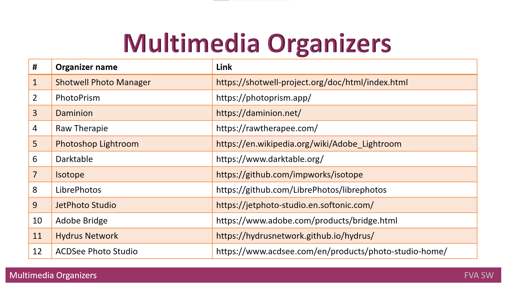

# Headline
What are Multimedia Organizers?

Exploring the Main Functions and Requirements of Multimedia Organizers for Efficient Photo Management

# Article description
This article delves into the functions and requirements of multimedia organizers for efficient photo management. 
It discusses the different features of photo organizers, such as searching, creating folder structures, and importing new photos, among others.
Additionally, the article provides a list of photo organizers and online courses that can help users with photo arrangement.
It also explores approaches for creating a folder structure and preventing the storage of duplicate photos in the same folder.
Overall, this article is a useful guide for anyone looking to manage their photo collection more effectively. 

# Tags
Multimedia organizers, Photo management, Photo organizer software, Metadata, IR Multimedia Systems

# Definitions, Acronyms, Abbreviations
| # | Abbreviation or Acronym | Definition     |
| - | ------------------------|:--------------:|
| 1 | [digiKam](https://www.digikam.org/about/)|digiKam is an advanced open-source digital photo management application that runs on Linux, Windows, and MacOS. The application provides a comprehensive set of tools for importing, managing, editing, and sharing photos and raw files. |
| 2 | IR Multimedia Systems |multimedia information retrieval means the process of searching for and finding multimedia documents; the corresponding research field is concerned with building multimedia search engines. |
| 3 | [Multimedia data](https://link.springer.com/referenceworkentry/10.1007%2F978-0-387-39940-9_1008)| Multimedia in principle means data of more than one medium. It usually refers to data representing multiple types of medium to capture information and experiences related to objects and events. Commonly used forms of data are numbers, alphanumeric, text, images, audio, and video. In common usage, people refer a data set as multimedia only when time-dependent data such as audio and video are involved.|
| 4 | Multimedia IR| Multimedia Information Retrieval (MIR) is an organic system made up of Text Retrieval (TR); Visual Retrieval (VR); Video Retrieval (VDR); and Audio Retrieval (AR) systems. So that each type of digital document may be analyzed and searched by the elements of language appropriate to its nature, search criteria must be extended.|
| 5 | [metadata](https://en.wikipedia.org/wiki/Metadata)|Metadata is "data that provides [information](https://en.wikipedia.org/wiki/Information) about other data". In other words, it is "data about data." Many distinct types of metadata exist, including descriptive metadata, structural metadata, administrative metadata, reference metadata and statistical metadata. |
| 6 | [Mylio](https://mylio.com/tour/)| Mylio has a suite of tools to help you locate and consolidate your images across a variety of locations, including external hard drives, online services.|
| 7 | [Synology Moments](https://www.synology.com/en-global/dsm/feature/moments)|It gathers all your photos and videos in one private place and organize them in an entirely new way. Synology Moments is the brand-new photo solution for personal and home use, offering a modern browsing experience with the image recognition technique. |

# Content

## Multimedia Organizers functions
A program that helps organizing photos is known as a **photo organizer**.
There are a variety of **photo organizer** software programs available on the market, and each one provides various features and tools to assist in organizing photos.
Thus, let’s consider main functions multimedia organizers perform:

* they provide the possibility to search through a photo set by organizing photos based on their date, location, categories, etc.;
* they offer an option of creating a folder structure and place the files in it;
* they automate the import of new photos into **IR Multimedia Systems**.

Additionally, they make photo albums more searchable (that is driven by **IR Multimedia Systems**) by enriching the **metadata** (and improving its consistency) with minimal human involvement.

Therefore, they are chosen as a subject for the overview and comparison.
A list of **Photo Organizers** for professional photographers is created, and those [organizers](https://www.pixpa.com/blog/photo-organiser) can also be used by an ordinary user with a big photo album.
Pertinent online [courses](https://www.organizepictures.com/organize-digital-photos-course) are available to instruct users on how to arrange the photos.
More detailed comparison of photo organizers is provided by Wikipedia and is available [here](https://en.wikipedia.org/wiki/Image_organizer).

## Multimedia Organizer requirements

* a user will be working with a large number of items, so automated approach is recommended;
* a toolset that is available for a typical user and not for enterprises shall be used;
* they shall provide integration with such **Multimedia IR Systems** as **digiKam** and **Synology Moments**;
* they shall be able to identify inconsistent or nonexistent photo metadata;
* they shall be able to suggest ways to solve inconsistency and absence.

## Multimedia Organizer approaches to create folder structure
The goal is to prevent duplicate photos from being stored in the same folder.
In order to construct subfolders based on the number of photographers or cameras, the folder name may be something like Date Shoot-Type Event Name; 
it could also contain a location or any other information the user desires.

# References
| # | Name                 | Source                | Release date           |  Author                 | Description   |
| - | ---------------------|---------------------- |----------------------- | ----------------------- |:-------------:|
| 1 | What is multimedia data?|[repo](./MultimediaData.md)| 2022            | Dmytro Nikulin | |
| 2 | What are Multimedia IR systems?|[repo](./MultimediaIRSystems.md)|2022 | Dmytro Nikulin | |
| 3 | Multimedia IR systems Analyze|[repo](./MultimediaIRSystemsAnalyze.md)|2022| Dmytro Nikulin | |
| 4 | 26 Best Photo Organizer Software and Apps of 2022 |[Web](https://www.pixpa.com/blog/photo-organiser)| Jun 25, 2021    | Anisha Singh   | |
| 5 | Independent Course for Organizing Your Digital Photos |[Web](https://www.organizepictures.com/organize-digital-photos-course)| 2021        | organizepictures | |
| 6 | Image organizer |[Web](https://en.wikipedia.org/wiki/Image_organizer) | | Wikipedia      | |
| 7 | Best Photo Management Software to Organize Digital Photos in 2022 |[Web](https://wethegeek.com/best-photo-management-software-organize-photos/)| 2021-12-17 | Mansi Vijay ||
| 8 | Photo organizer |[Web](https://github.com/topics/photo-organizer)| | GitHub ||
