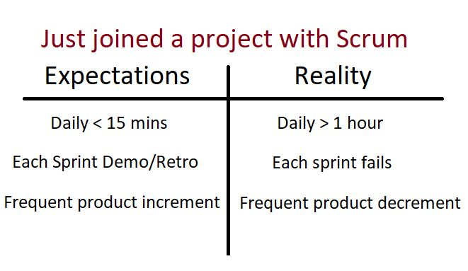
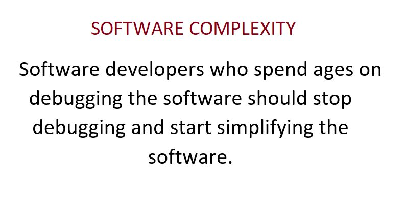
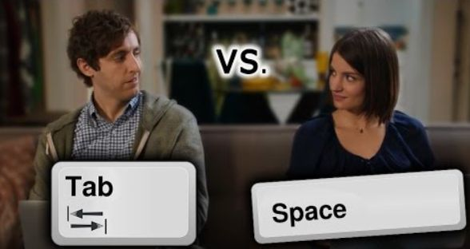
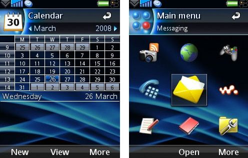
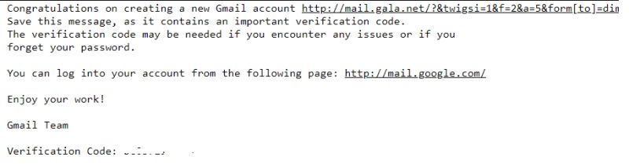
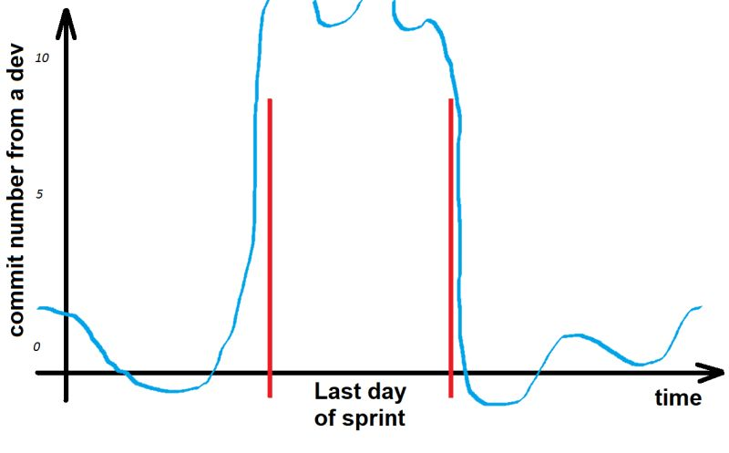
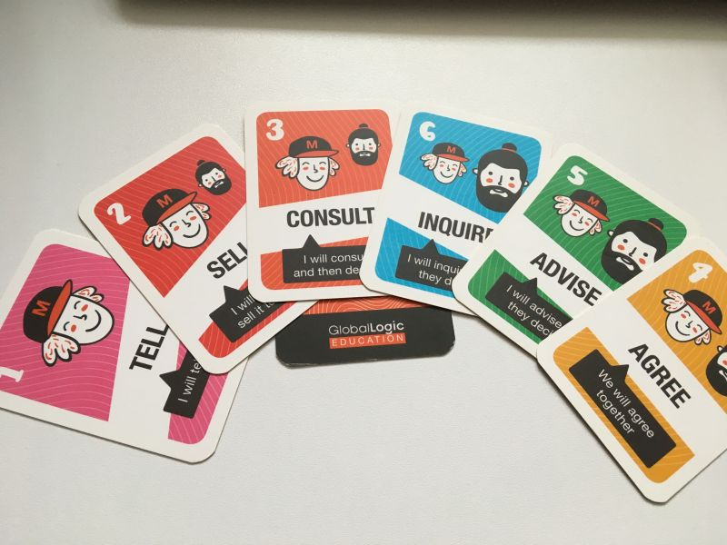
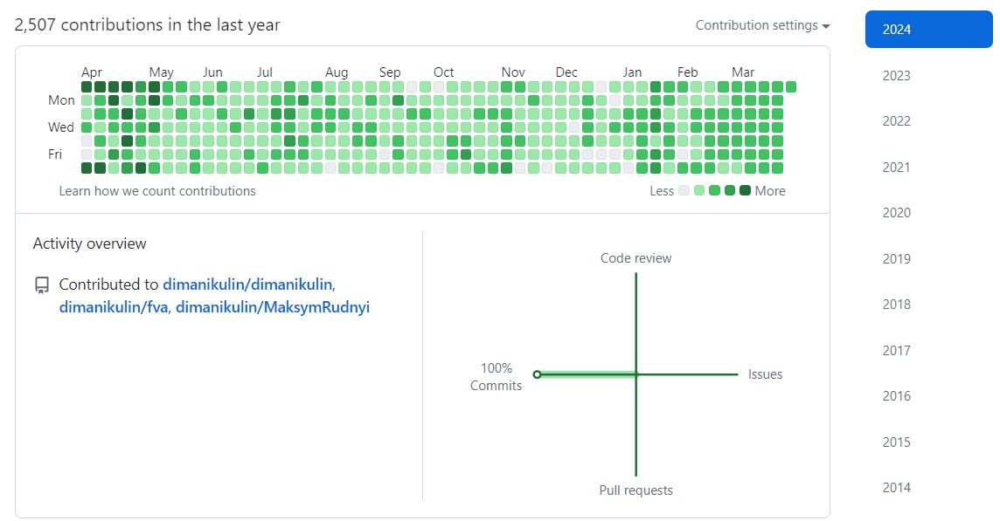

| # | Topic | Post name   | Tags           | Picture     | Release date, reactions |  Post    | Links         |
| - | ------|-------------|----------------|-------------|-------------------------|----------|:-------------:|
| | Software Development | Just joined a project with Scrum | SoftwareDevelopment Scrum |  | [01/05/2022](https://www.linkedin.com/posts/dimanikulin_activity-6937092837654081540-brUA?utm_source=share&utm_medium=member_desktop) {TBD/TBD/TBD/TBD} | | |
| | Software Development | Software Complexity | SoftwareDevelopment SoftwareComplexity |  | [01/04/2022](https://www.linkedin.com/posts/dimanikulin_activity-6934186023509741568-9mZu?utm_source=share&utm_medium=member_desktop)  {TBD/TBD/TBD/TBD} | | |
| | Software Development | Which title describes better a real job? | SoftwareDevelopment itconsulting cv | | [01/11/2022](https://www.linkedin.com/posts/dimanikulin_itconsulting-itcompany-cv-activity-7000719821558411264-1dHl?utm_source=share&utm_medium=member_desktop)  {TBD/TBD/TBD/TBD} | I have seen a lot of different titles in CV, social networks like "Consultant", "Consulting" etc. From my side it is difficult to understand what "IT Consultant" really does and knows. Which title describes better a real job? - IT Consultant **10%**; - C++ Developer **90%**; 87 Votes | |
| | Software Development | What do you usually do to provide accurate estimations? | SoftwareDevelopment experience  estimation | | [30/05/2023](https://www.linkedin.com/posts/dimanikulin_experience-softwaredevelopment-estimation-activity-7069560555165876224-_Af3?utm_source=share&utm_medium=member_desktop) {TBD/TBD/TBD/TBD} | I have had significant experience in software development, yet I still struggle with estimation. What I usually do is multiply my estimations by 2-3, but even that approach doesn't always work. I have rarely come across a developer who is consistently good at estimating. So what do you usually do to provide accurate estimations? - Break tasks into smaller parts **56%**; - Use historical data **10%**; - Involve the team **16%**; - Regularly review and learn **18%**; Please share your opinions in the comments.  | |
| | Software Development | C++ death | SoftwareDevelopment programminglanguage technologytrends cpplus prediction | | [19/06/2023](https://www.linkedin.com/posts/dimanikulin_programminglanguage-technologytrends-cpplus-activity-7076463361500098560-ucVw?utm_source=share&utm_medium=member_desktop) {TBD/TBD/TBD/TBD} | Do you have any programming language/technology that were predicted to die a long time ago but are still going strong? For me, it's C++. I started using it more than 20 years ago, and after a while (2-3 years), there were predictions that C++ would die soon due to the emergence of new languages and technologies. But that didn't happen, and those fast-approaching languages and technologies are still around.So, when was the first time you heard that your language/technology X would die? - 20 years ago **17%**; - 10 years ago **21%**; - 5 years ago  **20%**; - never heard  **42%**; 71 Votes. Please share in the comments your programming language/technology that was predicted to die but didn't. | |
| | Software Development | Programming Languages and Guessing! | SoftwareDevelopment |  | [23/11/2023](https://www.linkedin.com/posts/dimanikulin_languages-and-guessing-in-a-broader-sense-activity-7133365394043514880-WW4P?utm_source=share&utm_medium=member_desktop) {TBD/TBD/TBD/TBD} | In a broader sense, the relationship between programming languages and the role of guessing can depend on the nature of the language. It's not that guessing is universally opposed to programming; rather, different languages may encourage different approaches to problem-solving. For example, in languages like Python or JavaScript, often associated with scripting and rapid prototyping, developers might employ a more exploratory approach where they try out ideas, experiment, and make decisions on the fly. These languages are designed to be more flexible and expressive, allowing for a dynamic and iterative development process. On the contrary, a language like C++ is known for its precision, structure, and explicit coding, while guessing implies uncertainty and lack of precision. So, in the realm of programming, C++ and guessing can be considered on opposite sides. Do you agree with that? | |
| | Software Development | Tabs or Spaces | SoftwareDevelopment |  | [15/12/2023](https://www.linkedin.com/posts/dimanikulin_softwaredevelopment-activity-7141376776915660800-whXp?utm_source=share&utm_medium=member_desktop) {TBD/TBD/TBD/TBD} | "Tabs vs Spaces" - "Holy war" or settled matter? The "Tabs vs Spaces" holy war has been a long-standing debate among software developers regarding whether to use "tabs" or "spaces" for code indentation. Some developers prefer tabs, while others favor spaces. The choice between them is largely a matter of personal preference. So, what is your preference and why? | |
| | Software Development | UIQ | SoftwareDevelopment old |  | [16/01/2024](https://www.linkedin.com/posts/dimanikulin_old-activity-7152938805359001601-vGeW?utm_source=share&utm_medium=member_desktop) {TBD/TBD/TBD/TBD} | About 15 years ago, I used to program for a rare operating system called UIQ. It was used for Sony Ericsson smartphones with touchable screens. The C++ language was used to make UI programming possible, as well as backend programming. The biggest problem was the lack of programming documentation and support. Can you share your experience with old operating systems, libraries, languages, etc., that you will never forget due to issues working with them? | |
| | Software Development | Gmail | SoftwareDevelopment gmail sla email goodservice |  | [30/01/2024](https://www.linkedin.com/posts/dimanikulin_gmail-sla-email-activity-7158023530251530240-DNUk?utm_source=share&utm_medium=member_desktop) {TBD/TBD/TBD/TBD} | About 20 years ago, I created an email account on Gmail. At that time, it was quite simple in terms of the number of functions, but it was exceptionally fast and stable. Over the years, Gmail has added new features, and surprisingly, I have faced no issues. This means it has maintained a Service Level Agreement (SLA) of 99.9999% since I first got it. For me, it stands as a great example of wide functional software with high performance and stability. I want to express my gratitude to Google for providing such a reliable service! Can you provide other examples of functional software known for high performance and stability? PS. No, I am not an advertiser for Google. | |
| | Software Development | | SoftwareDevelopment | | {TBD/TBD/TBD/TBD} | | |
| | Software Development | | SoftwareDevelopment | | {TBD/TBD/TBD/TBD} | | |
| | Software Development | | SoftwareDevelopment | | {TBD/TBD/TBD/TBD} | | |
| | Software Development | | SoftwareDevelopment | | {TBD/TBD/TBD/TBD} | | |

| 10|Procrastination |[LinkedIn](https://www.linkedin.com/posts/dimanikulin_procrastination-projectrisk-activity-7170691619946541056-Zu2h?utm_source=share&utm_medium=member_desktop) | 05/03/2024 | Dmytro Nikulin | |
| 11|Delegation Poker Cards |[LinkedIn](https://www.linkedin.com/posts/dimanikulin_agile-scrum-delegation-activity-7173227183098720257-UTef?utm_source=share&utm_medium=member_desktop) | 12/03/2024 | Dmytro Nikulin | |
| 12|Commit quantity |[LinkedIn](https://www.linkedin.com/posts/dimanikulin_commits-activity-7180822960239239168-P_1m?utm_source=share&utm_medium=member_desktop) | 02/04/2024 | Dmytro Nikulin | |
| 13|KPI|[LinkedIn](https://www.linkedin.com/posts/dimanikulin_they-talk-a-lot-about-kpis-for-software-developers-activity-7204740366183337985-I2wF?utm_source=share&utm_medium=member_desktop)| 07/06/2024 | Dmytro Nikulin | |

# Procrastination

What is procrastination?

By my definition, procrastination is a state in which you postpone doing something complex until later. Initially, you prioritize easy tasks over difficult ones.

For example, as a software developer, you may spend the majority of a Scrum sprint contemplating your tasks, only to complete them all at once in the final days of the sprint. Such behavior poses significant risks from a project manager's perspective.

Could you provide your definition of procrastination?
Additionally, can you explain the advantages of procrastination?

## Tags

procrastination projectrisk

# Delegation Poker Cards

Can you guess what these playing cards are?

Have you ever tried them?

The answer is in the comment.

These are Delegation Poker Cards.

Delegation Poker is a technique used in Agile and Scrum methodologies for team collaboration and decision-making regarding task delegation and empowerment.
It involves a card-based game where team members discuss and vote on the level of authority and decision-making power they have regarding specific tasks or responsibilities.
Delegation Poker helps teams clarify roles and responsibilities, promotes transparency, and ensures that everyone understands the level of empowerment they have within the team.
It encourages open communication and collaboration, leading to better decision-making and more efficient task execution.

## Tags

agile scrum delegation

# Commit quantity

Typically, I utilize small commits to both create and update the code.

I prefer small commits over large ones for several reasons: they are easier to understand when reading them, quicker to review, and more conducive to testing.

Over the past year, I've averaged about 2.5k commits, so about 7 per day.
Do you think this quantity is excessive?

## Tags

commits

# KPIs for software developers

They talk a lot about KPIs for software developers, but there is still no good definition.

What do you think is the best KPI for software developers? Can you explain why?

- Commit count - 0%
- Ticket count - 17%
- Documentation and pull request - 33%
- All of them - 50%

## Tags

KPI
