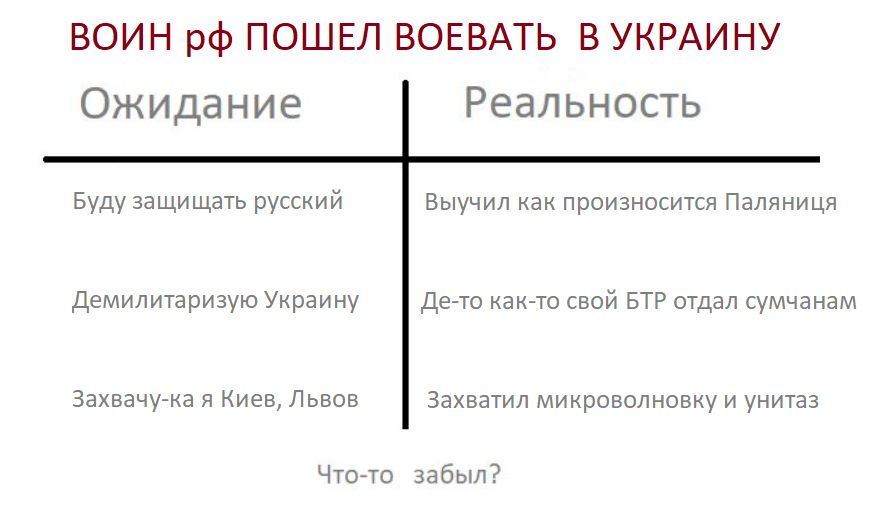
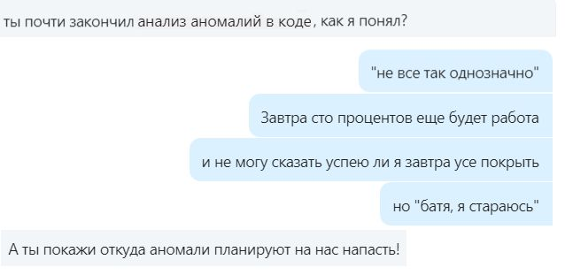
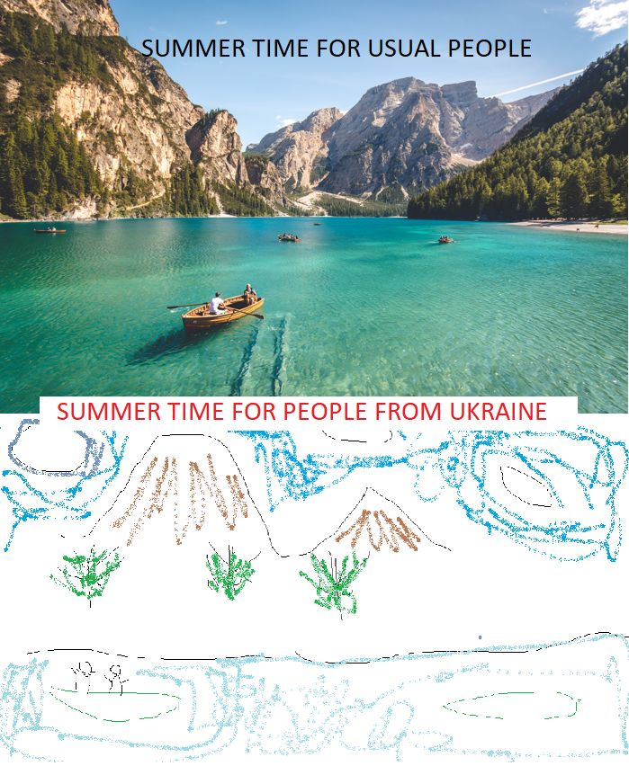
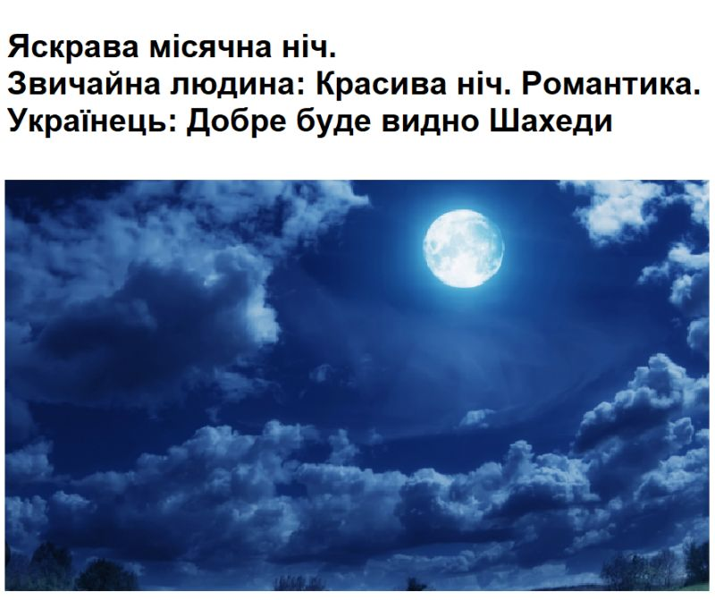
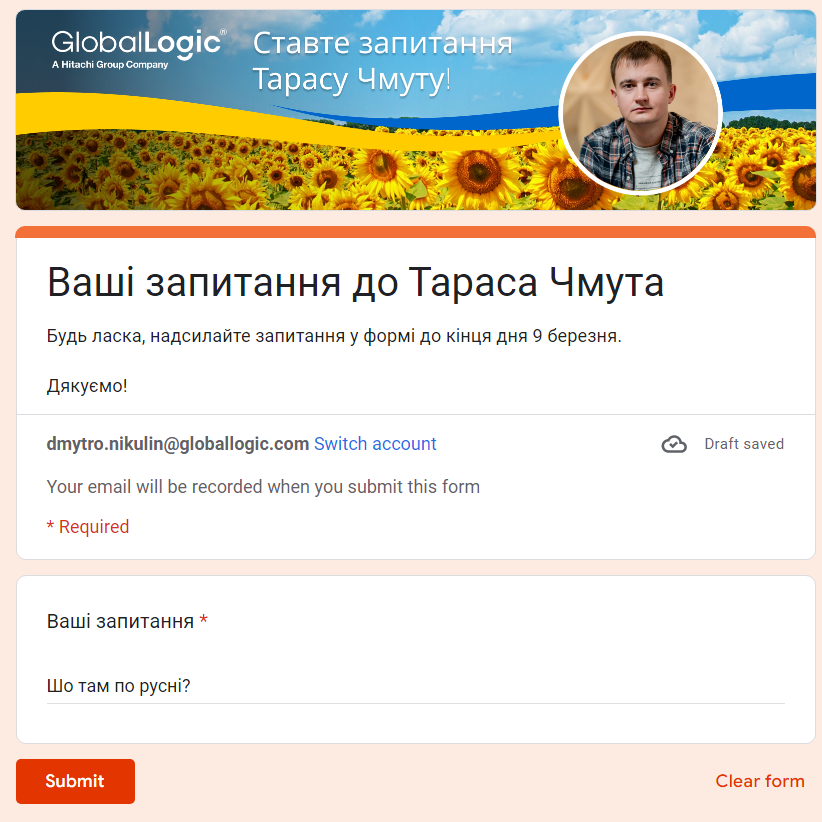
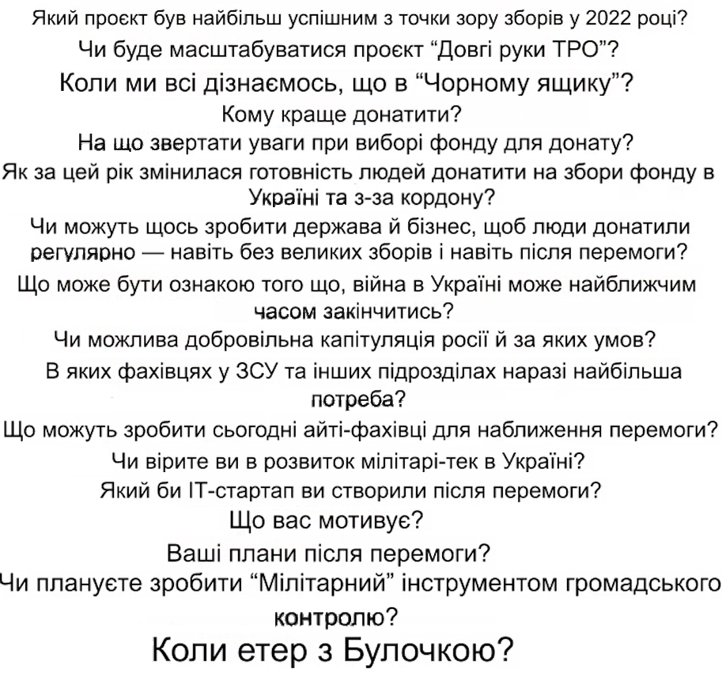
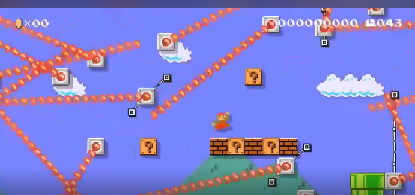
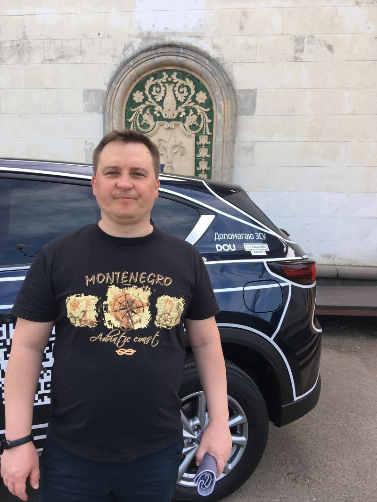

| # | Topic | Post name   | Tags           | Picture     | Release date, reactions |  Post    | Links         |
| - | ------|-------------|----------------|-------------|-------------------------|----------|:-------------:|
|   | War in Ukraine! | Первый пост с 24 февраля 2022 года | armukrainenow staywithukraine stoprussia stopwar russiaterroriststate warinukraine ukrainewar ukraine |  | [01/03/2022](https://www.linkedin.com/posts/dimanikulin_%D0%B4%D0%B0-%D1%8F-%D0%B3%D0%BE%D0%B2%D0%BE%D1%80%D0%B8%D0%BB-%D1%87%D1%82%D0%BE-%D0%BD%D0%B0-%D0%BB%D0%B8%D0%BD%D0%BA%D0%B5%D0%B4%D0%B5-%D0%BD%D0%B5%D1%82-%D0%BC%D0%B5%D1%81%D1%82%D0%B0-%D0%B4%D0%BB%D1%8F-activity-6927370042426707968-O7jY?utm_source=share&utm_medium=member_desktop)  {NULL/16/0/0} | Да, я говорил, что на Линкеде нет места для политоты. Но так-то было до 24 февраля  | |
|   | War in Ukraine! | Usual talks in unsual time | armukrainenow staywithukraine stoprussia stopwar russiaterroriststate warinukraine ukrainewar ukraine |  | [01/08/2022](https://www.linkedin.com/posts/dimanikulin_standwithukraine-warinukraine-activity-6962298071544135680-Szog?utm_source=share&utm_medium=member_desktop) {NULL/6/0/0} | Обычный разговор, в "необычное" время. | |
|   | War in Ukraine! | Summer time | armukrainenow staywithukraine stoprussia stopwar russiaterroriststate warinukraine ukrainewar ukraine |  | [01/08/2022](https://www.linkedin.com/posts/dimanikulin_ukrainewar-ukraine-summer-activity-6957738620485005312-kqEc?utm_source=share&utm_medium=member_desktop) {NULL/13/0/0} | Summer is definitely a time for vacation, relaxing ... But there are some "nuances" | |
|   | War in Ukraine! | How russians play chess? | armukrainenow staywithukraine stoprussia stopwar russiaterroriststate warinukraine ukrainewar ukraine |  | [01/11/2022](https://www.linkedin.com/posts/dimanikulin_russiaterroriststate-warinukraine-stoprussia-activity-7000377148582563840-kZNd?utm_source=share&utm_medium=member_desktop) {NULL/4/2/0} | Yes, it is not really easy to resign. Even when you just play chess and when you have already lost. When I am loosing chess game I am saying "thank you, well played" and I am getting upset. It differs from what usually rUSSIANS do. They say all rude words they even know when they loose just chess game. Another example what rUSSIANS do when they loose the "GAME" on real battle field - they bomb usual people, infrastructure like usual TERRORISTS. | |
|   | War in Ukraine! | А на куди зибеться пУТЕНг? | armukrainenow staywithukraine stoprussia stopwar russiaterroriststate warinukraine ukrainewar ukraine | | [01/11/2022](https://www.linkedin.com/posts/dimanikulin_warinukraine-staywithukraine-activity-6987497817262972928-os1e?utm_source=share&utm_medium=member_desktop) {NULL/7/2/1} | Яник зибався на ростов. А на куди зибеться пУТЕНг? - До яника **1%**; - На картопля-ленд **4%**; - На Марс з Маском **11%**; - До жиріка **84%**; 135 votes. | |
|   | War in Ukraine! | Яскрава місячна ніч | armukrainenow staywithukraine stoprussia stopwar russiaterroriststate warinukraine ukrainewar ukraine |  | [01/01/2023](https://www.linkedin.com/posts/dimanikulin_warinukraine-stoprussia-activity-7018150699758727169-qItq?utm_source=share&utm_medium=member_desktop) {1535/11/0/0} | Яскрава місячна ніч. Звичайна людина: Красива ніч. Романтика. Українець: Добре буде видно "Шахеди".  | |
|   | War in Ukraine! | Якби у Вас була можливість, то що б Ви запитали у Тараса Чмута? | armukrainenow staywithukraine stoprussia stopwar russiaterroriststate warinukraine ukrainewar ukraine |  | [01/03/2023](https://www.linkedin.com/posts/dimanikulin_globallogic-savelife-staywithukraine-activity-7046022484441149441-Ium7?utm_source=share&utm_medium=member_desktop) {4109/8/13/0} | П.С. Наступні питання не пропонувати: - Що там по русі?; - Що було в чорному ящику Кирила Буданова? - Коли ми отримаємо Ф-16? | |
|   | War in Ukraine! | Які питання ставили хлопці з GlobalLogic Тарасу Чмуту | armukrainenow staywithukraine stoprussia stopwar russiaterroriststate warinukraine ukrainewar ukraine |  | [01/05/2023](https://www.linkedin.com/posts/dimanikulin_globallogic-armukrainenow-staywithukraine-activity-7058710292825874433-_gHi?utm_source=share&utm_medium=member_desktop) {2070/1/0/0} | Місяць тому мене запитали, які питання ставили хлопці з GlobalLogic Тарасу Чмуту на зустрічі з ним. Ось вони. Якщо вам цікаво напишіть у коментах які питання цікаві та на які питання ви хотіли б дізнатися відповіді? | |
|   | War in Ukraine! | junior is trying to find a job in summer in Ukraine in war | armukrainenow staywithukraine stoprussia stopwar russiaterroriststate warinukraine ukrainewar ukraine |  | [01/07/2022](https://www.linkedin.com/posts/dimanikulin_ukrainewar-ukraine-summer-activity-6957738620485005312-kqEc?utm_source=share&utm_medium=member_desktop)  {NULL/13/0/0} | When junior is trying to find a job in summer... in Ukraine.... in war. Invest(hire) in them now and you will have nice ROI soon! | |
|   | War in Ukraine! | Що мені допомогло минулої зими під час blackout-ів | armukrainenow staywithukraine stoprussia stopwar russiaterroriststate warinukraine ukrainewar ukraine |  | [13/11/2023](https://www.linkedin.com/posts/dimanikulin_%D1%89%D0%BE-%D0%BC%D0%B5%D0%BD%D1%96-%D0%B4%D0%BE%D0%BF%D0%BE%D0%BC%D0%BE%D0%B3%D0%BB%D0%BE-%D0%BC%D0%B8%D0%BD%D1%83%D0%BB%D0%BE%D1%97-%D0%B7%D0%B8%D0%BC%D0%B8-%D0%BF%D1%96%D0%B4-%D1%87%D0%B0%D1%81-blackout-%D1%96%D0%B2-activity-7129735104486080512-MALD?utm_source=share&utm_medium=member_desktop)  {TBD/TBD/TBD/TBD} | - Запас питної та технічної води на 3 дні; - Сухи пайки, консерви, сублімовані продукти (каші); - BLUETTI AC50S Blue; - Лампи на акумуляторах; - Запас свічок, сірників та батарейок; - Теплі домашні речі, ковдри; - 2 додаткових sim карти для мобільного інтернету (тобто маю карти Life, Vodafone та Kyivstar); Також придбав домашній вогнегасник. А що допомогло Вам чого немає у цьому чек-листі? | |
|   | War in Ukraine! | DOU and BackAlive bank | armukrainenow staywithukraine stoprussia stopwar russiaterroriststate warinukraine ukrainewar ukraine  doucommunity dou savelife backalive |  | [30/07/2024](https://www.linkedin.com/posts/dimanikulin_staywithukraine-stoprussia-russiaterroriststate-activity-7223923409699655680-70jL?utm_source=share&utm_medium=member_desktop)  {TBD/TBD/TBD/TBD} | Я тут щось знайшов. Хтось у спільноті може вгадати де це, і з чим та машинка пов'язана? Та ще, за кожну вподобайку, комент та репост – надсилаю відповідно 20/50/100 гривень туди. Так-так, саме туди.  | |
|   | War in Ukraine! | DOU and BackAlive bank 2 | armukrainenow staywithukraine stoprussia stopwar russiaterroriststate warinukraine ukrainewar ukraine | | [14/08/2024](https://www.linkedin.com/posts/dimanikulin_%D0%B7%D0%B0%D0%B3%D1%96%D0%BD-%D1%96%D1%82-%D0%BC%D1%96%D1%81%D1%96%D1%8F-50%D0%BC%D1%96%D0%BB%D1%8C%D0%B9%D0%BE%D0%BD%D1%96%D0%B2-%D0%B2%D0%B8%D0%B3%D1%80%D0%B0%D0%B9%D1%82%D0%B5-activity-7229397440838127616-FReB?utm_source=share&utm_medium=member_desktop) {TBD/TBD/TBD/TBD} | У минулому пості (лінк у коментах) я викладав фото машини і питав, де вона і з чим вона пов'язана. На жаль, ніхто не дав відповіді. Це місце – Київ, ВДНГ. А машина - приз за донат на спільний збір DOU та Повернись Живим - <https://lnkd.in/gyXbFGAh>. Тож прошу долучитися до збору. Дуже вдячний за підтримку у розповсюдженні минулого посту. Він набрав багато вподобайок, коментів та репостів. Також буду вдячний за репости, вподобайки та коменті для цього поста. І так, як обіцяв, переказав "туди" 2000 грн за сумою вподобайок, коментів та репостів. Скрін переказу у коментах.| |
