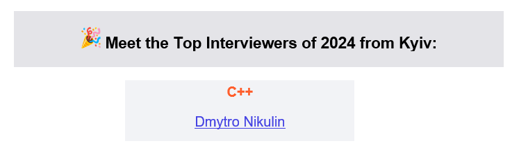
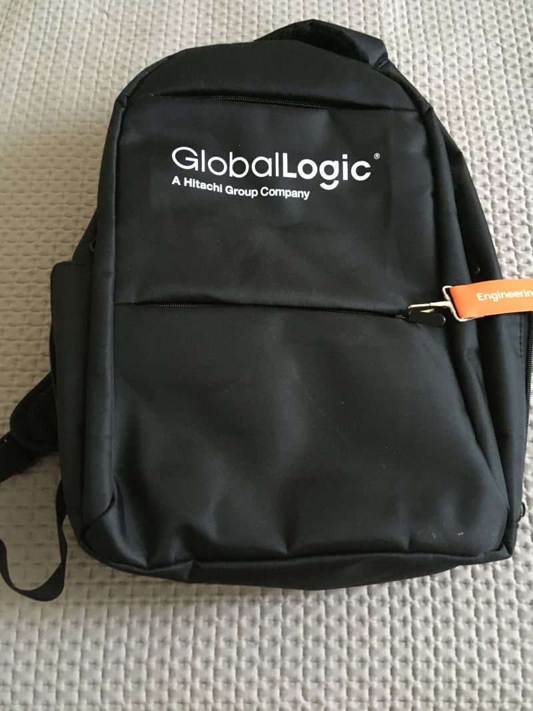
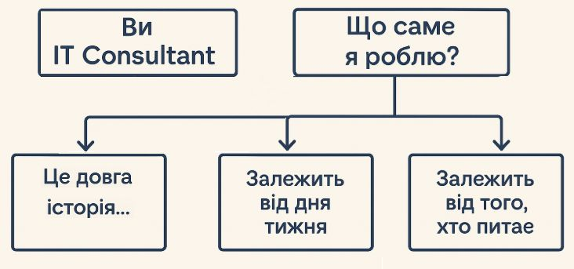

| # | Topic | Post name   | Tags           | Picture     | Release date, reactions |  Post    | Links         |
| - | ------|-------------|----------------|-------------|-------------------------|----------|:-------------:|
|   | Working in GL | Presents in GlobalLogic for an employer | GlobalLogic Work, Ukraine, War |  | [01/06/2022](https://www.linkedin.com/posts/dimanikulin_ukraine-war-globallogic-activity-6942043429455458304-eXr4?utm_source=share&utm_medium=member_desktop) {NULL/127/10/1} | Each year in GlobalLogic an employer gets the present for birthday. I have got following 5: - Backpack; - Multitool knife; - Belt bag; - Power bank; - Bottle for water. This year I realized their value especially in terms of war. Thank you GlobalLogic for taking care of me in advance! P.S. Here I meant GL Ukraine. | |
|  | Working in GL | Cool people create cool music | GlobalLogic Work | | [01/06/2022](https://www.linkedin.com/posts/dimanikulin_%D1%89%D0%B5%D0%B4%D1%80%D0%B8%D0%BA-carol-of-the-bells-globallogic-edition-activity-7011336761649836032-IGHe?utm_source=share&utm_medium=member_desktop) {1521/10/0/1} | | [YouTube](https://www.youtube.com/watch?v=KFLl5cD9zp0) |
|  | Working in GL | Taras Chmut and GlobalLogic ))) | GlobalLogic Work warinukraine | | [01/10/2022](https://www.linkedin.com/posts/dimanikulin_globallogic-warinukraine-activity-6975103190170042368-br-O?utm_source=share&utm_medium=member_desktop) {NULL/223/0/3} | | |
|  | Working in GL | Top Interviewer in Kyiv in C/C++ | GlobalLogic Work | | [01/01/2022](https://www.linkedin.com/posts/dimanikulin_globallogic-activity-6894337668830822401-iBcr?utm_source=share&utm_medium=member_desktop) {NULL/211/17/0} | I won't get frozen this winter because I have got this present from GlobalLogic as a Top Interviewer in Kyiv in C/C++ | |
|  | Working in GL | 7000 people in GL Ukraine | GlobalLogic Work GlobalLogicUkraine GlobalLogicUkraine7000 | | [01/12/2021](https://www.linkedin.com/posts/dimanikulin_7000-reasons-to-care-activity-6862097076923232257-iOMQ?utm_source=share&utm_medium=member_desktop) {NULL/27/0/0} | | |
|  | Working in GL | Люксембург, Люксембург | GlobalLogic Work |  | [26/05/2023](https://www.linkedin.com/posts/dimanikulin_globallogic-activity-7067761572093247488-7J4Y?utm_source=share&utm_medium=member_desktop) {3877/11/3/0} | Вгадайте, що за фільм. Якби у вас була можливість, то що б ви запитали режисера та акторів цього фільму? П.С. У коментарях відповідь. 18 травня до GlobalLogic Ukraine в гості завітали режисер Антоніо Лукіч та учасники реп-гурту "Курган і Agregat" – брати Раміл та Аміл Насирови. Цей творчий союз цього року подарував нам фільм "Люксембург, Люксембург" | |
|  | Working in GL | Олена Зеленська | GlobalLogic Work |  | [07/08/2023](https://www.linkedin.com/posts/dimanikulin_%D1%8F%D0%BA%D0%B1%D0%B8-%D1%83-%D0%B2%D0%B0%D1%81-%D0%B1%D1%83%D0%BB%D0%B0-%D1%82%D0%B0%D0%BA%D0%B0-%D0%BC%D0%BE%D0%B6%D0%BB%D0%B8%D0%B2%D1%96%D1%81%D1%82%D1%8C-%D1%82%D0%BE-%D1%89%D0%BE-%D0%B1-activity-7094210810255675392-Cj5E?utm_source=share&utm_medium=member_desktop) {2805/1/13/0} | Якби у вас була така можливість, то що б ви запитали у Олени Зеленської? | |
|  | Working in GL | A white paper on GlobalLogic Insights | GlobalLogic Work whitepaper softwarearchitecture softwaredesign | | [09/06/2023](https://www.linkedin.com/posts/dimanikulin_detecting-architectural-gaps-with-automation-activity-7073919594154868738-CpcR?utm_source=share&utm_medium=member_desktop) {2536/10/2/0} | I have just published a white paper on [Globallogic Insights](https://www.globallogic.com/insights/white-papers/detecting-architectural-gaps-with-automation/). In this paper, I delve into various manual architecture review methods and propose automated alternatives that not only reduce the time and resources required but also yield better outcomes. You will gain insights into: - Understanding architecture drift and erosion and their impact on business. - Exploring the workings of dependency analysis, peer reviews, and other manual inspections. - Recognizing the limitations of manual reviews as they may not address issues that arise despite adhering to best practices in architecture governance. - Considering specific factors related to compliance, data security, DevOps, and more when evaluating architecture review solutions. - Examining example use case scenarios to visualize the automation of architecture checks. I would like to extend my special thanks to Orkhan Gasimov for his valuable assistance! Enjoy your reading experience! | |
|  | Working in GL | Олена Зеленська 2 | GlobalLogic Work mentalhealth mentalhealthsupport zelensky | | [28/08/2023](https://www.linkedin.com/posts/dimanikulin_%D0%BE%D0%BB%D0%B5%D0%BD%D0%B0-%D0%B7%D0%B5%D0%BB%D0%B5%D0%BD%D1%81%D1%8C%D0%BA%D0%B0-%D0%B4%D0%B1%D0%B0%D1%82%D0%B8-%D0%BF%D1%80%D0%BE-%D0%BC%D0%B5%D0%BD%D1%82%D0%B0%D0%BB%D1%8C%D0%BD%D0%B5-%D0%B7%D0%B4%D0%BE%D1%80%D0%BE%D0%B2-activity-7101818614164389889-NNuc?utm_source=share&utm_medium=member_desktop)  {4619/15/4/0} | Нещодавно співробітники GlobalLogic Ukraine мали нагоду поспілкуватися з Першою Леді, Оленою Зеленською, Оксаною Збітнєвою та Олегом Романчуком, експертами Програми “Ти як?” Могли заздалегідь поставити запитання щодо програми “Ти як?”. Мені особисто спілкування сподобалося корисністю та форматом. | [FB](https://www.facebook.com/olenazelenska.official/posts/pfbid025TUqBC1FcR1CnMt3eGDS8JHx9eXwJAnQDDRbrm9KomuZ3D62DLgdDbSHQMWh6ev4l) |
|  | Working in GL | Presents in GlobalLogic for an employer 2 | GlobalLogic Work ukraine, war |  | [04/09/2023](https://www.linkedin.com/posts/dimanikulin_ukraine-war-globallogic-activity-7104355502528077825-Afg6?utm_source=share&utm_medium=member_desktop) {12702/128/11/0} | Each year in GlobalLogic an employer gets the present for birthday. I have got following 6: - Backpack; - Multitool knife; - Belt bag; - Power bank;- Bottle for water; - Blanket. I value it especially in terms of war, and thank GlobalLogic for taking care of me.P.S. Here I meant GL Ukraine. | |
|  | Working in GL | Дмитро Антонов | GlobalLogic Work |  | [24/10/2023](https://www.linkedin.com/posts/dimanikulin_%D1%8F%D0%BA%D0%B1%D0%B8-%D1%83-%D0%B2%D0%B0%D1%81-%D0%B1%D1%83%D0%BB%D0%B0-%D1%82%D0%B0%D0%BA%D0%B0-%D0%BC%D0%BE%D0%B6%D0%BB%D0%B8%D0%B2%D1%96%D1%81%D1%82%D1%8C-%D1%82%D0%BE-%D1%89%D0%BE-%D0%B1-activity-7122467952146153472-vlmd?utm_source=share&utm_medium=member_desktop) {2297/3/2/0} | Якби у вас була така можливість, то що б ви запитали у Дмитра Антонова, пілота Авіаційно-наукового Технічного Комплексу АНТОНОВ? | |
|  | Working in GL | Сергій Жадан | GlobalLogic Work |  | [06/12/2023](https://www.linkedin.com/posts/dimanikulin_warinukraine-activity-7138062207447138304-r2jI?utm_source=share&utm_medium=member_desktop) {2497/3/4/0} | Якби у вас була така можливість, то що б ви запитали у Сергія Жадана: письменника, волонтера, музиканта, засновника благодійного фонду, популяризатора міста-сонця Харкова в цілому та району ХТЗ зокрема? | |
|  | Working in GL | Interview number or **Top Interviewer in Kyiv in C/C++, 2022** | GlobalLogic Work |  | [01/03/2023](https://www.linkedin.com/posts/dimanikulin_globallogic-interviewer-cplusplus-activity-7038422433585860608-Tr0W?utm_source=share&utm_medium=member_desktop) {23805/148/10/1} | Do you think 81 interviews per year is a lot? I feel like no, it is about 1.5 interviews in a week only. And this year (the same as previous one) I was nominated as a Top Interviewer in Kyiv in C/C++ with 81 interviews. In 2022 it was quite the same | |
|  | Working in GL | # Top Interviewer in Kyiv in C/C++, 2023 | GlobalLogic Work interview award |  | [01/01/2024](https://www.linkedin.com/posts/dimanikulin_globallogic-interview-award-activity-7150529520310087681-ya3A?utm_source=share&utm_medium=member_desktop) {11092/89/24/1} | Third time in a row, I have been nominated as a Top Interviewer in Kyiv for C/C++. This year, I conducted 56 interviews in 2023, averaging one interview per week. | |
|  | Working in GL | # Top Interviewer in Kyiv in C/C++, 2024 | GlobalLogic Work interview award |  | [07/01/2024](https://www.linkedin.com/posts/dimanikulin_globallogic-work-interview-activity-7282302113999654915-aq-G?utm_source=share&utm_medium=member_desktop) {TBD/TBD/TBD/TBD} | This year again, I have been nominated as a Top Interviewer in Kyiv for C/C++. | |
|  | Working in GL | Presents in GlobalLogic for an employer | GlobalLogic Work, Ukraine, War |  | [20/03/2052](https://www.linkedin.com/posts/dimanikulin_as-you-might-know-each-year-globallogic-ukrainian-activity-7308804342227132417-SzEA?utm_source=share&utm_medium=member_desktop&rcm=ACoAAAlsWb8BPAbKMyDiy56H2KfpjQJ1GthAUxM) {TBD/TBD/TBD/TBD} | As you might know each year GlobalLogic Ukrainian employer gets the present for birthday or for New Year. I have got following 7 now: - 2 Backpack; - Multitool knife; - Belt bag; - Power bank; - Bottle for water; - Blanket. As for me it values a lot especially in terms of war. P.S. New back pack on a photo. | |
|  | Working in GL | New position  | Role       |  | [12/08/2025](https://www.linkedin.com/posts/dimanikulin_%D0%B7%D0%B4%D0%B0%D1%94%D1%82%D1%8C%D1%81%D1%8F-%D0%BC%D0%B0%D1%8E-%D1%85%D0%BE%D1%80%D0%BE%D1%88%D1%96-%D0%BD%D0%BE%D0%B2%D0%B8%D0%BD%D0%B8-%D0%BC%D0%B5%D0%BD%D0%B5-%D0%BF%D1%96%D0%B4%D0%B2%D0%B8%D1%89%D0%B8%D0%BB%D0%B8-activity-7359141809224069120-cBTN?utm_source=share&utm_medium=member_desktop&rcm=ACoAAAlsWb8BPAbKMyDiy56H2KfpjQJ1GthAUxM) |  🚀 Здається, маю хороші новини - мене підвищили! Здається... Віднедавна моя нова роль звучить як IT Consultant. Я щиро радий і вдячний за довіру, але маю зізнатися - коли розповідаю друзям і знайомим, часто чую у відповідь таке запитання: “А що ти тепер конкретно робиш?”😅 Назва може означати як консультування з приводу того, як правильно розставляти коробки з принтерами, так і рекомендації яке хмарне рішення підійде для enterprise-архітектури😅 Якщо що - повага до обох варіантів😉 Думаю, я не єдиний, хто зтикався з тим, що посада звучить "солідно", але мало що говорить про щоденну роботу.... 📌А як у вас? Назва вашої ролі відповідає тому, чим ви реально займаєтесь? Напишіть будь ласка у коментарях - цікаво зібрати топ найзагадковіших назв посад і дізнатись так як ви пояснюєте свою роботу іншим! #GlobalLogicUkraine @GlobalLogicUkraine.  |   |

Format is *{Reviews/Likes/Comments/Reposts}*
