# LinkedIn posts

TODO Table of contents

- [Interesting facts](./MyLinkedPosts_InterestingFacts.md) TODO to convert to table
- [Software Development](./SoftwareDevelopment.md) TODO to convert to table
- [War in Ukraine](./WarInUkraine.md) TODO to convert to table
- [Work in GlobalLogic](./WorkInGL.md) TODO to convert to table
- [Work Life Balance](WorkLifeBalance.md)

# Entertainment

| # | Topic | Post name   | Tags           | Picture     | Release date, reactions |  Post    | Links         |
| - | ------|-------------|----------------|-------------|-------------------------|----------|:-------------:|
| | Holidays | What is the best gift for Ukrainian people for Christmas and New Year? | holidays | | [01/12/2022](https://www.linkedin.com/posts/dimanikulin_armukrainenow-warinukraine-activity-7012374950275637249-Wpcn?utm_source=share&utm_medium=member_desktop) {TBD/TBD/TBD/TBD} | - Patriot defense system **8%**, - Atacms **16%**, - pUTINs visit of Kobzon concert **76%**. Any other options I forgot to mention?| |
|  | Holidays | З Днем Вишиванки! | holidays | 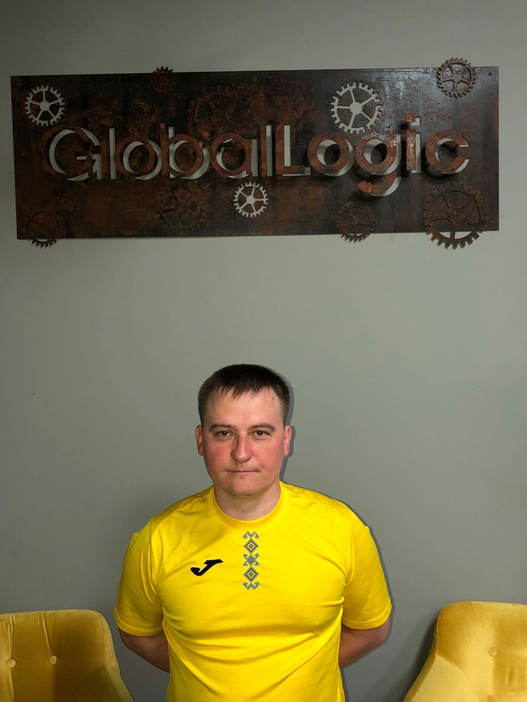 | [18/05/2023](https://www.linkedin.com/posts/dimanikulin_globallogic-ukraine-nationalholiday-activity-7064859572955398144-xxKg?utm_source=share&utm_medium=member_desktop) {TBD/TBD/TBD/TBD} | Цю футболку-вишиванку я отримав завдяки GlobalLogic та Дню Незалежності України. У 2018 році мені надійшов лист від GlobalLogic з пропозицією обрати спортивний захід з переліку марафонів. Я обрав забіг у Пирогово, який відбувся 24 серпня 2018 року. Там я та ця яскрава футболка-вишиванка поєдналися. Фото було зроблено у офісі. До речі, шорти були блакитні.А у вас є цікаві історії, пов'язані з вишиванками? | |
|  | Holidays | What is the best gift for Ukrainian people for Christmas and New Year 2?| globallogic ukraine national | | [26/12/2022](https://www.linkedin.com/posts/dimanikulin_activity-7145329226500521984-2up9?utm_source=share&utm_medium=member_desktop) {TBD/TBD/TBD/TBD} | - Taurus rockets **0%**; - Nuclear weapon **0%**; - pUTINs visit of Kobzon concert **0%**. Any other options I forgot to mention? | |
| | Interesting facts | Interesting facts about number "6" | interestingfacts numbers |  | [01/04/2023](https://www.linkedin.com/posts/dimanikulin_interestingfacts-numbers-globallogic-activity-7051457743555104769-pDkY?utm_source=share&utm_medium=member_desktop) {TBD/TBD/TBD/TBD} | - In many cultures, 6 is considered to be a lucky number; - Six is the smallest perfect number, which means that the sum of its factors (1, 2, and 3) equals 6.; - The average human hand has six bones in each finger, except for the thumb, which has two bones; - I have reached the 6th Anniversary in GlobalLogic recently. Are there other facts? Something else? please share in comments other facts. | |
| | Interesting facts | Interesting facts about number "11" | interestingfacts numbers |  | [01/08/2023](https://www.linkedin.com/posts/dimanikulin_interestingfacts-activity-6967512359246393344-drW-?utm_source=share&utm_medium=member_desktop) {TBD/TBD/TBD/TBD} | - 11 *11 = 121, 11* 111 = 1221, 1111 * 11 = 12221...; - Football team has 11 members; - Eleven is the name of main character in "Stranger Things" TV show; - I have reached 11 K connections now ) Are there other facts? Something else? please share in comments other facts.| |
| | Interesting facts | Interesting facts about number "12" | interestingfacts numbers |  | [01/03/2023](https://www.linkedin.com/posts/dimanikulin_interestingfacts-activity-7031329081606483968-Xg3L?utm_source=share&utm_medium=member_desktop) {TBD/TBD/TBD/TBD} | - 12 months in a year; - 12 hours visible on a clock; - 12 is a composite number, an even number, a natural number, and a whole number; - There are 12 stars on the flag of Europe. - Max 12 columns in Bootstrap row. ;) Something else? please share in comments other facts.| |
| | Interesting facts | Interesting facts about number "13" | interestingfacts numbers |  | [26/09/2023](https://www.linkedin.com/posts/dimanikulin_interestingfacts-activity-7112326331484258304-C2fS?utm_source=share&utm_medium=member_desktop) {TBD/TBD/TBD/TBD} | Usually, the number 13 is considered unlucky in many cultures. Here are some interesting facts about the number 13: - In some Western cultures, Friday the 13th is considered an especially unlucky day. - In some ancient cultures, this number was considered sacred and associated with the lunar and feminine cycles. It was seen as a symbol of fertility and good fortune. - In mathematics, 13 is considered a prime number, and it has some unique properties - a part of Pythagorean triples and a part of the Fibonacci sequence. - In Italian culture, this number is associated with good fortune. Are there other facts? | |
| | Interesting facts | Interesting facts about number "7" | interestingfacts numbers | 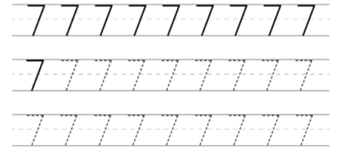 | [26/03/2024](https://www.linkedin.com/posts/dimanikulin_numbers-interestingfacts-activity-7178308521065648130-rwAl?utm_source=share&utm_medium=member_desktop) {TBD/TBD/TBD/TBD} | As you might know the number 7 has a rich history and significance across various cultures and disciplines. Here are 7 interesting facts about the number 7: - Seven is a prime number, meaning it can only be divided by 1 and itself without leaving a remainder. - The fourth prime number, the fourth Fibonacci number, and a Mersenne prime. - In Hinduism and some forms of yoga, there are believed to be seven energy centers in the body called chakras. - Traditionally, the world is divided into seven continents and seven seas. - In Christian theology, the Seven Deadly Sins are a classification of vices that were believed to be particularly detrimental to spiritual progress. - In many cultures, 7 is considered a lucky number. - The Seven Wonders of the Ancient World were a list of remarkable constructions of classical antiquity. Are there other facts? | |
| | Interesting facts | Interesting facts about me | interestingfacts numbers | | [26/03/2024](https://www.linkedin.com/posts/dimanikulin_there-are-a-lot-of-people-in-my-linkedin-activity-7194653260526333953-wBiT?utm_source=share&utm_medium=member_desktop)  {TBD/TBD/TBD/TBD} | There are a lot of people in my LinkedIn network who know me well. Let's share four random facts about me and guess which one is not true. Can you also share something interesting about yourself? Which one is not true about me? - I cannot swim well; - They called me Winnie the Pooh; - I dance folk; - I visited Egypt | |
| | Interesting facts | Interesting facts about number "14" | interestingfacts numbers | 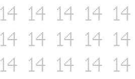 | [28/05/2024](https://www.linkedin.com/posts/dimanikulin_interestingfacts-numbers-activity-7201133644424396800-xGQA?utm_source=share&utm_medium=member_desktop)  {TBD/TBD/TBD/TBD} | Did you know the facts that highlight the number 14's significance and varied roles across different domains? Here are some interesting facts about the number 14: - The sum of the first three square numbers (1� + 2� + 3� = 1 + 4 + 9 = 14). - Silicon has an atomic number of 14. - The term "fortnight" means 14 nights (or two weeks). - In traditional Judaism, a boy reaches the age of Bar Mitzvah at 13, but the celebration often occurs in the 14th year. - Valentine's Day is celebrated on February 14th. Do you know any other facts? Please share other facts in the comments. | |

# Work

| # | Topic | Post name   | Tags           | Picture     | Release date, reactions |  Post    | Links         |
| - | ------|-------------|----------------|-------------|-------------------------|----------|:-------------:|
|  | Working with GPT | Everyone must know that| DOU Humor |  | [24/04/2023](https://www.linkedin.com/posts/dimanikulin_humor-chatgpt-chatgpttutorial-activity-7056156667721191424-rcxW?utm_source=share&utm_medium=member_desktop) {TBD/TBD/TBD/TBD} | When you work with GPT and you ask it to do something, please start your request with "Can you please" or "Could you please" because machines will not forget it... | [DOU, 100+ ChatGPT Prompts for Software Developers](https://dou.ua/forums/topic/43131/?from=tg&utm_source=telegram&utm_medium=social) |
| | Working with GPT | ChatGPT in CV | cv skills | | [18/07/2023](https://www.linkedin.com/posts/dimanikulin_chatgpt-cv-skills-activity-7086958836036644864-hpB6?utm_source=share&utm_medium=member_desktop) {TBD/TBD/TBD/TBD} | Nowadays, many people include their experience with ChatGPT in their CVs as a way to showcase their skills and expertise in various domains. However, in my opinion, this practice may seem excessive. Why? Because it's akin to listing the ability to move one's body as a skill. Is it OK to mention ChatGPT in CV? - Yes **0%** - No **100%** - ChatGPT knows answer **0%**|  |
| | Working with GPT | Do you consider ChatGPT a useful tool? | | | [18/09/2023](https://www.linkedin.com/posts/dimanikulin_chatgpt-activity-7109428850933022721-HDKN?utm_source=share&utm_medium=member_desktop) {TBD/TBD/TBD/TBD} | I have been using ChatGPT for 6 months and would like to share my experience working with it. So far, it has helped me with: - Proofreading, - Creating tags, headlines, and chapter descriptions from text, - Converting my text from upper case to lower case, - Generating poems, - Finding the top 10 sites to publish IT content, - Providing interesting facts about various topics,- Suggesting suitable images for provided text. The only thing it did not help me with was finding my social s  tyle. What about you? Do you consider ChatGPT a useful tool? - Yes **80%**, - No **12%**, - Never tried it **8%** | |
| | Communication | We need more Messengers | messenger ithumor | 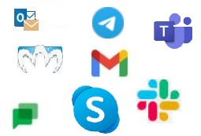 | [01/03/2023](https://www.linkedin.com/posts/dimanikulin_messenger-ithumor-activity-7040961774296154112-Tg-G?utm_source=share&utm_medium=member_desktop)  {TBD/TBD/TBD/TBD} | Guys from big IT Companies, we need "much more" messengers on our devices! Because I have "only" 6 on my laptop - Facebook messenger, Microsoft Skype and Teams, Google Chat, Twitter, Slack and Telegram. And "only" 8 on my smartphone. And there are additionally two email clients by the way. How many messengers there are on your devices? Which ones I missed? | |
| | Communication | What does it mean for me to be online? | online ithumor |  | [01/03/2023](https://www.linkedin.com/posts/dimanikulin_online-messenger-nokia-activity-7008705718677573632-aA2C?utm_source=share&utm_medium=member_desktop) {TBD/TBD/TBD/TBD}| | |
| | Communication | VPNs | | | [16/07/2024](https://www.linkedin.com/posts/dimanikulin_vpns-safework-vpnclient-activity-7218879732392554496-n-Pg?utm_source=share&utm_medium=member_desktop) {TBD/TBD/TBD/TBD} | VPNs seem to be indispensable in our private and work lives. They keep our connections safe and provide access to restricted networks. As a result, it has become normal to have more than one VPN client installed on your device. For example, I currently have three clients installed on my laptop. What is the maximum number of VPN clients you have or have had on your device? - 2; - 3; - more than 3; - What is a VPN? | |
| | This is when we say "Old, but Gold" | Windows 95 | oldschool old |  | [01/04/2023](https://www.linkedin.com/posts/dimanikulin_oldschool-old-activity-7048925594268352512-c-4G?utm_source=share&utm_medium=member_desktop) {TBD/TBD/TBD/TBD} |Can you guess what is this without googling? I used that a lot when I started programming. If you can guess, we are the same age. | |
| | This is when we say "Old, but Gold" | Miranda | oldschool old |  | [01/01/2023](https://www.linkedin.com/posts/dimanikulin_old-activity-7016323085142224896-OyzK?utm_source=share&utm_medium=member_desktop) {TBD/TBD/TBD/TBD} | Can you guess what it is? If you know what is this - we are the same age ) | [Related post](https://www.linkedin.com/feed/update/urn:li:activity:6947599537733558272/) |
| | This is when we say "Old, but Gold" | BSOD | oldschool old |  | [25/05/2023](https://www.linkedin.com/posts/dimanikulin_oldschool-oldtech-activity-7066684307964125184-hZG4?utm_source=share&utm_medium=member_desktop)  {TBD/TBD/TBD/TBD} | Can you guess what is this without googling? I have seen that a lot. | |
| | This is when we say "Old, but Gold" | First Mobile Phone | oldschool old | 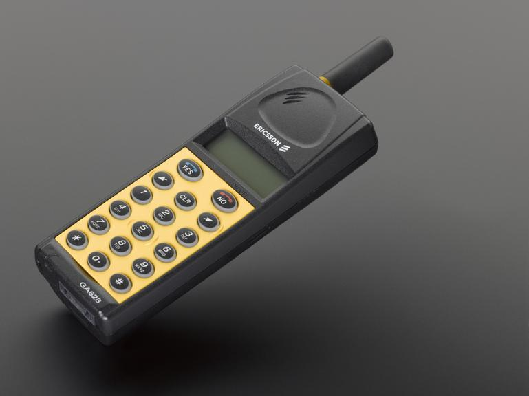 | [26/06/2023](https://www.linkedin.com/posts/dimanikulin_oldisgold-oldschool-first-activity-7078993334840569858-vZp0?utm_source=share&utm_medium=member_desktop) {TBD/TBD/TBD/TBD} | This is my first mobile phone. It had no: - color screen; - music; - internet connection; - touchable screen; - multimedia support; - camera; - extendable memory. Do you think I was not happy with it? - Nope! Please share what your first mobile phone was. Were you happy with it?| |
| | This is when we say "Old, but Gold" | Windows NT 4.0 | oldschool old | 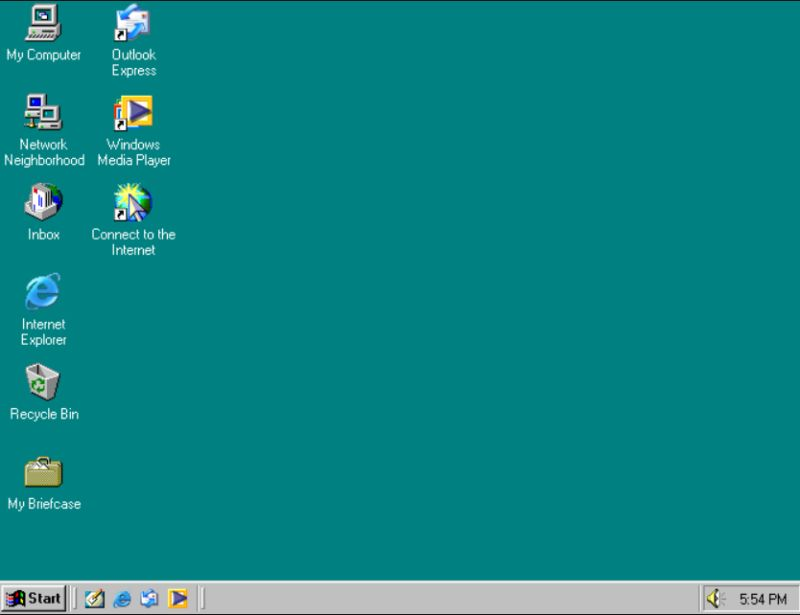 | [14/08/2023](https://www.linkedin.com/posts/dimanikulin_oldschool-old-activity-7096741686382407680-mJQ2?utm_source=share&utm_medium=member_desktop) {TBD/TBD/TBD/TBD} | Can you guess what is this without googling? I used that a lot when I started programming. If you can guess, we are the same age. | |
| | Soft skiils | Active Listening | softskills communication activelistening |  | [01/10/2023](https://www.linkedin.com/posts/dimanikulin_communication-softskills-activelistening-activity-6972809312763043840-Dv6D?utm_source=share&utm_medium=member_desktop) {TBD/TBD/TBD/TBD} |Is "talking a lot" a soft skill? Nope. I have seen a lot of people who think "talking a lot" is a soft skill. Literally, an ability to communicate is soft skill and communication consists of 2 points: how you give information and how you receive information. When you speak a lot you do not listen and so you don't receive information.| |
| | Soft skiils | Who are toxic people | softskills toxicpeople | | [01/02/2023](https://www.linkedin.com/posts/dimanikulin_toxicpeople-activity-7026092332055707648-oYuV?utm_source=share&utm_medium=member_desktop) {TBD/TBD/TBD/TBD} | Who are **toxic** people? People who..  - criticize a lot **11%**; - can not listen to other people **19%** ; - say rude words **5%**; - are rusnia **66%**; | |
| | Soft skiils | English level | softskills | 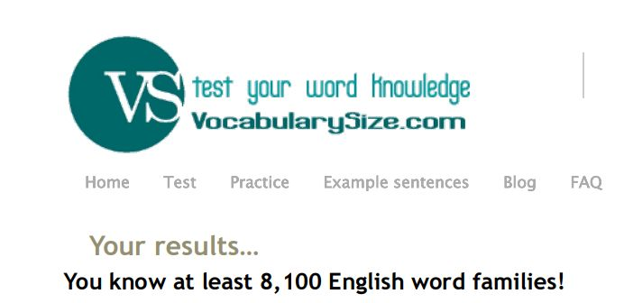 | [16/04/2024](https://www.linkedin.com/posts/dimanikulin_regularly-i-make-it-a-habit-to-assess-and-activity-7185896908903604224-80tI?utm_source=share&utm_medium=member_desktop) {TBD/TBD/TBD/TBD} | Regularly, I make it a habit to assess and enhance both my soft skills and hard skills.This includes refining my understanding of metaprograms, social styles, English proficiency, and technical knowledge. For instance, I use resources like <https://lnkd.in/gdBYFkuf> to gauge my English vocabulary. During my last assessment, I achieved a milestone, learning over 8,100 English word families! Do you also prioritize regular skill and knowledge assessments? What specific areas do you focus on refining and improving? | |
| | Soft skiils | Reminder about what to do | softskills | | [25/06/2024](https://www.linkedin.com/posts/dimanikulin_in-real-life-it-is-really-easy-to-get-lost-activity-7211339797997469697-RfOZ?utm_source=share&utm_medium=member_desktop)  {TBD/TBD/TBD/TBD} |In real life, it is really easy to get lost in things and forget what to do, so we use different reminders to help us. What reminder about what to do works best for you? - Flagged emails - **0%**; - Calendar reminders - **67%**; - Unread messages in messengers - **33%**; - Your option in comments - **0%**;  | |

# Other

| # | Topic | Post name   | Tags           | Picture     | Release date, reactions |  Post    | Links         |
| - | ------|-------------|----------------|-------------|-------------------------|----------|:-------------:|
| | Fishing | Attempt 0 | fishing staysafe emailsecurity internetsecurity | 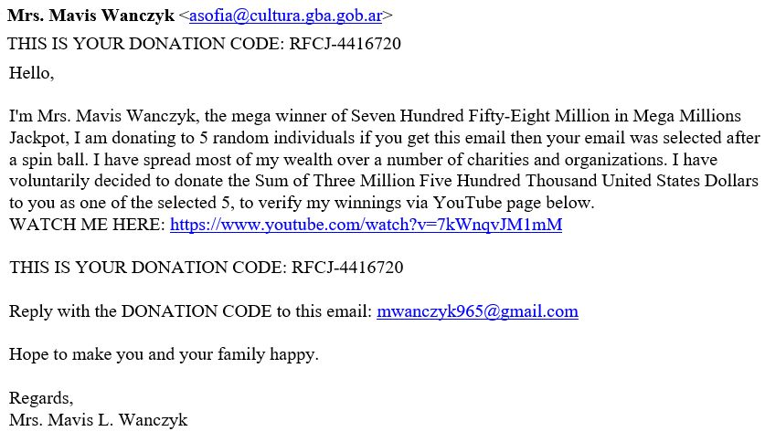 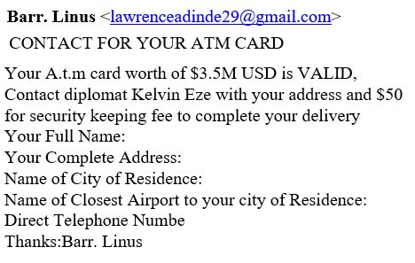 | [01/12/2022](https://www.linkedin.com/posts/dimanikulin_fishing-activity-6993092454992211969-Ucgz?utm_source=share&utm_medium=member_desktop) {TBD/TBD/TBD/TBD} | Dear fishers, thank you! But I will reject your gift ($3.5M) again. And will do it again and again.  | |
| | Fishing | Attempt 1 | fishing staysafe emailsecurity internetsecurity |  | [01/06/2022](https://www.linkedin.com/posts/dimanikulin_fishing-activity-6939455519191404544-mWpp?utm_source=share&utm_medium=member_desktop) {TBD/TBD/TBD/TBD} | This time they did not propose to send a big amount of money to me just for sharing my account info. This time they did not propose a big prize for me just for providing my credit card information. Instead, they used actor name (Peter Pine) to contact them � for me it�s the best fishing attack for now. | |
| | Fishing | Attempt 2 | fishing staysafe emailsecurity internetsecurity | 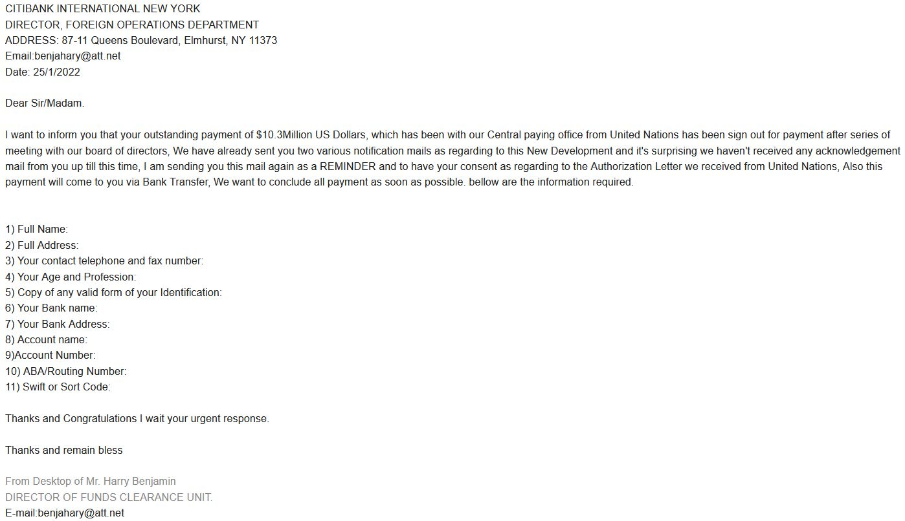 | [01/05/2022](https://www.linkedin.com/posts/dimanikulin_it-is-so-easy-to-get-really-big-money-now-activity-6935298599983443968-1GRA?utm_source=share&utm_medium=member_desktop) {TBD/TBD/TBD/TBD} | It is so easy to get really big money now. I can receive a payment with amount 10 Million US Dollars. What I need is just to send my address, bank name and address, account name and number, Swift Code etc. However, I need to reject this nice offer because I do not know what to do with such big money. )))  | |
| | Fishing | Attempt 3 | fishing staysafe emailsecurity internetsecurity | 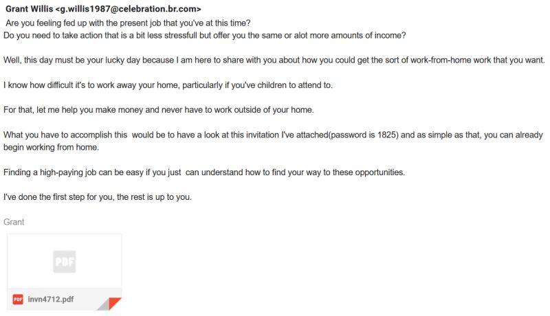 | [01/01/2022](https://www.linkedin.com/posts/dimanikulin_that-is-probably-first-time-when-i-reject-activity-6885883352952438784-CEq-?utm_source=share&utm_medium=member_desktop) {TBD/TBD/TBD/TBD} | That is probably first time when I reject the high-paying job and WFH mode. They sent me an email with a job description. Also they even provided me a password and nice attachment to open so I could start working immediately. Not this time, sorry guys ;-) | |
| | Fishing | Attempt 4 | fishing staysafe emailsecurity internetsecurity | 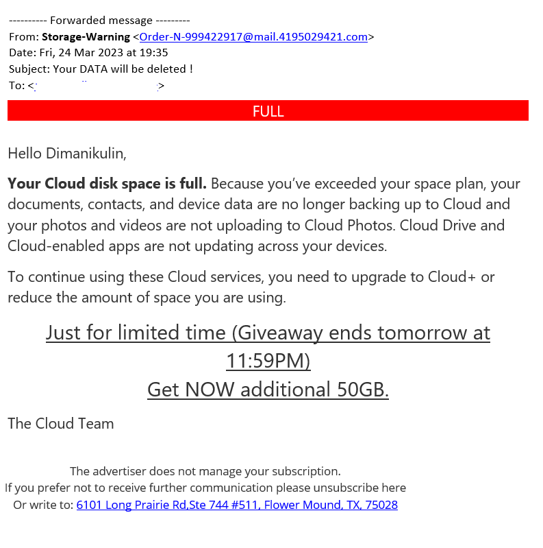 | [24/04/2023](https://www.linkedin.com/posts/dimanikulin_fishing-activity-7054716495364300801-_-1z?utm_source=share&utm_medium=member_desktop) {TBD/TBD/TBD/TBD} | The most boring proposal so far. This time they did not propose big money neither high-paying job with WFH. They just wanted to warn me about disk space. | |
| | Fishing | Sensitive or confidential language | fishing staysafe emailsecurity internetsecurity |  | [06/06/2023](https://www.linkedin.com/posts/dimanikulin_staysafe-fishing-activity-7071738520201027584-TmuQ?utm_source=share&utm_medium=member_desktop) {TBD/TBD/TBD/TBD} | It is unfortunately true that some people may use sensitive or confidential language (Confidential! Sensitive Information!) in their messages as a tactic to deceive or manipulate others, and they may not be concerned about the consequences of doing so. If you receive a message that you suspect may be fraudulent or deceptive, it is important to exercise caution and to verify the authenticity of the message before taking any action. This may involve double-checking the source of the message, looking for signs of phishing or other scams, or seeking guidance from a trusted authority or expert. By taking these precautions, you can help protect yourself from potential harm and avoid falling victim to scams or other types of fraud. Stay safe! | |
| | LinkedIn content | Just Joined LinkedIn | LinkedIn Content | 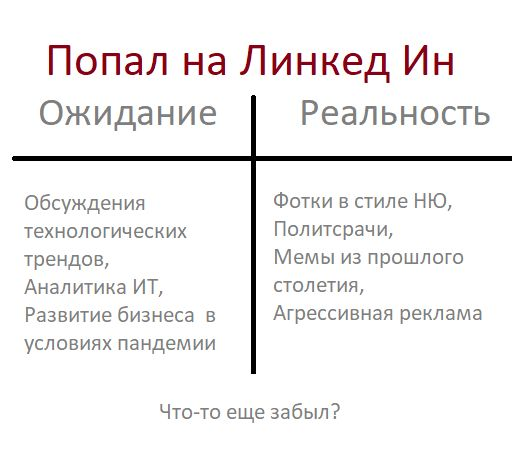 | [16/02/2022](https://www.linkedin.com/posts/dimanikulin_%D0%BD%D0%B0%D0%B1%D0%BE%D0%BB%D0%B5%D0%BB%D0%BE-activity-6896460037422686208-xicr?utm_source=share&utm_medium=member_desktop) {TBD/TBD/TBD/TBD} | Наболело... | |
| | LinkedIn content | What do you think about content posted in LinkedIn? | LinkedIn Content | | [08/05/2023](https://www.linkedin.com/posts/dimanikulin_linkedin-content-activity-7061244365477752832-VDm0?utm_source=share&utm_medium=member_desktop) {TBD/TBD/TBD/TBD} | About a year ago, I posted a picture about LI content and received a lot of responses. So.. What do you think about content posted in LinkedIn? Please share your opinion in the comments. - Dating  **31%**; - Asking for agreement or disagreement **19%**; - Memes from the 20th century **44%**; - Pet photos **6%**; 16 Votes | |

| | | | | | | | |
