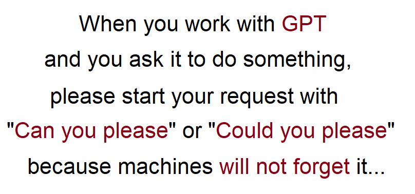

# LinkedIn posts

- [ChatGPT](./ChatGPT.md)
- [Communication](./Communication.md)
- [Fishing](./Fishing.md)
- [Holidays](/Holidays.md)
- [Interesting facts](./InterestingFacts.md)
- [Interviews](./Interviews.md)
- [LinkedIn Content](./LinkedInContent.md)
- [This is when we say "Old, but Gold](./OldButGold.md)
- [Soft Skills](./SoftSkills.md)
- [Software Development](./SoftwareDevelopment.md)
- [War in Ukraine](./WarInUkraine.md)
- [Work in GlobalLogic](./WorkInGL.md)
- [Work Life Balance](WorkLifeBalance.md)

| # | Topic | Post name   | Tags           | Picture     | Release date, reactions |  Post    | Links         |
| - | ------|-------------|----------------|-------------|-------------------------|----------|:-------------:|
| 1 | Working with GPT | Everyone must know that| DOU Humor |  | [24/04/2023](https://www.linkedin.com/posts/dimanikulin_humor-chatgpt-chatgpttutorial-activity-7056156667721191424-rcxW?utm_source=share&utm_medium=member_desktop) {TBD/TBD/TBD/TBD} | When you work with GPT and you ask it to do something, please start your request with "Can you please" or "Could you please" because machines will not forget it... | [DOU, 100+ ChatGPT Prompts for Software Developers](https://dou.ua/forums/topic/43131/?from=tg&utm_source=telegram&utm_medium=social) |
| | Working with GPT | ChatGPT in CV | cv skills | | [18/07/2023](https://www.linkedin.com/posts/dimanikulin_chatgpt-cv-skills-activity-7086958836036644864-hpB6?utm_source=share&utm_medium=member_desktop) {TBD/TBD/TBD/TBD} | Nowadays, many people include their experience with ChatGPT in their CVs as a way to showcase their skills and expertise in various domains. However, in my opinion, this practice may seem excessive. Why? Because it's akin to listing the ability to move one's body as a skill. Is it OK to mention ChatGPT in CV? - Yes **0%** - No **100%** - ChatGPT knows answer **0%**|  |
| | Working with GPT | Do you consider ChatGPT a useful tool? | | | [18/09/2023](https://www.linkedin.com/posts/dimanikulin_chatgpt-activity-7109428850933022721-HDKN?utm_source=share&utm_medium=member_desktop) {TBD/TBD/TBD/TBD} | I have been using ChatGPT for 6 months and would like to share my experience working with it. So far, it has helped me with: - Proofreading, - Creating tags, headlines, and chapter descriptions from text, - Converting my text from upper case to lower case, - Generating poems, - Finding the top 10 sites to publish IT content, - Providing interesting facts about various topics,- Suggesting suitable images for provided text. The only thing it did not help me with was finding my social style. What about you? Do you consider ChatGPT a useful tool? - Yes **80%**, - No **12%**, - Never tried it **8%** | |

| | ||||| | |
| | ||||| | |
| | ||||| | |
