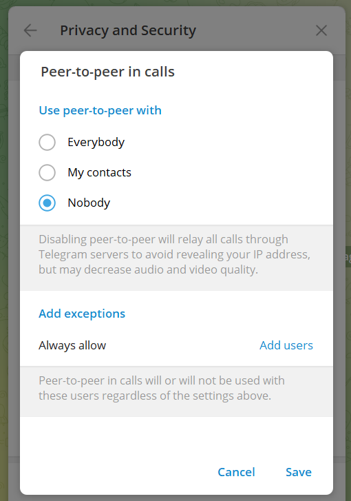

# Headline

Загальна безпека та правила роботи в Internet

# Table of contents

- [Tags](./MyRulesWorkingWithInternet_uk.md#tags)
- [References](./MyRulesWorkingWithInternet_uk.md#references)
- [Introduction](./MyRulesWorkingWithInternet_uk.md#introduction)
- [Загальна безпека](./MyRulesWorkingWithInternet_uk_uk.md#%D0%B7%D0%B0%D0%B3%D0%B0%D0%BB%D1%8C%D0%BD%D0%B0-%D0%B1%D0%B5%D0%B7%D0%BF%D0%B5%D0%BA%D0%B0)
- [Фішинг](./MyRulesWorkingWithTg_uk.md#%D1%84%D1%96%D1%88%D0%B8%D0%BD%D0%B3)
- [VPN](./MyRulesWorkingWithTg_uk.md#vpn)
- [Комп’ютерні віруси](./MyRulesWorkingWithTg_uk.md#%D0%BA%D0%BE%D0%BC%D0%BF%D1%8E%D1%82%D0%B5%D1%80%D0%BD%D1%96-%D0%B2%D1%96%D1%80%D1%83%D1%81%D0%B8)
- [Фактчекінг](./MyRulesWorkingWithTg_uk.md#%D1%84%D0%B0%D0%BA%D1%82%D1%87%D0%B5%D0%BA%D1%96%D0%BD%D0%B3)
- [Діпфейки](./MyRulesWorkingWithInternet_uk.md#%D0%B4%D1%96%D0%BF%D1%84%D0%B5%D0%B9%D0%BA%D0%B8)
- [Приховування IP-адреси під час дзвінків](./MyRulesWorkingWithInternet_uk.md#%D0%BF%D1%80%D0%B8%D1%85%D0%BE%D0%B2%D1%83%D0%B2%D0%B0%D0%BD%D0%BD%D1%8F-ip-%D0%B0%D0%B4%D1%80%D0%B5%D1%81%D0%B8-%D0%BF%D1%96%D0%B4-%D1%87%D0%B0%D1%81-%D0%B4%D0%B7%D0%B2%D1%96%D0%BD%D0%BA%D1%96%D0%B2)
- [Особиста інформація](./MyRulesWorkingWithTg_uk.md#%D0%BE%D1%81%D0%BE%D0%B1%D0%B8%D1%81%D1%82%D0%B0-%D1%96%D0%BD%D1%84%D0%BE%D1%80%D0%BC%D0%B0%D1%86%D1%96%D1%8F)
- [Контроль додатків](./MyRulesWorkingWithInternet_uk.md#%D0%BA%D0%BE%D0%BD%D1%82%D1%80%D0%BE%D0%BB%D1%8C-%D0%B4%D0%BE%D0%B4%D0%B0%D1%82%D0%BA%D1%96%D0%B2)
- TODO anonim windos

# Tags

General Security, Telegram, Two-Factor Authentication, Phishing, Blocking, Spam, Online Safety, Scams, Fraud

# Introduction

У сучасному цифрово взаємопов’язаному світі захист особистої та цифрової безпеки є першорядною проблемою.
Враховуючи розвиток технологічного середовища та нові загрози, вживання профілактичних заходів для захисту є обов’язковим.
У цьому тексті розглядаються різні стратегії та запобіжні заходи, спрямовані на посилення індивідуальної безпеки та запобігання потенційним ризикам.

# Загальна безпека

Насамперед раджу подбати про **власну безпеку**.
Я створив додатковий обліковий запис, за допомогою якого і веду цю війну.
Основний обліковий запис не використовую, оскільки його можуть заблокувати або обмежити.

Також рекомендую:

- почистити пов'язані з вашими особистими обліковими записами соціальні мережі, вилучивши персональну інформацію;
- поставити двофакторну авторизацію, в телеграмі, вайбері і тд;
- не відкривати підозрілих посилань, навіть якщо їх надіслано зі знайомого контакту (контакт можуть підмінити);
- не натискати на посилання та не відкривати вкладення в підозрілих електронних листах;
- не ставити собі неперевірене ПЗ (з незрозумілих джерел);
- при установці програм (на телефон або ПК) давати їм якнайменше прав;
- використовувати 64-бітні версії Chrome чи Firefox;
- використовувати останні версії будь якого програмного забезпечання (безпека браузера як і будь-якої іншої комп’ютерної програми критично залежить від його своєчасного оновлення);
- забороніти автоматичне скачування файлів;
- не надсилати фінансову та іншу конфіденційну інформацію електронною поштою;
- використовувати антивірусний захист, сучасне антивірусне програмне забезпечення на комп’ютері та смартфоні.

# Фішинг

Фішингові електронні листи можуть містити наступну інформацію або вкладення:

- повідомлення, що у вас проблеми з вашим рахунком;
- інформацію про підозрілі дії;
- повідомлення про спробу входу в систему;
- вкладений фальшивий рахунок-фактуру.

# VPN

VPN (Virtual Private Network) – це віртуальна приватна мережа, яка забезпечує шифрування трафіку між клієнтом та VPN-сервером і зміну IP-адреси.

Коли варто використовувати VPN:

- Під час користування незахищеними загальнодоступними мережами Wi-Fi, щоб захистити свої дані.
- Коли необхідний захищений доступ до інтернет-мережі та систем під час організації віддаленої роботи.
- Щоб захистити себе від вебсайтів, програм і сервісів, які хочуть відстежувати ваші дії.
- Щоб оператор або провайдер не міг відслідковувати ваших дій в інтернеті.
- Щоб отримати доступ до заблокованих окупантом інформаційних ресурсів.

При виборі VPN:

- Перевірте репутацію сервісу у пошуковику – чи не було фактів витоку або продажу даних користувача.
- Не використовуйте російських VPN(вони, ймовірно, можуть надсилати дані російським спецслужбам).

# Комп’ютерні віруси

Комп’ютерні віруси проникають у ґаджети та можуть завдати шкоди файлам і операційній системі.
Вони створюються для викрадення чи знищення даних, отримання контролю над чужими пристроями, шпигунства, встановлення, видалення чи модифікації програм для досягнення визначеної зловмисниками мети.

Захист від комп'ютерних вірусів:

- Регулярне оновлення та використання антивірусів є обов'язковим для ефективного захисту.
- Переконайтеся, що всі програми та операційні системи оновлені до останніх версій.
- Утримуйтеся від завантаження файлів з ненадійних джерел та уникайте переходу за підозрілими посиланнями.
- Регулярне створення резервних копій важливих файлів може врятувати вас від втрати даних.

# Фактчекінг

Фактчекінг – це процес перевірки достовірності фактів, інформації та тверджень, які поширюються в ЗМІ, соцмережах тощо.

Як використовувати фактчекінг:

- Користуйтеся першоджерелами під час перевірки інформації, звіряйтеся з офіційними [ресурсами](https://cyberpolice.gov.ua/article/kiberpolicziya-nagaduye-otrymujte-informacziyu-z-oficzijnyx-dzherel-4110/).
- Перевіряйте фото та відео на автентичність. Для цього, зокрема, можна скористатись сервісом пошуку зображень [Google](https://images.google.com/).
- З’ясуйте, чи не внесено певний ресурс Центром протидії дезінформації чи СБУ до списку [інструментів](https://cpd.gov.ua/reports/spysok-instrumentiv-poshyrennya-vorozhoyi-dezinformacziyi/https://cpd.gov.ua/reports/spysok-instrumentiv-poshyrennya-vorozhoyi-dezinformacziyi/) поширення ворожої дезінформації.
- Використовуйте ресурс [Кібер Брама](https://stopfraud.com.ua/). Платформа містить практичні рекомендації та інструменти для захисту від кіберзагроз, фейків, дезінформації.

# Діпфейки

Діпфейк фішинг – це різновид шахрайства з використанням спеціального програмного забезпечення для створення підробних відео/аудіо.
Ці фейкові матеріали виглядають та звучать майже як справжні і використовуються для того, щоб переконати жертв розкрити особисті дані, здійснити фінансові транзакції або надати доступ до корпоративних ресурсів.

Щоб захиститися від діпфейк фішингу, дотримуйтеся наступних порад:

- Зателефонуйте другу, який надіслав запит, щоб підтвердити його наміри, за відомим вам номером.
- Запитайте друга про те, що можете знати тільки ви - таке питання відразу викриє шахрая.
- Напишіть спільним друзям у соцмережах і запитайте, чи не отримували вони подібних повідомлень.
- Використовуйте сучасні антивірусні програми та системи захисту від фішингових атак.

# Особиста інформація

Що таке персональні дані:

- Дата народження / смерті
- Кримінальна історія, скарги
- Сімейні дані (наприклад, батьки, брати і сестри/чоловік/дружина)
- Стаж роботи, професійна кваліфікація, освіта
- Медичні дані
- Релігійні переконання / обмеження
- Політичні погляди
- Культурні уподобання
- Деталі геолокації
- Облікові дані для входу/дані автентифікації

# Приховування IP-адреси під час дзвінків

Більшість месенджерів використовують пряме з’єднання для дзвінків між користувачами.
Однак, це може бути небезпечно, якщо зловмисник перехопить трафік, так він зможе дізнатися вашу IP-адресу або людини, з якою ви спілкуєтесь.
Також ваша IP-адреса може бути доступна абоненту, якому ви телефонуєте.

Тому, якщо вам важливо захистити свою IP-адресу, потрібно вимкнути peer-to-peer.

## WhatsApp

Налаштування → Конфіденційність → (гортаємо до самого низу) → Додаткові → Захистити IP-адресу під час дзвінка.

## Signal

Налаштування → Конфіденційність → (гортаємо до самого низу) → Додаткові функції → Завжди ретранслювати дзвінки.

## Viber

Додатково → Параметри → Конфіденційність  → (гортаємо нижче) →  Одноранговий звʼязок.

## Telegram

Налаштування → Приватність і безпека → Виклики → Peer-to-peer → Ніколи.

# Контроль додатків

Додатки – сервіси та програми, які мають певний доступ до вашого облікового запису.
Небезпечність у тому, що користувач може надати доступ шахрайському додатку, який зможе читати вашу пошту або вміст Google-диску.

Як перевірити додатки?
Зайдіть у налаштування вашого облікового запису. *Керувати обліковим записом Google*->*Безпека*->*Зв’язки зі сторонніми додатками та сервісами*->*Переглянути всі зв’язки*

- Далі ви побачите всі додатки, що мають доступ до вашого облікового запису: *Вхід через Google* та *Доступ до сервісу*.
- Зверніть увагу на розділ *Доступ до сервісу*, бо саме ці додатки можуть мати повний або частковий доступ до Google-диску.
- У пункті *Доступ до сервісу – Усі сервіси* можна перевірити, який саме і до чого наданий доступ.
- Щоб повністю видалити всі зв’язки з цим сервісом, не тільки доступи, оберіть *Видалити всі зв’язки з сервісом*.

# Анонімне вікно браузера?

Більшість популярних браузерів мають серед своїх функцій режим інкогніто.
Проте він не забезпечує анонімність у мережі, адже не приховує вашу IP-адресу та місцезнаходження.

Приватний режим дійсно має свої переваги, бо не зберігає вашу історію переглядів, файли cookie та дані заповнених форм.
Щойно ви закриєте анонімне вікно браузера, ці дані будуть видалені.
Це зручно, коли треба увійти у свої акаунти на чужому пристрої або пошукати щось без впливу рекламних алгоритмів.

Але, інформація про ваші дії в анонімному вікні все одно буде доступна вашому інтернет-провайдеру, вебсайтам, які ви відвідували, та іншим третім сторонам.

Щоб зберігати анонімність онлайн, варто використовувати VPN-сервіси.
Вони зможуть приховати вашу справжню IP-адресу та забезпечити шифрування даних.

#

🚨НЕ публікуйте це для вашої ж безпеки в соцмережах та за їх межами

☝️Неакуратне поводження з особистими даними в соцмережах може стати причиною шахрайства, тож, яка активність може призвести до небезпек в соцмережах?

📍Поширення особистих та фінансових даних (шахраї можуть скористатися для отримання коштів/відкриття онлайн-рахунків на ім’я жертви, або для зламу паролів/викрадення облікового запису соцмережі)
📍Планування подорожей та поширення локації в соцмережах
📍Дописи про дорогоцінні покупки
📍Поширення фотографій дітей
📍Підступні розіграші призів у соціальних мережах
📍Приватні повідомлення (не варто обмінюватися конфіденційними даними, тим паче робочими)

Поради для безпеки в соцмережах

☑️Періодично переглядайте список друзів, видаляйте невідомих підписників.
☑️Обмежте список підписників тими, кому довіряєте перегляд ваших публікацій.
☑️Обмежте доступ до фотографій, щоб їх бачили лише близькі.
☑️Увімкніть багатофакторну автентифікацію для кожного акаунту, створюйте надійні, унікальні паролі.

# References

| # | Name                 | Source                | Release date           |  Author                 | Description   |
| - | ---------------------|---------------------- |----------------------- | ----------------------- |:-------------:|
| 1 | Список российских телеграм каналов |[github](./MyRuTelegramChannels_ru.md) | | Dmytro Nikulin | |
| 2 | Мой телеграм канал | [github](./MyTelegramChannel_uk.md) | | Dmytro Nikulin | |
| 3 | Загальна безпека та правила роботи в телеграм | [github](./MyRulesWorkingWithTg_uk.md) | | Dmytro Nikulin | |
