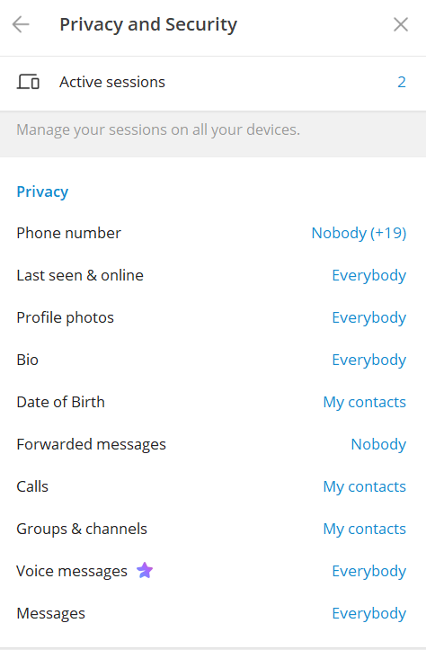
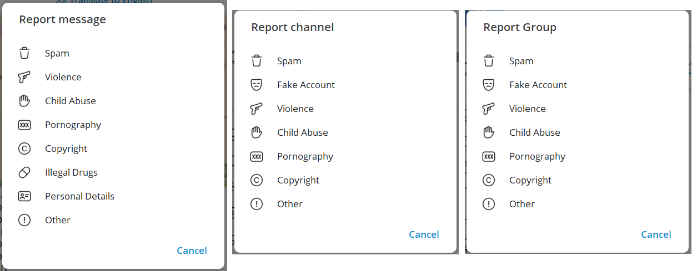

# Headline

Загальна безпека та правила роботи в телеграм

# Table of contents

- [Tags](./MyRulesWorkingWithTg_uk.md#tags)
- [Overview](./MyRulesWorkingWithTg_uk.md#overview)
- [Як замінюють контакт](./MyRulesWorkingWithTg_uk.md#%D1%8F%D0%BA-%D0%B7%D0%B0%D0%BC%D1%96%D0%BD%D1%8E%D1%8E%D1%82%D1%8C-%D0%BA%D0%BE%D0%BD%D1%82%D0%B0%D0%BA%D1%82)
- [Як безпечно використовувати Telegram та захистити свої дані](./MyRulesWorkingWithTg_uk.md#%D1%8F%D0%BA-%D0%B1%D0%B5%D0%B7%D0%BF%D0%B5%D1%87%D0%BD%D0%BE-%D0%B2%D0%B8%D0%BA%D0%BE%D1%80%D0%B8%D1%81%D1%82%D0%BE%D0%B2%D1%83%D0%B2%D0%B0%D1%82%D0%B8-telegram-%D1%82%D0%B0-%D0%B7%D0%B0%D1%85%D0%B8%D1%81%D1%82%D0%B8%D1%82%D0%B8-%D1%81%D0%B2%D0%BE%D1%97-%D0%B4%D0%B0%D0%BD%D1%96)
- [Блокування в Telegam](./MyRulesWorkingWithTg_uk.md#%D0%B1%D0%BB%D0%BE%D0%BA%D1%83%D0%B2%D0%B0%D0%BD%D0%BD%D1%8F-%D0%B2-telegam)
- [Як я зазвичай повожусь на каналах щоб не блокували](./MyRulesWorkingWithTg_uk.md#%D1%8F%D0%BA-%D1%8F-%D0%B7%D0%B0%D0%B7%D0%B2%D0%B8%D1%87%D0%B0%D0%B9-%D0%BF%D0%BE%D0%B2%D0%BE%D0%B6%D1%83%D1%81%D1%8C-%D0%BD%D0%B0-%D0%BA%D0%B0%D0%BD%D0%B0%D0%BB%D0%B0%D1%85-%D1%89%D0%BE%D0%B1-%D0%BD%D0%B5-%D0%B1%D0%BB%D0%BE%D0%BA%D1%83%D0%B2%D0%B0%D0%BB%D0%B8)
- [Що робити, якщо заблокували взагалі обліковий запис?](./MyRulesWorkingWithTg_uk.md#%D1%89%D0%BE-%D1%80%D0%BE%D0%B1%D0%B8%D1%82%D0%B8-%D1%8F%D0%BA%D1%89%D0%BE-%D0%B7%D0%B0%D0%B1%D0%BB%D0%BE%D0%BA%D1%83%D0%B2%D0%B0%D0%BB%D0%B8-%D0%B2%D0%B7%D0%B0%D0%B3%D0%B0%D0%BB%D1%96-%D0%BE%D0%B1%D0%BB%D1%96%D0%BA%D0%BE%D0%B2%D0%B8%D0%B9-%D0%B7%D0%B0%D0%BF%D0%B8%D1%81)
- [Що робити, якщо заблокували можливість писати у public каналах?](./MyRulesWorkingWithTg_uk.md#%D1%89%D0%BE-%D1%80%D0%BE%D0%B1%D0%B8%D1%82%D0%B8-%D1%8F%D0%BA%D1%89%D0%BE-%D0%B7%D0%B0%D0%B1%D0%BB%D0%BE%D0%BA%D1%83%D0%B2%D0%B0%D0%BB%D0%B8-%D0%BC%D0%BE%D0%B6%D0%BB%D0%B8%D0%B2%D1%96%D1%81%D1%82%D1%8C-%D0%BF%D0%B8%D1%81%D0%B0%D1%82%D0%B8-%D1%83-public-%D0%BA%D0%B0%D0%BD%D0%B0%D0%BB%D0%B0%D1%85)
- [Що робити, якщо заблокували на каналі?](./MyRulesWorkingWithTg_uk.md#%D1%89%D0%BE-%D1%80%D0%BE%D0%B1%D0%B8%D1%82%D0%B8-%D1%8F%D0%BA%D1%89%D0%BE-%D0%B7%D0%B0%D0%B1%D0%BB%D0%BE%D0%BA%D1%83%D0%B2%D0%B0%D0%BB%D0%B8-%D0%BD%D0%B0-%D0%BA%D0%B0%D0%BD%D0%B0%D0%BB%D1%96)
- [Підроблені облікові записи Telegram або шахраї](./MyRulesWorkingWithTg_uk.md#%D0%BF%D1%96%D0%B4%D1%80%D0%BE%D0%B1%D0%BB%D0%B5%D0%BD%D1%96-%D0%BE%D0%B1%D0%BB%D1%96%D0%BA%D0%BE%D0%B2%D1%96-%D0%B7%D0%B0%D0%BF%D0%B8%D1%81%D0%B8-telegram-%D0%B0%D0%B1%D0%BE-%D1%88%D0%B0%D1%85%D1%80%D0%B0%D1%97)
- [Зображення профілю](./MyRulesWorkingWithTg_uk.md#%D0%B7%D0%BE%D0%B1%D1%80%D0%B0%D0%B6%D0%B5%D0%BD%D0%BD%D1%8F-%D0%BF%D1%80%D0%BE%D1%84%D1%96%D0%BB%D1%8E)
- [Ім'я користувача та відображуване ім'я](./MyRulesWorkingWithTg_uk.md#%D1%96%D0%BC%D1%8F-%D0%BA%D0%BE%D1%80%D0%B8%D1%81%D1%82%D1%83%D0%B2%D0%B0%D1%87%D0%B0-%D1%82%D0%B0-%D0%B2%D1%96%D0%B4%D0%BE%D0%B1%D1%80%D0%B0%D0%B6%D1%83%D0%B2%D0%B0%D0%BD%D0%B5-%D1%96%D0%BC%D1%8F)
- [Розділ "Біографія"](./MyRulesWorkingWithTg_uk.md#%D1%80%D0%BE%D0%B7%D0%B4%D1%96%D0%BB-%D0%B1%D1%96%D0%BE%D0%B3%D1%80%D0%B0%D1%84%D1%96%D1%8F)
- [Поле "Востаннє бачили"](./MyRulesWorkingWithTg_uk.md#%D0%BF%D0%BE%D0%BB%D0%B5-%D0%B2%D0%BE%D1%81%D1%82%D0%B0%D0%BD%D0%BD%D1%94-%D0%B1%D0%B0%D1%87%D0%B8%D0%BB%D0%B8)
- [Поле "Дата створення"](./MyRulesWorkingWithTg_uk.md#%D0%BF%D0%BE%D0%BB%D0%B5-%D0%B4%D0%B0%D1%82%D0%B0-%D1%81%D1%82%D0%B2%D0%BE%D1%80%D0%B5%D0%BD%D0%BD%D1%8F)
- [Шахраї вкрали акаунт у Telegram: що робити?](./MyRulesWorkingWithTg_uk.md#%D1%88%D0%B0%D1%85%D1%80%D0%B0%D1%97-%D0%B2%D0%BA%D1%80%D0%B0%D0%BB%D0%B8-%D0%B0%D0%BA%D0%B0%D1%83%D0%BD%D1%82-%D1%83-telegram-%D1%89%D0%BE-%D1%80%D0%BE%D0%B1%D0%B8%D1%82%D0%B8)
- [4 способи, як зламують Telegram-акаунти](./MyRulesWorkingWithTg_uk.md#4-%D1%81%D0%BF%D0%BE%D1%81%D0%BE%D0%B1%D0%B8-%D1%8F%D0%BA-%D0%B7%D0%BB%D0%B0%D0%BC%D1%83%D1%8E%D1%82%D1%8C-telegram-%D0%B0%D0%BA%D0%B0%D1%83%D0%BD%D1%82%D0%B8)

# Tags

Telegram, Two-Factor Authentication, Blocking, Spam, Scams, Fraud

# Overview

Текст насамперед зосереджується на забезпеченні особистої безпеки, зокрема в контексті використання Telegram і навігації щодо потенційних загроз безпеці в Інтернеті.
Він також містить вказівки щодо того, що робити, якщо обліковий запис заблоковано, і як повідомляти про такі ситуації та вирішувати їх.
У тексті також розглядається проблема шахрайських облікових записів і шахрайства в Telegram, висвітлюються методи, які використовують шахраї, і пропонуються поради щодо ідентифікації підроблених облікових записів, включаючи перевірку даних профілю, активності та індикаторів автентифікації.
Загалом текст служить вичерпним посібником із підтримки безпеки під час використання Telegram і навігації щодо потенційних проблем безпеки та загроз.

# Як замінюють контакт

Спочатку зловмисникові треба дізнатися про номер вашого мобільного телефону.
Після цього він отримує (наприклад, за допомогою **GetContact**) вашу телефонну книгу і вибирає один із контактів.
Далі користуючись *проломом* у **Телеграмі**, підміняє вибраний контакт на телеграмний бот (наприклад на умовний *vasiapupkin_bot*), знаючи при цьому ваш телефон.
Швидше за все, є вже готове програмне рішення для підміни контакту, хоча можливо і зловмисник сам його створює користуючись ось такою [інструкцією](https://vamtlgrm.com/controllerbot-polnaya-instrukciya-po-rabote-s-botom/) на [базі](https://controllerbot.me/)

# Як безпечно використовувати Telegram та захистити свої дані

Заходьте в розділ **Приватність і безпека** або **Конфіденційність** та змінюйте налаштування, як вказано нижче:

- **Номер телефону** → Хто може бачити номер телефону – Ніхто
- **Номер телефону** → Хто може знайти за номером – Мої контакти
- **Остання активність** → Хто може бачити час моєї останньої активності – Ніхто
- **Фотографії профілю** → Хто може бачити фото та відео мого профілю – Мої контакти
- **Дзвінки** → Хто може мені телефонувати – Мої контакти (або Ніхто, якщо хочете)
- **Дзвінки** → Peer-to-peer – Мої контакти
- **Пересилання повідомлень** → Хто може додавати посилання на мій обліковий запис під час надсилання моїх повідомлень – Мої контакти

Також налаштуйте додатковий захист акаунту:

- Встановіть пароль для розблокування входу в Telegram
- Увімкніть Автоблокування на 1 хвилину чи 5 хвилин
- Увімкніть двофакторну автентифікацію для свого акаунту
- Перевіряйте активні сесії. Завершіть всі підозрілі сесії

# Що робити, якщо акаунт уже зламано?  

- Поміняйте пароль акаунту.
- Завершіть усі активні сесії, залишивши доступ лише на своєму пристрої.
- Попередьте своїх контактів, щоб вони не відповідали на підозрілі повідомлення.
- Зверніться до підтримки Telegram.

# Блокування в Telegam

**Telegram** блокує, коли користувачі скаржаться на повідомлення як на якісь неприйнятний контент - спам, насильство, особисті дані і т.д.
Як я розумію, якщо тільки один співрозмовник поскаржиться, то блокування не буде, тобто потрібна деяка масовість.
Але в мене був один випадок, коли одна людина заблокувала мене - я до нього звернувся за значком @ з образою.

Скарги надсилаються або до автоматичного процесингу, або до служби підтримки.

## Як я зазвичай повожусь на каналах щоб не блокували

Коли я підписувався на канали і говорив **Слава Україні**, мене блокували протягом 5 хвилин, як і багато інших користувачів.
Стало очевидно, що необхідно змінити підхід.
Тому, коли я підписувався на нові канали, то просто спостерігав та вивчав **оперативну обстановку** - терміни, жаргон і контент, який зазвичай публікується.

Часто мені доводилося використовувати усталені терміни, такі як **укронацисты** або **асвабождение**, щоб здаватися більш переконливим та **своїм**.
Знаючи, який контент зазвичай публікується на каналі і який контингент є, я визначав свої подальші дії.
Мої підходи до взаємодії з каналами були різними залежно від ситуації.

## Що робити, якщо заблокували взагалі обліковий запис?

Спробуйте згадати, чи порушували ви будь-які Умови використання **Telegram,** як-от розсилання спаму, поширення неприйнятного вмісту або видавання себе за інших.
Далі ви можете зв’язатися зі службою підтримки **Telegram** через програму або електронною поштою:  *Для спаму/зловживань: <abuse@telegram.org>*, *Для відновлення облікового запису: <recover@telegram.org>*.
Або ви написати в <https://telegram.org/support>
Також майте на увазі обмеження: **Telegram** не завжди скасовує заборони, тому не засмучуйтесь, якщо це не спрацює.
Пам’ятайте: будьте поважними та правдивими, коли звертаєтеся до служби підтримки.

## Що робити, якщо заблокували можливість писати у public каналах?

Напишіть у @SpamBot. Модератори перевірять, за що вас заблокували.

Якщо обліковий запис забанили помилково — його розблокують.

Якщо блокування було обґрунтованим — доведеться почекати. Бот вкаже у своєму повідомленні, як довго триватиме бан.

## Що робити, якщо заблокували на каналі?

Якщо вас заблокували на каналі, то ви можете **поскаржитися** на канал, а потім вийти з нього з чистою совістю.

Я заходжу на *інформацію про канал*, вибираю *Report*, далі *Other* та копіюю в поле текст скарги.

Текст скарги я беру ось [тут](https://t.me/+67FB3UDssxQ5Y2Qy).

Наприклад, скарга може звучати так:
**Канал створений і працює з метою пропаганди і публікації фейкових новин щодо російського вторгнення в Україну!**
або **The channel was created and operates with the purpose of propaganda and dissemination of fake news about russian invasion of Ukraine!**

Доступні дві мови, я обираю англійську як більш поширену порівняно із українською.

# Підроблені облікові записи Telegram або шахраї

Шахраям у **Telegram** вдалося різними способами маніпулювати додатком для отримання злочинної вигоди.
Шахрайство в додатку **Telegram** може приймати різні форми, але зазвичай вони спрямовані на те, щоб обманом отримати у користувачів особисту інформацію, фінансову інформацію або доступ до їхніх облікових записів.

Підроблені облікові записи **Telegram** можуть не мати детальної інформації профілю.
Та навпаки звичайні користувачі часто надають додаткову інформацію про себе.

Підроблені акаунти **Telegram** також часто використовують неправдиву контактну інформацію.
Ви можете перехресно перевірити інформацію, надану в обліковому записі **Telegram**, з офіційними веб-сайтами або профілями особи чи організації в соціальних мережах.

Фальшиві облікові записи **Telegram** часто мають мінімальну активність, наприклад відсутність публікацій або замалу кількість контактів.
Деякі публічні особи чи компанії мають підтверджені облікові записи, позначені синьою галочкою біля їх імені.

Погана граматика та орфографічні помилки в описі профілю або повідомленнях можуть свідчити про підроблений обліковий запис.

## Зображення профілю

Підроблені облікові записи часто використовують загальні або вкрадені зображення профілю.
Справжні користувачі змінюють свої зображення профілю з часом.

## Ім'я користувача та відображуване ім'я

Ім’я користувача (починається з @) і відображуване ім’я підробленого облікового запису можуть не збігатися у підроблених облікових записах.
Ви можете перевірити наявність невідповідностей між ними.

## Розділ "Біографія"

Справжні користувачі діляться дещо про себе, можливо, улюбленою цитатою чи коротким описом.
Навпаки підроблені облікові записи можуть використовувати розділ біографії інакше.
Якщо біографія наповнена рекламним матеріалом або містить підозрілі посилання, вважайте це червоним прапором.
Крім того, якщо обліковий запис містить контактні дані в біографії чи описі, ви можете перехресно перевірити їх незалежно.

## Поле "Востаннє бачили"

Зазвичай поле Останнє відвідування не пусте, якщо обліковий запис справжній.

## Поле "Дата створення"

Підроблені облікові записи також мають не свіжу дату створення.

# Шахраї вкрали акаунт у Telegram: що робити?

Щоб отримати повний і єдиний доступ до акаунта, зловмисники вмикають двофакторну автентифікацію. Це пароль або PIN-код.  Так, якщо власник намагається отримати код, він приходить через sms, але далі стоїть пароль, який знають лише шахраї.

У таких випадках жертва надсилає запит на sms багато разів, чого не слід робити, оскільки Telegram може заблокувати спроби входу до акаунту. У такому випадку потрібно буде чекати 24 години після останньої спроби, а це дає шахраям більше часу на їх зловмисні дії. 

Тож, що робити?

Скинути акаунт. 7 днів акаунт буде неактивним, а потім його можна буде зареєструвати заново. Примітка: може втратитися історія переписки.

Як скинути акаунт після отримання коду sms?

Тицьнути «забули пароль?» – Telegram запропонує скинути пароль через пошту, яка теж належить шахраю – клацнути варіант «у мене нема доступу до пошти» – скинути акаунт.

# 4 способи, як зламують Telegram-акаунти

1️⃣«Подарунок» у вигляді безплатної підписки Telegram Premium. Користувач отримує повідомлення з пропозицією активувати її, переходить за посиланням на фішинговий сайт, який імітує Telegram, і вводить номер телефону з кодом підтвердження. Усе це одразу потрапляє до рук шахраїв.

2️⃣Фейкова CAPTCHA. Шахраї під приводом «перевірки на бота» запускають шкідливий код, що дає їм доступ до пристрою. Пам’ятайте, що Telegram не використовує CAPTCHA – будь-які подібні повідомлення є шахрайством.

3️⃣Акаунти, що маскуються під службу підтримки Telegram. У повідомленнях від таких профілів користувача попереджають про нібито підозрілу активність і просять негайно надіслати код із SMS або перейти за посиланням. Якщо це зробити, шахраї отримують повний контроль над акаунтом.

4️⃣Фейкове «прикольне відео», яке насправді є шкідливим файлом. Telegram пропонує відкрити його в сторонньому програвачі, після чого на пристрій встановлюється шкідлива програма. Часто такі відео приховані у файлах із розширеннями ZIP, RAR, XLS, DOCX, PDF або MSI.

🚩Сигнали зламаного акаунту: прочитані повідомлення, які ви не відкривали, невідомі групи/канали, дивна поведінка застосунку, часті повідомлення про вхід, запити на повторну авторизацію або змінені налаштування.

⚠️Тож, варто встановити хмарний пароль, перевірити активні сесії у налаштуваннях і видалити всі незнайомі пристрої, після чого змінити пароль. Нікому не надсилайте код підтвердження та не використовуйте Telegram для входу на сторонні сайти.

TODO to add to table of contents
# Як діяти, якщо з вашого пристрою або від імені ваших знайомих надійшло повідомлення:
"Привіт, в тебе не буде 21 тис. гривень до завтрашнього ранку?"

Насамперед терміново повідомте знайомого, що його акаунт скомпрометовано шахраями. Зробіть це якомога швидше, щоб зменшити ризик того, що зловмисники встигнуть ошукати добросердних людей.

Після цього надішліть йому посилання на цей пост із інструкцію, як зупинити шахрайську «акцію»:

1️⃣ Завершення всіх відкритих сеансів
✔️Відкрийте Налаштування (Settings).
✔️Оберіть Пристрої (Devices).
✔️Натисніть Завершити всі інші сеанси (Terminate All Other Sessions) і підтвердьте дію.

2️⃣ Видалення Telegram API ключів (Bot API / Developer App)
Для ботів:
✔️Відкрийте чат з @BotFather.
✔️Введіть /mybots і виберіть потрібного бота.
✔️Натисніть Delete Bot або введіть /deletebot, підтвердьте видалення.

Для додатків API:
✔️Зайдіть на my.telegram.org.
✔️Авторизуйтесь за номером телефону.
✔️Перейдіть у API Development Tools.
✔️Знайдіть ваш додаток і натисніть Delete App, підтвердьте дію.

3️⃣ Увімкнення двофакторної авторизації
✔️У Налаштуваннях (Settings) оберіть Приватність і безпека (Privacy and Security).
✔️Знайдіть Двоетапна перевірка (Two-Step Verification).
✔️Натисніть Увімкнути пароль (Set Password).
✔️Введіть надійний пароль, додайте підказку та вкажіть резервний email.

# References

| # | Name                 | Source                | Release date           |  Author                 | Description   |
| - | ---------------------|---------------------- |----------------------- | ----------------------- |:-------------:|
| 1 | Список российских телеграм каналов |[github](./MyRuTelegramChannels_ru.md) | | Dmytro Nikulin | |
| 2 | Мой телеграм канал   |[github](./MyTelegramChannel_uk.md) | | Dmytro Nikulin | |
| 3 | Загальна безпека та правила роботи | [github](./MyRulesWorkingWithInternet_uk.md) | | Dmytro Nikulin | |
