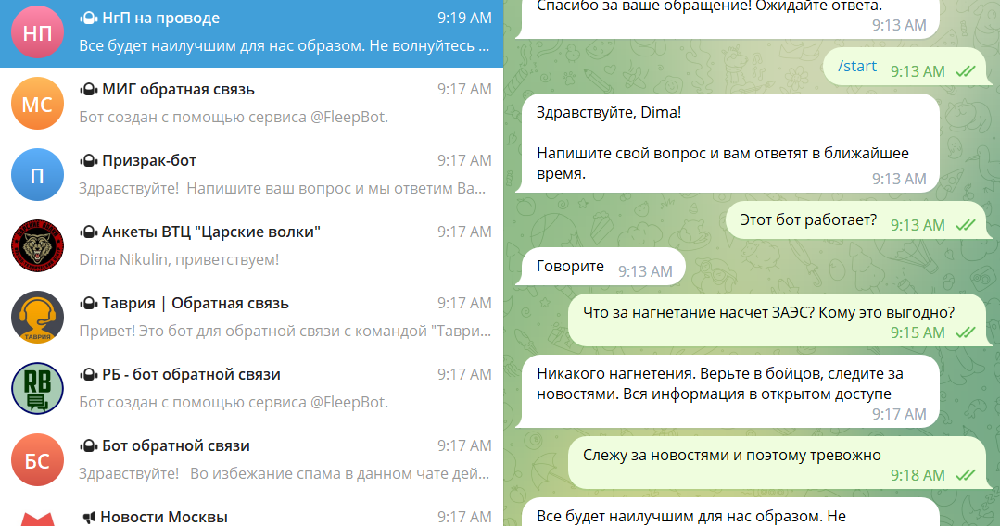
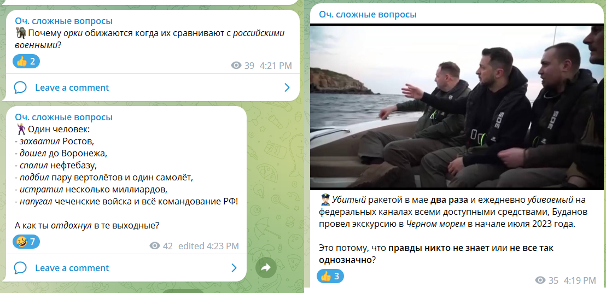

# Headline
TBD

# Інформаційна війна або яку роль відіграє Телеграм?
У даній статті розглядаються стратегії та тактики, що використовуються в інформаційній війні, зокрема через телеграм-канали.
Надані різні методи впливу на інформаційне поле через телеграм-канали, включаючи розповсюдження компрометуючої інформації та створення незручних питань для ворогів.

Крім того, висвітлюється особистий досвід автора та причини створення спеціального телеграм-каналу.
Підкреслюється важливість адаптації та збору інформації відповідно до цільової аудиторії у контексті поширюваного контенту.

Зокрема, стаття висвітлює проблему зловживання та маніпулювання інформацією відомими особистостями і організаціями. Автор надає реальні приклади таких випадків і підкреслює необхідність критичного мислення та перевірки джерел інформації, а також наголошує на важливості продовження наполегливої боротьби в безперервній інформаційній битві.

В цілому, стаття стимулює читачів до пошуку правдивої інформації, активної участі в інформаційній боротьбі та усвідомленого ставлення до контенту, адже інформаційна війна є складним й динамічним процесом, і тільки зі знанням та розумінням його механізмів можна ефективно чинити опір маніпуляціям та впливати на інформаційне середовище.

# Table of contents
- [Tags](https://github.com/dimanikulin/dimanikulin/blob/main/MyTelegramChannel.md#tags)
- [Початок](https://github.com/dimanikulin/dimanikulin/blob/main/MyTelegramChannel.md#%D0%BF%D0%BE%D1%87%D0%B0%D1%82%D0%BE%D0%BA)
- [Навіщо все це?](https://github.com/dimanikulin/dimanikulin/blob/main/MyTelegramChannel.md#%D0%BD%D0%B0%D0%B2%D1%96%D1%89%D0%BE-%D0%B2%D1%81%D0%B5-%D1%86%D0%B5)
- [Навіщо все це мені?](https://github.com/dimanikulin/dimanikulin/blob/main/MyTelegramChannel.md#%D0%BD%D0%B0%D0%B2%D1%96%D1%89%D0%BE-%D0%B2%D1%81%D0%B5-%D1%86%D0%B5-%D0%BC%D0%B5%D0%BD%D1%96)
- [Боти](https://github.com/dimanikulin/dimanikulin/blob/main/MyTelegramChannel.md#%D0%B1%D0%BE%D1%82%D0%B8)
- [Люди](https://github.com/dimanikulin/dimanikulin/blob/main/MyTelegramChannel.md#%D0%BB%D1%8E%D0%B4%D0%B8)
- [Автомати](https://github.com/dimanikulin/dimanikulin/blob/main/MyTelegramChannel.md#%D0%B0%D0%B2%D1%82%D0%BE%D0%BC%D0%B0%D1%82%D0%B8)
- [Трохи історій](https://github.com/dimanikulin/dimanikulin/blob/main/MyTelegramChannel.md#%D1%82%D1%80%D0%BE%D1%85%D0%B8-%D1%96%D1%81%D1%82%D0%BE%D1%80%D1%96%D0%B9)
- [Перша історія](https://github.com/dimanikulin/dimanikulin/blob/main/MyTelegramChannel.md#%D0%BF%D0%B5%D1%80%D1%88%D0%B0-%D1%96%D1%81%D1%82%D0%BE%D1%80%D1%96%D1%8F)
- [Друга історія](https://github.com/dimanikulin/dimanikulin/blob/main/MyTelegramChannel.md#%D0%B4%D1%80%D1%83%D0%B3%D0%B0-%D1%96%D1%81%D1%82%D0%BE%D1%80%D1%96%D1%8F)
- [Третя історія](https://github.com/dimanikulin/dimanikulin/blob/main/MyTelegramChannel.md#%D1%82%D1%80%D0%B5%D1%82%D1%8F-%D1%96%D1%81%D1%82%D0%BE%D1%80%D1%96%D1%8F)
- [Ефективність](https://github.com/dimanikulin/dimanikulin/blob/main/MyTelegramChannel.md#%D0%B5%D1%84%D0%B5%D0%BA%D1%82%D0%B8%D0%B2%D0%BD%D1%96%D1%81%D1%82%D1%8C)
- [Невдачі](https://github.com/dimanikulin/dimanikulin/blob/main/MyTelegramChannel.md#%D0%BD%D0%B5%D0%B2%D0%B4%D0%B0%D1%87%D1%96)
- [Безпека та блокування](https://github.com/dimanikulin/dimanikulin/blob/main/MyTelegramChannel.md#%D0%B1%D0%B5%D0%B7%D0%BF%D0%B5%D0%BA%D0%B0-%D1%82%D0%B0-%D0%B1%D0%BB%D0%BE%D0%BA%D1%83%D0%B2%D0%B0%D0%BD%D0%BD%D1%8F)
- [Як я зазвичай повожусь на каналах щоб не блокували](https://github.com/dimanikulin/dimanikulin/blob/main/MyTelegramChannel.md#%D1%8F%D0%BA-%D1%8F-%D0%B7%D0%B0%D0%B7%D0%B2%D0%B8%D1%87%D0%B0%D0%B9-%D0%BF%D0%BE%D0%B2%D0%BE%D0%B6%D1%83%D1%81%D1%8C-%D0%BD%D0%B0-%D0%BA%D0%B0%D0%BD%D0%B0%D0%BB%D0%B0%D1%85-%D1%89%D0%BE%D0%B1-%D0%BD%D0%B5-%D0%B1%D0%BB%D0%BE%D0%BA%D1%83%D0%B2%D0%B0%D0%BB%D0%B8)
- [За що блокують](https://github.com/dimanikulin/dimanikulin/blob/main/MyTelegramChannel.md#%D0%B7%D0%B0-%D1%89%D0%BE-%D0%B1%D0%BB%D0%BE%D0%BA%D1%83%D1%8E%D1%82%D1%8C)
- [Що робити, якщо заблокували на каналі?](https://github.com/dimanikulin/dimanikulin/blob/main/MyTelegramChannel.md#%D1%89%D0%BE-%D1%80%D0%BE%D0%B1%D0%B8%D1%82%D0%B8-%D1%8F%D0%BA%D1%89%D0%BE-%D0%B7%D0%B0%D0%B1%D0%BB%D0%BE%D0%BA%D1%83%D0%B2%D0%B0%D0%BB%D0%B8-%D0%BD%D0%B0-%D0%BA%D0%B0%D0%BD%D0%B0%D0%BB%D1%96)
- [Що робити, якщо заблокували взагалі обліковий запис?](https://github.com/dimanikulin/dimanikulin/blob/main/MyTelegramChannel.md#%D1%89%D0%BE-%D1%80%D0%BE%D0%B1%D0%B8%D1%82%D0%B8-%D1%8F%D0%BA%D1%89%D0%BE-%D0%B7%D0%B0%D0%B1%D0%BB%D0%BE%D0%BA%D1%83%D0%B2%D0%B0%D0%BB%D0%B8-%D0%B2%D0%B7%D0%B0%D0%B3%D0%B0%D0%BB%D1%96-%D0%BE%D0%B1%D0%BB%D1%96%D0%BA%D0%BE%D0%B2%D0%B8%D0%B9-%D0%B7%D0%B0%D0%BF%D0%B8%D1%81)
- [Що робити, якщо заблокували можливість писати у public каналах?](https://github.com/dimanikulin/dimanikulin/blob/main/MyTelegramChannel.md#%D1%89%D0%BE-%D1%80%D0%BE%D0%B1%D0%B8%D1%82%D0%B8-%D1%8F%D0%BA%D1%89%D0%BE-%D0%B7%D0%B0%D0%B1%D0%BB%D0%BE%D0%BA%D1%83%D0%B2%D0%B0%D0%BB%D0%B8-%D0%BC%D0%BE%D0%B6%D0%BB%D0%B8%D0%B2%D1%96%D1%81%D1%82%D1%8C-%D0%BF%D0%B8%D1%81%D0%B0%D1%82%D0%B8-%D1%83-public-%D0%BA%D0%B0%D0%BD%D0%B0%D0%BB%D0%B0%D1%85)
- [Власний канал](https://github.com/dimanikulin/dimanikulin/blob/main/MyTelegramChannel.md#%D0%B2%D0%BB%D0%B0%D1%81%D0%BD%D0%B8%D0%B9-%D0%BA%D0%B0%D0%BD%D0%B0%D0%BB)
- [Народження](https://github.com/dimanikulin/dimanikulin/blob/main/MyTelegramChannel.md#%D0%BD%D0%B0%D1%80%D0%BE%D0%B4%D0%B6%D0%B5%D0%BD%D0%BD%D1%8F)
- [Який підсумок або чи варта шкурка вичинки?](https://github.com/dimanikulin/dimanikulin/blob/main/MyTelegramChannel.md#%D1%8F%D0%BA%D0%B8%D0%B9-%D0%BF%D1%96%D0%B4%D1%81%D1%83%D0%BC%D0%BE%D0%BA-%D0%B0%D0%B1%D0%BE-%D1%87%D0%B8-%D0%B2%D0%B0%D1%80%D1%82%D0%B0-%D1%88%D0%BA%D1%83%D1%80%D0%BA%D0%B0-%D0%B2%D0%B8%D1%87%D0%B8%D0%BD%D0%BA%D0%B8)
- [Що далі?](https://github.com/dimanikulin/dimanikulin/blob/main/MyTelegramChannel.md#%D1%89%D0%BE-%D0%B4%D0%B0%D0%BB%D1%96)
- [References](https://github.com/dimanikulin/dimanikulin/blob/main/MyTelegramChannel.md#references)

# Tags
TelegramChannels InformationManipulation DiscreditingTactics Ukraine

---

# Початок
[StopRussiaChannel](https://t.me/+EbXZHBfHXbszY2I6) став відправною точкою!
Я підписався на нього на початку повномасштабного **вторгнення** у 2022 році.

Якщо коротко, там видавалися завдання щодо блокування та тролінгу каналів, які вели антиукраїнську інформаційну кампанію на платформах, таких як **YouTube**, **Telegram**, **TikTok** тощо. 

У мене був швидкий доступ тільки до **Telegram**, тому я працював виключно в **Telegram**.

## Навіщо все це?
Відповідь на питання про необхідність інформаційної війни детально описана в книзі **Мистецтво війни** *Сунь Цзи*.

Згідно з ідеєю книги, ворог, який сумнівається в собі, є **слабкішим** ворогом.
Автор наголошує, що для того, щоб змусити ворога сумніватися і ухвалювати нераціональні рішення, доцільно вдаватись до інформаційно-психологічних операцій (**ІПСО**), іншими словами, впливати на інформаційне поле.

Таким чином, поширення компрометуючої інформації та незручних питань певною мірою демотивують ворога.
Ефективне застосування ІПСО може мати значний вплив на думку цільової аудиторії та сприяти досягненню військових цілей.

## Навіщо все це мені?
Мене запитують, навіщо ти цим займаєшся.

Що ж, питання гідне, з огляду на те, що мені дуже не подобається просто так витрачати свій час.
Якби війни не було, то такі питання як: **курс рубля**, **скільки там в'язнів**, чи **заборонено ютуб** мене б не хвилювали особливо.

А так мої дії – просто моя реакція на війну. Мені не хочеться займатися цим, але я змушений.

Якщо говорити про цільову аудиторію, то в телеграм каналах багато людей.
Умовно я поділяю їх на кілька груп:
1. Росіяни, які проти путіна і війни, (є навіть що донатять на ЗСУ)
2. Росіяни, яким все одно, але на війну не хочуть іти та інших не змушують.
3. За путіна і війну, але не військові, вони зазвичай інших росіян підштовхують йти на війну.
4. Військові росіяни, їхні рідні та знайомі.
5. Українці, які за війну.
6. Українці, які проти війни.

Для першої та другої групи моя мета – не дати перейти на бік путіна та адептів війни.
Для третьої, четвертої та п'ятої груп моя мета - деморалізація та демотивація засобами ІПСО.
Із шостою групою не працюю.

# Боти
## Люди
Говорячи загалом, є у росіян **центри тролів**. Спробуйте пошукати за запитом *фабрика тролей росія* і ви багато чого дізнаєтесь.
По суті це звичайна офісна робота.
Приходиш на роботу, сидиш у соцмережах та месенджерах, пишеш повідомлення.
Отримують зарплату залежно від кількості повідомлень надісланих, та й є мінімум повідомлень на день.
Зазвичай такі люди-боти, маючи певні замовлення, відпрацьовують якусь тематику.
Наприклад, на початку липня 2023 року вони **мочили** Пригожина після його заколоту, а наприкінці липня 2023 року Ігоря Гіркіна, після його арешту.

Ще є акаунти телеграм, які пишуть повідомлення, але вже не за певною тематикою, а залежно від теми конкретного посту телеграм.
Там насправді автомат, який пише повідомлення ґрунтуючись на штучному інтелекті.

Повідомлення від тих та інших ботів відмінні від повідомлень звичайних людей.
Вони більш шаблонні.
Також вони вкрай рідко відповідають, якщо щось запитати.

## Автомати
Досить ефективно виходить працювати з Telegram-ботами.

Ви відправляєте боту вітання, запитуєте, чи він працює, а потім ставите інші питання.
Адміністратори ботів витрачають час на обробку таких запитів й іноді можуть заблокувати вас.

З вашого боку це забирає небагато часу, на відміну від адміністраторів, які обробляють запит значно довше, тому що ви не єдиний користувач, який спілкується з ботами.
Я особисто практикую роботу з кількома ботами одночасно, копіюючи в них один і той самий контент.

Ось тут детальний [пост](https://t.me/c/1663460417/1370) про те, як і навіщо спамити.

# Трохи історій
## **Перша історія.** 
У каналі, створеному **elena_geller**, я вирішив представитися жителем *Херсона*, який опинився у складній ситуації.
Моя легенда була наступною: я медик, який повірив російській пропаганді і не залишив місто у березні 2022 року.
У серпні 2022 року я почав розповсюджувати паніку в цьому каналі, побоюючись, що *Херсон* може бути захоплений **укропами**, тоді як російським військовим до мене не було справи.
Я не знав, як вибратися з міста і що робити далі.
У каналі мені запропонували евакуюватися до росії, наприклад, до *Ростова*.
Я сказав, що у мене там немає знайомих і не знаю, хто оплачуватиме мої витрати.
Зрештою, я вирішив евакуюватися до *Естонії*.
Пізніше я повернувся до *Херсона*, де вже не було російських військових.
Звичайно, мене відмовляли їхати до *Херсона*, попереджаючи про **страшных укропов**.
Здебільшого це були російські громадяни, котрі ніколи не були в *Україні*, але **знали** все з телевізора.
Врешті-решт я покинув цей чат, заявивши, що не варто вірити російській владі.

## **Друга історія.**
Я використав харківську операцію як інформаційний фон.
Під приводом пошуку свого племінника, я стверджував, що його захопили українці, і намагався знайти інформацію про нього у різних каналах.
Сказав, що прес-служба МО росії просто ігнорує мене і не може нічого вдіяти.
Звичайно, через мою наполегливість мене поступово видаляли з каналів, але осад у них залишався.

## **Третя історія.**
Я також стежив за каналом *В'ячеслава Володіна*.
Після початку мобілізації в росії я почав ставити питання про те, чому його діти не йдуть служити.
Мені відразу ж сказали, що він не має дітей призовного віку.
Однак я знайшов інформацію в інтернеті, яка свідчила про інше.
Тоді мене почали запевняти, що це фейк, замовлений комуністичною партією росії чи, можливо, опозицією, оскільки вони також розганяли історії на кшталт цієї. 
Паралельно там просував і історію про мого племінника, якого, як я стверджував, взяли в полон під *Ізюмом*.

Було і багато інших історій.

# Ефективність
Можна з упевненістю сказати, що коли адміністратори починають просити тебе заблокувати, це свідчить про твою успішність.
Коли тебе проклинають і обзивають, це також говорить про твої досягнення.
Спочатку це може бути неприємно, але якщо на тебе перестають реагувати, значить, твої дії марні.

Проте особливого захоплення заслуговують ті люди, які на російських телеграм-каналах стравлюють росіян одного з одним.
На це можна **дивитися вічно**!

# Невдачі
Звісно ж, мене неодноразово викривали.
Ну не може тітка з племінником у полоні називати себе *Діма Нікулін*.
Був випадок, коли я видавав себе за експерта з медійного контенту в одному каналі та називав безліч російських відео та фотографій фейками.
Але хлопці там виявилися не наївними, і я не зміг їх переконати, що це фейки.
В результаті мене видалили з їхнього каналу.
Такі ситуації є нормальним явищем у просторі інформаційної війни, де різні сторони намагаються впливати на громадську думку та контролювати розповсюдження інформації. Навіть якщо вас викривають, це може бути важливим досвідом, який допомагає краще розуміти механізми поширення інформації та реакції аудиторії.

# Безпека та блокування
Насамперед раджу подбати про **власну безпеку**.
Я створив додатковий обліковий запис, за допомогою якого і веду інформаційну війну.
Основний обліковий запис не використовую, оскільки його можуть заблокувати або обмежити.
Також рекомендую почистити пов'язані з вашими особистими обліковими записами соціальні мережі, вилучивши персональну інформацію.

## Як я зазвичай повожусь на каналах щоб не блокували
Коли я підписувався на канали і говорив **Слава Україні**, мене блокували протягом 5 хвилин, як і багато інших користувачів.
Стало очевидно, що необхідно змінити підхід.
Тому, коли я підписувався на нові канали, то просто спостерігав та вивчав **оперативну обстановку** - терміни, жаргон і контент, який зазвичай публікується.

Часто мені доводилося використовувати усталені терміни, такі як **укронацисты** або **асвабождение**, щоб здаватися більш переконливим та **своїм**. 
Знаючи, який контент зазвичай публікується на каналі і який контингент є, я визначав свої подальші дії.
Мої підходи до взаємодії з каналами були різними залежно від ситуації.

## За що блокують
Telegram блокує, коли користувачі скаржаться на повідомлення як на якісь неприйнятний контент - спам, насильство, особисті дані і т.д.
Як я розумію, якщо тільки один співрозмовник поскаржиться, то блокування не буде, тобто потрібна деяка масовість.
Але в мене був один випадок, коли одна людина заблокувала мене - я до нього звернувся за значком @ з образою.

Скарги надсилаються або до автоматичного процесингу, або до служби підтримки.

## Що робити, якщо заблокували взагалі обліковий запис?
Написати в https://telegram.org/support

## Що робити, якщо заблокували можливість писати у public каналах?
Напишіть у @SpamBot. Модератори перевірять, за що вас заблокували.

Якщо обліковий запис забанили помилково — його розблокують.

Якщо блокування було обґрунтованим — доведеться почекати. Бот вкаже у своєму повідомленні, як довго триватиме бан.

## Що робити, якщо заблокували на каналі?
Якщо вас заблокували на каналі, то ви можете **поскаржитися** на канал, а потім вийти з нього з чистою совістю.

Я заходжу на *інформацію про канал*, вибираю *Report*, далі *Other* та копіюю в поле текст скарги.

Текст скарги я беру ось [тут](https://t.me/+67FB3UDssxQ5Y2Qy).

Наприклад, скарга може звучати так: 
**Канал створений і працює з метою пропаганди і публікації фейкових новин щодо російського вторгнення в Україну!**
або **The channel was created and operates with the purpose of propaganda and dissemination of fake news about russian invasion of Ukraine!** 

Доступні дві мови, я обираю англійську як більш поширену порівняно із українською.

# Власний канал
Через необхідність працювати у декількох каналах я створив для зручності файл на комп'ютері, в якому зберігав контент, який просто копіював у різні канали.
Спочатку це були прості питання, наприклад, **чому називають путіна пуйлом** або **скільки може випити Медведєв**.

Поступово кількість питань та висловлювань збільшувалася до 1500 унікальних, і вони ставали дедалі складнішими.
Однак я зіткнувся із проблемою: не завжди я мав комп'ютер під рукою, а для такої діяльності потрібен постійний доступ до контенту.
Інакше кажучи, якщо я виходив до лікаря або в магазин, то виявлявся **знезброєним**.

## Народження 

Тому я вирішив перенести контент у телеграм канал, з якого можна було публікувати контент із будь-якого пристрою та із будь-якого місця.

Таким чином, я створив цей [телеграм-канал](https://t.me/questions4russians). Спочатку він містив лише текст та іконку, потім я додав можливість коментування та створив окрему групу.

Зараз у каналі вже з'явилися відео, картинки та лінки.

## Який підсумок або чи варта шкурка вичинки?

Коротка відповідь: так, якщо у вас є ті півгодини на день і, головне, бажання.

Все почалося із одного каналу, де спочатку було **34 тисячі** передплатників, а в коментарях всередині **80%** становив проросійський контент.
Десь за **3 місяці** коментарі закрили, але **70%** контенту було вже проукраїнським.

Схожа ситуація з іншими кількома каналами.

## Що далі?
Не зупинятися, звісно!

Як сказав *Тарас Шевченко*: *"Борітеся - поборете, вам Бог помагає!"*

# References
| # | Name                 | Source                | Release date           |  Author                 | Description   |
| - | ---------------------|---------------------- |----------------------- | ----------------------- |:-------------:|
| 1 | StopRussiaChannel                  |[Telegram](https://t.me/+EbXZHBfHXbszY2I6) | | | |
| 2 | Мой канал                          |[Telegram](https://t.me/questions4russians) | | Dmytro Nikulin | |
| 3 | Список российских телеграм каналов |[github](./MyRuTelegramChannels.md) | | Dmytro Nikulin | |
