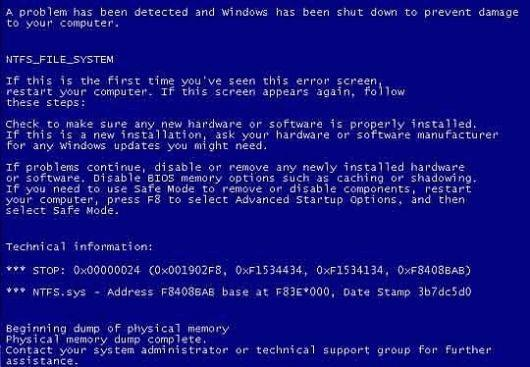

# Headline
This is when we say "Old, but Gold"

# Table of contents
- [Tags](./OldButGold.md#tags)
- [Overview](./OldButGold.md#overview)
- [Windows 95](./OldButGold.md#windows-95)
- [Miranda](./OldButGold.md#miranda)
- [BSOD](./OldButGold.md#bsod)
- [First Mobile Phone](./OldButGold.md#first-mobile-phone)
- [Windows NT 4.0](./OldButGold.md#windows-nt-40)
- [References](./OldButGold.md#references)

# Tags
oldschool old

# Overview
TBD 

---

# Windows 95

Can you guess what is this without googling?

I used that a lot when I started programming.

If you can guess, we are the same age

# Miranda
Can you guess what it is?

If you know what is this - we are the same age )

Based on https://www.linkedin.com/feed/update/urn:li:activity:6947599537733558272/?commentUrn=urn%3Ali%3Acomment%3A(activity%3A6947599537733558272%2C6951864730680487936)&dashCommentUrn=urn%3Ali%3Afsd_comment%3A(6951864730680487936%2Curn%3Ali%3Aactivity%3A6947599537733558272

# BSOD
Can you guess what is this without googling?

I have seen that a lot.

# First Mobile Phone
This is my first mobile phone.

It had no:
- color screen
- music
- internet connection
- touchable screen
- multimedia support
- camera
- extendable memory

Do you think I was not happy with it? - Nope!

Please share what your first mobile phone was.
Were you happy with it?

# Windows NT 4.0

Can you guess what is this without googling?

I used that a lot when I started programming.

If you can guess, we are the same age.

# References
| # | Name                 | Source                | Release date           |  Author                 | Description   |
| - | ---------------------|---------------------- |----------------------- | ----------------------- |:-------------:|
| 1 | Windows 95           |[LinkedIn](https://www.linkedin.com/posts/dimanikulin_oldschool-old-activity-7048925594268352512-c-4G?utm_source=share&utm_medium=member_desktop) | 01/04/2023| Dmytro Nikulin||
| 2 | Miranda NG           |[LinkedIn](https://www.linkedin.com/posts/dimanikulin_old-activity-7016323085142224896-OyzK?utm_source=share&utm_medium=member_desktop) | 01/01/2023| Dmytro Nikulin||
| 3 | BSoD                 |[LinkedIn](https://www.linkedin.com/posts/dimanikulin_oldschool-oldtech-activity-7066684307964125184-hZG4?utm_source=share&utm_medium=member_desktop)| 25/05/2023 | Dmytro Nikulin||
| 4 | First Mobile Phone   |[LinkedIn](https://www.linkedin.com/posts/dimanikulin_oldisgold-oldschool-first-activity-7078993334840569858-vZp0?utm_source=share&utm_medium=member_desktop)| 26/06/2023 | Dmytro Nikulin||
| 5 | Windows NT 4.0       |[LinkedIn](https://www.linkedin.com/posts/dimanikulin_oldschool-old-activity-7096741686382407680-mJQ2?utm_source=share&utm_medium=member_desktop)| 14/08/2023 | Dmytro Nikulin| |
