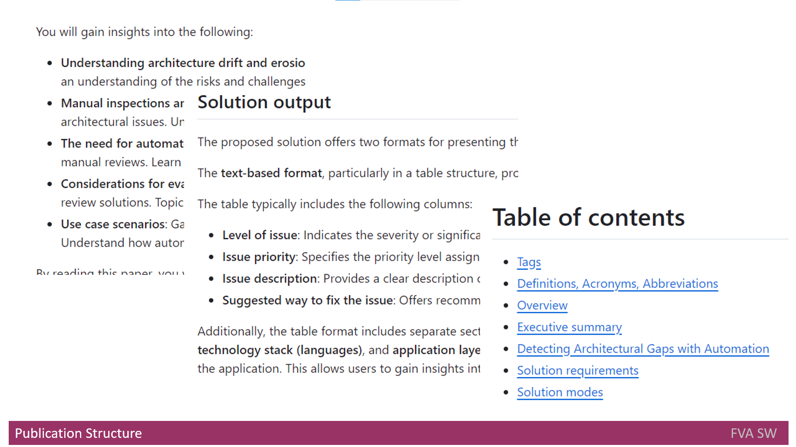

# Headline
**Optimizing Publication Success**: Key Metrics, Recommendations, and Structural Essentials

# Alternative headline 
**What and how to publish**

# Table of contents
- [Tags](./PublishWhat1_en.md#tags)
- [Definitions, Acronyms, Abbreviations](./PublishWhat1_en.md#definitions-acronyms-abbreviations)
- [Overview](./PublishWhat1_en.md#overview)
- [Criteria for Evaluating Publications](./PublishWhat1_en.md#criteria-for-evaluating-publications)
- [Common Recommendations](./PublishWhat1_en.md#common-recommendations)
- [Publication Structure](./PublishWhat1_en.md#publication-structure)
- [Must-Have Chapters](./PublishWhat1_en.md#must-have-chapters)
- [Optional Chapters](./PublishWhat1_en.md#optional-chapters)
- ["Headline" chapter](./PublishWhat1_en.md#headline-chapter)
- ["Table of contents" chapter](./PublishWhat1_en.md#table-of-contents-chapter)
- ["Overview" Chapter](./PublishWhat1_en.md#overview-chapter)
- ["Tags" Chapter](./PublishWhat1_en.md#tags-chapter)
- ["Definitions, Acronyms, Abbreviations" Chapter](./PublishWhat1_en.md#definitions-acronyms-abbreviations-chapter)
- ["References" Chapter](./PublishWhat1_en.md#references-chapter)

# Tags
Publication Metrics, Content Engagement, Publication Strategy, Writing Guidelines, Document Structure, Publication Optimization, Audience Interaction

# Overview
Mastering the Art of Publication: 
A comprehensive guide outlining key criteria for evaluating publications, common recommendations for successful content creation, essential publication structure guidelines, and must-have chapters.
Learn how to optimize your publications for engagement and readability while ensuring effective organization and categorization through tags.

---

# Criteria for Evaluating Publications
Having posted numerous publications across seven different sites, I've identified several key criteria for determining the success and interest level of each publication:

- **Number of Views**: The total number of times the publication has been viewed is a primary indicator of its reach and impact.
- **Comments**: Engaging comments indicate that the publication has sparked discussion and resonated with the audience.
- **Likes and Reposts**: The number of likes and reposts reflects the level of appreciation and the desire to share the publication with others.
- **Savings into Bookmarks**: When readers save the publication into their bookmarks, it suggests that they find the content valuable and wish to revisit it in the future.

By assessing these metrics, I can gauge the effectiveness of each publication and tailor future content to better meet the interests and preferences of the audience.

# Common Recommendations
When publishing, it's crucial to ensure that the content reads like a story rather than a mere collection of facts.
It's immensely valuable to draw from personal experiences rather than relying solely on information gathered from books and online sources, avoiding mere reposts.
Our content should reflect our own opinions, which might sometimes be provocative to stimulate discussion and even elicit strong reactions. For example, you can describe any pain points for yourself and for society.
Additionally, the content should encourage readers to form their own opinions and engage in meaningful dialogue.

Furthermore, it's important to be responsive to comments by addressing any questions or concerns raised.
This interaction helps foster a sense of community and encourages further engagement with the content.

# Publication Structure

When creating content, it is crucial to prioritize structure, especially for larger texts.
The following guidelines should be adhered to:

- Paragraphs and Indentation: Ensure that paragraphs are used to maintain clear segmentation of ideas. Implement proper indentation to enhance readability.
- Headings and Subheadings: Utilize headings and subheadings to organize content hierarchically. Limit heading levels to three for simplicity and clarity.
- Lists: Integrate bulleted or numbered lists to present information concisely.
- Chapter Order: Recognize the significance of the order of chapters, following the conventions of scientific documents.

By adhering to these guidelines, your content will not only be well-structured but also enhance the overall readability and comprehension of the larger text.

# Must-Have Chapters
In any comprehensive document, the following chapters are essential:

- Headline: This chapter serves as the introduction, providing a concise and compelling overview of the document's main theme or purpose.
- Overview: The overview chapter expands on the headline, offering a more detailed insight into the document's content, objectives, and key points.
- Tags: In this chapter, relevant tags are included to categorize and label the document, aiding in searchability and organization.
- Table of Contents: The table of contents chapter provides a structured outline of the document, listing its sections and subsections, guiding readers through the content.

Ensuring the inclusion of these must-have chapters will contribute to the clarity, accessibility, and overall effectiveness of the document.

# Optional Chapters
I would like to note that the **Alternative Headline**, **Definitions, Acronyms, Abbreviations**, **Introduction** and **References** chapters are optional.

Generally, there is no need for a glossary.

If there are terms that the reader may not know, please explain them where and when they are mentioned.

# "Headline" chapter
I use **ChatGPT** to assist me in generating headlines.
Therefore, I copy the entire content into **ChatGPT** and ask it to generate a headline.
Please note that sometimes it may require a few corrections because it might extract a headline based only on a part of the content and not the entire text.

# "Table of contents" chapter
**Table of contents** is just usual content table with links to the chapter headers 

# "Overview" Chapter
The **overview** chapter typically offers a brief summary or introduction to the main topics covered in the document.
It serves as a way to orient the reader and provide context before delving into more detailed information.

Alternatively, this chapter is often referred to as **TL;DR** - *too long; didn't read*.

Similar to the previous chapter, I use **ChatGPT** to assist me in generating the **Overview**. 
Therefore, I copy the entire content into **ChatGPT** and ask it to generate an **Overview**.

# "Tags" Chapter
**Tags** for text documents are keywords or labels assigned to the document to categorize or describe its content.
These **tags** aid in organizing and classifying documents, making them easier to search, filter, and retrieve later.

I use these **tags** to include on the platform where I am publishing.

Once more, I utilize **ChatGPT** to assist me in generating the **tags**.

# "Definitions, Acronyms, Abbreviations" Chapter
This chapter lists *Definitions*, *Acronyms*, and *Abbreviations* in the form of a table.

It consists of 3 columns:

- **Number**: Indicates the row number.
- **Abbreviation or Acronym**: The name of the Abbreviation or Acronym.
- **Definition**: Explains the Abbreviation or Acronym.

# "References" Chapter
It is recommended to include links at the point of mention.
Additionally, a separate chapter for references in the form of a table is desired.

The table consists of 6 columns:

- **Number**: Indicates the row number.
- **Name**: The name of the reference.
- **Source**: The name of the resource where it is published.
- **Release Date**: The date of release.
- **Author**: The content creator.
- **Description**: An additional field for details.
                   
# References
| # | Name                 | Source                | Release date           |  Author                 | Description   |
| - | ---------------------|---------------------- |----------------------- | ----------------------- |:-------------:|
| 1 | What and how to publish, part 2 |[GitHub](./PublishWhat2_en.md) | | | |
| 2 | Where to publish, part 1 |[GitHub](./PublishWhere1_en.md) | | | |
| 3 | Where to publish, part 2 |[GitHub](./PublishWhere2_en.md) | | | |
