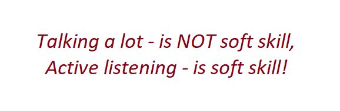

# Headline
Soft skiils

# Article description
TBD 

# Tags
softskills

# Active Listening

Is "talking a lot" a soft skill? Nope.

I have seen a lot of people who think "talking a lot" is a soft skill.

Literally, an ability to communicate is soft skill and communication consists of 2 points: how you give information and how you receive information.

When you speak a lot you do not listen and so you don't receive information.

## Tags
communication activelistening

# Who are toxic people
Who are **toxic** people?
People who..

- criticize a lot **11%**
- can not listen to other people **19%**
- say rude words **5%**
- are rusnia **66%**

## Tags
toxicpeople

# References
| # | Name                 | Source                | Release date           |  Author                 | Description   |
| - | ---------------------|---------------------- |----------------------- | ----------------------- |:-------------:|
| 1 | Who are toxic people | [LinkedIn](https://www.linkedin.com/posts/dimanikulin_toxicpeople-activity-7026092332055707648-oYuV?utm_source=share&utm_medium=member_desktop) | Febrary, 2023 | Dmytro Nikulin | | 
| 2 | Active Listening     | [LinkedIn](https://www.linkedin.com/posts/dimanikulin_communication-softskills-activelistening-activity-6972809312763043840-Dv6D?utm_source=share&utm_medium=member_desktop) | October, 2023 | Dmytro Nikulin | |
