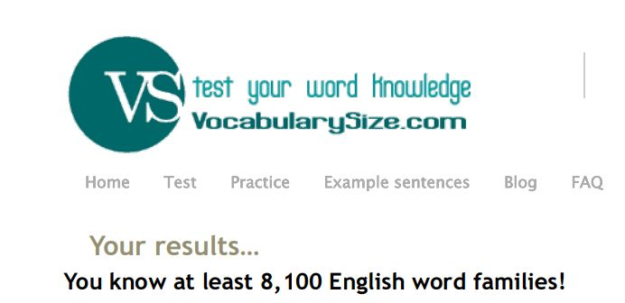

# Headline
Soft skiils
 
# Table of contents
- [Tags](./SoftSkills.md#tags)
- [Overview](./SoftSkills.md#overview)
- [Active Listening](./SoftSkills.md#active-listening)
- [Who are toxic people](./SoftSkills.md#who-are-toxic-people)
- [English level](./SoftSkills.md#english-level)
- [References](./SoftSkills.md#references)

# Tags
softskills

# Overview
TBD 

---

# Active Listening
Is "talking a lot" a soft skill? Nope.

I have seen a lot of people who think "talking a lot" is a soft skill.

Literally, an ability to communicate is soft skill and communication consists of 2 points: how you give information and how you receive information.

When you speak a lot you do not listen and so you don't receive information.

## Tags
communication activelistening

# Who are toxic people
Who are **toxic** people?
People who..

- criticize a lot **11%**
- can not listen to other people **19%**
- say rude words **5%**
- are rusnia **66%**

## Tags
toxicpeople

# English level
Regularly, I make it a habit to assess and enhance both my soft skills and hard skills.
This includes refining my understanding of metaprograms, social styles, English proficiency, and technical knowledge.

For instance, I use resources like https://lnkd.in/gdBYFkuf to gauge my English vocabulary.
During my last assessment, I achieved a milestone, learning over 8,100 English word families!

Do you also prioritize regular skill and knowledge assessments?
What specific areas do you focus on refining and improving?

# References
| # | Name                 | Source                | Release date           |  Author                 | Description   |
| - | ---------------------|---------------------- |----------------------- | ----------------------- |:-------------:|
| 1 | Who are toxic people | [LinkedIn](https://www.linkedin.com/posts/dimanikulin_toxicpeople-activity-7026092332055707648-oYuV?utm_source=share&utm_medium=member_desktop) | 01/02/2023 | Dmytro Nikulin | | 
| 2 | Active Listening     | [LinkedIn](https://www.linkedin.com/posts/dimanikulin_communication-softskills-activelistening-activity-6972809312763043840-Dv6D?utm_source=share&utm_medium=member_desktop) | 01/10/2023 | Dmytro Nikulin | |
| 3 | English level        | [LinkedIn](https://www.linkedin.com/posts/dimanikulin_regularly-i-make-it-a-habit-to-assess-and-activity-7185896908903604224-80tI?utm_source=share&utm_medium=member_desktop) | 16/04/2024 | Dmytro Nikulin | |