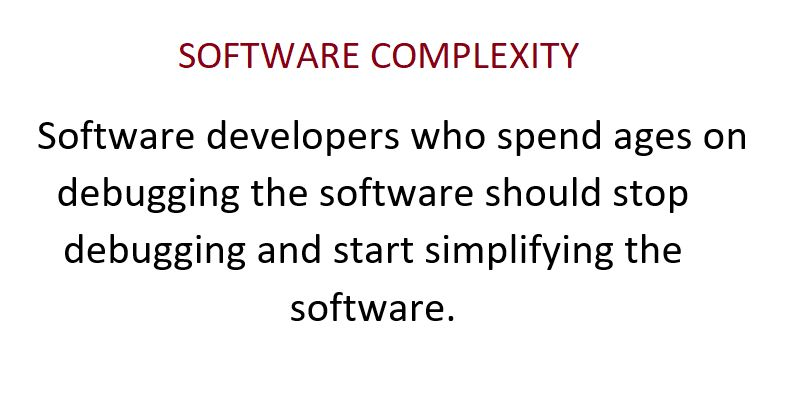

# Headline
TBD

# Everything about the Software Development
TBD 

# Table of contents
- [Tags](https://github.com/dimanikulin/dimanikulin/blob/main/SoftwareDevelopment.md#tags)
- [Definitions, Acronyms, Abbreviations](https://github.com/dimanikulin/dimanikulin/blob/main/SoftwareDevelopment.md#definitions-acronyms-abbreviations)
- [Just joined a project with Scrum](https://github.com/dimanikulin/dimanikulin/blob/main/SoftwareDevelopment.md#just-joined-a-project-with-scrum)
- [Tags](https://github.com/dimanikulin/dimanikulin/blob/main/SoftwareDevelopment.md#tags-1)
- [Software Complexity](https://github.com/dimanikulin/dimanikulin/blob/main/SoftwareDevelopment.md#software-complexity)
- [Tags](https://github.com/dimanikulin/dimanikulin/blob/main/SoftwareDevelopment.md#tags-2)
- [Which title describes better a real job?](https://github.com/dimanikulin/dimanikulin/blob/main/SoftwareDevelopment.md#which-title-describes-better-a-real-job)
- [Tags](https://github.com/dimanikulin/dimanikulin/blob/main/SoftwareDevelopment.md#tags-3)
- [What do you usually do to provide accurate estimations?](https://github.com/dimanikulin/dimanikulin/blob/main/SoftwareDevelopment.md#what-do-you-usually-do-to-provide-accurate-estimations)
- [Tags](https://github.com/dimanikulin/dimanikulin/blob/main/SoftwareDevelopment.md#tags-4)
- [C++ death](https://github.com/dimanikulin/dimanikulin/blob/main/SoftwareDevelopment.md#c-death)
- [Tags](https://github.com/dimanikulin/dimanikulin/blob/main/SoftwareDevelopment.md#tags-5)
- [Programming Languages and Guessing!](https://github.com/dimanikulin/dimanikulin/blob/main/SoftwareDevelopment.md#programming-languages-and-guessing)
- [References](https://github.com/dimanikulin/dimanikulin/blob/main/SoftwareDevelopment.md#references)

# Tags
Software Development 

# Definitions, Acronyms, Abbreviations
| # | Abbreviation or Acronym | Definition     |
| - | ------------------------|:--------------:|
| 1 | CV | TBD
| 2 | Scrum | TBD |

---

# Just joined a project with Scrum

## Tags
Scrum

# Software Complexity

## Tags
Software Complexity

# Which title describes better a real job?
I have seen a lot of different titles in CV, social networks like "Consultant", "Consulting" etc. 
From my side it is difficult to understand what "IT Consultant" really does and knows.

Which title describes better a real job?

- IT Consultant **10%**
- C++ Developer **90%**

87 Votes

## Tags
itconsulting cv

# What do you usually do to provide accurate estimations?
I have had significant experience in software development, yet I still struggle with estimation.

What I usually do is multiply my estimations by 2-3, but even that approach doesn't always work.

I have rarely come across a developer who is consistently good at estimating.

So what do you usually do to provide accurate estimations?
- Break tasks into smaller parts **56%**
- Use historical data **10%**
- Involve the team **16%**
- Regularly review and learn **18%**

Please share your opinions in the comments.

## Tags
experience softwaredevelopment estimation

# C++ death

Do you have any programming language/technology that were predicted to die a long time ago but are still going strong?

For me, it's C++. I started using it more than 20 years ago, and after a while (2-3 years), there were predictions that C++ would die soon due to the emergence of new languages and technologies.

But that didn't happen, and those fast-approaching languages and technologies are still around.

So, when was the first time you heard that your language/technology X would die?

- 20 years ago **17%**
- 10 years ago **21%**
- 5 years ago  **20%**
- never heard  **42%**

71 Votes

Please share in the comments your programming language/technology that was predicted to die but didn't.

## Tags
programminglanguage technologytrends cpplus prediction

## Programming Languages and Guessing!

In a broader sense, the relationship between programming languages and the role of guessing can depend on the nature of the language.
It's not that guessing is universally opposed to programming; rather, different languages may encourage different approaches to problem-solving.

For example, in languages like Python or JavaScript, often associated with scripting and rapid prototyping, developers might employ a more exploratory approach where they try out ideas, experiment, and make decisions on the fly.
These languages are designed to be more flexible and expressive, allowing for a dynamic and iterative development process.

On the contrary, a language like C++ is known for its precision, structure, and explicit coding, while guessing implies uncertainty and lack of precision.
So, in the realm of programming, C++ and guessing can be considered on opposite sides.

Do you agree with that?

## Tabs or Spaces

"Tabs vs Spaces" - "Holy war" or settled matter?

The "Tabs vs Spaces" holy war has been a long-standing debate among software developers regarding whether to use "tabs" or "spaces" for code indentation. 
Some developers prefer tabs, while others favor spaces.

The choice between them is largely a matter of personal preference.

So, what is your preference and why?

# References
| # | Name                 | Source                | Release date           |  Author                 | Description   |
| - | ---------------------|---------------------- |----------------------- | ----------------------- |:-------------:|
| 1 |Just joined a project with Scrum|[LinkedIn](https://www.linkedin.com/posts/dimanikulin_activity-6937092837654081540-brUA?utm_source=share&utm_medium=member_desktop)| May, 2022 | Dmytro Nikulin||
| 2 |Software Complexity|[LinkedIn](https://www.linkedin.com/posts/dimanikulin_activity-6934186023509741568-9mZu?utm_source=share&utm_medium=member_desktop)| April, 2022 | Dmytro Nikulin||
| 3 |Which title describes better a real job?|[LinkedIn](https://www.linkedin.com/posts/dimanikulin_itconsulting-itcompany-cv-activity-7000719821558411264-1dHl?utm_source=share&utm_medium=member_desktop)| November, 2022 | Dmytro Nikulin||
| 4 |What do you usually do to provide accurate estimations?|[LinkedIn](https://www.linkedin.com/posts/dimanikulin_experience-softwaredevelopment-estimation-activity-7069560555165876224-_Af3?utm_source=share&utm_medium=member_desktop)| 30 May, 2023 | Dmytro Nikulin| |
| 5 |C++ death |[LinkedIn](https://www.linkedin.com/posts/dimanikulin_programminglanguage-technologytrends-cpplus-activity-7076463361500098560-ucVw?utm_source=share&utm_medium=member_desktop)| 19 June, 2023 | Dmytro Nikulin| |
| 6 |Programming Languages and Guessing! |[LinkedIn](https://www.linkedin.com/posts/dimanikulin_languages-and-guessing-in-a-broader-sense-activity-7133365394043514880-WW4P?utm_source=share&utm_medium=member_desktop) | 23 November, 2023 | Dmytro Nikulin | |