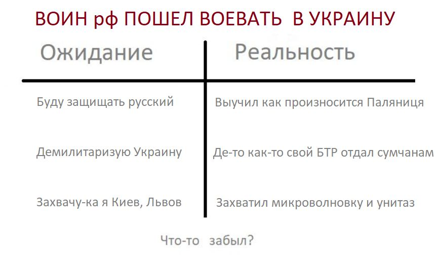
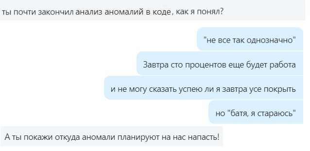
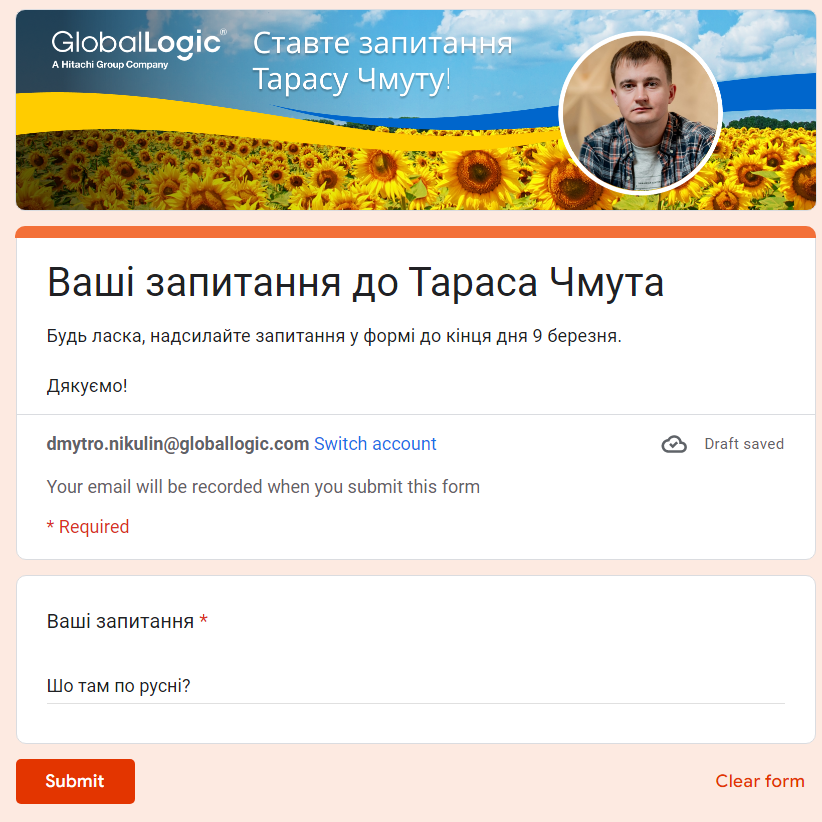
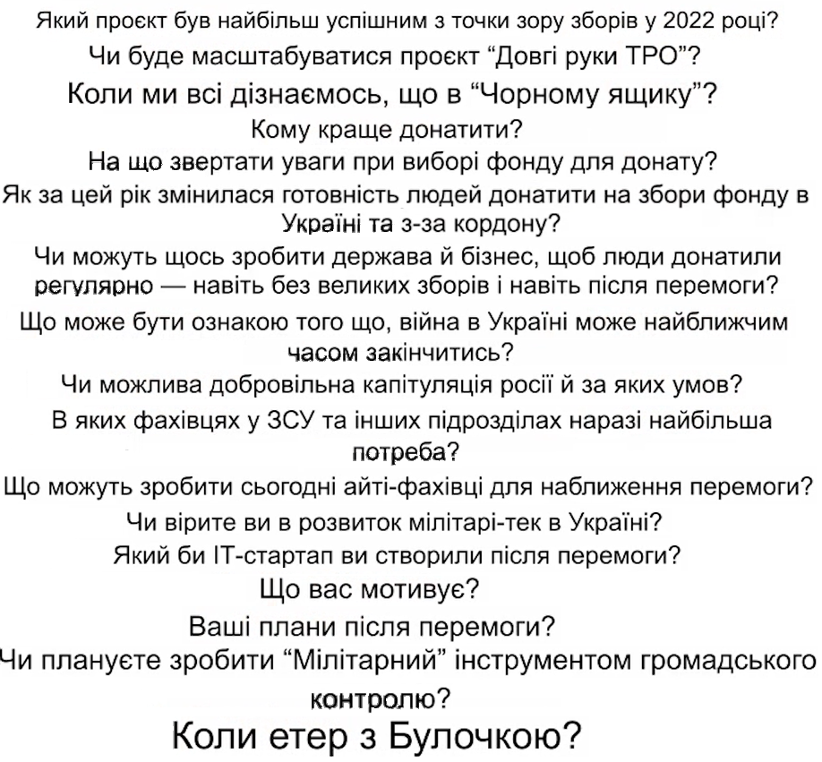

# Headline
TBD

# War in Ukraine!
Engaging in everyday conversations at unusual times.
Exploring how Russians handle defeat in chess and their behavior in real-life conflicts.
Options for Putin's future endeavors with humor and percentages.
A set of questions for Taras Chmut, with some restrictions on topic areas.
Listing questions posed to Taras Chmut by individuals from GlobalLogic during a recent meeting.
A humorous take on junior job seekers in Ukraine during times of conflict.

TBD 

# Table of contents
- [Tags](https://github.com/dimanikulin/dimanikulin/blob/main/WarInUkraine.md#tags)
- [Первый пост с 24 февраля 2022 года](https://github.com/dimanikulin/dimanikulin/blob/main/WarInUkraine.md#%D0%BF%D0%B5%D1%80%D0%B2%D1%8B%D0%B9-%D0%BF%D0%BE%D1%81%D1%82-%D1%81-24-%D1%84%D0%B5%D0%B2%D1%80%D0%B0%D0%BB%D1%8F-2022-%D0%B3%D0%BE%D0%B4%D0%B0)
- [Usual talks in unsual time](https://github.com/dimanikulin/dimanikulin/blob/main/WarInUkraine.md#usual-talks-in-unsual-time)
- [Summer time](https://github.com/dimanikulin/dimanikulin/blob/main/WarInUkraine.md#summer-time)
- [How russians play chess?](https://github.com/dimanikulin/dimanikulin/blob/main/WarInUkraine.md#how-russians-play-chess)
- [А на куди зибеться пУТЕНг?](https://github.com/dimanikulin/dimanikulin/blob/main/WarInUkraine.md#%D0%B0-%D0%BD%D0%B0-%D0%BA%D1%83%D0%B4%D0%B8-%D0%B7%D0%B8%D0%B1%D0%B5%D1%82%D1%8C%D1%81%D1%8F-%D0%BF%D1%83%D1%82%D0%B5%D0%BD%D0%B3)
- [Яскрава місячна ніч](https://github.com/dimanikulin/dimanikulin/blob/main/WarInUkraine.md#%D1%8F%D1%81%D0%BA%D1%80%D0%B0%D0%B2%D0%B0-%D0%BC%D1%96%D1%81%D1%8F%D1%87%D0%BD%D0%B0-%D0%BD%D1%96%D1%87)
- [Якби у Вас була можливість, то що б Ви запитали у Тараса Чмута?](https://github.com/dimanikulin/dimanikulin/blob/main/WarInUkraine.md#%D1%8F%D0%BA%D0%B1%D0%B8-%D1%83-%D0%B2%D0%B0%D1%81-%D0%B1%D1%83%D0%BB%D0%B0-%D0%BC%D0%BE%D0%B6%D0%BB%D0%B8%D0%B2%D1%96%D1%81%D1%82%D1%8C-%D1%82%D0%BE-%D1%89%D0%BE-%D0%B1-%D0%B2%D0%B8-%D0%B7%D0%B0%D0%BF%D0%B8%D1%82%D0%B0%D0%BB%D0%B8-%D1%83-%D1%82%D0%B0%D1%80%D0%B0%D1%81%D0%B0-%D1%87%D0%BC%D1%83%D1%82%D0%B0)
- [Які питання ставили хлопці з GlobalLogic Тарасу Чмуту](https://github.com/dimanikulin/dimanikulin/blob/main/WarInUkraine.md#%D1%8F%D0%BA%D1%96-%D0%BF%D0%B8%D1%82%D0%B0%D0%BD%D0%BD%D1%8F-%D1%81%D1%82%D0%B0%D0%B2%D0%B8%D0%BB%D0%B8-%D1%85%D0%BB%D0%BE%D0%BF%D1%86%D1%96-%D0%B7-globallogic-%D1%82%D0%B0%D1%80%D0%B0%D1%81%D1%83-%D1%87%D0%BC%D1%83%D1%82%D1%83)
- [junior is trying to find a job in summer in Ukraine in war](https://github.com/dimanikulin/dimanikulin/blob/main/WarInUkraine.md#junior-is-trying-to-find-a-job-in-summer-in-ukraine-in-war)
- [Що мені допомогло минулої зими під час blackout-ів](https://github.com/dimanikulin/dimanikulin/blob/main/WarInUkraine.md#%D1%89%D0%BE-%D0%BC%D0%B5%D0%BD%D1%96-%D0%B4%D0%BE%D0%BF%D0%BE%D0%BC%D0%BE%D0%B3%D0%BB%D0%BE-%D0%BC%D0%B8%D0%BD%D1%83%D0%BB%D0%BE%D1%97-%D0%B7%D0%B8%D0%BC%D0%B8-%D0%BF%D1%96%D0%B4-%D1%87%D0%B0%D1%81-blackout-%D1%96%D0%B2)
- [References](https://github.com/dimanikulin/dimanikulin/blob/main/WarInUkraine.md#references)

# Tags
armukrainenow staywithukraine stoprussia stopwar russiaterroriststate warinukraine ukrainewar ukraine

---

# Первый пост с 24 февраля 2022 года
Да, я говорил, что на Линкеде нет места для политоты.
Но так-то было до 24 февраля

# Usual talks in unsual time
Обычный разговор, в "необычное" время.

# Summer time
Summer is definitely a time for vacation, relaxing ...
But there are some "nuances"

# How russians play chess?
Yes, it is not really easy to resign.
Even when you just play chess and when you have already lost.
When I am loosing chess game I am saying "thank you, well played" and I am getting upset.
It differs from what usually rUSSIANS do.
They say all rude words they even know when they loose just chess game.
Another example what rUSSIANS do when they loose the "GAME" on real battle field - they bomb usual people, infrastructure like usual TERRORISTS.

# А на куди зибеться пУТЕНг?
Яник зибався на ростов.
А на куди зибеться пУТЕНг?

- До яника **1%**
- На картопля-ленд **4%**
- На Марс з Маском **11%**
- До жиріка **84%**

# Яскрава місячна ніч
Яскрава місячна ніч.
Звичайна людина: Красива ніч. Романтика.
Українець: Добре буде видно "Шахеди"

# Якби у Вас була можливість, то що б Ви запитали у Тараса Чмута?

П.С.
Наступні питання не пропонувати:

- Що там по русі?;

- Що було в чорному ящику Кирила Буданова?

- Коли ми отримаємо Ф-16?

# Які питання ставили хлопці з GlobalLogic Тарасу Чмуту
Місяць тому мене запитали, які питання ставили хлопці з GlobalLogic Тарасу Чмуту на зустрічі з ним.

Ось вони.

Якщо вам цікаво напишіть у коментах які питання цікаві та на які питання ви хотіли б дізнатися відповіді?

# junior is trying to find a job in summer in Ukraine in war
When junior is trying to find a job in summer... in Ukraine.... in war.
Invest(hire) in them now and you will have nice ROI soon!

# Що мені допомогло минулої зими під час blackout-ів
- Запас питної та технічної води на 3 дні
- Сухи пайки, консерви, сублімовані продукти (каші)
- BLUETTI AC50S Blue
- Лампи на акумуляторах
- Запас свічок, сірників та батарейок
- Теплі домашні речі, ковдри
- 2 додаткових sim карти для мобільного інтернету (тобто маю карти Life, Vodafone та Kyivstar)

Також придбав домашній вогнегасник.

А що допомогло Вам чого немає у цьому чек-листі?

# References
| # | Name                   | Source                | Release date           |  Author                 | Description   |
| - | -----------------------|---------------------- |----------------------- | ----------------------- |:-------------:|
| 1 |Первый пост с 24 февраля|[LinkedIn](https://www.linkedin.com/posts/dimanikulin_%D0%B4%D0%B0-%D1%8F-%D0%B3%D0%BE%D0%B2%D0%BE%D1%80%D0%B8%D0%BB-%D1%87%D1%82%D0%BE-%D0%BD%D0%B0-%D0%BB%D0%B8%D0%BD%D0%BA%D0%B5%D0%B4%D0%B5-%D0%BD%D0%B5%D1%82-%D0%BC%D0%B5%D1%81%D1%82%D0%B0-%D0%B4%D0%BB%D1%8F-activity-6927370042426707968-O7jY?utm_source=share&utm_medium=member_desktop)|Febrary, 2022| Dmytro Nikulin||
| 2 |Обычный разговор, в "необычное" время|[LinkedIn](https://www.linkedin.com/posts/dimanikulin_standwithukraine-warinukraine-activity-6962298071544135680-Szog?utm_source=share&utm_medium=member_desktop)|August, 2022| Dmytro Nikulin||
| 3 |Summer time|[LinkedIn](https://www.linkedin.com/posts/dimanikulin_ukrainewar-ukraine-summer-activity-6957738620485005312-kqEc?utm_source=share&utm_medium=member_desktop)|August, 2022| Dmytro Nikulin||
| 4 |How russians play chess?|[LinkedIn](https://www.linkedin.com/posts/dimanikulin_russiaterroriststate-warinukraine-stoprussia-activity-7000377148582563840-kZNd?utm_source=share&utm_medium=member_desktop)|November, 2022| Dmytro Nikulin||
| 5 |А на куди зибеться пУТЕНг?|[LinkedIn](https://www.linkedin.com/posts/dimanikulin_warinukraine-staywithukraine-activity-6987497817262972928-os1e?utm_source=share&utm_medium=member_desktop)|November, 2022| Dmytro Nikulin||
| 6 |Яскрава місячна ніч|[LinkedIn](https://www.linkedin.com/posts/dimanikulin_warinukraine-stoprussia-activity-7018150699758727169-qItq?utm_source=share&utm_medium=member_desktop)|January, 2023| Dmytro Nikulin||
| 7 |Якби у Вас була можливість, то що б Ви запитали у Тараса Чмута?|[LinkedIn](https://www.linkedin.com/posts/dimanikulin_globallogic-savelife-staywithukraine-activity-7046022484441149441-Ium7?utm_source=share&utm_medium=member_desktop)|March, 2023| Dmytro Nikulin||
| 8 |Які питання ставили хлопці з GlobalLogic Тарасу Чмуту|[LinkedIn](https://www.linkedin.com/posts/dimanikulin_globallogic-armukrainenow-staywithukraine-activity-7058710292825874433-_gHi?utm_source=share&utm_medium=member_desktop)|May 1, 2023 | Dmytro Nikulin||
| 9 |junior is trying to find a job in summer in Ukraine in war|[LinkedIn](https://www.linkedin.com/posts/dimanikulin_ukrainewar-ukraine-summer-activity-6957738620485005312-kqEc?utm_source=share&utm_medium=member_desktop)|July, 2022 | Dmytro Nikulin||
| 10|Що мені допомогло минулої зими під час blackout-ів|[LinkedIn](https://www.linkedin.com/posts/dimanikulin_%D1%89%D0%BE-%D0%BC%D0%B5%D0%BD%D1%96-%D0%B4%D0%BE%D0%BF%D0%BE%D0%BC%D0%BE%D0%B3%D0%BB%D0%BE-%D0%BC%D0%B8%D0%BD%D1%83%D0%BB%D0%BE%D1%97-%D0%B7%D0%B8%D0%BC%D0%B8-%D0%BF%D1%96%D0%B4-%D1%87%D0%B0%D1%81-blackout-%D1%96%D0%B2-activity-7129735104486080512-MALD?utm_source=share&utm_medium=member_desktop)|13 November, 2023 | Dmytro Nikulin| |
