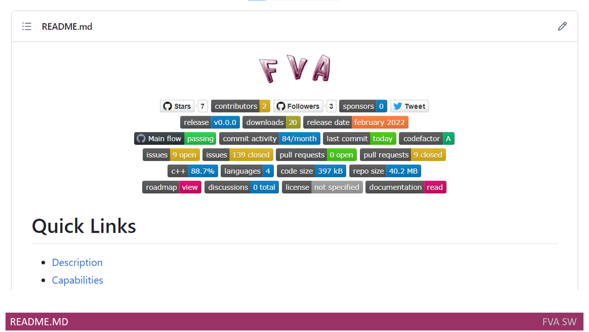
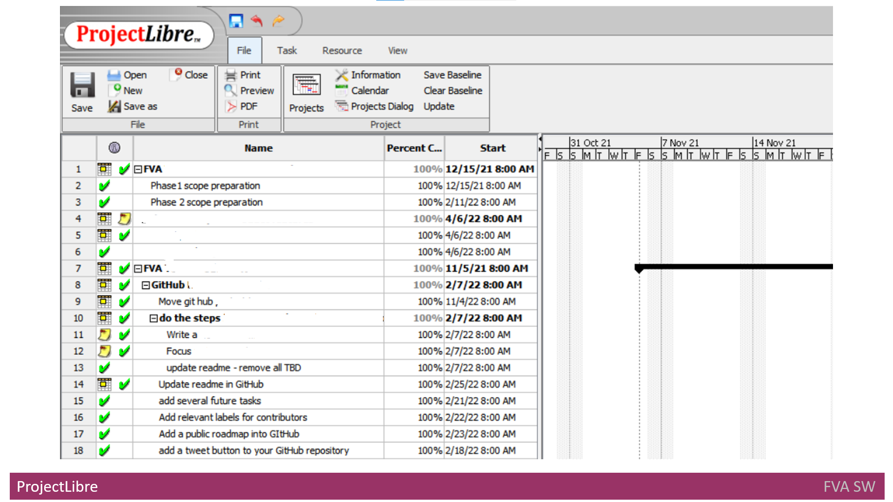

# Headline
What I learned as a Delivery Manager while creating my product
Crafting an Engaging Open-Source Project: A Guide to Elevating Developer Engagement and README Excellence

# Article description
Unlocking Developer Engagement: A Comprehensive Guide to Enhancing Open-Source Projects and Creating Compelling READMEs 

# Tags
Open Source Development, Developer Engagement, README Best Practices, Project Documentation, GitHub Projects, ProjectLibre

First, I began contemplating how to increase engagement with my open-source project. **Why?** Because:

- Developers play a pivotal role in adopting and integrating your product into their projects.
- Engaged developers, who have a positive experience with your product, can become influential advocates.
- They are more likely to explore the extensibility options and customization capabilities of your product.
- Furthermore, engaged developers can offer valuable feedback, suggestions, and bug reports.
- Ultimately, they might actively participate in your product's open-source community, contributing code, reporting issues, and collaborating on its development.

Their contributions can expedite the pace of innovation, foster a sense of ownership and community, and trigger a network effect that entices more developers to get involved.

As a result, I decided to create an appealing **README**.

# Create a Good Readme
[It](https://github.com/dimanikulin/fva#readme) is the first thing that a visitor to your repository sees.
A good **README** serves as a comprehensive and accessible starting point for users and developers to engage with your project.

It should be able to convey what your project is capable of doing, how to install and work with the project, how to contribute, and more.
It also maintains structured information about the product and its implementation details.

To avoid overloading the main **README**, there are several child files created to provide additional details:

- [CodeDocumentation.md](https://github.com/dimanikulin/fva/blob/master/CodeDocumentation.md) - Describes how to document the code.
- [CodeStyle.md](https://github.com/dimanikulin/fva/blob/master/CodeStyle.md)                 - Describes the code style.
- [Constraints.md](https://github.com/dimanikulin/fva/blob/master/Constraints.md)             - Describes the solution constraints.
- [Dependencies.md](https://github.com/dimanikulin/fva/blob/master/Dependencies.md)           - Describes the tools and libraries used for product development.
- [DependenciesOld.md](https://github.com/dimanikulin/fva/blob/master/DependenciesOld.md)     - Describes the old tools and libraries that were used for product development.
- [FunctionalView.md](https://github.com/dimanikulin/fva/blob/master/FunctionalView.md)       - Shows and describes the functional view.
- [QualityAttributes.md](https://github.com/dimanikulin/fva/blob/master/QualityAttributes.md) - Describes the product's Quality Attributes.

Furthermore, my **README starts with the product logo.

## Bages
The **README** then proceeds to badge chapters that prove helpful for developers. These sections include:

- Common(Repository stars, contributors, followers, sponsors, and Twitter URL)
- Release(Latest release version, release date, and number of downloads)
- Code Statistics(Build flow status, GitHub commit activity, GitHub's latest commit, and CodeFactor.io status)
- Issues and Pull Requests(GitHub issues, closed issues, pull requests, and closed pull requests)
- Repository Statistics(GitHub top language, count of languages, and repository size)
- Documentation(Roadmap, Discussions, License, and Main README)

There are three different types of badges based on their implementation approach:

- Implemented by GitHub, displayed as: [GitHub Badge](https://github.com/dimanikulin/fva/actions/workflows/main.yml/badge.svg?branch=master)
- Implemented by img.shields.io, displayed as: [Badge](https://img.shields.io/github/last-commit/dimanikulin/fva)
- Implemented by www.codefactor.io, displayed as: [Badge](https://www.codefactor.io/repository/github/dimanikulin/fva)

## Quick Links
Following this, the **README** transitions to the [Quick Links](https://github.com/dimanikulin/fva#quick-links) chapter.
**Quick links** within a **README** file play a crucial role as they offer convenient access to key sections, resources, or external references relevant to a project.
They act as navigation aids, enabling readers to swiftly navigate to specific parts of the **README** without the need for extensive scrolling or searching.
To enhance accessibility, I've added Quick Links for each main chapter in the [README](https://github.com/dimanikulin/fva#readme).

## Capabilities and Description
The description of [capabilities](https://github.com/dimanikulin/fva#capabilities) and the [product's overview](https://github.com/dimanikulin/fva#description) within a README file holds utmost importance.
It plays a critical role in effectively conveying the value, purpose, and unique selling points of your product.
This description aids users in comprehending what your product brings to the table, why it holds value, and whether it aligns with their requirements.
By presenting information that is both clear and compelling, you can draw in the right audience and increase the likelihood of user adoption and satisfaction.

## Architecture Documentation
Subsequently, the **README** delves into the description of **Architecture Documentation**, encompassing the following chapters:

- [Software Architecture Requirements](https://github.com/dimanikulin/fva#software-architecture-requirements)
- [Software Architecture Views](https://github.com/dimanikulin/fva#software-architecture-views)
- [Tools](https://github.com/dimanikulin/fva#dependencies), Libraries and [Programming Languages](https://github.com/dimanikulin/fva#programming-languages)
- [Licenses](https://github.com/dimanikulin/fva#license)

For more detailed information, please refer to the designated [section](./WhatILearnedAsAppArchitect.md).

## Code Style and Documentation
The **README** then proceeds to expound upon [Code Style](https://github.com/dimanikulin/fva#code-style) and [Documentation](https://github.com/dimanikulin/fva#code-documentation).
The act of documenting code style and practices serves as a linchpin for maintaining consistency, upholding code quality, fostering collaboration, and ensuring the project's long-term maintainability. 
It acts as a valuable resource for the development team, guaranteeing that the project's codebase retains organization, comprehensibility, and scalability.

Should you require further information, feel free to explore the section dedicated to **Code Style** and **Documentation**.

## Implementation Status
Subsequently, I contemplated an effective means to monitor the [coverage](https://github.com/dimanikulin/fva#implementation-status) of requirements.
It was essential to establish a method for tracing and discerning which requirements had been covered and which ones remained unaddressed. 
To tackle this, I formulated a table equipped with the following columns:

- **Implemented**: This column denotes whether the requirement has been implemented, denoted as either "yes" or "no."
- **Feature ID**: This serves as an identifier originating from the project's features.
- **Component**: This field specifies the name of the corresponding component.
- **File Names**: Here, the file names are enumerated where the implementation pertaining to the requirement can be located.
- **Description**: This column furnishes a descriptive account of the functional requirement.

## Contributing and Stay in Touch
In this section, I outline the various channels that individuals can utilize to contribute to the project's development.
This includes information on how one can actively participate and offer their assistance.

## Definitions, Acronyms, Abbreviations
Lastly, I provide an explanation of **Definitions, Acronyms, and Abbreviations**.
Presented in a tabular format, this section comprises the following columns:
- **Number**
- **Abbreviation or Acronym**
- **Definition**

# Project Status Tracking
In a broader perspective, monitoring the project's status holds immense significance for a **Delivery Manager**. 
This practice ensures the triumph of the project by overseeing factors such as risk management, resource allocation, effective communication, and the ability to make well-informed decisions across the entirety of the project's lifecycle.

## GitHub Projects
**GitHub Projects** emerges as a tool dedicated to tracking project status in an online environment, seamlessly integrated into your **GitHub** profile. 
Its user-friendly interface facilitates ease of use, and while it doesn't offer an extensive array of functions, it adeptly serves its purpose. 
Allow me to present [it](https://github.com/dimanikulin/fva/projects/3)

## ProjectLibre

Despite the aforementioned options, the demand for a more sophisticated solution persisted.
In light of this, my preference leaned towards [ProjectLibre](https://www.projectlibre.com/product/1-alternative-microsoft-project-open-source).
The ProjectLibre software, designed for desktop usage, presents itself as a comprehensive and open-source project management system.
Positioned as a stand-alone substitute for **Microsoft Project**, **ProjectLibre** effectively addresses the intricate requirements I sought.

Despite its stature as a compact and cost-free application, **ProjectLibre** remarkably delivered everything essential for my needs.

# Releasing the Code and Documentation
The release of the product is strategically planned to coincide with the readiness of a substantial portion of its functionality.
Whenever a segment of the product's functionality is deemed ready for release, the creation or updating of the release branch ensues.
This practice ensures that any added or updated product functionality is seamlessly integrated into the release branch.

Irrespective of adopting an incremental approach to the addition or update of product functions, it's pivotal to underscore that the resulting artifacts shall encompass the entirety of the product installation packages.
This holds true even when releasing relatively minor components of functionality.

In adherence to this approach, the ensuing artifacts are generated:

- Documentation for the code, structured around doxy comments.
- Installation packages for the latest versions of **Windows, Mac, and Linux**.

# References
| # | Name                 | Source           | Release date           |  Author                 | Description |
| - | ---------------------|---------------------- |----------------------- | ----------------------- |:-------------:|
| 1 | Getting started with project planning on GitHub| [Web](https://github.blog/2022-02-11-getting-started-with-project-planning-on-github/) |2022-02-11 | GitHub | |
| 2 | How to get more engagement with your open source project| [freecodecamp](https://www.freecodecamp.org/news/how-to-get-more-engagement-with-your-open-source-project/) | JANUARY 26, 2022 | navaneeth pk |Best practices to get more stars on your GitHub repos|