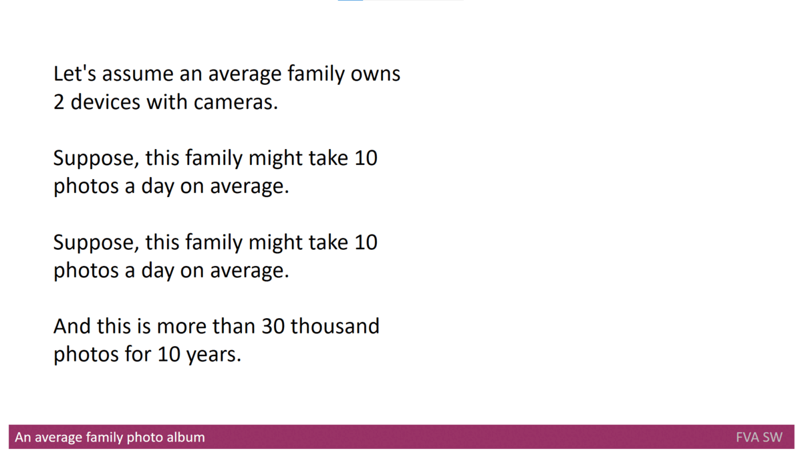
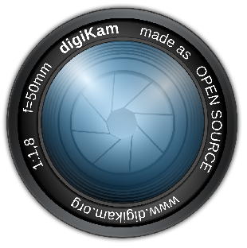

# Headline
TBD

# Why I decided to create my photo organizer?
In this article, the author shares their personal experience of managing a growing photo album in the digital age.
They highlight the challenges they faced in searching and organizing multimedia data and their quest to find a suitable multimedia information retrieval (IR) system.
The author also discusses their journey of creating their own multimedia organizer to address their needs and the challenges they encountered along the way. 

# Table of contents
- [Tags](https://github.com/dimanikulin/dimanikulin/blob/main/WhyCreatedPhotoOrganizer.md#tags)
- [Definitions, Acronyms, Abbreviations](https://github.com/dimanikulin/dimanikulin/blob/main/WhyCreatedPhotoOrganizer.md#definitions-acronyms-abbreviations)
- [References](https://github.com/dimanikulin/dimanikulin/blob/main/WhyCreatedPhotoOrganizer.md#references)

# Tags
Multimedia data, Photo album, Multimedia information retrieval (IR) systems, Multimedia organizer, Metadata

# Definitions, Acronyms, Abbreviations
| # | Abbreviation or Acronym | Definition     |
| - | ------------------------|:--------------:|
| 1 | [Synology Moments](https://www.synology.com/en-global/dsm/feature/moments)|It gathers all your photos and videos in one private place and organize them in an entirely new way. Synology Moments is the brand-new photo solution for personal and home use, offering a modern browsing experience with the image recognition technique. |
| 2 | [metadata](https://en.wikipedia.org/wiki/Metadata)|Metadata is "data that provides [information](https://en.wikipedia.org/wiki/Information) about other data". In other words, it is "data about data." Many distinct types of metadata exist, including descriptive metadata, structural metadata, administrative metadata, reference metadata and statistical metadata. |
| 3 | Multimedia IR| Multimedia Information Retrieval (MIR) is an organic system made up of Text Retrieval (TR); Visual Retrieval (VR); Video Retrieval (VDR); and Audio Retrieval (AR) systems. So that each type of digital document may be analyzed and searched by the elements of language appropriate to its nature, search criteria must be extended.|
| 4 | [Multimedia data](https://link.springer.com/referenceworkentry/10.1007%2F978-0-387-39940-9_1008)| Multimedia in principle means data of more than one medium. It usually refers to data representing multiple types of medium to capture information and experiences related to objects and events. Commonly used forms of data are numbers, alphanumeric, text, images, audio, and video. In common usage, people refer a data set as multimedia only when time-dependent data such as audio and video are involved.|
| 5 | [digiKam](https://www.digikam.org/about/)|digiKam is an advanced open-source digital photo management application that runs on Linux, Windows, and MacOS. The application provides a comprehensive set of tools for importing, managing, editing, and sharing photos and raw files. |

# Overview
TBD 

---

As a child, I used to flip through a family photo album to see my relatives whom I had not seen in real life.
At that time we had film cameras only, so the number of photos was not so large.
Time has passed and currently, let's say, almost everyone owns a camera or a smartphone with a camera, or even both.
Given that, the size of my photo album increased significantly. However, I think it's not just for me.

Once my friend and I decided to recall an event we both attended. We took my photo album and tried to search there. 
At that time my album kept more than 30 thousand items inside. That search process looked like

Of course, we didn't find anything. Therefore, I started looking for a solution to be able to search in [Multimedia Data](./MultimediaData.md) automatically. 
The solution I found were [Multimedia IR Systems](./MultimediaIRSystems.md). 

I decided to use [digiKam](https://www.digikam.org/)  as Offline [Multimedia IR systems](./MultimediaIRSystems.md) 
and [Synology Moments](https://www.synology.com/en-global/dsm/feature/moments)  as Online [Multimedia IR systems](./MultimediaIRSystems.md).
Please note, that they were selected solely based on the author's criteria, and there is no aim to advertise to anyone.

Then I started using it... 

What I discovered in a flash is that current [Multimedia IR systems](./MultimediaIRSystems.md) do not provide a flexible and automated functionality to import [Multimedia Data](./MultimediaData.md) into [Multimedia IR systems](./MultimediaIRSystems.md).

But that wasn't the only problem.

I realized that I need [Multimedia Organizer](./MultimediaOrganizers.md) as well.
Unfortunately, I didn't find a [Multimedia Organizer](./MultimediaOrganizers.md) that could fully satisfy my needs (fixing problem metadata, working with **digiKam** and **Synology** etc.)
That's why I started creating my [product](https://github.com/dimanikulin/fva) to cover my needs. 

Honestly, I didn't expect that it would be so hard and in the meantime so interesting.

# References
| # | Name                 | Source                | Release date           |  Author                 | Description   |
| - | ---------------------|---------------------- |----------------------- | ----------------------- |:-------------:|
| 1 | What is multimedia data?|[repo](./MultimediaData.md)| 2022            | Dmytro Nikulin |  |
| 2 | What are Multimedia IR systems?|[repo](./MultimediaIRSystems.md)|2022 | Dmytro Nikulin |  |
| 3 | Multimedia IR systems Analyze|[repo](./MultimediaIRSystemsAnalyze.md)|2022| Dmytro Nikulin |  |
| 4 | What are MultimediaOrganizers?|[repo](./MultimediaOrganizers.md)|2022 | Dmytro Nikulin | |
| 5 | 26 Best Photo Organizer Software and Apps of 2022 |[Web](https://www.pixpa.com/blog/photo-organiser)| Jun 25, 2021    | Anisha Singh   | |
| 6 | Independent Course for Organizing Your Digital Photos |[Web](https://www.organizepictures.com/organize-digital-photos-course)| 2021        | organizepictures | |
| 7 | Image organizer      |[Web](https://en.wikipedia.org/wiki/Image_organizer)|                        | Wikipedia      | |
| 8 | Best Photo Management Software to Organize Digital Photos in 2022 |[Web](https://wethegeek.com/best-photo-management-software-organize-photos/)| 2021-12-17 | Mansi Vijay ||
| 9 | Photo organizer |[Web](https://github.com/topics/photo-organizer)| | GitHub ||
