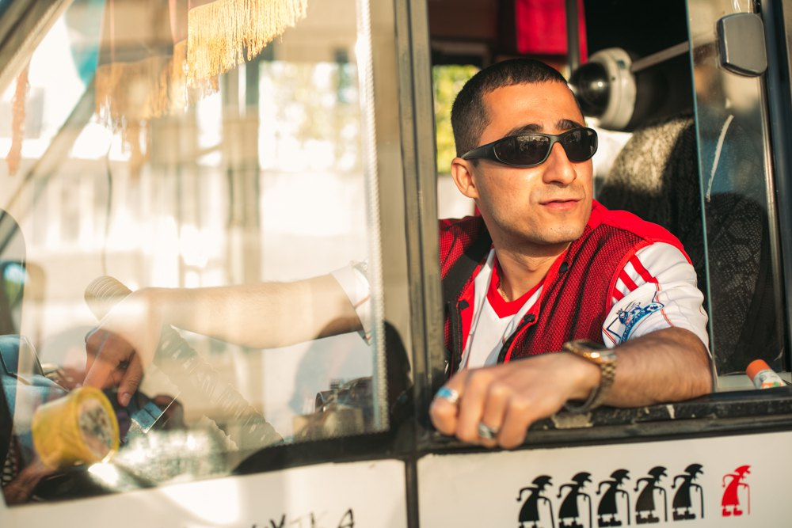
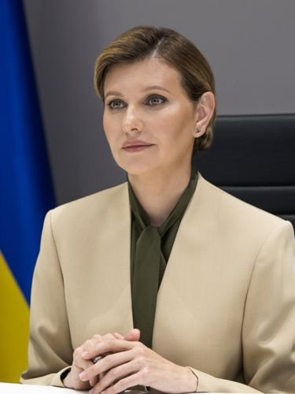
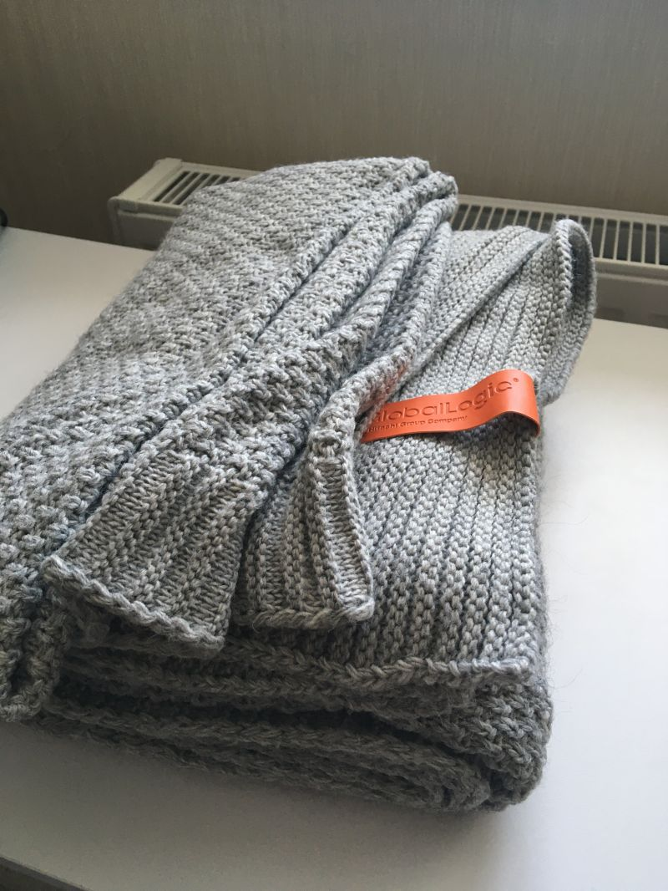
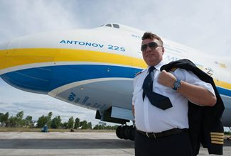
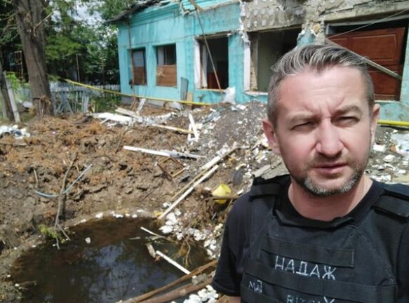
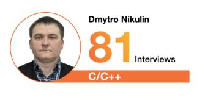

# Headline
Working in GL

# Table of contents
- [Tags](./WorkInGL.md#tags)
- [Overview](./WorkInGL.md#overview)
- [Presents in GlobalLogic for an employer](./WorkInGL.md#presents-in-globallogic-for-an-employer)
- [Tags](./WorkInGL.md#tags-1)
- [Cool people create cool music!](./WorkInGL.md#cool-people-create-cool-music)
- [Taras Chmut and GlobalLogic](./WorkInGL.md#taras-chmut-and-globallogic-)
- [Tags](./WorkInGL.md#tags-2)
- [Top Interviewer in Kyiv in C/C++](./WorkInGL.md#top-interviewer-in-kyiv-in-cc)
- [7000 people in GL Ukraine](./WorkInGL.md#7000-people-in-gl-ukraine)
- [Tags](./WorkInGL.md#tags-3)
- [Люксембург, Люксембург](./WorkInGL.md#%D0%BB%D1%8E%D0%BA%D1%81%D0%B5%D0%BC%D0%B1%D1%83%D1%80%D0%B3-%D0%BB%D1%8E%D0%BA%D1%81%D0%B5%D0%BC%D0%B1%D1%83%D1%80%D0%B3)
- [Олена Зеленська](./WorkInGL.md#%D0%BE%D0%BB%D0%B5%D0%BD%D0%B0-%D0%B7%D0%B5%D0%BB%D0%B5%D0%BD%D1%81%D1%8C%D0%BA%D0%B0)
- [A white paper on GlobalLogic Insights](./WorkInGL.md#a-white-paper-on-globallogic-insights)
- [Tags](./WorkInGL.md#tags-4)
- [Олена Зеленська 2](./WorkInGL.md#%D0%BE%D0%BB%D0%B5%D0%BD%D0%B0-%D0%B7%D0%B5%D0%BB%D0%B5%D0%BD%D1%81%D1%8C%D0%BA%D0%B0-2)
- [Tags](./WorkInGL.md#tags-5)
- [Presents in GlobalLogic for an employer 2](./WorkInGL.md#presents-in-globallogic-for-an-employer-2)
- [Tags](./WorkInGL.md#tags-6)
- [Дмитро Антонов](./WorkInGL.md#%D0%B4%D0%BC%D0%B8%D1%82%D1%80%D0%BE-%D0%B0%D0%BD%D1%82%D0%BE%D0%BD%D0%BE%D0%B2)
- [Сергій Жадан](./WorkInGL.md#%D1%81%D0%B5%D1%80%D0%B3%D1%96%D0%B9-%D0%B6%D0%B0%D0%B4%D0%B0%D0%BD)
- [Interview number](./WorkInGL.md#interview-number)
- [Trusted Interviewers](./WorkInGL.md#top-interviewer-in-kyiv-in-cc-1)
- [Tags](./WorkInGL.md#tags-7)
- [References](./WorkInGL.md#references)

# Tags
GlobalLogic Work

# Overview
In this article, the author expresses gratitude to GlobalLogic for their thoughtful birthday presents over the years.
The significance of these gifts is highlighted in the context of recent events related to war.
The author also shares insights into interactions with notable individuals, including Olena Zelenska, and provides a link to a white paper discussing software architecture and design.
Additionally, the article touches on the mental health program 'Ти як?', featuring Olena Zelenska.
The content reflects the author's appreciation for GlobalLogic's support and their personal experiences. 

---

# Presents in GlobalLogic for an employer 
Each year in GlobalLogic an employer gets the present for birthday.
I have got following 5:
- Backpack;
- Multitool knife;
- Belt bag;
- Power bank;
- Bottle for water.

This year I realized their value especially in terms of war.

Thank you GlobalLogic for taking care of me in advance!

P.S. Here I meant GL Ukraine.

## Tags
ukraine, war

# Cool people create cool music!

https://www.youtube.com/watch?v=KFLl5cD9zp0

# Taras Chmut and GlobalLogic )))

## Tags
warinukraine

#  Top Interviewer in Kyiv in C/C++
I won't get frozen this winter because I have got this present from GlobalLogic as a Top Interviewer in Kyiv in C/C++

# 7000 people in GL Ukraine

## Tags
GlobalLogicUkraine 

# Люксембург, Люксембург
Вгадайте, що за фільм.

Якби у вас була можливість, то що б ви запитали режисера та акторів цього фільму?

П.С. У коментарях відповідь.

18 травня до GlobalLogic Ukraine в гості завітали режисер Антоніо Лукіч та учасники реп-гурту "Курган і Agregat" – брати Раміл та Аміл Насирови.
Цей творчий союз цього року подарував нам фільм "Люксембург, Люксембург"

# Олена Зеленська

Якби у вас була така можливість, то що б ви запитали у Олени Зеленської?

# A white paper on GlobalLogic Insights
I have just published a white paper on [Globallogic Insights](https://www.globallogic.com/insights/white-papers/detecting-architectural-gaps-with-automation/)

In this paper, I delve into various manual architecture review methods and propose automated alternatives that not only reduce the time and resources required but also yield better outcomes.

You will gain insights into:

- Understanding architecture drift and erosion and their impact on business.
- Exploring the workings of dependency analysis, peer reviews, and other manual inspections.
- Recognizing the limitations of manual reviews as they may not address issues that arise despite adhering to best practices in architecture governance.
- Considering specific factors related to compliance, data security, DevOps, and more when evaluating architecture review solutions.
- Examining example use case scenarios to visualize the automation of architecture checks.

I would like to extend my special thanks to Orkhan Gasimov for his valuable assistance!

Enjoy your reading experience!

## Tags
whitepaper softwarearchitecture softwaredesign

# Олена Зеленська 2
Нещодавно співробітники GlobalLogic Ukraine мали нагоду поспілкуватися з Першою Леді, Оленою Зеленською, Оксаною Збітнєвою та Олегом Романчуком, експертами Програми “Ти як?”

Могли заздалегідь поставити запитання щодо програми “Ти як?”.

Мені особисто спілкування сподобалося корисністю та форматом.

https://www.facebook.com/olenazelenska.official/posts/pfbid025TUqBC1FcR1CnMt3eGDS8JHx9eXwJAnQDDRbrm9KomuZ3D62DLgdDbSHQMWh6ev4l

## Tags
mentalhealth mentalhealthsupport zelensky

# Presents in GlobalLogic for an employer 2 
Each year in GlobalLogic an employer gets the present for birthday.

I have got following 6:
- Backpack;
- Multitool knife;
- Belt bag;
- Power bank;
- Bottle for water;
- Blanket.

I value it especially in terms of war, and thank GlobalLogic for taking care of me.

P.S. Here I meant GL Ukraine.

## Tags
ukraine, war

# Дмитро Антонов 

Якби у вас була така можливість, то що б ви запитали у Дмитра Антонова, пілота Авіаційно-наукового Технічного Комплексу АНТОНОВ?

# Сергій Жадан
Якби у вас була така можливість, то що б ви запитали у Сергія Жадана:
письменника, волонтера, музиканта, засновника благодійного фонду, популяризатора міста-сонця Харкова в цілому та району ХТЗ зокрема?

# Interview number
or **Top Interviewer in Kyiv in C/C++, 2022**

Do you think 81 interviews per year is a lot?

I feel like no, it is about 1.5 interviews in a week only.

And this year (the same as previous one) I was nominated as a Top Interviewer in Kyiv in C/C++ with 81 interviews.

In 2022 it was quite the same

# Top Interviewer in Kyiv in C/C++
Third time in a row, I have been nominated as a Top Interviewer in Kyiv for C/C++.

This year, I conducted 56 interviews in 2023, averaging one interview per week.

## Tags
interview award

# References
| # | Name                 | Source                | Release date           |  Author                 | Description   |
| - | ---------------------|---------------------- |----------------------- | ----------------------- |:-------------:|
| 1 | Presents in GlobalLogic for an employer | [LinkedIn](https://www.linkedin.com/posts/dimanikulin_ukraine-war-globallogic-activity-6942043429455458304-eXr4?utm_source=share&utm_medium=member_desktop) | 01/06/2022 | Dmytro Nikulin | |
| 2 | Cool people create cool music! | [LinkedIn](https://www.linkedin.com/posts/dimanikulin_%D1%89%D0%B5%D0%B4%D1%80%D0%B8%D0%BA-carol-of-the-bells-globallogic-edition-activity-7011336761649836032-IGHe?utm_source=share&utm_medium=member_desktop)| 01/06/2022 | Dmytro Nikulin | |
| 3 | Carol of the Bells GlobalLogic Edition | [YouTube](https://www.youtube.com/watch?v=KFLl5cD9zp0) | 01/12/2022 | Dmytro Nikulin | |
| 4 | Taras Chmut and GlobalLogic | [LinkedIn](https://www.linkedin.com/posts/dimanikulin_globallogic-warinukraine-activity-6975103190170042368-br-O?utm_source=share&utm_medium=member_desktop)| 01/10/2022 | Dmytro Nikulin | |
| 5 | Top Interviewer in Kyiv in C/C++, 2021 | [LinkedIn](https://www.linkedin.com/posts/dimanikulin_globallogic-activity-6894337668830822401-iBcr?utm_source=share&utm_medium=member_desktop) | 01/01/2022 | Dmytro Nikulin | |
| 6 | GlobalLogicUkraine7000 | [LinkedIn](https://www.linkedin.com/posts/dimanikulin_7000-reasons-to-care-activity-6862097076923232257-iOMQ?utm_source=share&utm_medium=member_desktop)  | 01/12/2021 | Dmytro Nikulin | |
| 7 | Люксембург, Люксембург | [LinkedIn](https://www.linkedin.com/posts/dimanikulin_globallogic-activity-7067761572093247488-7J4Y?utm_source=share&utm_medium=member_desktop) | 26/05/2023 | Dmytro Nikulin | |
| 8 | A white paper on GlobalLogic Insights| [LinkedIn](https://www.linkedin.com/posts/dimanikulin_detecting-architectural-gaps-with-automation-activity-7073919594154868738-CpcR?utm_source=share&utm_medium=member_desktop)  | 09/06/2023 | Dmytro Nikulin | |
| 9 | Олена Зеленська | [LinkedIn](https://www.linkedin.com/posts/dimanikulin_%D1%8F%D0%BA%D0%B1%D0%B8-%D1%83-%D0%B2%D0%B0%D1%81-%D0%B1%D1%83%D0%BB%D0%B0-%D1%82%D0%B0%D0%BA%D0%B0-%D0%BC%D0%BE%D0%B6%D0%BB%D0%B8%D0%B2%D1%96%D1%81%D1%82%D1%8C-%D1%82%D0%BE-%D1%89%D0%BE-%D0%B1-activity-7094210810255675392-Cj5E?utm_source=share&utm_medium=member_desktop ) | 07/08/2023 | Dmytro Nikulin | |
| 10| Олена Зеленська2 | [LinkedIn](https://www.linkedin.com/posts/dimanikulin_%D0%BE%D0%BB%D0%B5%D0%BD%D0%B0-%D0%B7%D0%B5%D0%BB%D0%B5%D0%BD%D1%81%D1%8C%D0%BA%D0%B0-%D0%B4%D0%B1%D0%B0%D1%82%D0%B8-%D0%BF%D1%80%D0%BE-%D0%BC%D0%B5%D0%BD%D1%82%D0%B0%D0%BB%D1%8C%D0%BD%D0%B5-%D0%B7%D0%B4%D0%BE%D1%80%D0%BE%D0%B2-activity-7101818614164389889-NNuc?utm_source=share&utm_medium=member_desktop) | 28/08/2023 | Dmytro Nikulin | |
| 11| Presents in GlobalLogic for an employer 2 | [LinkedIn](https://www.linkedin.com/posts/dimanikulin_ukraine-war-globallogic-activity-7104355502528077825-Afg6?utm_source=share&utm_medium=member_desktop) | 04/09/2023 | Dmytro Nikulin | |
| 12| Дмитро Антонов | [LinkedIn](https://www.linkedin.com/posts/dimanikulin_%D1%8F%D0%BA%D0%B1%D0%B8-%D1%83-%D0%B2%D0%B0%D1%81-%D0%B1%D1%83%D0%BB%D0%B0-%D1%82%D0%B0%D0%BA%D0%B0-%D0%BC%D0%BE%D0%B6%D0%BB%D0%B8%D0%B2%D1%96%D1%81%D1%82%D1%8C-%D1%82%D0%BE-%D1%89%D0%BE-%D0%B1-activity-7122467952146153472-vlmd?utm_source=share&utm_medium=member_desktop) | 24/10/2023 | Dmytro Nikulin | | 
| 13| Сергій Жадан | [LinkedIn](https://www.linkedin.com/posts/dimanikulin_warinukraine-activity-7138062207447138304-r2jI?utm_source=share&utm_medium=member_desktop) | 06/12/2023 | Dmytro Nikulin | |
| 14| Top Interviewer in Kyiv in C/C++, 2022 | [LinkedIn](https://www.linkedin.com/posts/dimanikulin_globallogic-interviewer-cplusplus-activity-7038422433585860608-Tr0W?utm_source=share&utm_medium=member_desktop) | 01/03/2023 | Dmytro Nikulin | |
| 15| Top Interviewer in Kyiv in C/C++, 2023 | [LinkedIn](https://www.linkedin.com/posts/dimanikulin_globallogic-interview-award-activity-7150529520310087681-ya3A?utm_source=share&utm_medium=member_desktop) | 01/01/2024 | Dmytro Nikulin | |