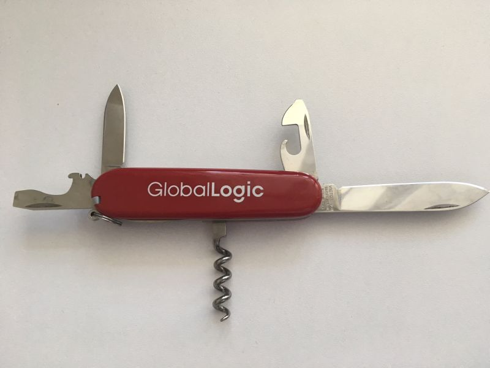

# Headline
TBD

# Article description
TBD 

# Tags
globallogic

# Content
## Presents in GlobalLogic for an employer 
Each year in GlobalLogic an employer gets the present for birthday.
I have got following 5:
- Backpack;
- Multitool knife;
- Belt bag;
- Power bank;
- Bottle for water.

This year I realized their value especially in terms of war.

Thank you GlobalLogic for taking care of me in advance!

P.S. Here I meant GL Ukraine.

### Tags
ukraine, war

## Cool people create cool music!

https://www.youtube.com/watch?v=KFLl5cD9zp0

## Taras Chmut and GlobalLogic )))

### Tags
warinukraine

##  Top Interviewer in Kyiv in C/C++
I won't get frozen this winter because I have got this present from GlobalLogic as a Top Interviewer in Kyiv in C/C++

## 7000 people in GL Ukraine

### Tags
GlobalLogicUkraine 

# References
| # | Name                 | Source                | Release date           |  Author                 | Description   |
| - | ---------------------|---------------------- |----------------------- | ----------------------- |:-------------:|
| 1 | Presents in GlobalLogic for an employer | [LinkedIn](https://www.linkedin.com/posts/dimanikulin_ukraine-war-globallogic-activity-6942043429455458304-eXr4?utm_source=share&utm_medium=member_desktop) | June, 2022 | Dmytro Nikulin | |
| 2 | Cool people create cool music! | [LinkedIn](https://www.linkedin.com/posts/dimanikulin_%D1%89%D0%B5%D0%B4%D1%80%D0%B8%D0%BA-carol-of-the-bells-globallogic-edition-activity-7011336761649836032-IGHe?utm_source=share&utm_medium=member_desktop)| June, 2022 | Dmytro Nikulin | |
| 3 | Carol of the Bells GlobalLogic Edition | [YouTube](https://www.youtube.com/watch?v=KFLl5cD9zp0) | December 2022 | Dmytro Nikulin | |
| 4 | Taras Chmut and GlobalLogic | [LinkedIn](https://www.linkedin.com/posts/dimanikulin_globallogic-warinukraine-activity-6975103190170042368-br-O?utm_source=share&utm_medium=member_desktop)| October 2022 | Dmytro Nikulin | |
| 5 | Top Interviewer in Kyiv in C/C++ | [LinkedIn](https://www.linkedin.com/posts/dimanikulin_globallogic-activity-6894337668830822401-iBcr?utm_source=share&utm_medium=member_desktop) | January 2022 | Dmytro Nikulin | |
| 6 | GlobalLogicUkraine7000 | [LinkedIn](https://www.linkedin.com/posts/dimanikulin_7000-reasons-to-care-activity-6862097076923232257-iOMQ?utm_source=share&utm_medium=member_desktop)  | December 2021 | Dmytro Nikulin | |

# Definitions, Acronyms, Abbreviations
TBD
