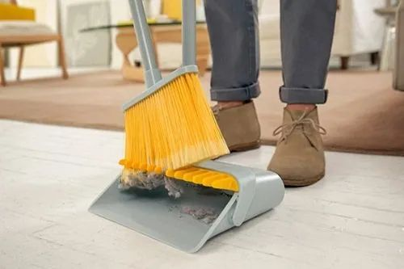

# Headline
Work-life Balance

# Table of contents
- [Tags](https://github.com/dimanikulin/dimanikulin/blob/main/WorkLifeBalance.md#tags)
- [Overview](https://github.com/dimanikulin/dimanikulin/blob/main/WorkLifeBalance.md#overview)
- [Playing chess](https://github.com/dimanikulin/dimanikulin/blob/main/WorkLifeBalance.md#playing-chess)
- [Insurance case](https://github.com/dimanikulin/dimanikulin/blob/main/WorkLifeBalance.md#insurance-case)
- [What does work-life balance mean for you?](https://github.com/dimanikulin/dimanikulin/blob/main/WorkLifeBalance.md#what-does-work-life-balance-mean-for-you)
- [Tags](https://github.com/dimanikulin/dimanikulin/blob/main/WorkLifeBalance.md#tags-1)
- [Playing chess 2](https://github.com/dimanikulin/dimanikulin/blob/main/WorkLifeBalance.md#playing-chess-2)
- [Cleanup](https://github.com/dimanikulin/dimanikulin/blob/main/WorkLifeBalance.md#cleanup)
- [Tags](https://github.com/dimanikulin/dimanikulin/blob/main/WorkLifeBalance.md#tags-2)

Cleanup

- [Definitions, Acronyms, Abbreviations](https://github.com/dimanikulin/dimanikulin/blob/main/WorkLifeBalance.md#definitions-acronyms-abbreviations)
- [References](https://github.com/dimanikulin/dimanikulin/blob/main/WorkLifeBalance.md#references)

# Tags
wellbeing worklifebalance workload relaxation Chess MedicalInsurance

# Overview
TBD 

---

# Playing chess
What do I usually do to switch context and relax before engaging in the next brain activity?
I play chess!
You might wonder, but moving the chess pieces from one cell to another helps me relax.

And I have noticed a direct correlation between the amount of glucose I consume and the number of chess games I win. It seems that the more sugar I consume, the more successful I am in chess.

Now, I'm curious to know what you do to employ a similar approach?

# Insurance case
Про страхову медицину – бо наболіло.

Спершу історія.

У мене була ранка незагойна неглибока, яка почалася з маленької подряпини.
На жаль, вона поступово розширювалася, мабуть тому, що потрапила ззовні якась активна речовина.
При чому інші ранки гоїлися, а ця ні.
Довелося звернутися до страхової за медичною страховкою.

Я припускав, що страхові повинні рекомендувати прості рішення, щоб заощадити гроші страховий і мені час.
І коли дзвонив у страхову, думав, що зараз направлять до дерматолога.
Та ні. Іди до терапевта або до хірурга, на вибір - сказала страхова.
Справа в тому, що у медиків і у страховиків є протоколи - алгоритми постановки діагнозу та методи лікування.

Терапевт поставила досить серйозний діагноз – виразка.
Ну що б переконається, рекомендувала піти до хірурга. Ну що б не закопали швидше, ніж потрібно)
Хірург сказав, що не все так погано – локальне зараження шкіри.
Але щоб переконатися в діагнозі, потрібно йти, еврика, до дерматолога.
Дерматолог підтверджує діагноз та дає простенький, але ефективний крем.

Крем за два-три дні все лікує і через 2 тижні мені вже потрібно постаратися, щоб знайти де була ранка.
Принагідно дерматолог рекомендує ще здати 100 500 аналізів і піти до ендокринолога.

Підсумок для страхової: Мені оплачені 4 лікарі та купа аналізів. Міг бути один лікар і менше аналізів.
Підсумок для мене: Зрозумів, що протокольність – не тільки добре, але ще й погано)

Ну тобто, нежить лікаря плюс мінус можуть лікувати без зайвих відвідувань медичних установ, але якщо трохи складніше - готуйся до квестів:
- А давай спробуємо ось це, і ще ось це, і трохи ось це.
- Ну якщо не працює, то тоді це, це і це.
- Нічого не спрацювало? Ну тоді йди до іншого лікаря.

Я розумію, що при всій технічності та розвиненості медицини, досі існує багато хвороб, які і лікувати важко і діагностувати причину теж.
Наприклад, у 2020 році я здавав аналіз, формулу якого знайшли лише у 2017. Тобто аналізу було лише 3 роки.
З одного боку ми там робимо заміну серця та нирок, лазимо по судинах, підключаємося до мозку та нервів.
І на тобі шукали так довго хімічну формулу.

Можливо, в деяких інших країнах інакше.

А Ви маєте аналогічний досвід?

# What does work-life balance mean for you?

In the options, 'W&P' equals to 'Work And Personal'

- Boundaries for W&P lives - **21%**
- W&P lives don't dominate other - **4%**
- Scheduling for both W&P lives - **4%**
- Physical and mental health - **71%**

28 votes

## Tags
wellbeing insurance medicalcare

# Playing chess 2

How do you know when to stop fighting in a game or sport with an opponent to avoid wasting time if you keep losing?

If I start winning, I keep going until I lose. If I lose once, I propose a rematch just to check if the loss was not just random.
And yes, when I start competing, I am prepared beforehand to lose, just in case.

# Cleanup
I have a somewhat strange habit that I would describe as 'cleaning the environment.'
From time to time, I perform clean-ups of my working and personal environments. 

Why? It makes my environments more searchable and structured. What do I mean by 'environments'? It could be anything - data on hard drives, items on the table, clothes, etc.

Do you have the same habit?

## Tags
habits cleaningmotivation cleanbeauty 

# References
| # | Name                 | Source                | Release date           |  Author                 | Description   |
| - | ---------------------|---------------------- |----------------------- | ----------------------- |:-------------:|
| 1 | Playing chess        |[LinkedIn](https://www.linkedin.com/posts/dimanikulin_worklifebalance-workload-relax-activity-7084787080802836480-jGcU?utm_source=share&utm_medium=member_desktop) | 12/07/2023 | Dmytro Nikulin | |
| 2 | Insurance case       |[LinkedIn](https://www.linkedin.com/posts/dimanikulin_wellbeing-insurance-medicalcare-activity-7106889450810449920-rtpf?utm_source=share&utm_medium=member_desktop) | 11/09/2023 | Dmytro Nikulin |
| 3 | What does work-life balance mean for you? | [LinkedIn](https://www.linkedin.com/posts/dimanikulin_activity-7117415823085907968-RXT3?utm_source=share&utm_medium=member_desktop) | 10/10/2023 | Dmytro Nikulin |
| 4 | Playing chess 2      |[LinkedIn](https://www.linkedin.com/posts/dimanikulin_wellbeing-chess-relaxation-activity-7163062724321558528-w9IV?utm_source=share&utm_medium=member_desktop)  | 13/02/2024 | Dmytro Nikulin |
| 5 | Cleanup              |[LinkedIn](https://www.linkedin.com/posts/dimanikulin_habits-cleaningmotivation-cleanbeauty-activity-7165619939620458496-idtD?utm_source=share&utm_medium=member_desktop) | 20/02/2024 | Dmytro Nikulin |