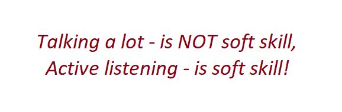

## Active Listening

Is "talking a lot" a soft skill? Nope.

I have seen a lot of people who think "talking a lot" is a soft skill.

Literally, an ability to communicate is soft skill and communication consists of 2 points: how you give information and how you receive information.

When you speak a lot you do not listen and so you don't receive information.

### Tags
communication softskills activelistening