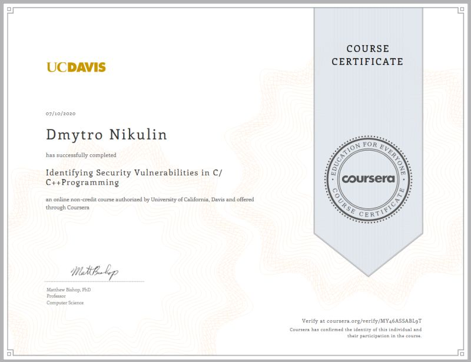

## Coursera Certificates

During education in NAUKMA, we were given free access to https://www.coursera.org/ and so we could choose any from 5K cources. I liked following ones:

| # | Name                                                     | Issued   | Credential ID |
| - | -------------------------------------------------------- |--------- |:-------------:|
| 1 | Data Structures and Algorithms-Algorithmic Toolbox       |          |               |
| 2 | Embedded Software and Hardware Architecture              | Jun 2020 | VTMJWCL8KW7N  |
| 3 | Enterprise Architecture                                  | Jul 2020 | NJSWYS74R3XZ  |
| 4 | Identifying Security Vulnerabilities in C-C++Programming | Jul 2020 | MY46ASSABL9T  |
| 5 | I/O-efficient algorithms                                 | Jul 2020 | 6ZV294TY7Q29  |
| 6 | Linux for Developers                                     | Jul 2020 | E8898ZRGEGTE  |
| 7 | Linux Tools for Developers                               | Aug 2020 | TJNUX7X9N5U2  |
| 8 | Structuring Machine Learning Projects                    | Jul 2020 | PD4MQFF47WLJ  |
| 9 | Version Control with Git                                 | Jun 2020 | X3MLKP3PMQGB  |
| 10| [Business Implications of AI: A Nano-course](./Images/CourseraCertificate1.jpg)         | Jul 2020 | LE48SG9295TU  |
    
### Business Implications of AI: A Nano-course

### Version Control with Git

### Structuring Machine Learning Projects

### Certificate from Coursera - Linux Tools for Developers

### Certificate from Coursera - Linux for Developers

### Certificate from Coursera - I/O-efficient algorithms

### Certificate from Coursera - Identifying Security Vulnerabilities in C/C++ Programming

### Certificate from Coursera - Enterprise Architecture

### Certificate from Coursera - Embedded Software and Hardware Architecture

### Tags
Coursera Certificate