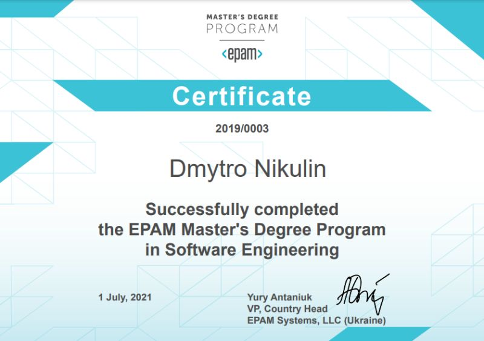

## Certificates EPAM
Master's Program / EPAM SCHOOL of Digital Engineering
### I have got EPAM MSDP Certificate.

### There were 7 modules following

### All MSDP certificates for all modules

- Engineering Excellence 360, Issued Nov 2019
- Product Management, Issued Jan 2020
- Solution Architecture 1.0, Issued Apr 2020
- Delivery Management 1.0, Issued Jun 2020
- Big Data Basic, Issued Oct 2020
- Big Data Advanced, Issued Nov 2020
- Delivery Management 2.0, Issued Feb 2021
- Solution Architecture 2.0, Issued Jun 2021

### Tags
TODo