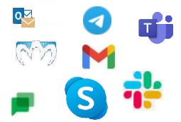
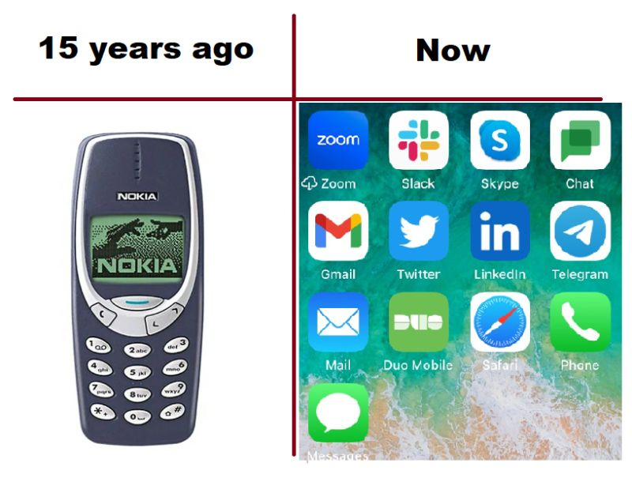

# Communication

## We need more Messengers!

Guys from big IT Companies, we need "much more" messengers on our devices!

Because I have "only" 6 on my laptop - Facebook messenger, Microsoft Skype and Teams, Google Chat, Twitter, Slack and Telegram.

And "only" 8 on my smartphone.

And there are additionally two email clients by the way.

How many messengers there are on your devices?

Which ones I missed?

## Miranda
This is when we say "Old, but Gold"

Can you guess what it is?

If you know what is this - we are the same age )

Based on https://www.linkedin.com/feed/update/urn:li:activity:6947599537733558272/?commentUrn=urn%3Ali%3Acomment%3A(activity%3A6947599537733558272%2C6951864730680487936)&dashCommentUrn=urn%3Ali%3Afsd_comment%3A(6951864730680487936%2Curn%3Ali%3Aactivity%3A6947599537733558272

## What does it mean for me to be online?

### Tags
online messenger ithumor