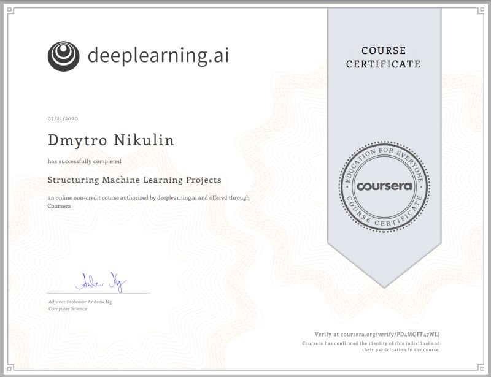
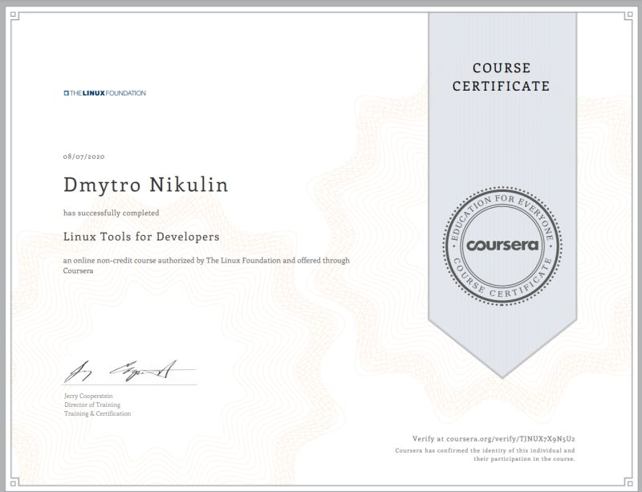
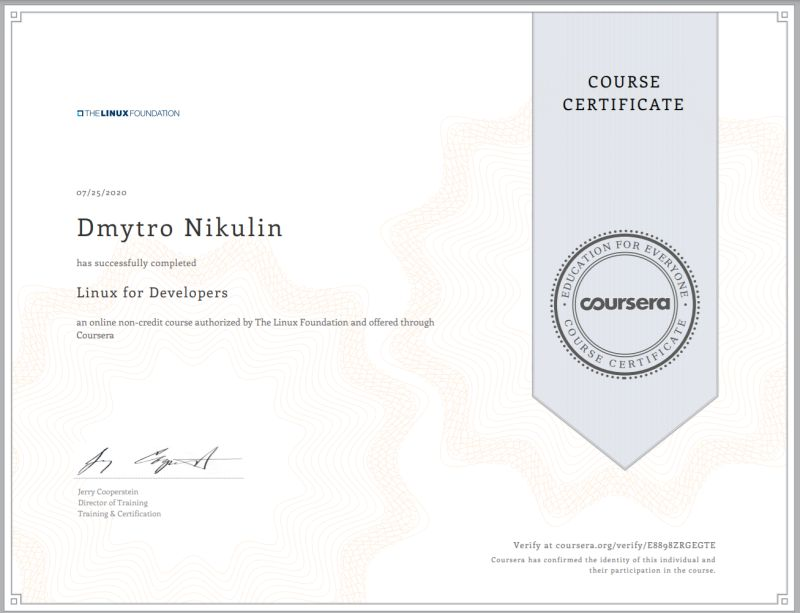
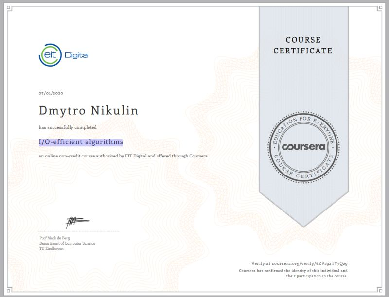
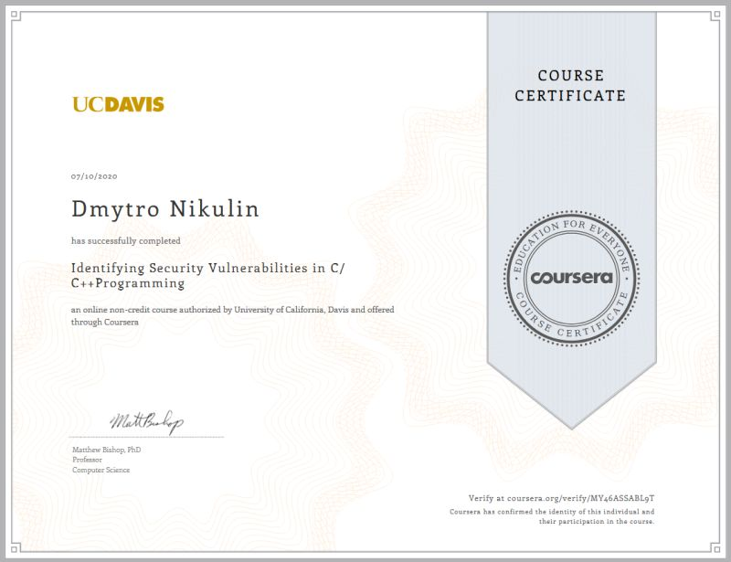

## Coursera Certificates

### Business Implications of AI: A Nano-course

### Version Control with Git

### Structuring Machine Learning Projects

### Certificate from Coursera - Linux Tools for Developers

### Certificate from Coursera - Linux for Developers

### Certificate from Coursera - I/O-efficient algorithms

### Certificate from Coursera - Identifying Security Vulnerabilities in C/C++ Programming

### Tags
Coursera Certificate