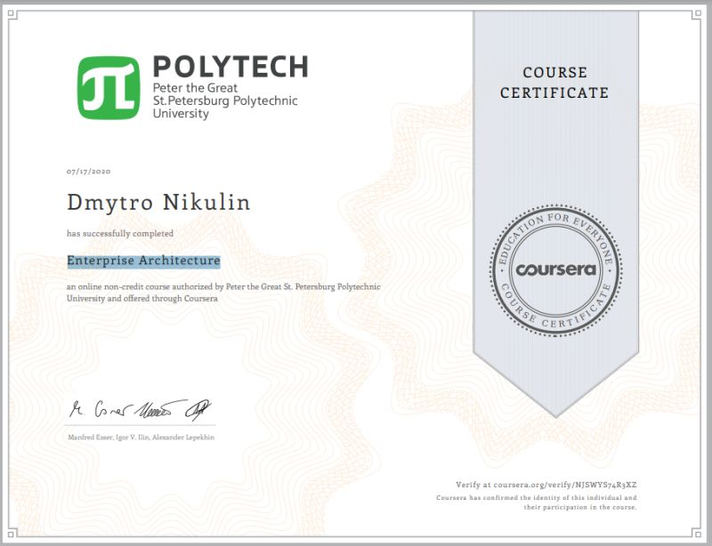
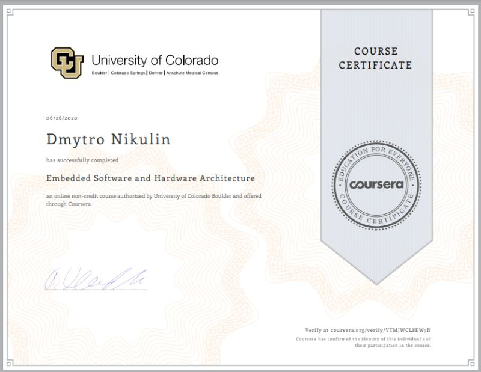

## Coursera Certificates

During education in NAUKMA, we were given free access to https://www.coursera.org/ and so we could choose any from 5K cources. I liked following ones:
1. Data Structures and Algorithms-Algorithmic Toolbox,
2. Embedded Software and Hardware Architecture,
3. Enterprise Architecture,
4. Identifying Security Vulnerabilities in C-C++Programming,
5. IO Efficient algorithms,
6. Linux for Developers,
7. Linux Tools for Developers,
8. Structuring Machine Learning Projects,
9. Version Control with Git,
10. Business Implications of AI: A Nano-course.

### Business Implications of AI: A Nano-course

### Version Control with Git

### Structuring Machine Learning Projects

### Certificate from Coursera - Linux Tools for Developers

### Certificate from Coursera - Linux for Developers

### Certificate from Coursera - I/O-efficient algorithms

### Certificate from Coursera - Identifying Security Vulnerabilities in C/C++ Programming

### Certificate from Coursera - Enterprise Architecture

### Certificate from Coursera - Embedded Software and Hardware Architecture

### Tags
Coursera Certificate