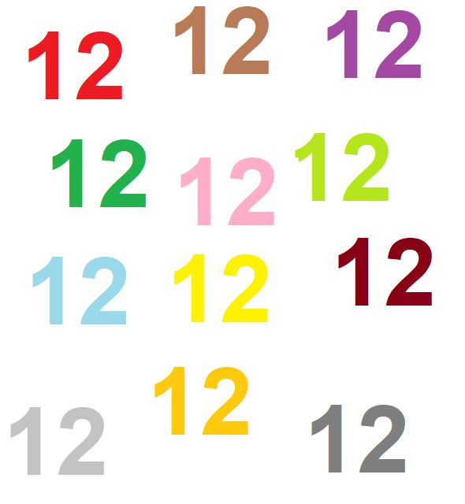

## Interesting facts about number "12"

- 12 months in a year;
- 12 hours visible on a clock;
- 12 is a composite number, an even number, a natural number, and a whole number;
- There are 12 stars on the flag of Europe.
- Max 12 columns in Bootstrap row. ;)

Something else? please share in comments other facts.

### Tags
interestingfacts