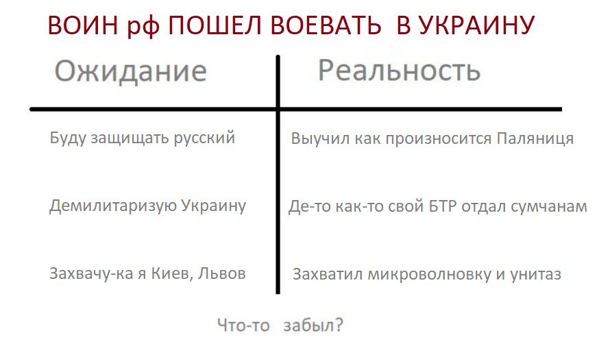
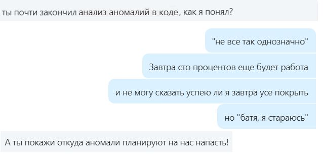
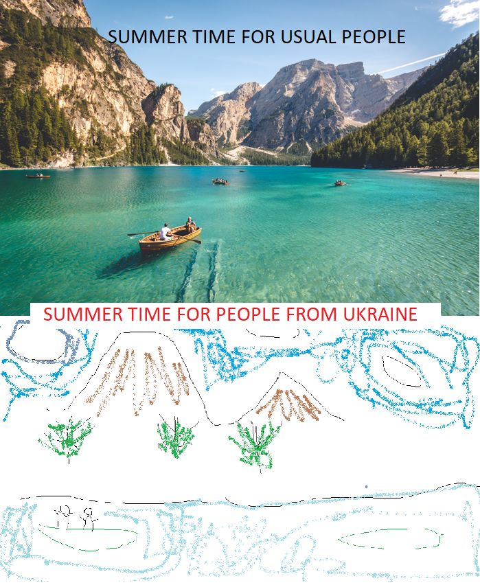
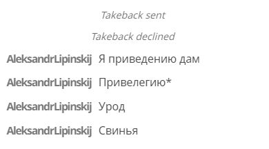

## Первый пост с 24 февраля
Да, я говорил, что на Линкеде нет места для политоты.
Но так-то было до 24 февраля

## Usual talks in unsual time
Обычный разговор, в "необычное" время.

## Summer time
Summer is definitely a time for vacation, relaxing ...
But there are some "nuances"

## How russians play chess?
Yes, it is not really easy to resign.
Even when you just play chess and when you have already lost.
When I am loosing chess game I am saying "thank you, well played" and I am getting upset.
It differs from what usually rUSSIANS do.
They say all rude words they even know when they loose just chess game.
Another example what rUSSIANS do when they loose the "GAME" on real battle field - they bomb usual people, infrastructure like usual TERRORISTS.

## А на куди зибеться пУТЕНг?
Яник зибався на ростов.
А на куди зибеться пУТЕНг?

- До яника **1%**
- На картопля-ленд **4%**
- На Марс з Маском **11%**
- До жиріка **84%**

## Who are toxic people
Who are **toxic** people?
People who..

- criticize a lot **11%**
- can not listen to other people **19%**
- say rude words **5%**
- are rusnia **66%**

## What is the best gift for Ukrainian people for Christmas and New Year?
What is the best gift for Ukrainian people for Christmas and New Year?

- Patriot defense system **8%**
- Atacms **16%**
- pUTINs visit of Kobzon concert **76%**

Any other options I forgot to mention?

## Яскрава місячна ніч
Яскрава місячна ніч.
Звичайна людина: Красива ніч. Романтика.
Українець: Добре буде видно "Шахеди"

### Tags
armukrainenow toxicpeople staywithukraine stoprussia stopwar russiaterroriststate warinukraine ukrainewar ukraine