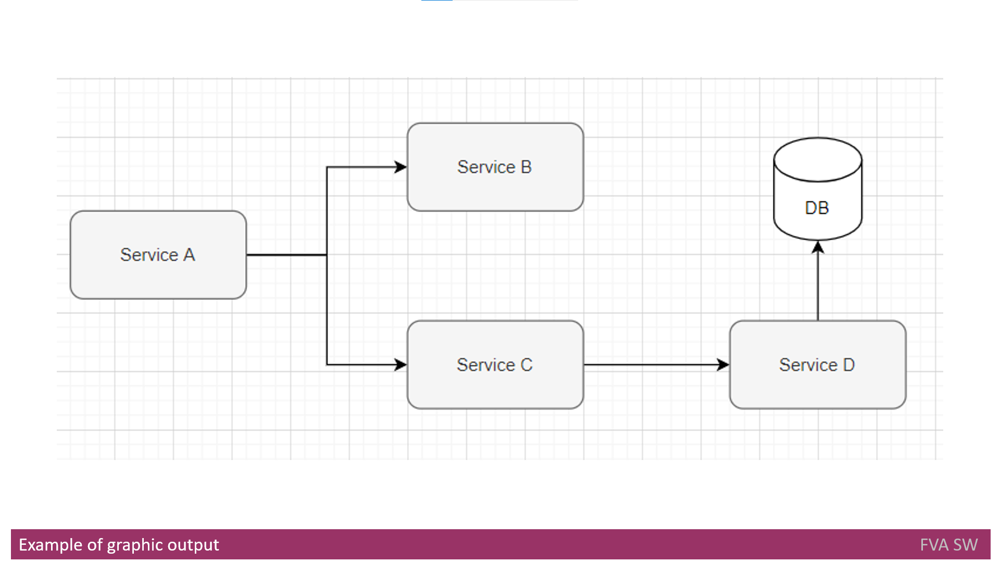

# Headline
Title: Detecting Architectural Gaps with Automation: Enhancing Software Architecture Maintenance and Efficiency

# Article description
This text discusses the implementation of a solution for detecting architectural gaps and drifts in software systems.
It highlights the importance of maintaining a changeable software architecture in the rapidly evolving tech world.
The paper explores the limitations of manual architecture reviews and proposes automated alternatives to improve efficiency and outcomes.
The solution requirements include different modes of execution, inputs from code and configuration, integration with UML design tools and source control systems, user interaction through a web interface, and various output formats for issue reporting and graphic visualization of the architecture.
The solution aims to enhance modifiability, extendibility, and configurability, allowing for flexibility in adapting to project needs. 

# Tags
Software architecture, architecture review, architecture drift, architecture erosion, manual review, dependency analysis

# Definitions, Acronyms, Abbreviations
| # | Abbreviation or Acronym | Definition     |
| - | ------------------------|:--------------:|
| 1 |API | API is the acronym for Application Programming Interface, which is a software intermediary that allows two applications to talk to each other.|
| 2 |API gateways | An API gateway is an API management tool that sits between a client and a collection of backend services. An API gateway acts as a reverse proxy to accept all application programming interface (API) calls, aggregate the various services required to fulfill them, and return the appropriate result. |
| 3 |Architecture Governance | Architecture governance is an approach, a series of processes, a cultural orientation, and set of owned responsibilities that ensure the integrity and effectiveness of the organization's architectures.|
| 4 |CI/CD | CI/CD or CICD is the combined practices of continuous integration and continuous delivery or continuous deployment.|
| 5 |Cloud Model | There are three major cloud service models: software as a service (SaaS), infrastructure as a service (IaaS) and platform as a service (PaaS). Cloud service pricing models are categorized into pay per use, subscription-based and hybrid, which is a combination of pay-per-use and subscription pricing models.|
| 6 |Cloud Services | The term "cloud services" refers to a wide range of services delivered on demand to companies and customers over the internet. These services are designed to provide easy, affordable access to applications and resources, without the need for internal infrastructure or hardware.|
| 7 |Cluster | A computer cluster is a set of computers that work together so that they can be viewed as a single system. Unlike grid computers, computer clusters have each node set to perform the same task, controlled and scheduled by software.|
| 8 |Compliance | In general, compliance means conforming to a rule, such as a specification, policy, standard or law. Compliance has traditionally been explained by reference to the deterrence theory, according to which punishing a behavior will decrease the violations both by the wrongdoer and by others.|
| 9 |Coverity | Coverity is a proprietary static code analysis tool from Synopsys. This product enables engineers and security teams to find and fix software defects.|
| 10|DevOps | DevOps is the combination of cultural philosophies, practices, and tools that increases an organization's ability to deliver applications and services at high velocity: evolving and improving products at a faster pace than organizations using traditional software development and infrastructure management processes.|
| 11|FrontEnd | Front-end web development is the development of the graphical user interface of a website, through the use of HTML, CSS, and JavaScript, so that users can view and interact with that website|
| 12|Git | Git is free and open source software for distributed version control: tracking changes in any set of files, usually used for coordinating work among programmers collaboratively developing source code during software development.|
| 13|GDPR | The General Data Protection Regulation is a regulation in EU law on data protection and privacy in the European Union and the European Economic Area. The GDPR is an important component of EU privacy law and of human rights law, in particular Article 8 of the Charter of Fundamental Rights of the European Union.|
| 14|Hacks | A commonly used hacking definition is the act of compromising digital devices and networks through unauthorized access to an account or computer system. Hacking is not always a malicious act, but it is most commonly associated with illegal activity and data theft by cyber criminals.|
| 15|Identity and Access management | Identity management, also known as identity and access management, is a framework of policies and technologies to ensure that the right users have the appropriate access to technology resources. IdM systems fall under the overarching umbrellas of IT security and data management.|
| 16|IBM | International Business Machines Corporation is an American multinational technology corporation headquartered in Armonk, New York|
| 17|JavaScript	| JavaScript, often-abbreviated JS, is a programming language that is one of the core technologies of the World Wide Web, alongside HTML and CSS. As of 2022, 98% of websites use JavaScript on the client side for webpage behavior, often incorporating third-party libraries.|
| 18|Jenkins | Jenkins is an open source automation server. It helps automate the parts of software development related to building, testing, and deploying, facilitating continuous integration and continuous delivery. It is a server-based system that runs in servlet containers such as Apache Tomcat.|
| 19|Microservices | A microservice architecture – a variant of the SOA structural style – arranges an application as a collection of loosely-coupled services. In a microservices architecture, services are fine-grained and the protocols are lightweight. The goal is that teams can bring their services to life independent of others|
| 20|PII | Personal Identifiable Information (PII) is defined as: Any representation of information that permits the identity of an individual to whom the information applies to be reasonably inferred by either direct or indirect means.|
| 21|PoC | Proof of concept, also known as proof of principle, is a realization of a certain method or idea in order to demonstrate its feasibility, or a demonstration in principle with the aim of verifying that some concept or theory has practical potential. A proof of concept is usually small and may or may not be complete.|
| 22|SOA | In software engineering, service-oriented architecture is an architectural style that focuses on discrete services instead of a monolithic design|
| 23|Software Architecture | Software architecture refers to the fundamental structures of a software system and the discipline of creating such structures and systems. Each structure comprises software elements, relations among them, and properties of both elements and relations.|
| 24|SonarQube | SonarQube is an open-source platform developed by SonarSource for continuous inspection of code quality to perform automatic reviews with static analysis of code to detect bugs, code smells on 17 programming languages.|
| 25|Subversion | Apache Subversion is a software versioning and revision control system distributed as open source under the Apache License. Software developers use Subversion to maintain current and historical versions of files such as source code, web pages, and documentation.|
| 26|UML | The Unified Modeling Language (UML) is a general-purpose, developmental, modeling language in the field of software engineering that is intended to provide a standard way to visualize the design of a system.|
| 27|VPN | A virtual private network extends a private network across a public network and enables users to send and receive data across shared or public networks as if their computing devices were directly connected to the private network.|

# Content
## Executive summary

In today's rapidly changing software world, the ability to adapt and evolve the software architecture is crucial for success.
The readiness for change is a key factor in ensuring a product can meet evolving business and product requirements in the high-tech industry.

However, uncontrolled architecture drifts and erosions pose significant risks to a product's success.
These drifts can result in the loss of expected extensibility and hinder the adoption of a product as the user base grows.
Identifying and addressing these drifts is often done through complex and time-consuming manual architecture reviews, relying on experienced architects to assess the software architecture.

Despite the importance of manual reviews, they have limitations in terms of efficiency and coverage. 
Human factors can influence the identification of architectural issues, leading to inconsistencies and potentially missing critical problems.

To overcome these challenges, there is a need for automated solutions that can detect architecture drift and erosion more effectively.
By leveraging automated tools and processes, organizations can achieve better outcomes in terms of identifying and preventing architectural issues.

This white paper explores the concept of detecting architectural gaps with automation.
It covers the impact of architecture drift and erosion on the business, the limitations of manual reviews, and the benefits of automating architecture checks. Additionally, it discusses specific considerations related to compliance, data security, DevOps, and more when evaluating architecture review solutions. 
The paper also provides use case scenarios to illustrate what automated architecture checks can look like in practice.

By adopting automated architecture review solutions, organizations can improve their ability to identify and address architectural gaps, ensuring the stability, scalability, and maintainability of their software systems.

## Detecting Architectural Gaps with Automation

Please read [this paper](https://www.globallogic.com/insights/white-papers/detecting-architectural-gaps-with-automation/) before proceeding to the next chapters.

You will gain insights into the following:

- Understanding architecture drift and erosion: Learn what architecture drift and erosion are and how they can impact the business. Gain an understanding of the risks and challenges associated with uncontrolled architectural changes.
- Manual inspections and their limitations: Explore the role of dependency analysis, peer reviews, and other manual inspections in detecting architectural issues. Understand why manual reviews, while important, may not be the ideal solution due to their limitations.
- The need for automated architecture review: Discover the benefits of automating architecture checks and how they can complement manual reviews. Learn how automation can provide more efficient and comprehensive detection of architectural gaps.
- Considerations for evaluating architecture review solutions: Explore specific considerations to keep in mind when evaluating architecture review solutions. Topics covered include compliance, data security, DevOps integration, and more.
- Use case scenarios: Gain insights into what automating architecture checks may look like through a series of example use case scenarios. Understand how automation can be applied in practical situations to enhance architecture review processes.

By reading this paper, you will develop a deeper understanding of architecture drift and erosion, the limitations of manual reviews, the benefits of automation, and important considerations when evaluating architecture review solutions.
 
## Solution requirements
This section outlines the requirements for implementing the solution.
It is important to note that these requirements are not exhaustive and can be extended based on the specific needs of the project.
The requirements are categorized into solution modes and inputs, solution integration and user interaction, and solution output with quality attributes like modifiability, extendibility, and configurability.

### Solution modes
The proposed solution should support the following modes:

- Standalone application: The solution should be designed to run as a standalone application, allowing it to be executed on demand without any dependencies on the target environment. This mode provides flexibility for manual execution of the solution.

- Integration with CI/CD pipeline: The solution should have the capability to integrate seamlessly into a CI/CD pipeline as a separate step. This mode enables regular assessment of the architecture within the automated pipeline.

In the context of the CI/CD mode, the following features should be supported:

- Initial architecture reference: The solution should allow setting an initial architecture as a reference point. Any deviations from this reference architecture should be identified as architecture drifts.

- Drift reporting and approval process: When a drift is detected, the solution should provide an option to approve or decline the changes with comments. The description of the change should include an impact analysis, allowing the user to understand the cost associated with the proposed change.

- Documenting drifts and erosion: The solution should provide the ability to save the documentation that describes drifts or erosions. This documentation can be useful for future analysis and reference. It should be easily accessible for review and analysis purposes.

- Integration with popular CI/CD tools: The solution should be easily integrated with widely used CI/CD tools such as Jenkins, Bamboo, etc. This ensures compatibility and seamless integration into existing CI/CD workflows.

### Solution inputs 
The proposed solution can accept various inputs, including:

- Code from the solution under review: The solution should be able to analyze and process code files from the software being reviewed.

- Configuration from the solution under review: Configuration files used by the software should be compatible with the solution to extract relevant information.

- Software design from UML designing tools: The solution should support importing software designs created using UML (Unified Modeling Language) tools. This allows for a comprehensive analysis of the software's architectural design.

- Database scripts and database configuration: The solution should be capable of working with database scripts and configurations, enabling analysis of the database layer in the software.

These inputs collectively provide the necessary information for the solution to perform its analysis and evaluation of the software architecture.

### Solution integration 
Integration of the proposed solution with various tools and systems allows for a comprehensive analysis of software architecture.
Here are the integration possibilities mentioned:

- Offline UML designing tools: The solution can be integrated with offline UML designing tools like OmniGraffle and Microsoft Visio. This integration enables the import of UML diagrams created using these tools for analysis and evaluation.

- Online UML designing tools: Integration with online UML designing tools such as Enterprise Architect, LucidChart, Draw.IO, PlantUML, and Gliffy.com provides the ability to import UML diagrams created in these platforms. This expands the range of tools that can be used for software design and analysis.

- Source control management systems: Integration with source control management systems like SVN and Git allows the solution to access code and configuration files directly from the repository. This ensures that the latest version of the software is analyzed, and any changes made to the codebase are taken into account.

By integrating the solution with these tools and systems, users can leverage existing software design and version control workflows to enhance the effectiveness of the automatic review process. 

As an example of the input code could be the code written in C# using microservices architecture. 
The other example could be the code written in JavaScript for multi-tier applications. 
The example of configuration might be the description of nodes used in deployment.
Another example could be the configuration of VPN network and API gateways.
The example of input software design can be description of interfaces saved in Enterprise Architect.

### User interaction
The user can interact with the solution using a web interface from a desktop computer. No mobile device (like smartphones or tablets) is intended because the low screen size of mobile devices is not suitable for the content the proposed solution is going to provide. 
Two types of user shall be supported: administrators and architects. 
The administrators shall be able to configure the system for intended use.
The architects shall be able to run the proposed solution for analysis and to review the analysis results.
The dashboards can be available to show metrics and software architecture status like: components count, dependencies list etc.

### Solution output
There are two formats of output: the text (plain text or table) one and graphic one.

The table format is used to provide a user with 
- a level of issue, 
- the issue priority, 
- the issue description itself 
- and the suggested way to fix the issue.

In addition, it shall list
- all dependencies (frameworks, libraries);
- APIs, 
- databases, 
- technology stack (languages) 
- and application layers into separate documents. 

It shall be possible to request the inventories of the 
- languages, 
- frameworks, 
- libraries, 
and databases used in the application at any time.

An example of text output might be following
| # | Level                | Priority              | Issue                  | Suggestion   |
| - | ---------------------|---------------------- |----------------------- |:-------------:|
| 1 | Architecture | Medium | BackEnd For FrontEnd services are directly integrated with third party services (external services) | To add an abstraction level to decrease the level of dependency on third parties |
| 2 | DevOps |	High |	Endpoints configuration are not correct basing of their meta description |To fix configuration |
| 3 | Architecture| High | Communication in between microservices does not meet initially predefined communication | To update initially documented communication or to fix current communication |
| 4 | Architecture| Medium | BackEnd For FrontEnd services are directly integrated with domain Data Access/data stores engines | To add an abstraction level to decrease the level of dependency on domain Data Access/Data stores engines |
| 5 | Architecture| Low | BackEnd For FrontEnd and Domain services are mixed | To move domain logic out of BackEnd For FrontEnd services|
| 6 | Architecture| Medium | Domain services are aware of client (browsers, devices)|	To move awareness of client away from domain services|
| 7 | Architecture| Medium | Domain services are stateful | To move state management away from domain services|
| 8 | DevOps| Medium | The code does not use the selected cloud model | To check Cloud Model being used|
|9  | DevOps | Medium | The architecture of solution uses the Cloud services it was not expected to use | To check Cloud Services being used |
|10 | DevOps | Medium | A microservice became strictly depending on an environment | To make that service be deployable on any environment |
|11 | Code | High | Technology standards changed - the developers started using the library or programming language that is out of scope.| To replace that library with allowed one |
|12 | Code | Low | A microservice accesses local FS and provides access to internal data | To add an abstraction level to decrease the level of dependency on internal data |

The graphic format is used to show the software architecture in the form of 
- holistic application architecture, 
- diagram of all services, 
- data flows etc. 

Offline and Online UML diagramming tools are used to save extracted Software Architecture.
Using graphic format users shall be able to tag any component, an item from inventory by any user-defined key words.

An example of graphic output might be following

In the picture above four services and one database are defined in the software architecture.
From the output you can see the relationship between them and the direction of communication.

### Modifiability and extendibility
Because there is no limitation on the solution, scope defined above the solution itself shall be extensible enough to support adding new features such a new check or even a new level.
Because there might not be good software practices used on a project the default set of checks shall be used to verify target architecture.
In case of established architecture governance, a proposed solution user shall be provided a possibility for extension of the set of checks.
Because there are multiple Static Code tools like Coverity, SonarQube, etc. there is no sense to implement low-level checks like checking indentation, formatting etc.

### Configurability
The following configuration items can be supported:
- Solution mode (available for configuration at deployment stage);
- A path to read the architecture documents from offline UML design tools;
- An address of online UML design tool API to read and write the architecture documents;
- Source control management system configuration;
- The addresses of databases for observation the data layer;
- The integration with CI/CD tools like Jenkins or Bamboo;
- The report plugins configuration (format, storage etc)

# References
| # | Name                 | Source                | Release date           |  Author                 | Description   |
| - | ---------------------|---------------------- |----------------------- | ----------------------- |:-------------:|
| 1 | Architectural drift analysis using architecture reflexion viewpoint and design structure reflexion matrices | [web](https://www.researchgate.net/publication/301257152_Architectural_drift_analysis_using_architecture_reflexion_viewpoint_and_design_structure_reflexion_matrices)|December 2016 |Bedir Tekinerdogan, Wageningen University & Research | |
| 2 | Drift and Erosion in Software Architecture: Summary and Prevention Strategies                               | [web](https://www.researchgate.net/publication/339385701_Drift_and_Erosion_in_Software_Architecture_Summary_and_Prevention_Strategies)|February 2020|Erik Whiting, University of Nebraska at Lincoln | |
| 3 | DISCUSSION: Architectural drift & erosion violations                                                        | [web](https://uw.cs.cs446.narkive.com/nRvtbr2q/discussion-architectural-drift-erosion-violations)| 2010 | Atif Khan | |
| 4 | Differentiate software architectural erosion and architectural drift?                                       | [web](https://www.ques10.com/p/13271/differentiate-software-architectural-erosion-and-1)| 2017 | teamques10 | |
 