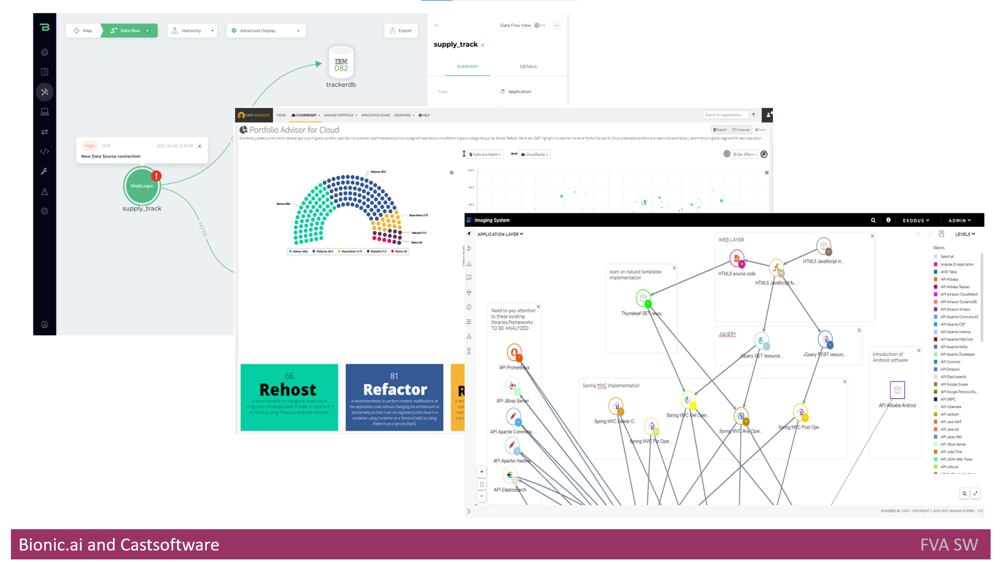

# Headline
TBD

# Article description
TBD 

# Tags
TBD

# Definitions, Acronyms, Abbreviations
TBD

# Content
## Bionic.ai

[Bionic](https://www.bionic.ai/) is a platform to analyze the architecture of applications and its dependencies in real-time.
First, it creates a baseline of architecture at initial scan.
Once a change occurred, the next scan happens to find any drift or erosion.
Regular scan is supported by integration Bionic.ai into CI/CD pipeline.
When it detects the change, it also suggests the context and analyzes the impact the changes might cause.
As the output, it creates software architecture diagrams with deployment, logical and flow views.

### Main features
- it helps to check if architecture rules and standards are applied;
- it helps to identify any structural or behavioral changes.
- it scans the code and document at the initial or scheduled stage.
- it determines the new API in the application;
- it is able to find new data flows;
- it detects new connections; 
- it provides the prioritized list of risks once change occurred; 

## Castsoftware Highlight 
[Cast Highlight](https://www.castsoftware.com/products/highlight) is an application to automatically analyze the source code.

### Main features
- It analyzes the code to define what process/applications can be refactored, retired, rebuild; 
- Based on analysis it can provide a percent of readiness to migrate to the cloud.

## Castsoftware Cast Imaging 
[Cast Imaging](https://www.castsoftware.com/imaging) application creates visualization of architecture with several different levels of detailsation from services level up to code/classes level. It defines the flows of data from high level (application level) up to the database. When changes occur, it provides the impact of changes for example, the list of components affected by breaking of components communication. It creates the inventories of 
- databases;
- libraries/frameworks;
- languages.

### Main features
- It performs reverse engineering of code, databases, and dependencies of applications;
- It performs the creation of holistic architecture views and blueprints;
- Its architecture view has interactive mode;
- It has a tagging feature to group components by criteria. Once tagging is finished, the user can search the components and filter them.

## NDepend
[NDepend] is application to analyze C# code to check against best practices and to check the code based on rules created by developers and architects.
It gives the possibility to manage the dependencies by creating the graphs and matrix.

### Main features
- A user can use built-in rules and can customize the rules;
- it provides a way to investigate how an application is structured and linked with libraries; 
- It can be easily plugged into the CI/CD process to find the code and architecture problem in real time;
- When it finds an issue, it provides the cost of fix and its priority.

# References
| # | Name                 | Source                | Release date           |  Author                 | Description   |
| - | ---------------------|---------------------- |----------------------- | ----------------------- |:-------------:|
https://www.bionic.ai/
https://www.castsoftware.com/products/highlight
https://www.castsoftware.com/imaging
https://www.workshell.co.uk/products/netdepends/