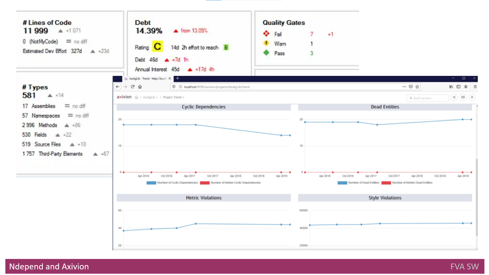

# Headline
TBD

# Article description
TBD 

# Tags
TBD

# Definitions, Acronyms, Abbreviations
| # | Abbreviation or Acronym | Definition     |
| - | ------------------------|:--------------:|
| 1 | API                     |is a computing interface to a software component or a system, that defines how other components or systems can use it. It defines the kinds of calls or requests that can be made, how to make them, the data formats that should be used, the conventions to follow, etc                |
AUTOSAR 	AUTomotive Open System ARchitecture is a development partnership of automotive interested parties founded in 2003. It pursues the objective to create and establish an open and standardized software architecture for automotive electronic control units
Bamboo	Bamboo is a continuous integration and deployment tool that ties automated builds, tests and releases together in a single workflow.
Big Data	is data that contains greater variety, arriving in increasing volumes and with more velocity. This is also known as the three Vs. Put simply, big data is larger, more complex data sets, especially from new data sources.
C#	C# is a general-purpose, multi-paradigm programming language. C# encompasses static typing, strong typing, lexically scoped, imperative, declarative, functional, generic, object-oriented, and component-oriented programming disciplines.
Bamboo	Bamboo is a continuous integration and deployment tool that ties automated builds, tests and releases together in a single workflow.
C#	C# is a general-purpose, multi-paradigm programming language. C# encompasses static typing, strong typing, lexically scoped, imperative, declarative, functional, generic, object-oriented, and component-oriented programming disciplines.
CDN	A content delivery network (CDN) refers to a geographically distributed group of servers that work together to provide fast delivery of Internet content.
CI/CD	CI/CD or CICD is the combined practices of continuous integration and continuous delivery or continuous deployment.

# Content
## Bionic.ai

[Bionic](https://www.bionic.ai/) is a platform to analyze the architecture of applications and its dependencies in real-time.
First, it creates a baseline of architecture at initial scan.
Once a change occurred, the next scan happens to find any drift or erosion.
Regular scan is supported by integration Bionic.ai into CI/CD pipeline.
When it detects the change, it also suggests the context and analyzes the impact the changes might cause.
As the output, it creates software architecture diagrams with deployment, logical and flow views.

### Main features
- it helps to check if architecture rules and standards are applied;
- it helps to identify any structural or behavioral changes.
- it scans the code and document at the initial or scheduled stage.
- it determines the new API in the application;
- it is able to find new data flows;
- it detects new connections; 
- it provides the prioritized list of risks once change occurred; 

## Castsoftware Highlight 
[Cast Highlight](https://www.castsoftware.com/products/highlight) is an application to automatically analyze the source code.

### Main features
- It analyzes the code to define what process/applications can be refactored, retired, rebuild; 
- Based on analysis it can provide a percent of readiness to migrate to the cloud.

## Castsoftware Cast Imaging 
[Cast Imaging](https://www.castsoftware.com/imaging) application creates visualization of architecture with several different levels of detailsation from services level up to code/classes level. It defines the flows of data from high level (application level) up to the database. When changes occur, it provides the impact of changes for example, the list of components affected by breaking of components communication. It creates the inventories of 
- databases;
- libraries/frameworks;
- languages.

### Main features
- It performs reverse engineering of code, databases, and dependencies of applications;
- It performs the creation of holistic architecture views and blueprints;
- Its architecture view has interactive mode;
- It has a tagging feature to group components by criteria. Once tagging is finished, the user can search the components and filter them.

## NDepend
[NDepend] is application to analyze C# code to check against best practices and to check the code based on rules created by developers and architects.
It gives the possibility to manage the dependencies by creating the graphs and matrix.

### Main features
- A user can use built-in rules and can customize the rules;
- it provides a way to investigate how an application is structured and linked with libraries; 
- It can be easily plugged into the CI/CD process to find the code and architecture problem in real time;
- When it finds an issue, it provides the cost of fix and its priority.

## Axivion
[Axivion](https://www.axivion.com/en/) Suite is the static code analysis tool that provides you with the ability to check software architecture to prevent drifts or erosions. It provides customizable reporting with a reporting API. With Axivion you have an editor to create the rules for checking or to customize the default rules

It supports the checking for the next compliance standards/rules:
- MISRA;
- AUTOSAR C++14 code;
- CERT;
- CWE;
- ISO/IEC TS 17961.

It supports following metrics: 
- HIS; 
- McCabe;
- Tracking memory leaks.

### Main features
- Code checks for clones, unreachable code and cycles;
- three main OS are supported to run on - MacOS, Windows and Linux;
- identification for technical debt;
- Integration with CI tools to work as a part of pipeline (Jenkins and Bamboo are supported);
- make, CMake, Msbuild and gradle are supported;
- analysis of delta to continuously track the changes against baseline;
- it supports some IDE plugins to integrate Axivion into a developer environment. 

## Comparison of existing solutions
| Function | Bionic | Cast Imaging and Highlight | Axivion  | NDepend               |
| -------- | -------|--------------------------- |--------- |:---------------------:|
|The initial scan to create baseline (holistic application architecture diagram of all services, data flows, dependencies, and APIs, technology stack, application layers)|+|+|+|+|
|To create the inventories (all the languages, frameworks, libraries, and databases used in the application)|-|+|+|-|
|The scan after a change to detect drift or erosion (integration into CI/CD pipelines)|+|-|+|+|
|Tagging the components|-|+|-|-|
|Reporting the changes (behavioral or structural change)|+|+|+|+|
|Detection Security level issues|+|+|+|+|
|Detection Architecture level issues(new data flow, new API, new connection)|+|+|-|+|
|Detection Compliance level issues|+|-|+|-|
|Detection DevOps level issues|-|-|-|-|
|Detection Data level issues|-|-|-|-|
|Scanning code and configuration|+|+|+|+|
|Scanning documentation (UML) to get input|-|-|+|-|
|Scanning DB|-|+|-|+|
|Saving the results to UML documentation tools|-|-|-|-|
|Impact analysis|+|+|-|+|
|Simple to set up|+|+|+|+|
|Check for cloud Readiness|-|+|-|-|

As we can see from the table above the existing solutions do not provide coverage for levels important for architecture governments like DevOps, Data, Compliance one etc.
Also not all inputs are supported by the overviewed solutions, for example scanning DB is not supported by Bionic.ai and scanning UML documentation is not supported at all. 

# References
| # | Name                 | Source                | Release date           |  Author                 | Description   |
| - | ---------------------|---------------------- |----------------------- | ----------------------- |:-------------:|
| 1 | Bionic | [Web](https://www.bionic.ai/) | | | |
| 2 | Castsoftware highlight | [Web](https://www.castsoftware.com/products/highlight) | | | |
| 3 | Castsoftware Image | [Web](https://www.castsoftware.com/imaging) | | | |
| 4 | Netdepends | [Web](https://www.workshell.co.uk/products/netdepends/) | | | |
| 5 | Axivion | [Web](https://www.axivion.com/en/) | | | |
