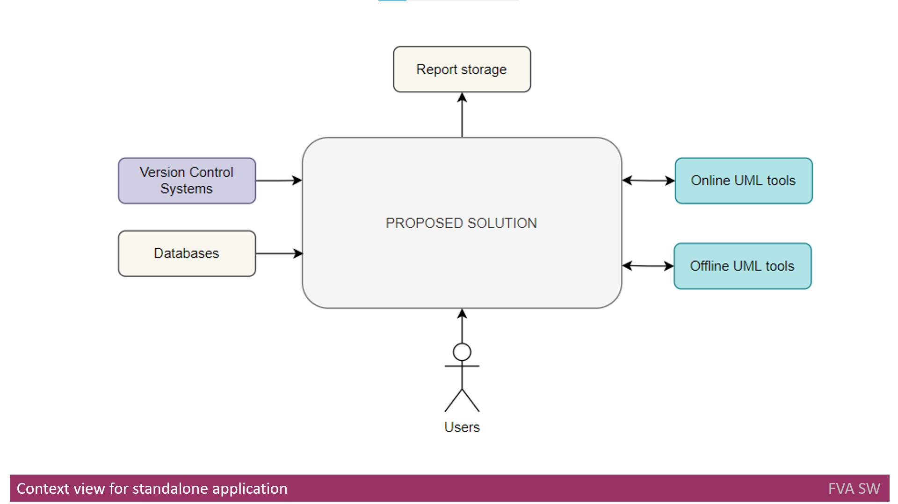
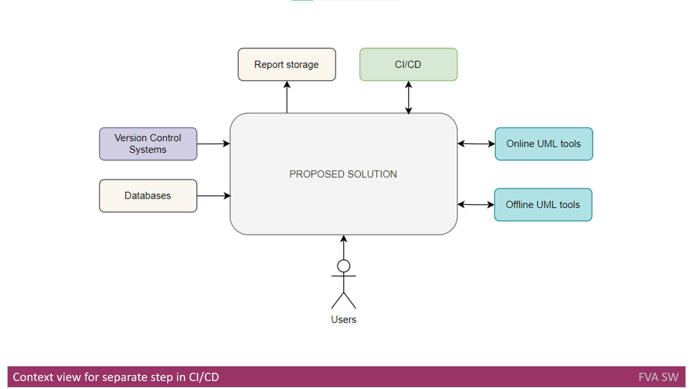
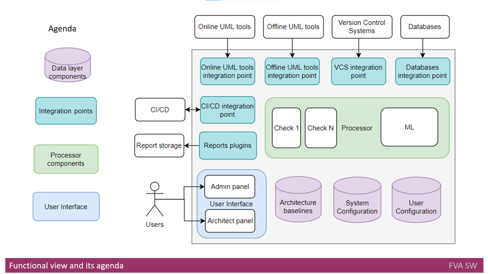
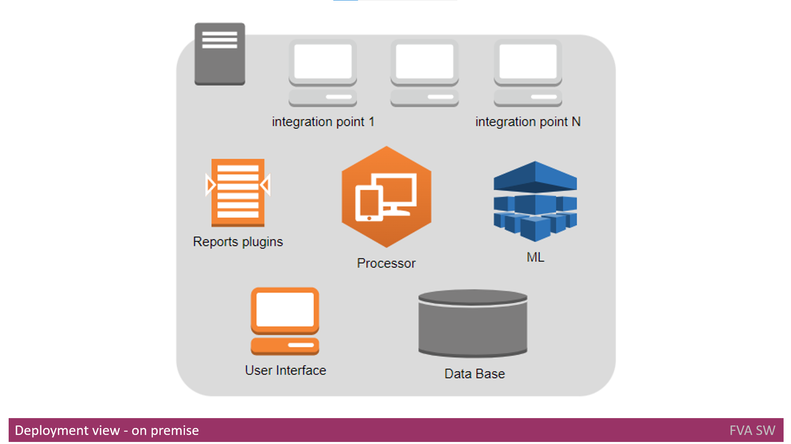
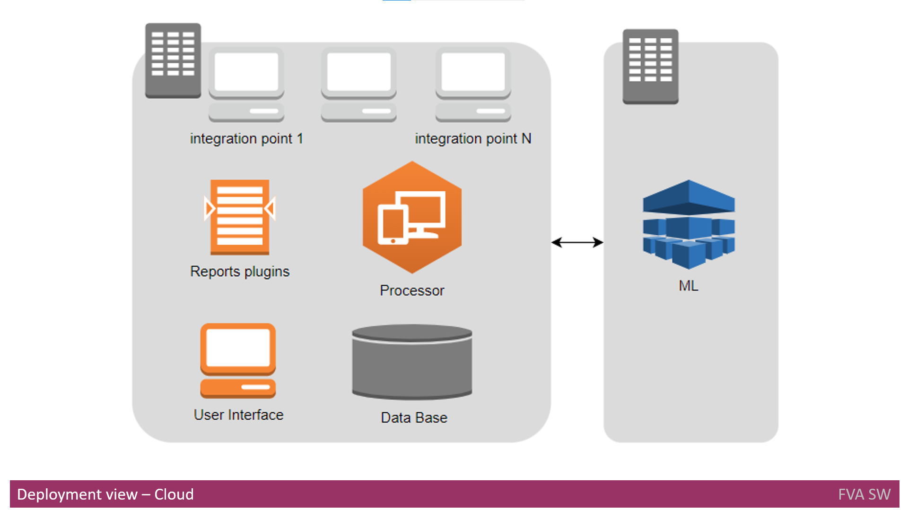
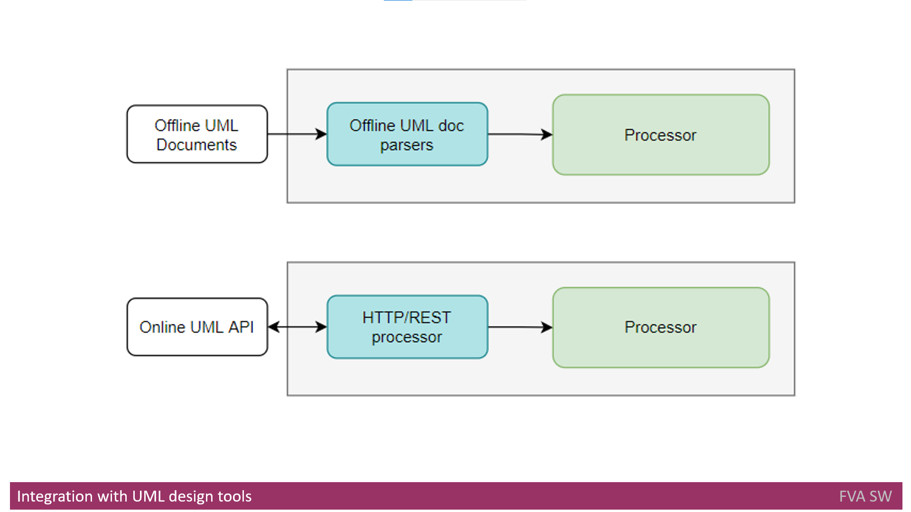

# Headline
TBD

# Article description
TBD 

# Tags
TBD

# Definitions, Acronyms, Abbreviations
TBD

# Content
## Context view for standalone application

A context diagram (view) defines solution bounds and connection with third parties like external systems, users and data. 

As shown above on the context diagram there is an interaction between Users and Proposed Solution. 
Interactions shall be implemented using UI web interface. 

To get the input the solution interacts with Online and Offline UML tools using its API to get initial Software Architecture and to save extracted Software Architecture.

To get access to code, configuration and DB the interactions with the Version Control Systems and interaction with DB are used.

Finally, Report Storage is used to save the outputs extracted from Architecture under analysis. 

## Context view for separate step in CI/CD

The only difference between previous view and Context View for Separate step in CI/CD is integration of the proposed solution with existing CI/CD pipeline.

## Functional view

A functional diagram below shows the high-level function decomposition of the proposed solution.
An agenda below explains the coloring for functional decomposition diagram.

### Integration layer
The integration layer function is to abstract and segregate the system from external components to improve the system extensibility and modifiability.

Following are the components:
- Online UML tools integration point - component to integrate Online UML tools with Processor;
- Offline  UML tools integration point - component to integrate Offline UML tools with Processor;
- VSC integration point - component to integrate Version Control Systems with Processor;
- Databases integration point - component to integrate databases configuration with Processor;
- CI/CD integration point - component to integrate CI/CD tools (like Jenkins, Bamboo) with Processor;
- The Reports plugins - an engine to generate reports in a flexible way and to save them on external report storage.

### User Interface
The user interface function interacts with the user in two modes: architects and administrator mode. 
It is based on a web interface that supports desktop browsers. 

### Data layer
The data layer function keeps following types of data:
- Architecture baselines - it is a history of Architecture changes so users can see at any time which Architecture change took place, available for a view from the architects panel;
- System configuration - it is a set of check configurations for processing, it also keeps track of reports plugins configuration, available for a change from the architects panel;
- User configuration - user profiles and access rights, available for a change from administrator panel.

### Processing layer
The processing layer is a core function of systems to process the input to find architecture problems. 
It is configured from the architect panel to run the checks against input. 
It interacts with the reports plugins engine to store the reports. 
It also saves the extracted architecture to Architecture baselines so the architects can review it later. 
To improve the quality of reports, Machine Learning (ML) during processing might be used. ML and its interaction is described in this document later.  

## Deployment view

The deployment schemes show how a solution shall be deployed with its flows and supporting components.

## Deployment view - on premise

On premise, deployment assumes only one computing node for installation. 
The Data Base component shall be deployed first as other components depend on it.
Then, the Processor and ML component are being deployed after the Database component is in place.
The User interface component, reports plugins and integration points are deployed at the last stage. 
The Data Base component shall be deployed in the form of one DB instance with several schemes inside.
User interface component is represented as a web service.
Processor and ML are native processes built for the target platform.
Reports plugins and integration points shall be represented as dynamic libraries that can be easily added, removed and configured at run time.

## Deployment view - Cloud

Cloud deployment assumes two computing nodes for installation.
Because the Machine Learning process can utilize the CPU time a lot, it is suggested to have a separate machine for Machine Learning process for cloud pipeline.

## Integration with UML design tools
As it was described earlier, proposed solution shall be integrated with such offline UML designing tools like:
- Microsoft Visio;
- OmniGraffle;

In addition, proposed solution shall be integrated with such online UML designing tools like:
- Enterprise Architecture;
- LucidChart;
- Draw.IO;
- PlantUML;
- Gliffy.com.

### Integration with offline UML design tools
Because offline tools do not have an API to work with, the cooperation with them is implemented using import mechanisms. 
So input architecture documents saved in Microsoft Visio format will be exported by a plugin (integration point) and analyzed then by the Processor.
The path for scanning input documents is saved in System Configuration DB.
So parsing the different input formats shall be implemented to support this kind of integration.

### Integration with online UML design tools

Online UML design tools usually have an API to work with and the cooperation with them shall use that API. Still some UML design tools might not have API for integration. In such cases, the import of architecture docs to some folder shall take place. Then parsing those documents is implemented to import data to the Processor, so in the same way as described earlier for offline tools.
For online UML design tools, usually HTTP or REST API is available. In this case, the integration point shall access the data in the UML design tool using HTTP or REST API. For each integration with such one tool shall have a separate integration point. 
For example, the integration with LucidChart shall be implemented using HTTP protocol with GET and POST verbs. 
For Enterprise Architect the integration shall be implemented using rest API and JSON as data format.

## Integration with AWS or Azure
This section describes how a proposed solution can be integrated with AWS, Azure or GCP.
Because Machine Learning can improve the quality of results, it makes sense to use a separate compute node for ML.
Still on premise environment can fail to support ML calculation.
In such cases, the *silver bullet* can be using Cloud Environment for ML computation and whole computation as well.
Based on deployment flows described earlier each component shall be presented with appropriate cloud provider service. 
For example for AWS it can be:

- Processor - AWS Lambda functions;
- Database  - RDS and MySQL services;
- Machine Learning - Machine Learning;
- and etc.

## Dependency analyzing tool
The dependency identification is an important function used during architecture analysis. 
It breaks down the whole code on the pieces to define the components and interaction between them. 
Because such functions are already implemented in tools like JDeps it makes sense to use their output to support proposed solution implementation. 
JDeps is the command line tool to launch the Java class dependency analyzer. 
For .Net framework, Net Dependency Walker can be used to identify dependency. 

## Integration with Jenkins or Bamboo
As it was mentioned earlier, the one mode of application is a step in CI/CD pipeline. 
CI/CD is a complex/composite process, which consists of multiple steps. 
There is a lot of functionality within a single CI/CD pipeline.

# References
| # | Name                 | Source                | Release date           |  Author                 | Description   |
| - | ---------------------|---------------------- |----------------------- | ----------------------- |:-------------:|
