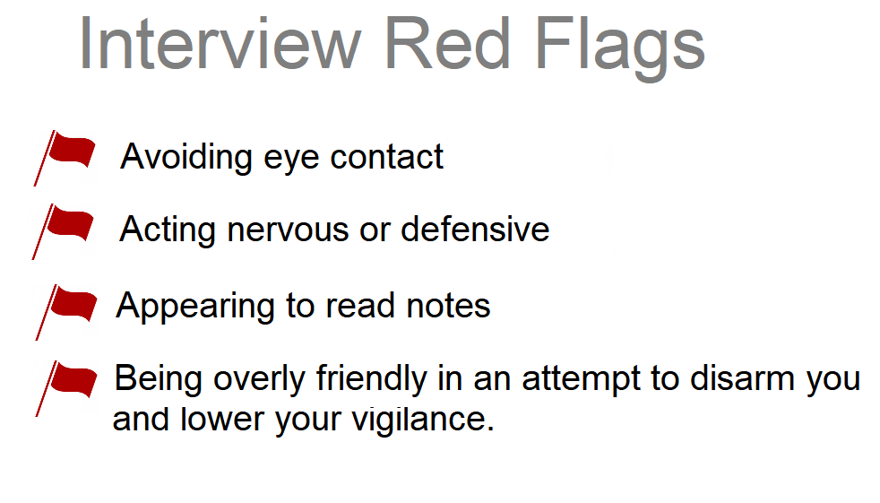

# Interview Red Flags

Let me start with a small history about a technical interview I recently hosted. 
The interviewee greeted me in Ukrainian, which was a pleasant surprise. 
When I asked how he learned Ukrainian, he explained that he has friends in Ukraine and has visited them.
I suggested we switch to Ukrainian, but he declined as he doesn't speak it very well.

During the interview, I noticed that he had two or even three monitors, one of which he used to communicate with me through a camera.
At first, he struggled with practical tasks, but when I checked his theoretical knowledge, he showed a good level.
I asked him a lot of questions, and he answered them in the same manner - he would think and then move his eyes to the keyboard or other monitor before providing an answer.
After a while, he would either say that he wasn't sure about the answer or give me the wrong answer entirely.
But then he would provide the correct answer. 

Because time was limited, I had to rush him in his thinking for each answer, which made him nervous.
I noticed that when he moved his eyes, he seemed to be reading something on his second display. 
It was clear that he was trying to cheat.

So, some red flags to watch out for during an interview include:

- Avoiding eye contact
- Acting nervous or defensive
- Appearing to read notes
- Being overly friendly in an attempt to disarm you and lower your vigilance.

# performing passing interview

poker face on TI when they answer, you must be subjective
не давать долго отвеать.

chat gpt 
