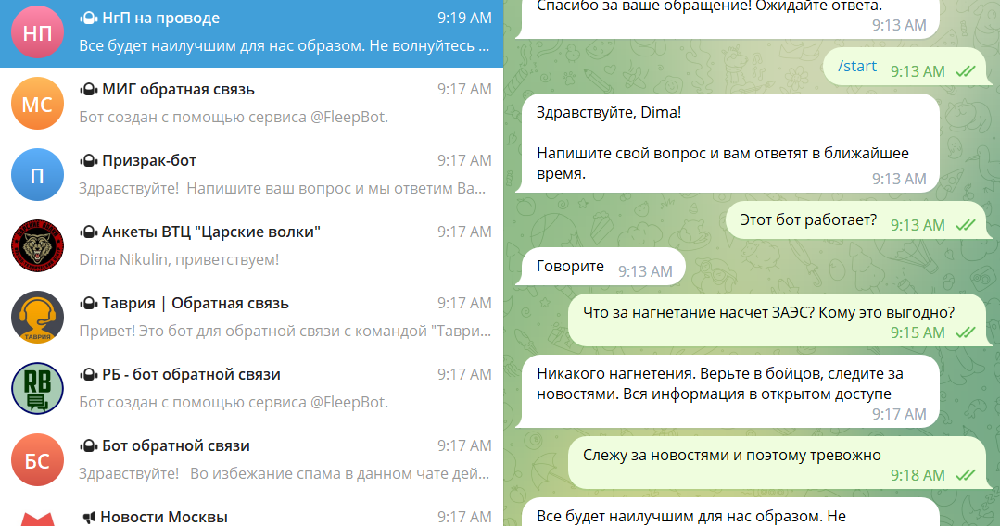

# Headline
TBD

# Article description
TBD 

# Tags
TBD

# Content

## Зачем все это?
Ответ на вопрос о необходимости всего этого хорошо описан в книге "Искусство войны" Сунь Цзы.
По сути, неуверенный и сомневающийся в себе враг является более слабым врагом. 
Чтобы заставить врага сомневаться и принимать нерациональные решения, можно использовать информационно-психологические операции (ИПСО), то есть воздействовать на его информационное поле.
Другими словами, распространение компрометирующей информации и неудобные вопросы в определенной степени демотивируют врага. 
А в телеграм-каналах много российских военных, родственников и знакомых военных.

## Как все началось!
[StopRussiaChannel](https://t.me/+EbXZHBfHXbszY2I6) стал отправной точкой!
Я подписался на него в начале полномасштабного вторжения в 2022 году.
Вкратце, там выдавались задания по блокировке и троллингу каналов, которые вели антиукраинскую информационную кампанию на платформах, таких как YouTube, Telegram, TikTok и т.д. 
У меня был быстрый доступ только к Telegram, поэтому я работал исключительно в Telegramе.

## Боты
Достаточно эффективно работать с Telegram-ботами.
Вы отправляете боту приветствие, спрашиваете, работает ли он, а затем задаете другие вопросы.
Администраторы ботов тратят время на обработку таких запросов, и иногда могут заблокировать вас, особенно если вы являетесь активным пользователем.
С вашей стороны на это уходит немного времени, в отличие от администраторов, которые затрачивают много времени, так как вы не единственный пользователь, коммуницирующий с ботами.
Я сам практикую работу с несколькими ботами одновременно, копируя в них один и тот же контент.

## Смена тактики
Смена тактики была необходима, поскольку работа с обычными телеграм-каналами оказалась неэффективной по сравнению с использованием ботов.
Когда ты подписывался на каналы и говорил "Слава Украине", тебя блокировали в течение 5 минут, как и множество других пользователей.
Стало ясно, что необходимо изменить подход.
Поэтому, когда я подписывался на новые каналы, я просто наблюдал и изучал "оперативную обстановку" - термины, жаргон и контент, который обычно публикуется. 
Часто мне приходилось использовать устоявшиеся термины, такие как "укронацисты" или "освобождение", чтобы казаться более убедительным и "своим". 
Зная, какой контент обычно публикуется на канале и какой контингент подписчиков присутствует, я определял свои дальнейшие действия.
Мои подходы к взаимодействию с каналами были абсолютно разными в зависимости от ситуации.

## Немного историй
В канале, созданном elena_geller, я решил представиться жителем Херсона, который оказался в сложной ситуации. 
Моя история была следующей: будучи медиком, я поверил российской пропаганде и не покинул город в марте 2022 года.
В августе 2022 года я начал распространять панику в этом канале, опасаясь, что Херсон может быть захвачен "укропами", в то время как российским военным до меня не было дела.
Я не знал, как выбраться из города и что делать дальше.
В канале мне предложили эвакуироваться в Россию, например, в Ростов.
Я сказал, что у меня там нет знакомых и не знаю, кто будет оплачивать мои расходы.
В конечном итоге я решил эвакуироваться в Эстонию.
Позже я вернулся в Херсон, где уже не было российских военных.
Естественно, меня отговаривали ехать в Херсон, предупреждая о "страшных укропах".
В основном это были российские граждане, которые никогда не были в Украине, но "знали" все из телевизора.
В итоге я покинул этот чат, заявив, что не стоит верить российским властям.

Был также канал Вячеслава Володина. после начала мобилизации на росиии я стал спрашивать почему его дети не идут служить.
Сразу же мне сказали что у него нет детей призывного возраста. Но я их нашел в инете. Тогда мне сказали что это фейк, и это заказ
комунистичсекой партии России, а может рос опозиции, так как они тоже такой же фейк разгоняли. 
Попутно там же разгонял историю о моем племяннике, который попал в плен под Изюмом.

Я также использовал харьковскую операцию в качестве информационного фона.
Под предлогом поиска своего племянника, которого, как я утверждал, пленили украинцы, я пытался найти информацию о нем в различных каналах.
Я говорил, что пресс-служба МО России просто игнорирует меня и не может ничего сделать.
Конечно, из-за моей настойчивости меня постепенно удаляли из каналов, но осадочек у них оставался.

Также я следил за каналом Вячеслава Володина. После начала мобилизации в России, я начал задавать вопросы о том, почему его дети не идут служить. Мне сразу же сказали, что у него нет детей в призывном возрасте. Однако я нашел информацию в интернете, которая говорила обратное. Тогда мне сказали, что это фейк, заказанный коммунистической партией России или, возможно, оппозицией, так как они тоже разгоняли подобные истории. Параллельно разговаривалось и о случае с моим племянником, которого, я утверждал, взяли в плен под Изюмом.

## Эффективность 
Можно с уверенностью сказать, что если просят админов тебя заюлокировать - ты очень эффективен.
Тебя проклинают, обзывают - тоже норм. Да, это неприятно сначала. Но если на тебя не реагируют - твои страния мимо.
когда русня против русни

## Неудачи
Да, меня неоднократно разоблачали. Не может же тетя с племянником в плену называть себя Дима Никулин.
Было дело что в одном канале, я выдал себя эксперт по меди контенту называя многие российские видео и фото фейками.
Но ребята там оказались не простыми, и я не смог убедить в том что то фейки и меня тоже удалили.

## Рождение собственного канала  
Из-за того, что работаешь в нескольких каналах то создал файл на компььере с контентом из которого просто копировал по разеым каналам.
Cначала там были простые вопросы - почему путена называют пуйлом и сколько может выпить медведев.

 вопросы/высказывания повторялись 
 и поэтому я довел их количество до 1700 уникальных. 
И они становились все более и более сложными.
С чем столкнулся, что комп у менея не всегда с собой, а заниматься такой деятельностью нужно всегда, по крайней мере до конца войны.
выходишь к доктору или в магаз и все - я обезоружен )

И решил перенести контеетв в канал, из которого можно постить контент с любого устройства и любого места.

Вот так создал тот самый [Телеграм канал](https://t.me/questions4russians). 

сначала был текст и одна иконка, потом добавил возможность коментирования и сделал отдельную группу. 

теперь уже видео и картинки )

## Что дальше?

как говорил тарас шевченко боритесь и поборете.

Слава Украине

ось така фигня малята

# References
