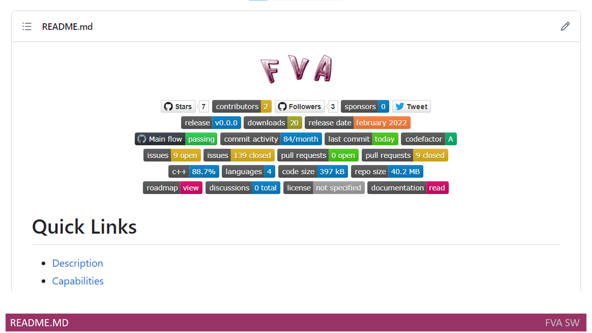

# Headline
TBD
What I learned as a Delivery Manager while creating my product

# Article description
TBD 
, and uncover the significance of tracking implementation status for better requirement coverage

# Tags
TBD

# Content

First I started thinking how to get more engagement with my open source project. Why? Beacause: 
- Developers play a crucial role in adopting and integrating your product into their projects.
- Engaged developers who have a positive experience with your product can become powerful advocates.
- They are more likely to explore the extensibility options and customization capabilities of your product. 
- Also Engaged developers can provide valuable feedback, suggestions, and bug reports.
- Finally they may actively participate in your product's open-source community, contribute code, report issues, and collaborate on its development. 

Their contributions can accelerate the pace of innovation, foster a sense of ownership and community, and create a network effect that attracts more developers to get involved.

## Project Status tracking
Overall, tracking project status is crucial for a Delivery Manager to ensure project success, manage risks and resources, facilitate communication, and make informed decisions throughout the project lifecycle.

### GitHub projects
**GitHub Projects** is tool for tracking project status online integrated into your GitHub profile.
It is quite easy to use, and it doesn't have a lot of functions. 
Here it [is](https://github.com/dimanikulin/fva/projects/3)

### ProjectLibre
In spite of all the above-mentioned, a more compex solution was required. 
My choice was [ProjectLibre](https://www.projectlibre.com/product/1-alternative-microsoft-project-open-source).
ProjectLibre desktop is a free and open-source project management software system, intended ultimately as a standalone replacement for Microsoft Project.
Despite being a free and small app, it gave me everything I needed.

TBD openproject

## Create a Good Readme
[It](https://github.com/dimanikulin/fva#readme) is the first thing that a visitor to your repository sees.
And good README serves as a comprehensive and accessible starting point for users and developers to engage with your project.

It should be able to convey what your project is able to do, how to instakk and work with the project, how to contribute, etc.
It also keeps structured information for product and its implementation details. 

Not to overlod main reamd there are some child files created to keep details:
- [CodeDocumentation.md](https://github.com/dimanikulin/fva/blob/master/CodeDocumentation.md) - to describe how to document the code 
- [CodeStyle.md](https://github.com/dimanikulin/fva/blob/master/CodeStyle.md)        - to describe the code style
- [Constraints.md](https://github.com/dimanikulin/fva/blob/master/Constraints.md)      - to describe solution constraints
- [Dependencies.md](https://github.com/dimanikulin/fva/blob/master/Dependencies.md)     - to descrive tools and libs are used for product development
- [DependenciesOld.md](https://github.com/dimanikulin/fva/blob/master/DependenciesOld.md)  - to descrive old tools and libs were used for product development
- [FunctionalView.md](https://github.com/dimanikulin/fva/blob/master/FunctionalView.md)   - to show and describe functioanl view 
- [QualityAttributes.md](https://github.com/dimanikulin/fva/blob/master/QualityAttributes.md) - to decsribe product Quality Attributes

And my readme start with product logo. 

### Bages

Than it moves to bage chapters that are helpful for developers. There are following sections:
- Common (Repo stars, contributors, followers, sponsors and twitter URL)
- Release (last release version, last release date and numbers of downloads)
- Code statistic (status of build flow,GitHub commit activity,GitHub last commit and www.codefactor.io status)
- Issues and Pull requests (GitHub issues, GitHub closed issues, GitHub pull requests and GitHub closed pull requests)
- Repository statictis (GitHub top language, GitHub language count and GitHub repo size) 
- Documentation(Roadmap, Discussions, License and Main Readme)

There are 3 different types of badges in terms of their way of implementation
- Implememented by GitHub like [this](https://github.com/dimanikulin/fva/actions/workflows/main.yml/badge.svg?branch=master) 
- Implememented by img.shields.io like [this](https://img.shields.io/github/last-commit/dimanikulin/fva)
- Implememented by www.codefactor.io like [this](https://www.codefactor.io/repository/github/dimanikulin/fva)

### Quick Links
After it switches to [Quick Links](https://github.com/dimanikulin/fva#quick-links) chapter. 
Quick links in a README file are important because they provide easy and convenient access to key sections, resources, or external references related to a project. 
They serve as navigational aids, allowing readers to quickly jump to specific parts of the README without having to scroll or search extensively.
So I add the Quick Links for each main chpter in [readme](https://github.com/dimanikulin/fva#readme)

### Capabilities and Description 
The description of [capabilities](https://github.com/dimanikulin/fva#capabilities) and product [description](https://github.com/dimanikulin/fva#description) in a README file is critical for effectively communicating the value, purpose, and unique selling points of your product. 
It helps users understand what your product offers, why it is valuable, and whether it meets their requirements.
By providing clear and compelling information, you can attract the right audience and increase the chances of user adoption and satisfaction.

### Architecture documentation
Then it switches to description of Architecture documentation with following chapters:
- [Software Architecture Requirements](https://github.com/dimanikulin/fva#software-architecture-requirements)
- [Software Architecture Views](https://github.com/dimanikulin/fva#software-architecture-views)
- [Tools](https://github.com/dimanikulin/fva#dependencies), libraries and [programming languages](https://github.com/dimanikulin/fva#programming-languages)
- [Licenses](https://github.com/dimanikulin/fva#license)

For more details see [here](./WhatILearnedAsAppArchitect.md)

### Code Style and Documentation
After it describes [Code Style](https://github.com/dimanikulin/fva#code-style) and [Documentation](https://github.com/dimanikulin/fva#code-documentation).
Documenting code style and practices promotes consistency, code quality, collaboration, and long-term maintainability of the project.
It serves as a valuable resource for the development team and ensures that the project's codebase remains organized, understandable, and scalable. 

### Implementation status
Then I considered how I could effectively track the [coverage](https://github.com/dimanikulin/fva#implementation-status) of requirements. 
I needed a way to implement tracing and determine which requirements were covered and which ones were not. 
To address this, I devised a table with the following columns:

**Implemented**: Indicates whether the requirement has been implemented, marked as either "yes" or "no."
**Feature ID**: An identifier sourced from the features.
**Component**: Specifies the name of the component.
**File names**: Lists the file names where the implementation for the requirement can be found.
**Description**: Provides a description of the functional requirement.

### Contributing and Stay in touch
Here I describe the channels which anyone can use to help me in developing and how to contribute. 

### Definitions, Acronyms, Abbreviations
Last but not least I describe Definitions, Acronyms and Abbreviations.
it is in form of table with columns:
- Number
- Abbreviation or Acronym
- and Definition

## Releasing the code and the docs
The release of product shall be on demand as soon as peace of product functionality is ready for release.
Thus the release branch is being created or updated to keep added/updated product functionality.

Regardless of incremental approach to add or update product functions, the artifacts shall accumulate whole product installation packages and not increments even really small piece of functions is released.

The following artifacts shall be created:
- The documentation for code (based on doxy comments);
- The installation packages for Windows, Mac and Linux latest version. 

# References
| # | Name                 | Source           | Release date           |  Author                 | Description |
| - | ---------------------|---------------------- |----------------------- | ----------------------- |:-------------:|
| 1 | Getting started with project planning on GitHub| [Web](https://github.blog/2022-02-11-getting-started-with-project-planning-on-github/) |2022-02-11 | GitHub | |
| 2 | How to get more engagement with your open source project| [freecodecamp](https://www.freecodecamp.org/news/how-to-get-more-engagement-with-your-open-source-project/) | JANUARY 26, 2022 | navaneeth pk |Best practices to get more stars on your GitHub repos|