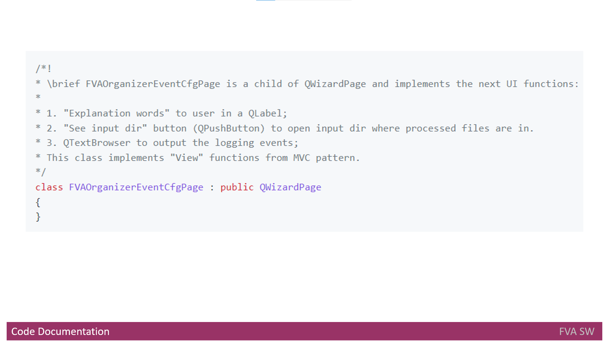

# Headline
- Code Quality, Documentation, and Implementation: Building a Solid Foundation for Software Development

- Prioritizing Code Quality and Documentation: Building a Robust and Maintainable FVA Software

- What I learned as a Software Developer while creating my product

# Article description
This article delves into the importance of code quality, documentation, and UI development in the creation of the FVA Software.
It explores the use of automated tools, manual code review, and Python checks to ensure code adherence. 
The significance of clear code documentation for both C++ and Python is emphasized.
The transition from QWidgets to QML for UI implementation is discussed, along with the benefits of utilizing the QT library.
The evolution of internal metadata formats in the software is explored, highlighting the challenges and decisions made along the way.

Overall, the article provides insights into building a robust and maintainable software product.

# Tags
Software development, code quality, code review, coding standards, documentation practices, C++, Python, implementation status, UI development, QT library, QWidgets, QML, UI languages, SQLite, CSV, C++ and Python integration, riff parser, metadata formats, maintainability

# Content

## Code quality
Before creating the code, it is crucial to prioritize its quality.
It should be the foremost consideration in the development process.
To ensure code quality, we can utilize automated tools that help with code analysis.
 owever, it's important to note that automated tools may not cover all the necessary rules. 
As a result, manual code review becomes essential to enforce coding standards.
Personally, I have dedicated significant time to code reviewing and checking for adherence to [code style](https://github.com/dimanikulin/fva/blob/master/CodeStyle.md). Additionally, 
I have employed **Python** to create additional code checks.
It is worth mentioning that not all rules can be checked automatically, requiring manual effort in certain cases.

## Code documentation
"*Now, hold on*!" you might ask, 
"*Are we jumping straight into coding?*". 
My answer is a resounding "*Nope*".

Before embarking on the coding phase, it is vital to consider code documentation. 
Since the **FVA Software** employs two programming languages, it is imperative to establish clear documentation rules for both [C++](https://github.com/dimanikulin/fva/blob/master/CodeDocumentation.md) and **Python**.
 
Consequently, I have familiarized myself with documenting **C++** code using **Doxygen** markdown and have gained proficiency in generating documentation based on Doxygen markdown.
It's quite remarkable how confident I am now in configuring **Doxygen**.



## Implementation
Finally, we can proceed to the coding phase!
For the development of **FVA Software**, I have chosen the versatile [QT](https://en.wikipedia.org/wiki/Qt_(software)) library, which supports multiple operating systems such as Windows, MacOS, and Linux Ubuntu. 
Since the software requires a user interface ([UI](https://en.wikipedia.org/wiki/User_interface)), I initially utilized **QWidgets**, including components like **QWizard** and **QWizardPage**.
However, I soon realized that employing **QML** would offer a more streamlined approach for [UI](https://en.wikipedia.org/wiki/User_interface) implementation.
Therefore, my plan is to transition from **QWidgets** to **QML**.

I was pleasantly surprised by the ease of utilizing **QT** for creating a multimedia content [player](https://github.com/dimanikulin/fva/blob/master/FVAPlayer). 
The flexibility of [QT](https://en.wikipedia.org/wiki/Qt_(software)) allows me to work with multiple [UI](https://en.wikipedia.org/wiki/User_interface) languages.
To facilitate this, [QT](https://en.wikipedia.org/wiki/Qt_(software)) suggests using the following components:

- [QTranslator](https://doc.qt.io/qt-5/qtranslator.html);
- [QtextCodec](https://doc.qt.io/qt-5/qtextcodec.html);
- [Qlocale](https://doc.qt.io/qt-5/qlocale.html);
- [QtextDecoder](https://doc.qt.io/qt-5/qtextdecoder.html);
- [QtextEncoder](https://doc.qt.io/qt-5/qtextencoder.html).

Additionally, I discovered that working with **SQLite** using [QT](https://en.wikipedia.org/wiki/Qt_(software)) is remarkably straightforward. 
However, I later made the decision to switch from **SQLite** to [CSV](https://github.com/dimanikulin/fva/blob/master/FVACommonLib/fvacsvfile.h) for data storage.

As my project involves working with two programming [languages](https://github.com/dimanikulin/fva/blob/master/README.md#programming-languages), I needed to establish a means of integrating **Python** code into the **C++** application.

Last but not least, I acquired knowledge on how to create a [riff parser](https://github.com/dimanikulin/fva/blob/master/FVACommonLib/fvariffparser.h), adding another valuable capability to the project.

## History of internal metadata formats
Let describe how **FVA Software internal metadata** was before current implementation. 
Firstly it was kept at file system level inside of the Photo Album. 
Each folder in the Photo Album could keep two files:**folderDescription.json** and **description.csv**. 
**FolderDescription.json** kept information about all the files under a folder that was common. 
For example it could be device id that was the same for all multimedia files. 

**FolderDescription.json** structure was:
```json
{
"deviceId":"",
"tags":"",
"people": "",
"place":"",
"event":"" 
}
```
**folderDescription.json** example:
```json
{
"deviceId":"3",
"tags":"At home, with a family",
"people": "3,6,8",
"place":"3,4",
"event":"45"
}
```

**description.csv** has been used to keep information about files under a folder for cases if some multimedia files had different internal metadata. 
**description.csv** structure was:

- Name
- Place
- People
- Device
- WhoTook
- Description
- Scaner

So the **FVA software** created or updated these files during import new files to photo album.
Keeping the internal metadata in this approach did not give good flexibility and maintainability. 
So adding one column in **folderDescription.json** or **description.csv** could cause whole photo album file system structure to update.

And it was decided to move all **folderDescription.json** and **description.csv** to **SQLlite** database. 
The scheme has been created to keep the same information as **folderDescription.json** and **description.csv** did keep.
The **FVA software** created **SQL** updates to **DB** during import new files to photo album and all those **SQL** updates were kept to create **SQL** at any time.

But again keeping the internal metadata in this approach did not give good flexibility and maintainability. 
So merging one folder in photo album to another caused significant change of **SQL** updates.

Finally it was decided to move all information in one **CSV** file.
That **internal metadata** file does not keep information in which folder a file is kept. 
So merging one folder in photo album to another does not cause an issue.
Still the duplication of information takes place because for all files in one folder common information is just copied.

"*And what did you learn?*" you might ask, 
"*Before implementation you need to think how easly you will maintain the product changes!*"
 
# References
| # | Name                 | Source                | Release date           |  Author                 | Description   |
| - | ---------------------|---------------------- |----------------------- | ----------------------- |:-------------:|
| 1 | FVA Tool Set features | [local resource](./FVADocX/FVAToolSetFeatures.pptx) | June 2022 | Dmytro Nikulin | | 

# Definitions, Acronyms, Abbreviations
| # | Abbreviation or Acronym | Definition     |
| - | ------------------------|:--------------:|
| 1 | [Dictionary](https://en.wikibooks.org/wiki/A-level_Computing/AQA/Paper_1/Fundamentals_of_data_structures/Dictionaries)|A dictionary is a general-purpose data structure for storing a group of objects. A dictionary has a set of keys and each key has a single associated value. When presented with a key, the dictionary will return the associated value. |
| 2 | [Doxygen](https://en.wikipedia.org/wiki/Doxygen)| [Doxygen](https://en.wikipedia.org/wiki/Doxygen)  is a [documentation generator](https://en.wikipedia.org/wiki/Documentation_generator) and [static analysis](https://en.wikipedia.org/wiki/Static_analysis) tool for software [source trees](https://en.wikipedia.org/wiki/Source_code#Organization). When used as a documentation generator, Doxygen extracts information from specially-formatted comments within the code.|
| 3 | [exiftool](https://en.wikipedia.org/wiki/ExifTool)| ExifTool is a [free and open-source software](https://en.wikipedia.org/wiki/Free_and_open-source_software) program for reading, writing, and manipulating image, audio, video, and [PDF](https://en.wikipedia.org/wiki/Portable_Document_Format) [metadata](https://en.wikipedia.org/wiki/Metadata)|
| 4 | [JSON](https://www.json.org/json-en.html)| JSON (JavaScript Object Notation) is a lightweight data-interchange format.|
| 5 | [IDE](https://en.wikipedia.org/wiki/Integrated_development_environment)| An integrated development environment (IDE) is a [software application](https://en.wikipedia.org/wiki/Application_software) that provides comprehensive facilities to [computer programmers](https://en.wikipedia.org/wiki/Computer_programmer) for [software development](https://en.wikipedia.org/wiki/Software_development). An IDE normally consists of at least a [source code editor](https://en.wikipedia.org/wiki/Source_code_editor), build [automation tools](https://en.wikipedia.org/wiki/Build_automation) and a [debugger](https://en.wikipedia.org/wiki/Debugger).|
| 6 | [Qt](https://en.wikipedia.org/wiki/Qt_(software))|is a [widget toolkit](https://en.wikipedia.org/wiki/Widget_toolkit) for creating [graphical user interfaces](https://en.wikipedia.org/wiki/Graphical_user_interfaces) as well as [cross-platform applications](https://en.wikipedia.org/wiki/Cross-platform) that run on various software and hardware platforms such as [Linux](https://en.wikipedia.org/wiki/Linux), [Windows](https://en.wikipedia.org/wiki/Windows), [macOS](https://en.wikipedia.org/wiki/MacOS), [Android](https://en.wikipedia.org/wiki/Android_(operating_system)) or [embedded systems](https://en.wikipedia.org/wiki/Embedded_system) with little or no change in the underlying codebase while still being a native application with native capabilities and speed. |
| 7 | [UI](https://en.wikipedia.org/wiki/User_interface)| is the space where interactions between humans and machines occur. The goal of this interaction is to allow effective operation and control of the machine from the human end, whilst the machine simultaneously feeds back information that aids the operators' [decision-making](https://en.wikipedia.org/wiki/Decision-making) process|
