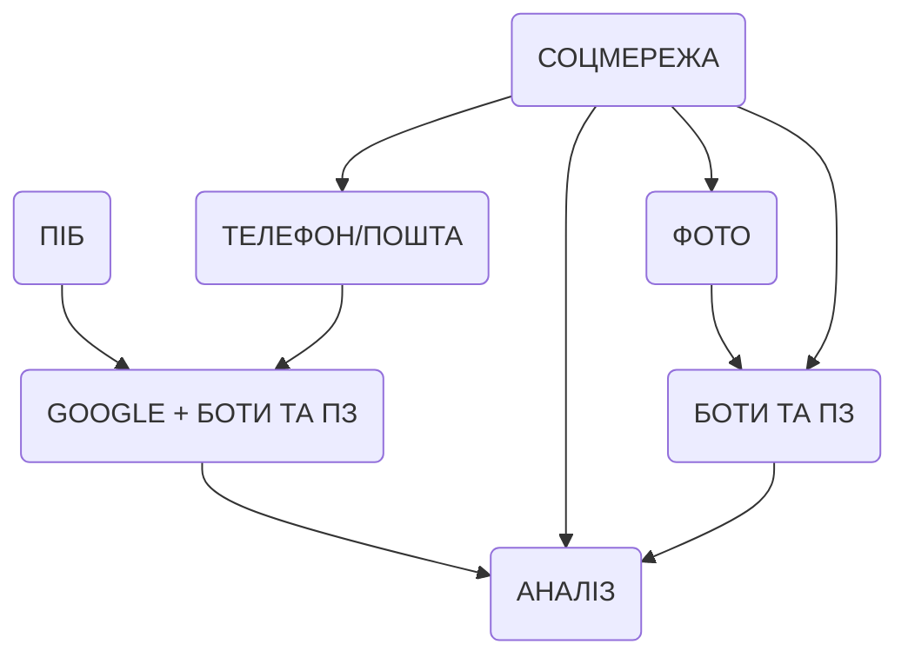
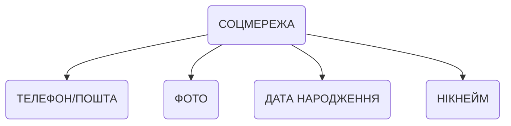
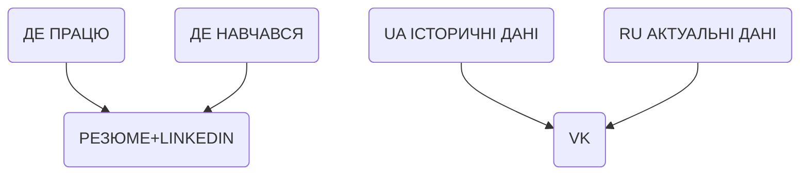
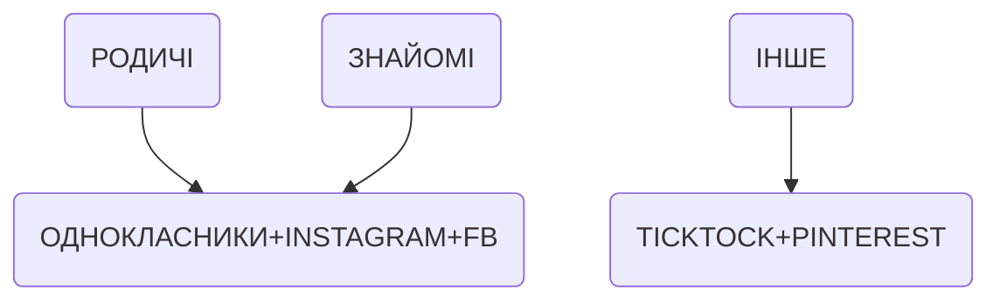

# Headline

TBD

# Alternative headline

TBD

# Table of contents

- [Tags](./OSINT_uk.md#tags)
- [Definitions, Acronyms, Abbreviations](./OSINT_uk.md#definitions-acronyms-abbreviations)
- [Overview](./OSINT_uk.md#overview)
- [Introduction](./OSINT_uk.md#introduction)
- [References](./OSINT_uk.md#references)

# Tags

TBD

# Definitions, Acronyms, Abbreviations

| # | Abbreviation or Acronym | Definition     |
| - | ------------------------|:--------------:|
| 1 |

# Overview

TBD

or ---

# Introduction

Розвідка соціальних мереж (SOCMINT) - це різновид розвідки з відкритим кодом (OSINT), яка стосується збору та аналізу даних з веб-сайтів соціальних мереж. Вона охоплює всі соціальні медіа-платформи, а не лише соціальні мережі.

З чого починати загальний пошук акаунту людини в соцмережах?

Почніть із широкого пошуку, якщо ви не визначилися з конкретною платформою.

# Загальний алгоритм пошуку

Як відправну точку можна використовувати: [osintframework](https://osintframework.com/)

Використовуйте [Wayback Machine](https://web.archive.org/), щоб отримати доступ до історичних даних знайдених вами сторінок у соціальних мережах. Не всі вони архівуються, особливо менш популярні, але спробувати варто.

[Vortimo OSINT](http://find.osint-tool.com/) – онлайн-інструмент для швидкого пошуку в сотнях різних джерел і подальшої обробки знайденої інформації.

# Детальні алгоритми пошуку

# Крітерії пошука

- Iм'я користувача
- Електронна пошта
- Номер телефону
- Зображення
- За даними Телеграму
- За обличчям
- За даними Whatsapp
- За данними мережи
- За данними LinkedIn

# Пошук за іменем користувача

Пошук за іменем користувача - найшвидший спосіб для більшості соціальних мережах, за умови, що цільова особа постійно використовує одне й те саме ім'я користувача. Ім'я має бути унікальним, малоунікальне Іванов чи Джон дасть мало результатів.
Крім того, ім'я користувача може виявити ім'я/прізвище, яке відрізняється від того, що вказано на сторінці в соціальній мережі.
Це створює додаткові критерії для пошуку.

Просто введіть ім'я користувача в [Namechk.com](https://namechk.com/) або [Instantusername.com](https://instantusername.com/#/) і проскануйте сотні веб-сайтів за лічені хвилини.

[webmii](https://webmii.com/) - інструмент, який збирає загальнодоступну інформацію про розшукувану особу на ім’я та вказує джерело, з якого вона її знайшла

# Пошук за pображенням

Зворотний пошук зображень показує, де раніше публікували певне зображення і в якому контексті.
Зворотний пошук за зображеннями дуже корисний, коли цільовий акаунт завантажив унікальне зображення профілю або інші фотографії.
Для цього добре підходять [Google](https://images.google.com/) і [TinEye](https://tineye.com/), хоча, можливо, вам доведеться переглянути багато зображень, які не відповідають цільовому. Такеж саме пропанують сервіси - Bing та PimEyes.

Також допоможе GeoHints – великий довідник з фотографіями предметів з різних країн. Допоможе при проведенні досліджень за фото або відео. Туди входять:

- номерні знаки
- поштові скриньки
- номери будинків
- бічні доріжки
- світлофори
і багато іншого.
geohints.com

# Пошук за поштою

Якщо ви не впевнені в достовірності адреси, скористайтеся [Proofy.io](https://proofy.io/), щоб перевірити, чи існує ця адреса.
Щоб отримати більше інформації про особу, перевірте пошту за відомими порушеннями на [Dehashed.com](https://dehashed.com/).
Там можуть з'явитися деякі соціальні мережі, наприклад, нещодавній злом Facebook.

# Пошук за обличчям

[FaceCheckID](https://facecheck.id/) – безкоштовний інструмент для пошуку за обличчям серед десятків платформ. Сервіс стверджує, що у його базі знаходяться понад 560 млн облич.

Якщо зворотний пошук за обличчям не дав результатів, спробуйте зістарити фотографію за допомогою вікового фільтра ШІ, додавши 10-20 років (в задежності від віку вашої цілі).

Ось кілька прикладів інструментів:

- media.io/lab/ai-face-editor/
- fotor.com/features/old-filter/
- reface.ai/unboring/features/old-face-filter
- ailab.wondershare.com/tools/aging-filter.html

Іноді буває складно визначити, чи на фотографіях, зроблених в різному віці, знаходиться одна і та сама людина.

У такій ситуації допоможе інструмент [Face Detection and Comparison](https://6mzld2.csb.app)

# Пошук за допомогою developer tools

Якщо вам потрібна більш розширена функціональність для пошуку за username - скористайтеся локально встановленим інструментом [Maigret](https://github.com/soxoj/maigret), щоб налаштувати процес пошуку і створити HTML-звіти.

Функція "Забули пароль" - зручний інструмент для перевірки того, чи зареєструвалася цільова особа на сайті.
Однак перевіряти кожен сайт по черзі нудно, і Python-інструмент [Holehe](https://github.com/megadose/holehe) спрощує цю процедуру.
Якщо ви не хочете встановлювати щось локально, скористайтеся онлайн-сервісом [Epieos](https://epieos.com/), який робить запити до Holehe.

[TelAnalysis](https://github.com/krakodjaba/telanalysis) -  - інструмент для аналізу Telegram, аналіз телеграм-каналів, чатів.
Дозволяє вигружати учасників чатів, їх видимі імена, нікнейми, кількість повідомлень тощо

[TeleParser](https://github.com/artmih24/TeleParser) - простий парсер для чатів і каналів Telegram, записує дані в JSON, CSV і MongoDB. З міркувань безпеки краще не використовувати особистий акаунт для парсингу

[Telerecon](https://github.com/sockysec/Telerecon) - це всеохоплююча OSINT-інтелектуальна структура для дослідження, дослідження та вилучення даних із Telegram.

[Geogramint](https://github.com/Alb-310/Geogramint) - це OSINT-інструмент, який використовує API Telegram для пошуку користувачів і груп поблизу.

[Sherlock](https://github.com/sherlock-project/sherlock) - Шукайте облікові записи соціальних мереж за іменем користувача в понад 400 соціальних мережах.

# Пошук за допомогою номера телефона

Якщо у вас є номер телефону, перевірте його за допомогою [TrueCaller](https://www.truecaller.com/) або [GetContact](https://www.getcontact.com/), щоб отримати можливе ім'я/прізвище, а потім знайдіть акаунт у соціальних мережах.

# Пошук за даними Whatsapp

whatsapp.checkleaked.cc - Сервіс для пошуку інформації про профіль Whatsapp за номером телефону. Доступний прямо в браузері і не потребує входу в WhatsApp. Можна отримати ідентифікатор профілю, опис, електронну пошту, веб-сайт, місцезнаходження тощо. Працює не тільки для бізнесу, але й для особистих профіль.

# Пошук за данними мережи

[ODIN](search.odin.io) – пошукова система, яка дозволяє здійснювати пошук за IP-адресами, доменними іменами, ASN, геолокацією, BGP префіксом, датою оновлення WHOIS та іншими параметрами.

# Пошук за даними Телеграму

Пошук по архівованим сторінкам з Telegram за допомогою [Wayback Machine](http://web.archive.org/collection-search/telegram/)

- 629 мільйонів сторінок Telegram (t . me/*)
- можливість знайти видалений контент
- можливість побачити всі результати пошуку (а не лише невелику частину, як у Google)
- розширені фільтри пошуку

# Пошук за допомогою Telegram ботів

TODO

# Пошук за данними LinkedIn

Як знайти електронну пошту власника профілю Linkedin, не маючи акаунта в Linkedin?

Окрім використання різних сторонніх баз даних (Amazing Hiring, Prospeo, SalesQL тощо), можна експлойтнути сервіс [recruitRyte](https://recruitryte.com) (дозволяє витягнути 50 адрес безкоштовно)

# Геолокалізація зображень

[Picarta](https://www.picarta.ai)  - геолокалізація зображень за допомогою штучного інтелекту. АІ-модель прогнозує точне місце, де було зроблено фотографію в світі

[Find That Spot](findthatspot.io) – інструмент, що дозволяє шукати на карті об'єкти, які відповідають текстовому опису. Заснований на OverPass Turbo, але не вимагає знання мови запитів, працює і з великими площами.

[EarthKit AGENT](https://agent.earthkit.app/feed) - багатомодальний агент, який об'єднує інформацію в реальному часі з сучасними моделями машинного навчання для виконання точної геолокації та перевірки.

# Метаданні

EXIF-дані зображення містять цінну інформацію, але веб-сайти зазвичай її видаляють.
Перевірте, чи доступні вони за допомогою [Viewexifdata.com](https://www.viewexifdata.com/).

[Bellingcat Filename Finder](https://chromewebstore.google.com/detail/bellingcat-filename-finde/fdhodjpkigpaachejkipcghppfnnfdmp) – розширення, яке показує назви файлів фотографій з Google Maps. Іноді вони дозволяють дізнатися точну дату фото, а іноді й інші деталі, наприклад, ім'я користувача або модель телефону

[metashieldclean](https://metashieldclean-up.tu.com) Безкоштовний онлайн-інструмент для читання метаданих. Від багатьох аналогів його відрізняє більша кількість полів для читання (максимум даних, навіть найнезначніших) + велика кількість підтримуваних форматів.

# Інструменти, які допоможуть розпізнати фейкові фото та відео

- [Forensically](https://29a.ch/photo-forensics/#forensic-magnifier),
 [FotoForensics](https://fotoforensics.com/) дозволять виявляти елементи фото, які ймовірно могли відредагувати. Також тут можна перевірити метадані: автор файлу, дата і місце створення інше.

- [Fake News Debunker](https://chromewebstore.google.com/detail/fake-news-debunker-by-inv/mhccpoafgdgbhnjfhkcmgknndkeenfhe?pli=1) — плагін у браузері Chrome одразу з кількома функціями: зворотний пошук фото, аналіз метаданих чи змін, зроблених на фото.

# Як виявити контент, згенерований за допомогою ШІ, використовуючи OSINT?

Виявлення тексту, згенерованого штучним інтелектом:

- <https://copyleaks.com/ai-content-detector>
- <https://gptzero.me/>
- <https://crossplag.com/>
- <https://originality.ai/>
- <https://contentatscale.ai/ai-content-detector/>
- <https://undetectable.ai/>

Виявлення зображень, згенерованих штучним інтелектом:

- <https://www.aiornot.com/>
- <https://contentatscale.ai/ai-image-detector/>
- <https://huggingface.co/spaces/umm-maybe/AI-image-detector>
- <https://deepmind.google/technologies/synthid/>

# Як відстежити зміни в акаунтах?

Ресурс [Visualping](https://visualping.io/) надсилає вам на пошту сповіщення, коли на вказаній вебсторінці щось змінюється.

У соцмережах ви можете моніторити: онлайн-статус користувача, нові дописи, зміни в біографії. Можна досліджувати конкретну область або весь профіль. А сайти можна переглядати під іншим IP.

Після реєстрації доступний безкоштовний моніторинг 5 сторінок

# References

| # | Name                 | Source                | Release date           |  Author                 | Description   |
| - | ---------------------|---------------------- |----------------------- | ----------------------- |:-------------:|
TODO
[WhatsMyName](https://whatsmyname.app/) by name
[Namecheckup](https://namecheckup.com/) domain names cjec
<https://www.youtube.com/live/8sC8x79iyP8>

CryptoGmail <https://cryptogmail.com/>, TempMail <https://temp-mail.org/> Безплатний Сервіси тимчасових пошт

Як переглянути профіль у Linkedin не маючи власного профілю?

Цей сервіс безкоштовно показує фотографію та опис профілю в повному обсязі та деяку інформацію про досвід роботи та освіту.

<https://nubela.co/proxycurl/demo/linkedin-profile-viewer>

№№№№№№
При пошуку за повним ім'ям або нікнеймом, не забувайте про бібліотеки PDF-документів.

Наприклад, scribd.com має 195 мільйонів різноманітних файлів (іноді навіть списки контактів), slideshare.net - понад 28 мільйонів файлів.

Пошук на цих ресурсах працює краще, ніж дорк filetype:pdf

№№№№№№№№№№№№№
TGeocoder – парсить Telegram-канали та витягує дані про місцезнаходження, що містяться в повідомленнях, і знаходить координати довготи/широти для кожної події

Потрібен ключ OpenAI API та ключ API Telegram (не використовуйте свої важливі акаунти Telegram для отримання ключа API, є ризик блокування).

<https://github.com/MJCruickshank/TGeocoder>
